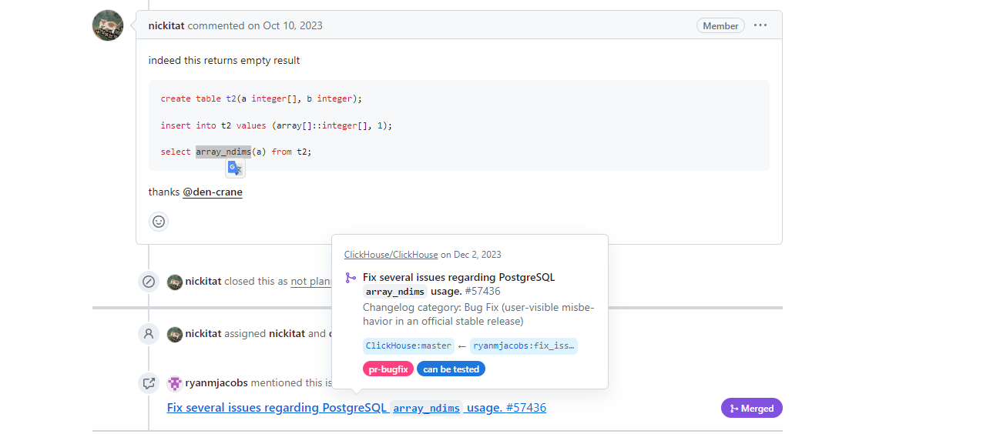

PG同步Clickhouse问题

```sql
drop database video_access5;
 SET allow_experimental_database_materialized_postgresql=1;
 CREATE DATABASE IF NOT EXISTS video_access5
 ENGINE = MaterializedPostgreSQL('10.8.40.223', 'video-access', 'postgres', 'postgres')
 SETTINGS materialized_postgresql_max_block_size = 65536,
         materialized_postgresql_schema = 'public';
```


重启PG和CK后都没有效果，查看CK同步日志:

[1002] ClickHouse exception, message: std::exception. Code: 1001, type: pqxx::conversion_error, e.what() = Attempt to convert null to NSt3__112basic_stringIcNS_11char_traitsIcEENS_9allocatorIcEEEE. (version 23.1.3.5 (official build)) , host: 218.3.126.49, port: 18123;

找到clickhouse github上的issure：





查询pg中列为数组的列：

```sql
SELECT 
    table_schema,
    table_name,
    column_name,
    data_type
FROM 
    information_schema.columns
WHERE 
	table_schema='public' AND
    data_type = 'ARRAY';

```


以上报错是在drop数据库时出现，删除后同时需要到服务器上删除指定文件：

```shell
[1002] ClickHouse exception, message: Code: 521. DB::ErrnoException: Cannot rename /home/clickhouse/metadata/hrm.sql.tmp to /home/clickhouse/metadata/hrm.sql because the second path already exists, errno: 17, strerror: File exists. (ATOMIC_RENAME_FAIL) (version 23.1.3.5 (official build)) , host: 218.3.126.49, port: 18123;
```


最后发现，问题不是这个，**问题不在空数据组中**，另外一个库HRM中不存在数组列，同样也是同步失败。

重启Clickhouse。。。

```sh
systemctl restart clickhouse-server
```

等待重启PG数据库。。。。。。

重启PG后, 数据恢复正常同步

