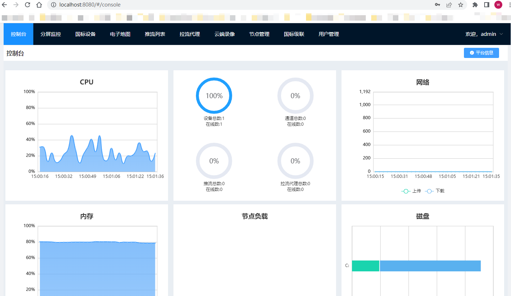
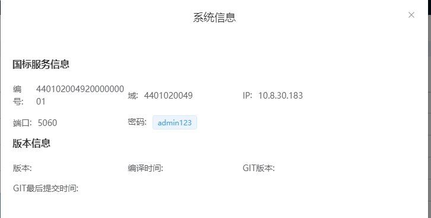
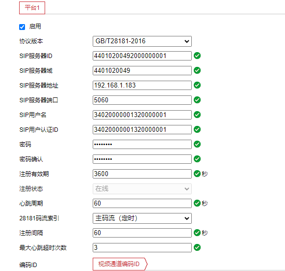

视频GB选型

| 对比项目         | [Monibuca](https://github.com/Monibuca) | [ZLMediaKit](https://github.com/ZLMediaKit/ZLMediaKit)       | [wvp-GB28181-pro](https://github.com/648540858/wvp-GB28181-pro) | [srs](https://github.com/ossrs/srs)                          |
| ---------------- | --------------------------------------- | ------------------------------------------------------------ | ------------------------------------------------------------ | ------------------------------------------------------------ |
| Star (2023.5.30) | 1k                                      | 9.7k                                                         | 3.2k                                                         | 21.7K                                                        |
| 开发语言         | Go                                      | C++                                                          | Java                                                         | C++                                                          |
| GB28181          | 支持                                    | 支持                                                         | 支持                                                         | *NVG*                                                        |
| 文档地址         | [中文文档](https://docs.m7s.live/)      | **[快速开始](https://github.com/ZLMediaKit/ZLMediaKit/wiki/快速开始)** | [https://doc.wvp-pro.cn](https://doc.wvp-pro.cn/)            | [中文文档：起步](https://ossrs.net/lts/zh-cn/docs/v4/doc/getting-started) |
| Docker镜像       |                                         | [Yes](https://hub.docker.com/r/zlmediakit/zlmediakit)        |                                                              | Yes                                                          |
|                  |                                         |                                                              |                                                              |                                                              |
|                  |                                         |                                                              |                                                              |                                                              |

> 🧩 Monibuca is a Modularized, Extensible framework for building Streaming Server.

> ZLMeidaKit is WebRTC/RTSP/RTMP/HTTP/HLS/HTTP-FLV/WebSocket-FLV/HTTP-TS/HTTP-fMP4/WebSocket-TS/WebSocket-fMP4/GB28181/SRT server and client framework based on C++11

> WVP (WEB VIDEO PLATFORM)是一个基于GB28181-2016标准实现的网络视频平台，支持NAT穿透，支持海康、大华、宇视等品牌的IPC、NVR、DVR接入。支持国标级联，支持rtsp/rtmp等视频流转发到国标平台，支持rtsp/rtmp等推流转发到国标平台。

> SRS is a simple, high-efficiency, real-time video server supporting RTMP, WebRTC, HLS, HTTP-FLV, SRT, MPEG-DASH, and GB28181.


WVP

WEB VIDEO PLATFORM是一个基于GB28181-2016标准实现的开箱即用的网络视频平台，负责实现核心信令与设备管理后台部分，支持NAT穿透，支持海康、大华、宇视等品牌的IPC、NVR接入。支持国标级联，支持将不带国标功能的摄像机/直播流/直播推流转发到其他国标平台。

流媒体服务基于@夏楚 ZLMediaKit https://github.com/ZLMediaKit/ZLMediaKit
播放器使用@dexter jessibuca https://github.com/langhuihui/jessibuca/tree/v3
前端页面基于@Kyle MediaServerUI https://gitee.com/kkkkk5G/MediaServerUI 进行修改.


> 参考 https://blog.csdn.net/Crazy_Cw/article/details/127218201
>
> 环境 Win10 + Ubuntu18(10.8.30.38)

+ 启动一个`ZLMediaKit`容器

  ```bash
  docker run -id -p 1935:1935 -p 8080:80 -p 8443:443 -p 8554:554 -p 10000:10000 -p 10000:10000/udp -p 8000:8000/udp -p 9000:9000/udp zlmediakit/zlmediakit:master
  ```

  

+ 下载WVP源代码

  + 执行SQL目录下的‘初始化.sql’创建Postgres数据库 

    ```yml
    datasource:
            type: com.zaxxer.hikari.HikariDataSource
            driver-class-name: org.postgresql.Driver
            url: jdbc:postgresql://10.8.30.156:5432/wvp
            username: postgres
            password: postgres
    ```

    

  + 到web_src下执行 npm install & npm start. 这里选择node14版本测试

    http://localhost:8080/#/login

  + 最外层执行 mvn install.


登录平台：




平台信息中查看国标编号和域：



海康摄像头配置（http://192.168.1.64 )




### 目前安心云平台部署情况

> http://222.186.227.196:32188/ 
>
> admin/****
>
> 容器化部署注意事项：
>
> + WVP端口的`nodeport`改成一致（32188）
> + 公网设备播放的时候，目前看只能使用TCP被动模式