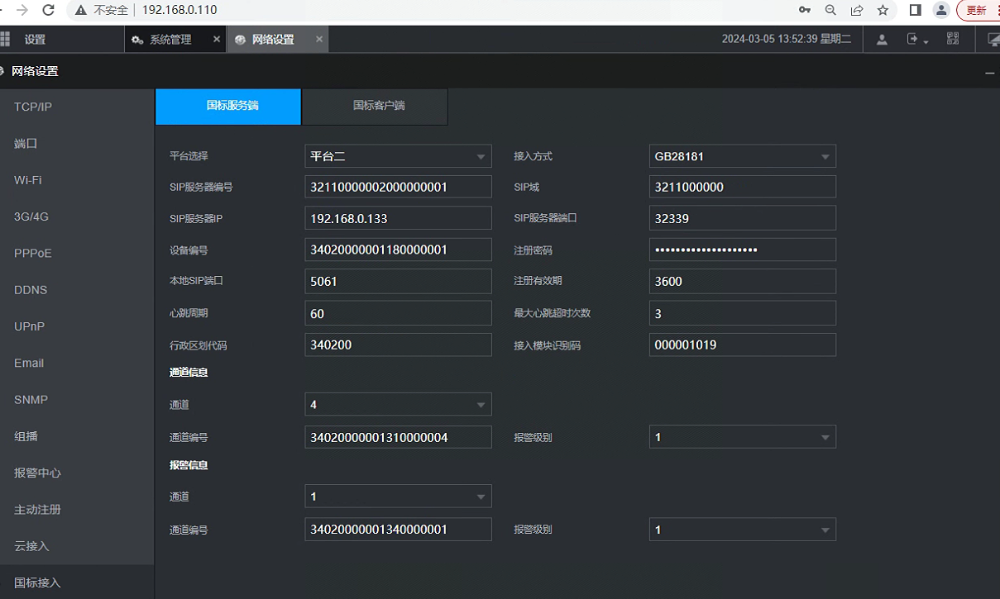
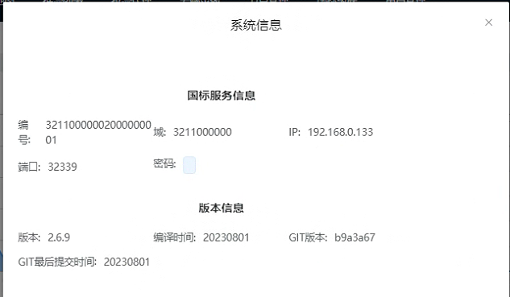
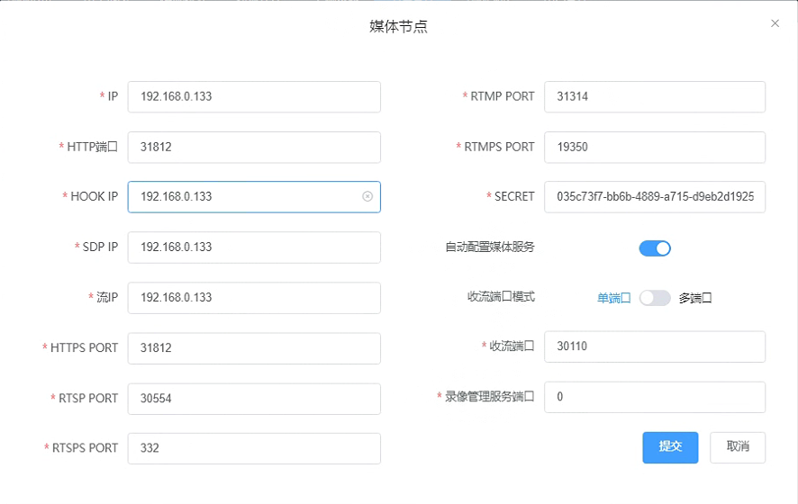

目前MediaPusher进程仅支持大华NVR的实时预览，不支持历史回放和云控功能。

> 测试环境：
>
> http://10.8.30.84:32188/#/deviceList admin/admin


我们改用GB28181方案：

登录东江大华NVR：



通过MicroK8S部署WVP和ZLM进程，首先创建数据，然后执行初始化SQL脚本。（如下）


部署WVP后，登录http://192.168.0.133:32188/#/console，默认账户密码admin/admin.



添加节点：（wvp配置中media中默认的ZLM无法自动添加，在数据库中修改默认记录端口，然后在前端添加节点）



> 注意收留端口必须作为NodePort放开

在国标列表中，可以看到NVR国标设备上线，默认选择的流传输模式为UDP。


wvp.yaml

```yaml
apiVersion: apps/v1     #指定API版本标签
kind: Deployment        #定义资源的类型/角色，deployment为控制器，service，endpoints
metadata:               #定义资源的元数据信息
  name: wvp-deployment        #定义资源的名称，在同一个namespace空间中必须是唯一的
  namespace: lk   #默认default
  labels:               #定义资源标签
    app: yaml-wvp-d
spec:
  replicas: 1           #定义副本数量
  selector:             #定义选择器
    matchLabels:        #匹配上边的标签
      app: yaml-wvp-d        #名称
  template:             #定义模板
    metadata:
        labels:
            app: yaml-wvp-d
    spec:
        volumes:
          - name: volume-wvp-conf
            configMap:
              name: iota-wvp
              items:
                - key: application.yml
                  path: application.yml
                - key: logback-spring-local.xml
                  path: logback-spring-local.xml
              defaultMode: 420
        containers:               #定义容器信息
          - name: yaml-wvp            #容器名，与标签名要相同
            image: registry.ngaiot.com/zhiwucloud/wvp:6      #镜像
            imagePullPolicy: IfNotPresent   #获取镜像的策略 Alawys表示下载镜像 IfNotPresent 表示优先使用本地镜像,否则下载镜像，Never表示仅使用本地镜像
            ports:
                - containerPort: 18080     #定义容器的端口
                  name: tcp-18080
            volumeMounts:
              - name: volume-wvp-conf
                mountPath: /app/config/application.yml
                subPath: application.yml
              - name: volume-wvp-conf
                mountPath: /app/config/logback-spring-local.xml
                subPath: logback-spring-local.xml

---
apiVersion: v1     #指定API版本标签
kind: Service        #定义资源的类型/角色，Deployment为控制器，Service，endpoints
metadata:               #定义资源的元数据信息
  name: wvp-service        #定义资源的名称，在同一个namespace空间中必须是唯一的
  namespace: lk   #默认default
  labels:               #定义资源标签
    app: wvp-s
spec:
    selector:
        app: yaml-wvp-d  #deployment标签
    type: NodePort
    ports:
      - protocol: TCP
        port: 18080  # 集群内访问
        targetPort: 18080 #集群内 容器内端口
        name: tcp-18080
        nodePort: 32188  #集群外访问 范围30000-32767
      - protocol: TCP
        port: 32339  # 集群内访问
        targetPort: 32339 #集群内 容器内端口
        name: tcp-32339
        nodePort: 32339  #集群外访问 范围30000-32767
      - protocol: UDP
        port: 32339  # 集群内访问
        targetPort: 32339 #集群内 容器内端口
        name: udp-32339
        nodePort: 32339  #集群外访问 范围30000-32767        
        

---
kind: ConfigMap
apiVersion: v1
metadata:
  name: iota-wvp
  namespace: lk
data:
  application.yml: |


    # 此配置文件只是用作展示所有配置项， 不可直接使用


    spring:
        # [可选]上传文件大小限制
        servlet:
            multipart:
                max-file-size: 10MB
                max-request-size: 100MB
        # REDIS数据库配置
        redis:
            # [必须修改] Redis服务器IP, REDIS安装在本机的,使用127.0.0.1
            host: redis-service
            # [必须修改] 端口号
            port: 6379
            # [可选] 数据库 DB
            database: 6
            # [可选] 访问密码,若你的redis服务器没有设置密码，就不需要用密码去连接
            password:
            # [可选] 超时时间
            timeout: 10000
            # [可选] 一个pool最多可分配多少个jedis实例
            poolMaxTotal: 1000
            # [可选] 一个pool最多有多少个状态为idle(空闲)的jedis实例
            poolMaxIdle: 500
            # [可选] 最大的等待时间(秒)
            poolMaxWait: 5
        # [必选] jdbc数据库配置
        datasource:
            type: com.zaxxer.hikari.HikariDataSource
            driver-class-name: org.postgresql.Driver
            url: jdbc:postgresql://pg-service:5432/wvp
            username: postgres
            password: example
            hikari:
                connection-timeout: 20000             # 是客户端等待连接池连接的最大毫秒数
                initialSize: 10                       # 连接池初始化连接数
                maximum-pool-size: 200                # 连接池最大连接数
                minimum-idle: 5                       # 连接池最小空闲连接数
                idle-timeout: 300000                  # 允许连接在连接池中空闲的最长时间（以毫秒为单位）
                max-lifetime: 1200000                 # 是池中连接关闭后的最长生命周期（以毫秒为单位)

    # 修改为数据库字段下划线分隔直接对应java驼峰命名
    mybatis:
        configuration:
            map-underscore-to-camel-case: true

    # 修改分页插件为 postgresql， 数据库类型为mysql不需要
    #pagehelper:
    #    helper-dialect: postgresql

    # [可选] WVP监听的HTTP端口, 网页和接口调用都是这个端口
    server:
        port: 18080
        # [可选] HTTPS配置， 默认不开启
        ssl:
            # [可选] 是否开启HTTPS访问
            enabled: false
            # [可选] 证书文件路径，放置在resource/目录下即可，修改xxx为文件名
            key-store: classpath:xxx.jks
            # [可选] 证书密码
            key-store-password: password
            # [可选] 证书类型， 默认为jks，根据实际修改
            key-store-type: JKS
            # 配置证书可以使用如下两项，如上面二选一即可
            # PEM 编码证书
            certificate: xx.pem
            #   私钥文件
            certificate-private-key: xx.key

    # 作为28181服务器的配置
    sip:
        # [必须修改] 本机的IP，对应你的网卡，监听什么ip就是使用什么网卡，
        # 如果要监听多张网卡，可以使用逗号分隔多个IP， 例如： 192.168.1.4,10.0.0.4
        # 如果不明白，就使用0.0.0.0，大部分情况都是可以的
        # 请不要使用127.0.0.1，任何包括localhost在内的域名都是不可以的。
        ip: 0.0.0.0
        # [可选] 没有任何业务需求，仅仅是在前端展示的时候用
        show-ip: 192.168.0.133
        # [可选] 28181服务监听的端口
        port: 32339
        # 根据国标6.1.2中规定，domain宜采用ID统一编码的前十位编码。国标附录D中定义前8位为中心编码（由省级、市级、区级、基层编号组成，参照GB/T 2260-2007）
        # 后两位为行业编码，定义参照附录D.3
        # 3701020049标识山东济南历下区 信息行业接入
        # [可选]
        domain: 3211000000
        # [可选]
        id: 32110000002000000001
        # [可选] 默认设备认证密码，后续扩展使用设备单独密码, 移除密码将不进行校验
        password:
        # [可选] 国标级联注册失败，再次发起注册的时间间隔。 默认60秒
        register-time-interval: 60
        # [可选] 云台控制速度
        ptz-speed: 50
        # TODO [可选] 收到心跳后自动上线， 重启服务后会将所有设备置为离线，默认false，等待注册后上线。设置为true则收到心跳设置为上线。
        # keepalliveToOnline: false
        # 是否存储alarm信息
        alarm: false

    # 做为JT1078服务器的配置
    jt1078:
        #[必须修改] 是否开启1078的服务
        enable: true
        #[必修修改] 1708设备接入的端口
        port: 21078
        #[可选] 设备鉴权的密码
        password: admin123

    #zlm 默认服务器配置
    media:
        # [必须修改] zlm服务器唯一id，用于触发hook时区别是哪台服务器,general.mediaServerId
        id: fs-zlm-0
        # [必须修改] zlm服务器的内网IP
        ip: 192.168.0.133
        # [可选] 返回流地址时的ip，置空使用 media.ip
        stream-ip: 192.168.0.133
        # [可选] wvp在国标信令中使用的ip，此ip为摄像机可以访问到的ip， 置空使用 media.ip
        sdp-ip: 192.168.0.133
        # [可选] zlm服务器的hook所使用的IP, 默认使用sip.ip
        hook-ip: 192.168.0.133
        # [必须修改] zlm服务器的http.port
        http-port: 31812
        # [可选] zlm服务器的http.sslport, 置空使用zlm配置文件配置
        http-ssl-port:
        # [可选] zlm服务器的rtmp.port, 置空使用zlm配置文件配置
        rtmp-port: 31314
        # [可选] zlm服务器的rtmp.sslport, 置空使用zlm配置文件配置
        rtmp-ssl-port:
        # [可选] zlm服务器的 rtp_proxy.port, 置空使用zlm配置文件配置
        rtp-proxy-port: 30585
        # [可选] zlm服务器的 rtsp.port, 置空使用zlm配置文件配置
        rtsp-port: 31741
        # [可选] zlm服务器的 rtsp.sslport, 置空使用zlm配置文件配置
        rtsp-ssl-port:
        # [可选] 是否自动配置ZLM, 如果希望手动配置ZLM, 可以设为false, 不建议新接触的用户修改
        auto-config: true
        # [可选] zlm服务器的hook.admin_params=secret
        secret: 035c73f7-bb6b-4889-a715-d9eb2d1925cc
        # 启用多端口模式, 多端口模式使用端口区分每路流，兼容性更好。 单端口使用流的ssrc区分， 点播超时建议使用多端口测试
        rtp:
            # [可选] 是否启用多端口模式, 开启后会在portRange范围内选择端口用于媒体流传输
            enable: false
            # [可选] 在此范围内选择端口用于媒体流传输, 必须提前在zlm上配置该属性，不然自动配置此属性可能不成功
            port-range: 30000,30500 # 端口范围
            send-port-range: 40000,40500 # 端口范围
        # 录像辅助服务， 部署此服务可以实现zlm录像的管理与下载， 0 表示不使用
        record-assist-port: 0

    # [可选] 日志配置, 一般不需要改
    logging:
        config: file:/app/config/logback-spring-local.xml

    # [根据业务需求配置]
    user-settings:
        # [可选] 服务ID，不写则为000000
        server-id:
        # [可选] 自动点播， 使用固定流地址进行播放时，如果未点播则自动进行点播, 需要rtp.enable=true
        auto-apply-play: false
        # [可选] 部分设备需要扩展SDP，需要打开此设置
        senior-sdp: false
        # 保存移动位置历史轨迹：true:保留历史数据，false:仅保留最后的位置(默认)
        save-position-history: false
        # 点播/录像回放 等待超时时间,单位：毫秒
        play-timeout: 18000
        # 上级点播等待超时时间,单位：毫秒
        platform-play-timeout: 60000
        # 是否开启接口鉴权
        interface-authentication: true
        # 接口鉴权例外的接口, 即不进行接口鉴权的接口,尽量详细书写，尽量不用/**，至少两级目录
        interface-authentication-excludes:
            - /api/v1/**
        # 推流直播是否录制
        record-push-live: true
        # 国标是否录制
        record-sip: true
        # 是否将日志存储进数据库
        logInDatebase: true
        # 使用推流状态作为推流通道状态
        use-pushing-as-status: true
        # 使用来源请求ip作为streamIp,当且仅当你只有zlm节点它与wvp在一起的情况下开启
        use-source-ip-as-stream-ip: false
        # 国标点播 按需拉流, true：有人观看拉流，无人观看释放， false：拉起后不自动释放
        stream-on-demand: true
        # 推流鉴权， 默认开启
        push-authority: true
        # 国标级联发流严格模式，严格模式会使用与sdp信息中一致的端口发流，端口共享media.rtp.port-range，这会损失一些性能，
        # 非严格模式使用随机端口发流，性能更好， 默认关闭
        gb-send-stream-strict: false
        # 设备上线时是否自动同步通道
        sync-channel-on-device-online: false
        # 是否使用设备来源Ip作为回复IP， 不设置则为 false
        sip-use-source-ip-as-remote-address: false
        # 是否开启sip日志
        sip-log: true
        # 是否开启sql日志
        sql-log: false
        # 消息通道功能-缺少国标ID是否给所有上级发送消息
        send-to-platforms-when-id-lost: true
        # 保持通道状态，不接受notify通道状态变化， 兼容海康平台发送错误消息
        refuse-channel-status-channel-form-notify: false
        # 设置notify缓存队列最大长度，超过此长度的数据将返回486 BUSY_HERE，消息丢弃, 默认10000
        max-notify-count-queue: 10000
        # 设备/通道状态变化时发送消息
        device-status-notify: false
        # 上级平台点播时不使用上级平台指定的ssrc，使用自定义的ssrc，参考国标文档-点播外域设备媒体流SSRC处理方式
        use-custom-ssrc-for-parent-invite: true
        # 跨域配置，配置你访问前端页面的地址即可， 可以配置多个
        allowed-origins:
            - http://localhost:38008
            - http://localhost:8080
            - http://wvp:18080
            - http://media.anxinyun.cn:18080
            - http://222.186.227.196:32108
            - http://222.186.227.196:18080
            - https://wvp.ngaiot.com

    # 关闭在线文档（生产环境建议关闭）
    springdoc:
        api-docs:
            enabled: false
        swagger-ui:
            enabled: false
  logback-spring-local.xml: "<?xml version=\"1.0\" encoding=\"UTF-8\"?>\n<configuration debug=\"false\">\n\t<!--定义日志文件的存储地址 -->\n\t<springProperty scop=\"context\" name=\"spring.application.name\" source=\"spring.application.name\" defaultValue=\"\"/>\n\t<property name=\"LOG_HOME\" value=\"logs\" />\n\n\t<substitutionProperty name=\"log.pattern\" value=\"%clr(%d{yyyy-MM-dd HH:mm:ss.SSS}){faint} %clr(%5p) %clr(---){faint} %clr(%-1.30logger{0}){cyan} %clr(:){faint} %m%n%wEx\"/>\n\n\t<conversionRule conversionWord=\"clr\" converterClass=\"org.springframework.boot.logging.logback.ColorConverter\"/>\n\t<conversionRule conversionWord=\"wex\" converterClass=\"org.springframework.boot.logging.logback.WhitespaceThrowableProxyConverter\"/>\n\t<conversionRule conversionWord=\"wEx\" converterClass=\"org.springframework.boot.logging.logback.ExtendedWhitespaceThrowableProxyConverter\"/>\n\n\t<!-- 控制台输出 -->\n\t<appender name=\"STDOUT\" class=\"ch.qos.logback.core.ConsoleAppender\">\n\t\t<encoder class=\"ch.qos.logback.classic.encoder.PatternLayoutEncoder\">\n\t\t\t<!--格式化输出：%d表示日期，%thread表示线程名，%-5level：级别从左显示5个字符宽度%msg：日志消息，%n是换行符 -->\n\t\t\t<pattern>${log.pattern}</pattern>\n\t\t\t<charset>UTF-8</charset>\n\t\t</encoder>\n\t\t<filter class=\"ch.qos.logback.classic.filter.ThresholdFilter\" >\n\t\t\t<!--与ThresholdFilter的区别,允许onmatch-->\n\t\t\t<!--设置日志级别 接收info级别的日志-->\n\t\t\t<level>DEBUG</level>\n\t\t</filter>\n\t</appender>\n\n\t<!-- 按照每天生成日志文件 DEBUG以上级别的日志,仅用于测试环境,正式环境为info级别以上的日志-->\n\t<appender name=\"RollingFile\" class=\"ch.qos.logback.core.rolling.RollingFileAppender\">\n\n\t\t<!-- 文件路径 -->\n\t\t<rollingPolicy class=\"ch.qos.logback.core.rolling.SizeAndTimeBasedRollingPolicy\">\n\t\t\t<!--历史日志文件输出的文件名 -->\n\t\t\t<FileNamePattern>${LOG_HOME}/wvp-%d{yyyy-MM-dd}.%i.log</FileNamePattern>\n\t\t\t<!--日志文件保留天数 -->\n\t\t\t<MaxHistory>30</MaxHistory>\n\t\t\t<maxFileSize>20MB</maxFileSize>\n\t\t</rollingPolicy>\n\t\t<encoder class=\"ch.qos.logback.classic.encoder.PatternLayoutEncoder\">\n\t\t\t<!--格式化输出：%d表示日期，%thread表示线程名，%-5level：级别从左显示5个字符宽度%msg：日志消息，%n是换行符 -->\n\t\t\t<pattern>%d{yyyy-MM-dd HH:mm:ss.SSS} [%thread] %-5level %logger{50}:%L - %msg%n</pattern>\n\t\t\t<charset>UTF-8</charset>\n\t\t</encoder>\n\t\t<filter class=\"ch.qos.logback.classic.filter.ThresholdFilter\">\n\t\t\t<!--与ThresholdFilter的区别,允许onmatch-->\n\t\t\t<!--设置日志级别 接收info级别的日志-->\n\t\t\t<level>DEBUG</level>\n\t\t</filter>\n\t</appender>\n\n\t<!-- 生成 error格式日志开始 -->\n\t<appender name=\"RollingFileError\" class=\"ch.qos.logback.core.rolling.RollingFileAppender\">\n\n\t\t<rollingPolicy class=\"ch.qos.logback.core.rolling.SizeAndTimeBasedRollingPolicy\">\n\t\t\t<!--历史日志文件输出的文件名 -->\n\t\t\t<FileNamePattern>${LOG_HOME}/error-%d{yyyy-MM-dd}.%i.log</FileNamePattern>\n\t\t\t<!--日志文件保留天数 -->\n\t\t\t<MaxHistory>30</MaxHistory>\n\t\t\t<maxFileSize>20MB</maxFileSize>\n\t\t</rollingPolicy>\n\t\t<encoder class=\"ch.qos.logback.classic.encoder.PatternLayoutEncoder\">\n\t\t\t<!--格式化输出：%d表示日期，%thread表示线程名，%-5level：级别从左显示5个字符宽度%msg：日志消息，%n是换行符 -->\n\t\t\t<pattern>%d{yyyy-MM-dd HH:mm:ss.SSS} [%thread] %-5level %logger{50}:%L - %msg%n</pattern>\n\t\t\t<charset>UTF-8</charset>\n\t\t</encoder>\n\t\t<filter class=\"ch.qos.logback.classic.filter.ThresholdFilter\">\n\t\t\t<!--设置日志级别,过滤掉info日志,只输入error日志-->\n\t\t\t<level>WARN</level>\n\t\t</filter>\n\t</appender>\n\n\t<!-- 生成 SIP日志追加 -->\n\t<appender name=\"SipRollingFile\" class=\"ch.qos.logback.core.rolling.RollingFileAppender\">\n\t\t<rollingPolicy class=\"ch.qos.logback.core.rolling.SizeAndTimeBasedRollingPolicy\">\n\t\t\t<!--历史日志文件输出的文件名 -->\n\t\t\t<FileNamePattern>${LOG_HOME}/sip-%d{yyyy-MM-dd}.%i.log</FileNamePattern>\n\t\t\t<!--日志文件保留天数 -->\n\t\t\t<MaxHistory>30</MaxHistory>\n\t\t\t<maxFileSize>50MB</maxFileSize>\n\t\t</rollingPolicy>\n\t\t<encoder class=\"ch.qos.logback.classic.encoder.PatternLayoutEncoder\">\n\t\t\t<!--格式化输出：%d表示日期，%thread表示线程名，%-5level：级别从左显示5个字符宽度%msg：日志消息，%n是换行符 -->\n\t\t\t<pattern>%d{yyyy-MM-dd HH:mm:ss.SSS} [%thread] %-5level %logger{50}:%L - %msg%n</pattern>\n\t\t\t<charset>UTF-8</charset>\n\t\t</encoder>\n\t</appender>\n\n\n\t<!-- 日志输出级别 -->\n\t<root level=\"INFO\">\n\t\t<appender-ref ref=\"STDOUT\" />\n\t</root>\n\n\n\t<logger name=\"java.sql.Connection\">\n\t\t<level value=\"INFO\" />\n\t\t<appender-ref ref=\"STDOUT\" />\n\t</logger>\n\t<logger name=\"java.sql.Statement\">\n\t\t<level value=\"INFO\" />\n\t\t<appender-ref ref=\"STDOUT\" />\n\t</logger>\n\t<logger name=\"java.sql.PreparedStatement\">\n\t\t<level value=\"ERROR\" />\n\t\t<appender-ref ref=\"STDOUT\" />\n\t</logger>\n    \n\t<logger name=\"com.genersoft.iot.vmp\" level=\"info\" additivity=\"true\">\n\t\t<appender-ref ref=\"RollingFileError\"/>\n\t\t<appender-ref ref=\"RollingFile\"/>\n\t</logger>\n\n\t<logger name=\"com.genersoft.iot.vmp.gb28181.conf.StackLoggerImpl\" level=\"info\" additivity=\"true\">\n\t\t<appender-ref ref=\"SipRollingFile\" />\n\t</logger>\n\n</configuration>"


```


zlm.yaml

```yaml
apiVersion: apps/v1     #指定API版本标签
kind: Deployment        #定义资源的类型/角色，deployment为控制器，service，endpoints
metadata:               #定义资源的元数据信息
  name: zlm-deployment        #定义资源的名称，在同一个namespace空间中必须是唯一的
  namespace: lk   #默认default
  labels:               #定义资源标签
    app: yaml-zlm-d
spec:
  replicas: 1           #定义副本数量
  selector:             #定义选择器
    matchLabels:        #匹配上边的标签
      app: yaml-zlm-d        #名称
  template:             #定义模板
    metadata:
        labels:
            app: yaml-zlm-d
    spec:
        volumes:
          - name: volume-zml-config
            hostPath:
              path: /home/anxincloud/zlm
        containers:               #定义容器信息
          - name: yaml-zlm            #容器名，与标签名要相同
            image: registry.ngaiot.com/iot/zlmediakit:latest      #镜像
            imagePullPolicy: IfNotPresent   #获取镜像的策略 Alawys表示下载镜像 IfNotPresent 表示优先使用本地镜像,否则下载镜像，Never表示仅使用本地镜像
            command:
              - /app/MediaServer
            args:
              - '-c'
              - /conf/config.ini
            volumeMounts:
              - name: volume-zml-config
                mountPath: /conf/

---
apiVersion: v1     #指定API版本标签
kind: Service        #定义资源的类型/角色，Deployment为控制器，Service，endpoints
metadata:               #定义资源的元数据信息
  name: zlm-service        #定义资源的名称，在同一个namespace空间中必须是唯一的
  namespace: lk   #默认default
  labels:               #定义资源标签
    app: zlm-s
spec:
    selector:
        app: yaml-zlm-d  #deployment标签
    type: NodePort
    ports:
      - protocol: TCP
        port: 31812  # 集群内访问
        targetPort: 31812 #集群内 容器内端口
        name: tcp-31812
        nodePort: 31812  #集群外访问 范围30000-32767
      - protocol: TCP
        port: 31314  # 集群内访问
        targetPort: 31314 #集群内 容器内端口
        name: tcp-31314
        nodePort: 31314  #集群外访问 范围30000-32767
      - protocol: TCP
        port: 30585  # 集群内访问
        targetPort: 30585 #集群内 容器内端口
        name: tcp-30585
        nodePort: 30585  #集群外访问 范围30000-32767
      - protocol: TCP
        port: 30448  # 集群内访问
        targetPort: 30448 #集群内 容器内端口
        name: tcp-30448
        nodePort: 30448  #集群外访问 范围30000-32767
      - protocol: UDP
        port: 30585  # 集群内访问
        targetPort: 30585 #集群内 容器内端口
        name: udp-30585
        nodePort: 30585  #集群外访问 范围30000-32767
      - protocol: UDP
        port: 30448  # 集群内访问
        targetPort: 30448 #集群内 容器内端口
        name: udp-30448
        nodePort: 30448  #集群外访问 范围30000-32767
      - protocol: UDP
        port: 30110  # 集群内访问
        targetPort: 30110 #集群内 容器内端口
        name: udp-30110
        nodePort: 30110  #集群外访问 范围30000-32767
      - protocol: TCP
        port: 30110
        targetPort: 30110
        name: tcp-30110
        nodePort: 30110

```

其中，zlm的配置放到volumn,手动修改如下：

> 需要修改收流端口，RTP_PROXY，这里修改成30110
>
> hook地址如果没有自动正确配置，需要手动进行修改为WVP的API URL地址。
>
> 这里同时也修改了HTTP、RTMP以及RTSP的默认端口，使其可以匹配K8S的NodePort。

```ini
; auto-generated by mINI class {

[api]
apiDebug=1
defaultSnap=./www/logo.png
secret=035c73f7-bb6b-4889-a715-d9eb2d1925cc
snapRoot=./www/snap/

[cluster]
origin_url=
retry_count=3
timeout_sec=15

[ffmpeg]
bin=/usr/bin/ffmpeg
cmd=%s -re -i %s -c:a aac -strict -2 -ar 44100 -ab 48k -c:v libx264 -f flv %s
log=./ffmpeg/ffmpeg.log
restart_sec=0
snap=%s -rtsp_transport tcp -i %s -y -f mjpeg -t 0.001 %s

[general]
check_nvidia_dev=1
enableVhost=0
enable_ffmpeg_log=0
flowThreshold=1024
maxStreamWaitMS=15000
mediaServerId=bIKNQwTiTm8uLvOl
mergeWriteMS=0
resetWhenRePlay=1
streamNoneReaderDelayMS=20000
unready_frame_cache=100
wait_add_track_ms=3000
wait_track_ready_ms=10000

[hls]
broadcastRecordTs=0
deleteDelaySec=10
fileBufSize=65536
segDur=2
segKeep=0
segNum=3
segRetain=5

[hook]
admin_params=secret=035c73f7-bb6b-4889-a715-d9eb2d1925cc
alive_interval=30.000000
enable=1
on_flow_report=
on_http_access=
on_play=http://192.168.0.133:32188/index/hook/on_play
on_publish=http://192.168.0.133:32188/index/hook/on_publish
on_record_mp4=
on_record_ts=
on_rtp_server_timeout=http://192.168.0.133:32188/index/hook/on_rtp_server_timeout
on_rtsp_auth=
on_rtsp_realm=
on_send_rtp_stopped=http://192.168.0.133:32188/index/hook/on_send_rtp_stopped
on_server_exited=
on_server_keepalive=http://192.168.0.133:32188/index/hook/on_server_keepalive
on_server_started=http://192.168.0.133:32188/index/hook/on_server_started
on_shell_login=
on_stream_changed=http://192.168.0.133:32188/index/hook/on_stream_changed
on_stream_none_reader=http://192.168.0.133:32188/index/hook/on_stream_none_reader
on_stream_not_found=http://192.168.0.133:32188/index/hook/on_stream_not_found
retry=1
retry_delay=3.000000
timeoutSec=20

[http]
allow_cross_domains=1
charSet=utf-8
dirMenu=1
forbidCacheSuffix=
forwarded_ip_header=
keepAliveSecond=15
maxReqSize=40960
notFound=<html><head><title>404 Not Found</title></head><body bgcolor="white"><center><h1>您访问的资源不存在！</h1></center><hr><center>ZLMediaKit(git hash:Git_Unkown_commit/Git_Unkown_time,branch:Git_Unkown_branch,build time:2023-07-25T20:40:04)</center></body></html>
port=31812
rootPath=./www
sendBufSize=65536
sslport=443
virtualPath=

[multicast]
addrMax=239.255.255.255
addrMin=239.0.0.0
udpTTL=64

[protocol]
add_mute_audio=1
auto_close=0
continue_push_ms=3000
enable_audio=1
enable_fmp4=1
enable_hls=1
enable_hls_fmp4=0
enable_mp4=0
enable_rtmp=1
enable_rtsp=1
enable_ts=1
fmp4_demand=0
hls_demand=0
hls_save_path=./www
modify_stamp=2
mp4_as_player=0
mp4_max_second=3600
mp4_save_path=./www
rtmp_demand=0
rtsp_demand=0
ts_demand=0

[record]
appName=record
fastStart=0
fileBufSize=65536
fileRepeat=0
sampleMS=500

[rtmp]
handshakeSecond=15
keepAliveSecond=15
modifyStamp=0
port=31314
sslport=19350

[rtp]
audioMtuSize=600
h264_stap_a=1
lowLatency=0
rtpMaxSize=10
videoMtuSize=1400

[rtp_proxy]
dumpDir=
gop_cache=1
h264_pt=98
h265_pt=99
opus_pt=100
port=30110
port_range=30000-35000
ps_pt=96
timeoutSec=15

[rtsp]
authBasic=0
directProxy=1
handshakeSecond=15
keepAliveSecond=15
lowLatency=0
port=30554
rtpTransportType=-1
sslport=332

[shell]
maxReqSize=1024
port=9000

[srt]
latencyMul=4
pktBufSize=8192
port=9000
timeoutSec=5

; } ---

```

初始化的SQL脚本也记录在这里：

初始化SQL：

```sql
/*建表*/
create table wvp_device (
                            id serial primary key ,
                            device_id character varying(50) not null ,
                            name character varying(255),
                            manufacturer character varying(255),
                            model character varying(255),
                            firmware character varying(255),
                            transport character varying(50),
                            stream_mode character varying(50),
                            on_line bool default false,
                            register_time character varying(50),
                            keepalive_time character varying(50),
                            ip character varying(50),
                            create_time character varying(50),
                            update_time character varying(50),
                            port integer,
                            expires integer,
                            subscribe_cycle_for_catalog integer DEFAULT 0,
                            subscribe_cycle_for_mobile_position integer DEFAULT 0,
                            mobile_position_submission_interval integer DEFAULT 5,
                            subscribe_cycle_for_alarm integer DEFAULT 0,
                            host_address character varying(50),
                            charset character varying(50),
                            ssrc_check bool default false,
                            geo_coord_sys character varying(50),
                            media_server_id character varying(50),
                            custom_name character varying(255),
                            sdp_ip character varying(50),
                            local_ip character varying(50),
                            password character varying(255),
                            as_message_channel bool default false,
                            keepalive_interval_time integer,
                            switch_primary_sub_stream bool default false,
                            broadcast_push_after_ack bool default false,
                            constraint uk_device_device unique (device_id)
);

create table wvp_device_alarm (
                                  id serial primary key ,
                                  device_id character varying(50) not null,
                                  channel_id character varying(50) not null,
                                  alarm_priority character varying(50),
                                  alarm_method character varying(50),
                                  alarm_time character varying(50),
                                  alarm_description character varying(255),
                                  longitude double precision,
                                  latitude double precision,
                                  alarm_type character varying(50),
                                  create_time character varying(50) not null
);

create table wvp_device_channel (
                                    id serial primary key ,
                                    channel_id character varying(50) not null,
                                    name character varying(255),
                                    custom_name character varying(255),
                                    manufacture character varying(50),
                                    model character varying(50),
                                    owner character varying(50),
                                    civil_code character varying(50),
                                    block character varying(50),
                                    address character varying(50),
                                    parent_id character varying(50),
                                    safety_way integer,
                                    register_way integer,
                                    cert_num character varying(50),
                                    certifiable integer,
                                    err_code integer,
                                    end_time character varying(50),
                                    secrecy character varying(50),
                                    ip_address character varying(50),
                                    port integer,
                                    password character varying(255),
                                    ptz_type integer,
                                    custom_ptz_type integer,
                                    status bool default false,
                                    longitude double precision,
                                    custom_longitude double precision,
                                    latitude double precision,
                                    custom_latitude double precision,
                                    stream_id character varying(255),
                                    device_id character varying(50) not null,
                                    parental character varying(50),
                                    has_audio bool default false,
                                    create_time character varying(50) not null,
                                    update_time character varying(50) not null,
                                    sub_count integer,
                                    longitude_gcj02 double precision,
                                    latitude_gcj02 double precision,
                                    longitude_wgs84 double precision,
                                    latitude_wgs84 double precision,
                                    business_group_id character varying(50),
                                    gps_time character varying(50),
                                    constraint uk_wvp_device_channel_unique_device_channel unique (device_id, channel_id)
);

create table wvp_device_mobile_position (
                                            id serial primary key,
                                            device_id character varying(50) not null,
                                            channel_id character varying(50) not null,
                                            device_name character varying(255),
                                            time character varying(50),
                                            longitude double precision,
                                            latitude double precision,
                                            altitude double precision,
                                            speed double precision,
                                            direction double precision,
                                            report_source character varying(50),
                                            longitude_gcj02 double precision,
                                            latitude_gcj02 double precision,
                                            longitude_wgs84 double precision,
                                            latitude_wgs84 double precision,
                                            create_time character varying(50)
);

create table wvp_gb_stream (
                               gb_stream_id serial primary key,
                               app character varying(255) not null,
                               stream character varying(255) not null,
                               gb_id character varying(50) not null,
                               name character varying(255),
                               longitude double precision,
                               latitude double precision,
                               stream_type character varying(50),
                               media_server_id character varying(50),
                               create_time character varying(50),
                               constraint uk_gb_stream_unique_gb_id unique (gb_id),
                               constraint uk_gb_stream_unique_app_stream unique (app, stream)
);

create table wvp_log (
                         id serial primary key ,
                         name character varying(50),
                         type character varying(50),
                         uri character varying(200),
                         address character varying(50),
                         result character varying(50),
                         timing bigint,
                         username character varying(50),
                         create_time character varying(50)
);

create table wvp_media_server (
                                  id character varying(255) primary key ,
                                  ip character varying(50),
                                  hook_ip character varying(50),
                                  sdp_ip character varying(50),
                                  stream_ip character varying(50),
                                  http_port integer,
                                  http_ssl_port integer,
                                  rtmp_port integer,
                                  rtmp_ssl_port integer,
                                  rtp_proxy_port integer,
                                  rtsp_port integer,
                                  rtsp_ssl_port integer,
                                  auto_config bool default false,
                                  secret character varying(50),
                                  rtp_enable bool default false,
                                  rtp_port_range character varying(50),
                                  send_rtp_port_range character varying(50),
                                  record_assist_port integer,
                                  default_server bool default false,
                                  create_time character varying(50),
                                  update_time character varying(50),
                                  hook_alive_interval integer,
                                  constraint uk_media_server_unique_ip_http_port unique (ip, http_port)
);

create table wvp_platform (
                              id serial primary key ,
                              enable bool default false,
                              name character varying(255),
                              server_gb_id character varying(50),
                              server_gb_domain character varying(50),
                              server_ip character varying(50),
                              server_port integer,
                              device_gb_id character varying(50),
                              device_ip character varying(50),
                              device_port character varying(50),
                              username character varying(255),
                              password character varying(50),
                              expires character varying(50),
                              keep_timeout character varying(50),
                              transport character varying(50),
                              character_set character varying(50),
                              catalog_id character varying(50),
                              ptz bool default false,
                              rtcp bool default false,
                              status bool default false,
                              start_offline_push bool default false,
                              administrative_division character varying(50),
                              catalog_group integer,
                              create_time character varying(50),
                              update_time character varying(50),
                              as_message_channel bool default false,
                              constraint uk_platform_unique_server_gb_id unique (server_gb_id)
);

create table wvp_platform_catalog (
                                      id character varying(50),
                                      platform_id character varying(50),
                                      name character varying(255),
                                      parent_id character varying(50),
                                      civil_code character varying(50),
                                      business_group_id character varying(50),
                                      constraint uk_platform_catalog_id_platform_id unique (id, platform_id)
);

create table wvp_platform_gb_channel (
                                         id serial primary key ,
                                         platform_id character varying(50),
                                         catalog_id character varying(50),
                                         device_channel_id integer,
                                         constraint uk_platform_gb_channel_platform_id_catalog_id_device_channel_id unique (platform_id, catalog_id, device_channel_id)
);

create table wvp_platform_gb_stream (
                                        id serial primary key,
                                        platform_id character varying(50),
                                        catalog_id character varying(50),
                                        gb_stream_id integer,
                                        constraint uk_platform_gb_stream_platform_id_catalog_id_gb_stream_id unique (platform_id, catalog_id, gb_stream_id)
);

create table wvp_stream_proxy (
                                  id serial primary key,
                                  type character varying(50),
                                  app character varying(255),
                                  stream character varying(255),
                                  url character varying(255),
                                  src_url character varying(255),
                                  dst_url character varying(255),
                                  timeout_ms integer,
                                  ffmpeg_cmd_key character varying(255),
                                  rtp_type character varying(50),
                                  media_server_id character varying(50),
                                  enable_audio bool default false,
                                  enable_mp4 bool default false,
                                  enable bool default false,
                                  status boolean,
                                  enable_remove_none_reader bool default false,
                                  create_time character varying(50),
                                  name character varying(255),
                                  update_time character varying(50),
                                  enable_disable_none_reader bool default false,
                                  constraint uk_stream_proxy_app_stream unique (app, stream)
);

create table wvp_stream_push (
                                 id serial primary key,
                                 app character varying(255),
                                 stream character varying(255),
                                 total_reader_count character varying(50),
                                 origin_type integer,
                                 origin_type_str character varying(50),
                                 create_time character varying(50),
                                 alive_second integer,
                                 media_server_id character varying(50),
                                 push_time character varying(50),
                                 status bool default false,
                                 update_time character varying(50),
                                 push_ing bool default false,
                                 self bool default false,
                                 constraint uk_stream_push_app_stream unique (app, stream)
);

create table wvp_user (
                          id serial primary key,
                          username character varying(255),
                          password character varying(255),
                          role_id integer,
                          create_time character varying(50),
                          update_time character varying(50),
                          push_key character varying(50),
                          constraint uk_user_username unique (username)
);

create table wvp_user_role (
                               id serial primary key,
                               name character varying(50),
                               authority character varying(50),
                               create_time character varying(50),
                               update_time character varying(50)
);
create table wvp_resources_tree (
                                    id serial primary key ,
                                    is_catalog bool default true,
                                    device_channel_id integer ,
                                    gb_stream_id integer,
                                    name character varying(255),
                                    parentId integer,
                                    path character varying(255)
);


/*初始数据*/
INSERT INTO wvp_user VALUES (1, 'admin','21232f297a57a5a743894a0e4a801fc3',1,'2021-04-13 14:14:57','2021-04-13 14:14:57','3e80d1762a324d5b0ff636e0bd16f1e3');
INSERT INTO wvp_user_role VALUES (1, 'admin','0','2021-04-13 14:14:57','2021-04-13 14:14:57');


```

必备更新SQL:

```sql
alter table wvp_device_channel alter column stream_id TYPE varchar(255)
```


## 常见问题

1. 收流超时

   HOOK地址是否正确

   RTP端口是否放开了或者是否有防火墙

   具体查看ZLM的运行日志

2. WVP启动报错，redis或者pg连接不上

   这些改成IP地址+端口，可以解决

3. Eileen