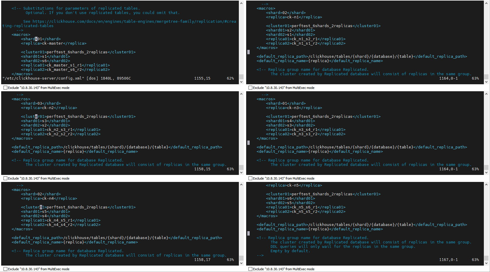
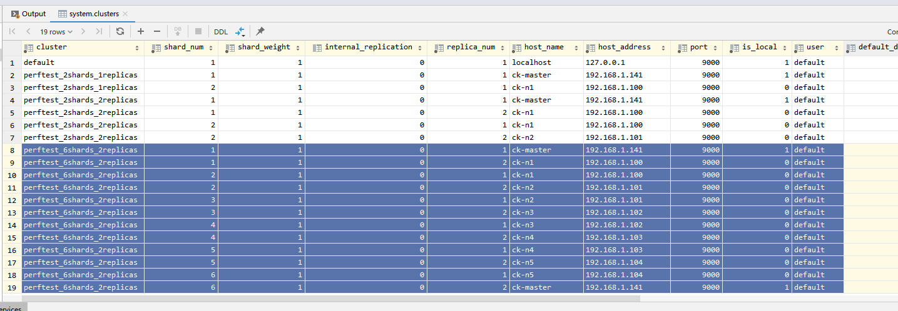

网络代理技术调研

如果只有一台服务器有对外IP地址，而其他服务器上的服务需要通过该服务器提供服务，你可以使用端口转发或反向代理等技术来实现。这可以通过在拥有对外IP地址的服务器上设置适当的网络配置和服务来完成。以下是一些常见的方法：

1. **端口转发：** 在具有对外IP的服务器上设置端口转发，将特定端口的流量转发到其他服务器上的对应端口。你可以使用工具如 `iptables`（针对 Linux）或者 `netsh`（针对 Windows）来配置端口转发规则。
2. **反向代理：** 在具有对外IP的服务器上设置反向代理，将接收到的请求转发到其他服务器上的对应服务。常见的反向代理软件包括 Nginx、Apache HTTP Server 和 HAProxy 等。
3. **VPN隧道：** 使用VPN技术建立虚拟专用网络（VPN），将其他服务器和具有对外IP的服务器连接起来，然后在具有对外IP的服务器上处理所有流量。
4. **NAT（网络地址转换）：** 在具有对外IP的服务器上设置NAT，将其他服务器的内部IP映射到具有对外IP的服务器上。


网络拓扑


修改网络

1. 界面设置

```ini
[connection]
id=有线连接 2
uuid=f75bd046-59f6-3f47-9f35-fd60a598dd48
type=ethernet
autoconnect-priority=-999
interface-name=eno2
permissions=
timestamp=1712739227

[ethernet]
mac-address-blacklist=

[ipv4]
address1=10.8.30.143/24,10.8.30.1
dns=114.114.114.114;223.5.5.5;8.8.8.8;
dns-search=
method=manual

[ipv6]
addr-gen-mode=stable-privacy
dns-search=
method=auto

[proxy]

```

2. 命令设置

   ```sh
   nmcli connection add \
       con-name "wire1" \
       type ethernet \
       ifname eno1 \
       ipv4.address "192.168.1.100/24" \
       ipv4.gateway "192.168.1.1" \
       ipv4.dns "114.114.114.114 223.5.5.5 8.8.8.8" \
       ipv4.method manual \
       ipv6.addr-gen-mode stable-privacy \
       ipv6.method auto
   ```


> 在某次修改服务器hostname之后，无法重新连接服务器
>
> 改成使用NetPlan的方式设置网络：
>
> ```sh
> systemctl stop NetworkManager
> systemctl disable NetworkManager
> 
> vi /etc/netplan/xxx.yaml
> ```
>
> 
>
> ```yaml
> network:
>   version: 2
>   renderer: networkd
>   ethernets:
>     eno1:
>       dhcp4: no
>       addresses: [10.8.40.141/24]
>       gateway4: 10.8.40.1
>       nameservers:
>         addresses: [114.114.114.114, 223.5.5.5]
>         search: [localdomain]
>     eno2:
>       dhcp4: no
>       addresses: [192.168.1.141/24]
>       routes:
>         - to: 192.168.1.0/24
>           via: 192.168.1.1
> 
> ```
>
> ```sh
> netplan apply
> ```
>
> 

修改集群的hosts： /etc/hosts

```
192.168.1.141 ck-master
192.168.1.100 ck-n1
192.168.1.101 ck-n2
192.168.1.102 ck-n3
192.168.1.103 ck-n4
192.168.1.104 ck-n5
192.168.1.105 zk-n1
192.168.1.106 zk-n2
192.168.1.107 zk-n3
```


> 目前用了新机器8台（5台`ck`，3台`zk`）、老集群n31在40商用网段做ck-master服务节点。
>
> 10.8.40.141  192.168.1.141 ck-master
> 10.8.30.143  192.168.1.100 ck-n1
> 10.8.30.144  192.168.1.101 ck-n2
> 10.8.30.145  192.168.1.102 ck-n3
> 10.8.30.146  192.168.1.103 ck-n4
> 10.8.30.149  192.168.1.104 ck-n5
> 10.8.30.135  192.168.1.105 zk-n1
> 10.8.30.136  192.168.1.106 zk-n2
> 10.8.30.137  192.168.1.107 zk-n3


安装clickhouse集群

```sh

sudo apt-get install -y apt-transport-https ca-certificates dirmngr
sudo apt-key adv --keyserver hkp://keyserver.ubuntu.com:80 --recv 8919F6BD2B48D754

echo "deb https://packages.clickhouse.com/deb stable main" | sudo tee \
    /etc/apt/sources.list.d/clickhouse.list
sudo apt-get update

sudo apt-get install -y clickhouse-server clickhouse-client

 service clickhouse-server start
  service clickhouse-server start
```

修改配置 /etc/clickhouse-server/config.xml

```xml
<listen_host>0.0.0.0</listen_host>
<timezone>Asia/Shanghai</timezone>


<path>/var/lib/clickhouse/</path>

  <remote_servers>
        <perftest_2shards_1replicas>
        <shard>
            <replica>
                <host>ck-master</host>
                <port>9000</port>
                <user>default</user>
                <password>Fas123</password>
            </replica>
        </shard>
        <shard>
            <replica>
                <host>ck-n1</host>
                <port>9000</port>
                <user>default</user>
                <password>Fas123</password>
             </replica>
        </shard>
    </perftest_2shards_1replicas>
    </remote_servers>             

 <zookeeper>
        <node>
            <host>zk-n1</host>
            <port>2181</port>
        </node>
        <node>
            <host>zk-n2</host>
            <port>2181</port>
        </node>
        <node>
            <host>zk-n2</host>
            <port>2181</port>
        </node>
    </zookeeper>
```


设置`ck`的密码：

```sh
# 这里修改密码
cat /etc/clickhouse-server/users.xml 
```


磁盘绑定：

```sh
# 查看
fdisk -l

gdisk /dev/sdb
#选择 n 默认走完
#输入 w 保存
#全部卷划分为一个分区 8300 Linux FileSystem

# 查看
lsblk

# 格式化
sudo mkfs -t ext4 /dev/sdb1

mkdir /mnt/data 
sudo mount /dev/sdb1 /mnt/data
#  umount /dev/sdb1

root@sifangjing:/home/diantong# df -h
文件系统        容量  已用  可用 已用% 挂载点
udev             63G     0   63G    0% /dev
tmpfs            13G  3.0M   13G    1% /run
/dev/sda2       549G   25G  496G    5% /
tmpfs            63G     0   63G    0% /dev/shm
tmpfs           5.0M     0  5.0M    0% /run/lock
tmpfs            63G     0   63G    0% /sys/fs/cgroup
/dev/loop0      128K  128K     0  100% /snap/bare/5
/dev/loop2       75M   75M     0  100% /snap/core22/1122
/dev/loop1       64M   64M     0  100% /snap/core20/2264
/dev/loop3       64M   64M     0  100% /snap/core20/2182
/dev/loop5      347M  347M     0  100% /snap/gnome-3-38-2004/115
/dev/loop4      6.5M  6.5M     0  100% /snap/curl/1754
/dev/loop6      350M  350M     0  100% /snap/gnome-3-38-2004/143
/dev/loop7      505M  505M     0  100% /snap/gnome-42-2204/172
/dev/loop8      506M  506M     0  100% /snap/gnome-42-2204/176
/dev/loop10      55M   55M     0  100% /snap/snap-store/558
/dev/loop9       92M   92M     0  100% /snap/gtk-common-themes/1535
/dev/loop11      13M   13M     0  100% /snap/snap-store/1113
/dev/loop12      40M   40M     0  100% /snap/snapd/21184
/dev/sda1       511M  6.1M  505M    2% /boot/efi
/dev/sdb1        11T   28K   11T    1% /mnt/data
tmpfs            13G   36K   13G    1% /run/user/125
tmpfs            13G  8.0K   13G    1% /run/user/1000


# 自动绑定
root@sifangjing:/home/diantong# cat /etc/fstab
# /etc/fstab: static file system information.
#
# Use 'blkid' to print the universally unique identifier for a
# device; this may be used with UUID= as a more robust way to name devices
# that works even if disks are added and removed. See fstab(5).
#
# <file system> <mount point>   <type>  <options>       <dump>  <pass>
# / was on /dev/sda2 during installation
UUID=eec4a43c-d391-4357-874e-a54f405114de /               ext4    errors=remount-ro 0       1
/dev/sdb1 /mnt/data     ext4            defaults 0 2
# /boot/efi was on /dev/sda1 during installation
UUID=B6E4-8C9B  /boot/efi       vfat    umask=0077      0       1
/swapfile                                 none            swap    sw              0       0


# 迁移clickhouse数据
service clickhouse-server stop
mv /var/lib/clickhouse/ /mnt/data/
sudo chown -R clickhouse:clickhouse /mnt/data/clickhouse

root@sifangjing:/home/diantong# vi /etc/clickhouse-server/config.xml

​```xml
<path>/mnt/data/clickhouse/</path>
​```
```


安装zookeeper 

**注意**：必须下载带bin后缀的，不然执行会报错java类找不到

```sh
wget https://downloads.apache.org/zookeeper/stable/apache-zookeeper-3.8.4.bin.tar.gz
tar zxvf apache-zookeeper-3.8.4.tar.gz
cp conf/zoo_sample.cfg conf/zoo.cfg
mkdir data
touch data/myid
```


```conf

dataDir=/home/diantong/apache-zookeeper-3.8.4/data

server.1=zk-n1:2888:3888
server.2=zk-n2:2888:3888
server.3=zk-n3:2888:3888
```


导入数据测试

https://clickhouse.com/docs/zh/getting-started/tutorial#example-queries


集群状态查看：


集群Cluster宏定义和默认分配ZK地址



```sql
select * from system.clusters;
```




集群中分片副本不允许相同的`ip:host`配置，所以需要配置不通的默认数据库

https://zhuanlan.zhihu.com/p/461792873

- put **each shard** into a **separate database**
- set **default_database** for **each shard**
- set **empty database parameter** in the **distributed table DDL script**, the system will use the default database to route the query for a particular table to the right database in query time.
- set **internal_replication** of each shard to **true**


在我们服务器集群中将采用6分片2副本的模式：


将服务器的config文件拷贝到本机后修改

```sh
scp cfg_master.xml cloud@192.168.1.141:/home/cloud/config.xml

# <path>/var/lib/clickhouse/</path>

mv cfg_n1r.xml /home/diantong/config.xml
scp cfg_n2r.xml diantong@192.168.1.101:/home/diantong/config.xml
scp cfg_n3r.xml diantong@192.168.1.102:/home/diantong/config.xml
scp cfg_n4r.xml diantong@192.168.1.103:/home/diantong/config.xml
scp cfg_n5r.xml diantong@192.168.1.104:/home/diantong/config.xml

cp  /home/diantong/config.xml /etc/clickhouse-server/config.xml
```


config.xml节选

```xml
 <perftest_6shards_2replicas>
            <shard>
                <internal_replication>true</internal_replication>
                <replica>
                    <default_database>db_shard1</default_database>
                    <host>ck-master</host>
                    <port>9000</port>
                    <user>default</user>
                    <password>Fas123</password>
                </replica>
                <replica>
                    <default_database>db_shard1</default_database>
                    <host>ck-n1</host>
                    <port>9000</port>
                    <user>default</user>
                    <password>Fas123</password>
                </replica>
            </shard>
     ...
</perftest_6shards_2replicas>
```


升级之后的宏定义


重启服务器clickhouse集群，查看集群配置表:

```sql
select * from system.clusters;
```


```sql
# ck-master
clickhouse-client --password "Fas123" --query "CREATE DATABASE IF NOT EXISTS db_shard1"
clickhouse-client --password "Fas123" --query "CREATE DATABASE IF NOT EXISTS db_shard6"

#ck-n1
clickhouse-client --password "Fas123" --query "CREATE DATABASE IF NOT EXISTS db_shard2"
clickhouse-client --password "Fas123" --query "CREATE DATABASE IF NOT EXISTS db_shard1"
#ck-n2
clickhouse-client --password "Fas123" --query "CREATE DATABASE IF NOT EXISTS db_shard3"
clickhouse-client --password "Fas123" --query "CREATE DATABASE IF NOT EXISTS db_shard2"
#ck-n3
clickhouse-client --password "Fas123" --query "CREATE DATABASE IF NOT EXISTS db_shard4"
clickhouse-client --password "Fas123" --query "CREATE DATABASE IF NOT EXISTS db_shard3"
#ck-n4
clickhouse-client --password "Fas123" --query "CREATE DATABASE IF NOT EXISTS db_shard5"
clickhouse-client --password "Fas123" --query "CREATE DATABASE IF NOT EXISTS db_shard4"
#ck-n5
clickhouse-client --password "Fas123" --query "CREATE DATABASE IF NOT EXISTS db_shard6"
clickhouse-client --password "Fas123" --query "CREATE DATABASE IF NOT EXISTS db_shard5"
```


在每个节点创建 表：

```sql
CREATE TABLE db_shard5.hits_shard
(
   。。。
)
ENGINE = ReplicatedMergeTree('/clickhouse/{cluster01}/{shard01}/tables/hits', '{replica01}')
PARTITION BY toYYYYMM(EventDate)
ORDER BY (CounterID, EventDate, intHash32(UserID))
SAMPLE BY intHash32(UserID)

CREATE TABLE db_shard5.hits_shard
(
   。。。
)
ENGINE = ReplicatedMergeTree('/clickhouse/{cluster01}/{shard02}/tables/hits', '{replica02}')
PARTITION BY toYYYYMM(EventDate)
ORDER BY (CounterID, EventDate, intHash32(UserID))
SAMPLE BY intHash32(UserID)
```


查看zookeeper中存储：

```sh

[zk: localhost:2181(CONNECTED) 0] ls /clickhouse
[perftest_6shards_2replicas, sessions, task_queue]
[zk: localhost:2181(CONNECTED) 1] ls /clickhouse/perftest_6shards_2replicas
[s1, s2, s3, s4, s5, s6]
[zk: localhost:2181(CONNECTED) 2] ls /clickhouse/perftest_6shards_2replicas/s1
[tables]
[zk: localhost:2181(CONNECTED) 3] ls /clickhouse/perftest_6shards_2replicas/s1/tables
[hits]
[zk: localhost:2181(CONNECTED) 4] ls /clickhouse/perftest_6shards_2replicas/s1/tables/hits
[alter_partition_version, async_blocks, block_numbers, blocks, columns, leader_election, log, lost_part_count, metadata, mutations, nonincrement_block_numbers, part_moves_shard, pinned_part_uuids, quorum, replicas, table_shared_id, temp]

```

创建分布式表

```sql
CREATE TABLE tutorial.hits_all AS tutorial.hits_local
ENGINE = Distributed(perftest_6shards_2replicas, '', 'hits_shard', rand());
```

将本地表的数据导入分布式表：

```sql
INSERT INTO tutorial.hits_all SELECT * FROM tutorial.hits_v1;
```

查询：

```sql
select count(*) from hits_all;
```


踩坑：

1. 数据同步不对称，查看clickhouse日志发现hostname解析失败。还是解析原来的node-31

   修改服务器的hostname对应位ck-n

2. 重建库需要删除zookeeper中之前的信息

   ```sh
   # 上其中的某一个zk节点 执行 ./zkCli.sh
   [zk: localhost:2181(CONNECTED) 13] deleteall /clickhouse/tables
   ```

   


参考：

【官网】https://clickhouse.com/docs/zh/getting-started/tutorial

【官网】https://clickhouse.com/docs/zh/engines/table-engines/mergetree-family/replication

【查询结果不一致】https://cloud.tencent.com/developer/article/1748216