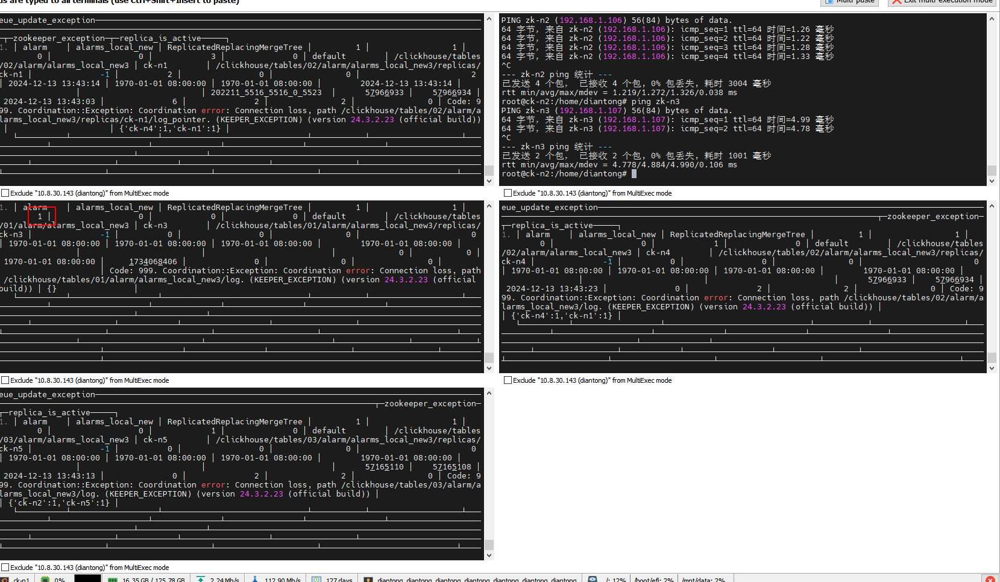
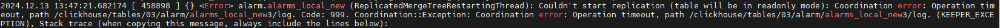
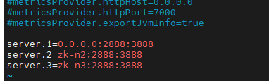
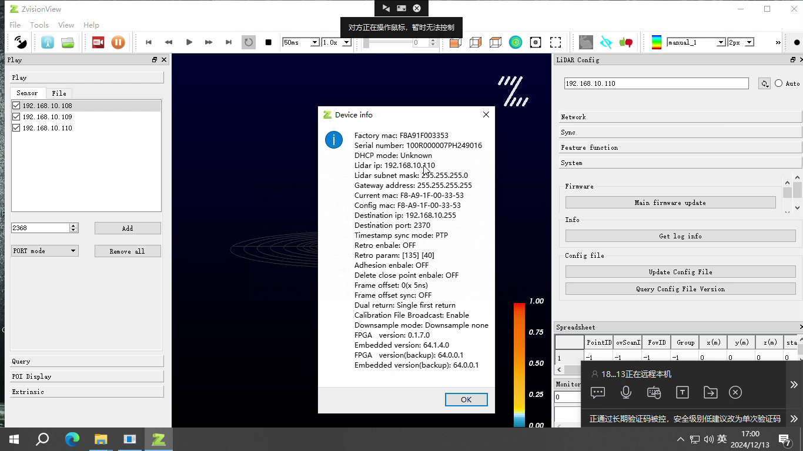

ck集群问题

3分片2副本

```sql
INSERT INTO alarm.themes (SensorId, CollectTime, Values, ValueStrs) VALUES ('test:003', '2024-12-12 10:00:00.000', [2], []);
INSERT INTO alarm.themes (SensorId, CollectTime, Values, ValueStrs) VALUES ('test:003', '2024-12-12 11:00:00.000', [2], []);
INSERT INTO alarm.themes (SensorId, CollectTime, Values, ValueStrs) VALUES ('test:003', '2024-12-12 12:00:00.000', [2], []);
INSERT INTO alarm.themes (SensorId, CollectTime, Values, ValueStrs) VALUES ('test:003', '2024-12-12 13:00:00.000', [2], []);
INSERT INTO alarm.themes (SensorId, CollectTime, Values, ValueStrs) VALUES ('test:003', '2024-12-12 14:00:00.000', [2], []);
INSERT INTO alarm.themes (SensorId, CollectTime, Values, ValueStrs) VALUES ('test:003', '2024-12-12 15:00:00.000', [2], []);
INSERT INTO alarm.themes (SensorId, CollectTime, Values, ValueStrs) VALUES ('test:003', '2024-12-12 16:00:00.000', [2], []);
INSERT INTO alarm.themes (SensorId, CollectTime, Values, ValueStrs) VALUES ('test:003', '2024-12-12 17:00:00.000', [2], []);
INSERT INTO alarm.themes (SensorId, CollectTime, Values, ValueStrs) VALUES ('test:003', '2024-12-12 18:00:00.000', [2], []);
INSERT INTO alarm.themes (SensorId, CollectTime, Values, ValueStrs) VALUES ('test:003', '2024-12-12 19:00:00.000', [2], []);
INSERT INTO alarm.themes (SensorId, CollectTime, Values, ValueStrs) VALUES ('test:003', '2024-12-12 20:00:00.000', [2], []);

select * from alarm.themes_local where SensorId='test:003' and CollectTime>='2024-12-12 00:00:00' order by CollectTime;
```

问题：

插入11条数据，实际入库4条。（只有一个主分片有数据了）


master上面：

count=9750085975   max=2106-02-06 06:28:15.000


查看local表之后发现：

+ master 和node-03是一个主备分片。只有上面有新插入的数据
+ ck-n1上数据中断在8-7日


查看n1日志发现：

```log


```

重启N1


还是不行？？

查看Master

```log

2024.12.12 22:21:54.755633 [ 13211 ] {} <Error> alarm.themes_local (e0b1d04f-ae96-41d8-b90b-bea8d9de3cbb): void DB::StorageReplicatedMergeTree::mergeSelectingTask(): Code: 242. DB::Exception: Table is in readonly mode (replica path: /clickhouse/tables/01/alarm/themes_local/replicas/ck-master). (TABLE_IS_READ_ONLY), Stack trace (when copying this message, always include the lines below):

0. DB::Exception::Exception(DB::Exception::MessageMasked&&, int, bool) @ 0x000000000cbcedbb
1. DB::Exception::Exception<String const&>(int, FormatStringHelperImpl<std::type_identity<String const&>::type>, String const&) @ 0x0000000007674e43
2. DB::StorageReplicatedMergeTree::assertNotReadonly() const @ 0x000000001180e887
3. DB::StorageReplicatedMergeTree::mergeSelectingTask() @ 0x00000000118b275f
4. DB::BackgroundSchedulePool::threadFunction() @ 0x000000000fd9f367
5. void std::__function::__policy_invoker<void ()>::__call_impl<std::__function::__default_alloc_func<ThreadFromGlobalPoolImpl<false>::ThreadFromGlobalPoolImpl<DB::BackgroundSchedulePool::BackgroundSchedulePool(unsigned long, StrongTypedef<unsigned long, CurrentMetrics::MetricTag>, StrongTypedef<unsigned long, CurrentMetrics::MetricTag>, char const*)::$_0>(DB::BackgroundSchedulePool::BackgroundSchedulePool(unsigned long, StrongTypedef<unsigned long, CurrentMetrics::MetricTag>, StrongTypedef<unsigned long, CurrentMetrics::MetricTag>, char const*)::$_0&&)::'lambda'(), void ()>>(std::__function::__policy_storage const*) @ 0x000000000fda04d3
6. void* std::__thread_proxy[abi:v15000]<std::tuple<std::unique_ptr<std::__thread_struct, std::default_delete<std::__thread_struct>>, void ThreadPoolImpl<std::thread>::scheduleImpl<void>(std::function<void ()>, Priority, std::optional<unsigned long>, bool)::'lambda0'()>>(void*) @ 0x000000000cc7d9ed
7. ? @ 0x00007fd8cdbf7609
8. ? @ 0x00007fd8cdb1c353
 (version 24.3.2.23 (official build))

```

chatg提示我去检查zk状态

```sh
echo ruok | nc zk-n3 2182
```

ZK 都是正常的


那就重启表吧:

```sql
SYSTEM RESTART REPLICA alarm.themes_local;
```


没有用：

CK-N1

```
2024.12.13 10:46:14.241891 [ 3672731 ] {} <Error> ReadWriteBufferFromHTTP: Failed to make request to 'http://ck-n4:9009/?endpoint=DataPartsExchange%3A%2Fclickhouse%2Ftables%2F02%2Falarm%2Fthemes_local%2Freplicas%2Fck-n4&part=202412_1093995_1093995_0&client_protocol_version=8&compress=false'. Error: 'Timeout: connect timed out: 192.168.1.103:9009'. Failed at try 1/1.
2024.12.13 10:46:14.242476 [ 3672731 ] {} <Error> alarm.themes_local (e0b1d04f-ae96-41d8-b90b-bea8d9de3cbb): auto DB::StorageReplicatedMergeTree::processQueueEntry(ReplicatedMergeTreeQueue::SelectedEntryPtr)::(anonymous class)::operator()(LogEntryPtr &) const: Poco::Exception. Code: 1000, e.code() = 0, Timeout: connect timed out: 192.168.1.103:9009, Stack trace (when copying this message, always include the lines below):
2024.12.13 10:46:14.256755 [ 3672763 ] {} <Error> ReadWriteBufferFromHTTP: Failed to make request to 'http://ck-n4:9009/?endpoint=DataPartsExchange%3A%2Fclickhouse%2Ftables%2F02%2Falarm%2Fthemes_local%2Freplicas%2Fck-n4&part=202405_211022_211022_0&client_protocol_version=8&compress=false'. Error: 'Timeout: connect timed out: 192.168.1.103:9009'. Failed at try 1/1.
2024.12.13 10:46:14.257391 [ 3672763 ] {} <Error> alarm.themes_local (e0b1d04f-ae96-41d8-b90b-bea8d9de3cbb): auto DB::StorageReplicatedMergeTree::processQueueEntry(ReplicatedMergeTreeQueue::SelectedEntryPtr)::(anonymous class)::operator()(LogEntryPtr &) const: Poco::Exception. Code: 1000, e.code() = 0, Timeout: connect timed out: 192.168.1.103:9009, Stack trace (when copying this message, always include the lines below):
```


CK-n2

```
2024.12.13 10:47:53.026099 [ 458998 ] {} <Error> MergeTreeBackgroundExecutor: Exception while executing background task {e0b1d04f-ae96-41d8-b90b-bea8d9de3cbb::202411_27626683_27626735_12}: Code: 999. Coordination::Exception: Coordination error: Connection loss, path /clickhouse/tables/03/alarm/themes_local/quorum/parallel. (KEEPER_EXCEPTION), Stack trace (when copying this message, always include the lines below):
2024.12.13 10:47:53.031545 [ 458999 ] {} <Error> auto DB::ReplicatedMergeMutateTaskBase::executeImpl()::(anonymous class)::operator()() const: Code: 999. Coordination::Exception: Coordination error: Connection loss, path /clickhouse/tables/03/alarm/themes_local/replicas/ck-n2/queue/queue-0135828665. (KEEPER_EXCEPTION), Stack trace (when copying this message, always include the lines below):
2024.12.13 10:47:53.032439 [ 458988 ] {} <Error> e0b1d04f-ae96-41d8-b90b-bea8d9de3cbb::202411_27627042_27627047_1 (MergeFromLogEntryTask): virtual bool DB::ReplicatedMergeMutateTaskBase::executeStep(): Code: 999. Coordination::Exception: Coordination error: Connection loss, path /clickhouse/tables/03/alarm/themes_local/replicas. (KEEPER_EXCEPTION), Stack trace (when copying this message, always include the lines below):
2024.12.13 10:47:53.032833 [ 458988 ] {} <Error> MergeTreeBackgroundExecutor: Exception while executing background task {e0b1d04f-ae96-41d8-b90b-bea8d9de3cbb::202411_27627042_27627047_1}: Code: 999. Coordination::Exception: Coordination error: Connection loss, path /clickhouse/tables/03/alarm/themes_local/replicas. (KEEPER_EXCEPTION), Stack trace (when copying this message, always include the lines below):

```


发现alarms也是这样的

查看：

```sql
select * from system.replicas where database='alarm' and table='alarms_local_new'

select * from system.replicas where database='alarm' and table='themes_local'
```


发现本地表处于只读状态

+ ck-master
+ ck-n2
+ ck-n3





```log
2024.12.13 13:49:39.415343 [ 458898 ] {} <Warning> alarm.alarms_local_new (ReplicatedMergeTreeRestartingThread): Table was in readonly mode. Will try to activate it.
2024.12.13 13:49:41.974913 [ 458898 ] {} <Warning> alarm.alarms_local_new (e541158c-dbcf-43cc-9071-0ca4d24f0d9b): Will mimic ck-n5
2024.12.13 13:49:56.315958 [ 458898 ] {} <Error> zkutil::EphemeralNodeHolder::~EphemeralNodeHolder(): Cannot remove /clickhouse/tables/03/alarm/alarms_local_new3/replicas/ck-n2/is_active: Code: 999. Coordination::Exception: Coordination error: Session expired, path /clickhouse/tables/03/alarm/alarms_local_new3/replicas/ck-n2/is_active. (KEEPER_EXCEPTION), Stack trace (when copying this message, always include the lines below):
2024.12.13 13:49:56.316231 [ 458898 ] {} <Error> alarm.alarms_local_new (ReplicatedMergeTreeRestartingThread): Couldn't start replication (table will be in readonly mode): Coordination error: Operation timeout, path /clickhouse/tables/03/alarm/alarms_local_new3/replicas/ck-n5/log_pointer. Code: 999. Coordination::Exception: Coordination error: Operation timeout, path /clickhouse/tables/03/alarm/alarms_local_new3/replicas/ck-n5/log_pointer. (KEEPER_EXCEPTION), Stack trace (when copying this message, always include the lines below):
```

检查ZK：

```sh
echo stat | nc zk-n1 2181

root@sifangjing:/home/diantong# echo srvr | nc zk-n3 2181
Zookeeper version: 3.8.4-9316c2a7a97e1666d8f4593f34dd6fc36ecc436c, built on 2024-02-12 22:16 UTC
Latency min/avg/max: 0/67.8886/15460
Received: 7394649
Sent: 4256869
Connections: 2
Outstanding: 0
Zxid: 0x223001be53a
Mode: leader
Node count: 100284
Proposal sizes last/min/max: 277/36/60755

root@sifangjing:/home/diantong# echo srvr | nc zk-n2 2181
This ZooKeeper instance is not currently serving requests

```




