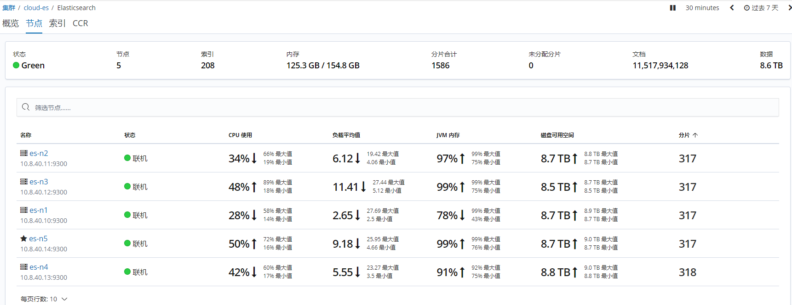
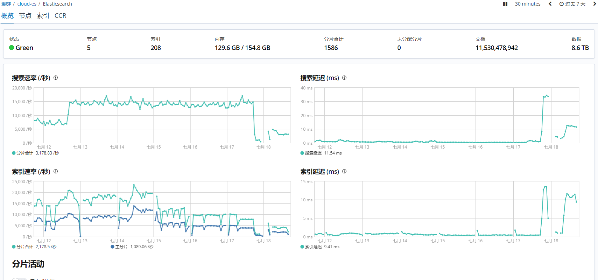

ES查询变慢


n3 n5 负载高




目前集群

+ QPS ~5000  前几日最高峰 ~15000
+ TPS ~5000 范围800~12000



索引查询速率：


打开es的slow log：https://www.elastic.co/guide/en/elasticsearch/reference/current/index-modules-slowlog.html#_identifying_search_slow_log_origin

```yaml
index.search.slowlog.threshold.query.warn: 10s
index.search.slowlog.threshold.query.info: 5s
index.search.slowlog.threshold.query.debug: 2s
index.search.slowlog.threshold.query.trace: 500ms
```

登录es-n3/n5查看慢日志，见附录：


查看磁盘I/O情况

https://www.cnblogs.com/mauricewei/p/10502539.html

```sh
[root@cloud-es-n3 logs]# vmstat 2
procs -----------memory---------- ---swap-- -----io---- -system-- ------cpu-----
 r  b   swpd   free   buff  cache   si   so    bi    bo   in   cs us sy id wa st
23  0      0 311552     12 21377916    0    0   206   106    0    0  9  1 88  1  0
 2  0      0 313168     12 21376672    0    0  4522  1211 39051 116610 17  3 80  0  0
 2  0      0 310600     12 21376252    0    0     0     0 5694  919  3  3 94  0  0
 2  0      0 310648     12 21376320    0    0     0     0 3727  802  3  3 94  0  0
 2  0      0 310648     12 21376348    0    0     0     1 3771  840  3  3 94  0  0
 2  0      0 310536     12 21374968    0    0    54 17998 6331  900  3  3 93  0  0
 2  0      0 310176     12 21375168    0    0     0     8 9400  836  2  4 94  0  0
10  7      0 323344     12 21371932    0    0 55801 10012 384014 38424 22  6 62 10  0
 3  3      0 286032     12 21410832    0    0 25900  9829 100510 27391 37  2 56  5  0
 8  0      0 281280     12 21417148    0    0 21535  2189 76256 80468 14  1 82  3  0
23  1      0 278892     12 21419276    0    0  4184   394 66528 89937 29  1 69  1  0
```


### 参考

【1】[高级调优：查找并修复 Elasticsearch 慢查询](https://www.elastic.co/cn/blog/advanced-tuning-finding-and-fixing-slow-elasticsearch-queries)

> #### 问题
>
> 查询面向的分片太多，超过了集群中的核心数。这会在搜索线程池中造成排队任务，从而导致搜索拒绝。另一个常见原因是磁盘 I/O 速度慢，导致搜索排队或在某些情况下 CPU 完全饱和。 
>
> #### 解决方案
>
> 创建索引时采用 *1 个主分片:1 个副本分片* (1P:1R) 模型。使用[索引模板](https://www.elastic.co/guide/en/elasticsearch/reference/7.0/indices-templates.html)是一个在创建索引时部署此设置的好方法。（Elasticsearch 7.0 或更高版本将默认 1P:1R）。Elasticsearch 5.1 或更高版本支持[搜索任务取消](https://www.elastic.co/guide/en/elasticsearch/reference/7.0/search.html#global-search-cancellation)，这对于取消[任务管理 API](https://www.elastic.co/guide/en/elasticsearch/reference/7.0/tasks.html) 中出现的慢查询任务非常有用。若要改进磁盘 I/O，请查看[存储建议](https://www.elastic.co/guide/en/elasticsearch/reference/7.0/tune-for-indexing-speed.html#_use_faster_hardware)，并确保使用推荐的硬件以获得最佳性能。

【2】[Elasticsearch调优篇-慢查询分析笔记](https://heapdump.cn/article/1966569)

> 


### 附录：慢查询

