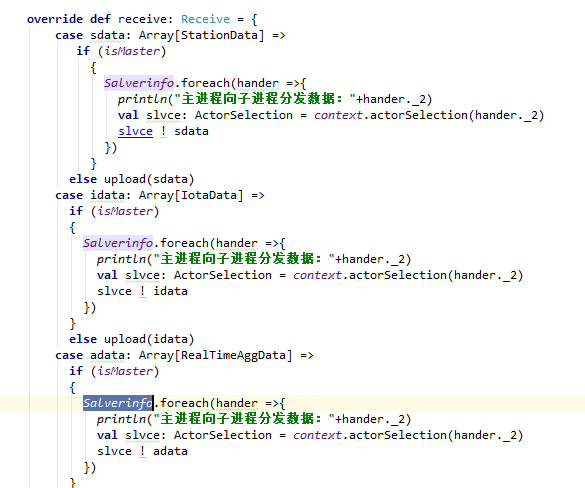

1. 重复的继承类，可以使用统一继承不同构造参数改造

   

   ```scala
   object http_comm_son4 extends http_comm with Logging with Expiring {
       class_name = "http_comm_son4"
       override  def initDebug(): Unit = {
           // val source = Source.fromInputStream(getClass.getResourceAsStream("/http.comm_chongqing.json"))
           val source = Source.fromInputStream(getClass.getResourceAsStream("/http.comm_jk.json"))
           val cfg = try JsonHelper.Json2Object[Array[CommUploadConfig]](source.mkString)._1.get finally source.close
           configs = cfg
           //configAsKnown = DateTime.now
       }
       override def refresh(): Unit = {
           try {
               configs = ConfigHelper.getUploadCommHttpConfigNew(class_name).map(s => {
                   val (obj, _) = JsonHelper.Json2Object[CommUploadConfig](s._2)
                   if (obj.isEmpty) {
                       warn(s"http_comm_son4 upload comm-http config json parse error: id ${s._1}")
                   }
                   obj
               }).filter(_.nonEmpty).map(_.get)
           } catch {
               case tr: Throwable => warn(s"http_comm_son4 comm-http upload refresh error: ${tr.getMessage}")
           }
   
           try {
               logger.info("[http_comm_son4] cache flushing")
               http_comm.flush() // cache flushing
           } catch {
               case tr: Throwable =>
                   warn(s"[http_comm_son4] flush error: ${tr.getMessage}")
           }
       }
   
   }
   ```

   

2. 基类中无效的重载函数

   基类http_comm应该作为抽象类，不在做业务内容处理

   去除如下：

   ```scala
   override def refresh(): Unit 
   ```

   

3. 控制日志体量

   在关键位置记录日志，同时应该使用log类而非控制台答应

   