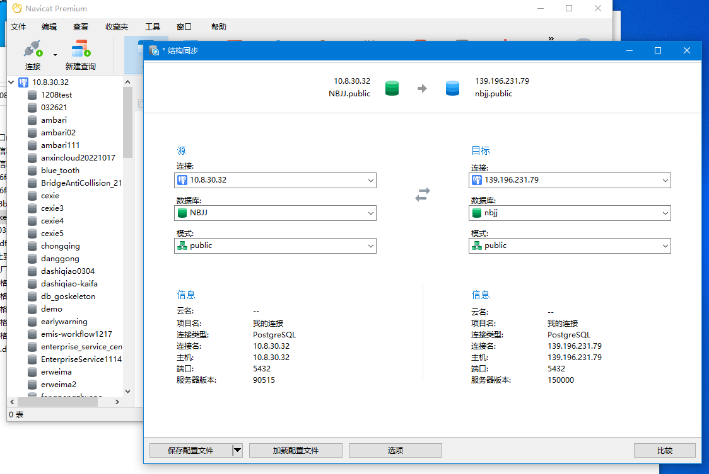

Navicat

[Navicat Premium 16 下载与安装破解教程（详细教程）](https://learnku.com/articles/67706)


工具 > 表结构同步

> 创建相同的用户两边，不然会出现
>
> ```
> postgres role "admin" does not exist
> ```
>
> 执行sql
>
> ```sql
> CREATE USER admin SUPERUSER;
> CREATE DATABASE nbjj2 WITH OWNER admin;
> ```




> 遇到ALTER SEQUENCE "public"."t_bridge_component_id_seq"
> OWNED BY "public"."t_bridge_component"."id";执行报错，这时候：
>
> 选择选项中“遇到问题继续执行”
>
> 执行完成后，再进行对比，再执行即可


