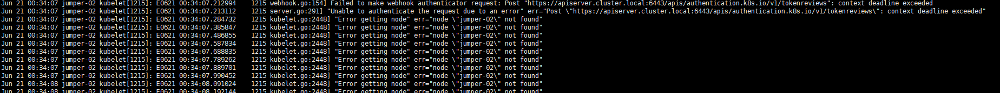
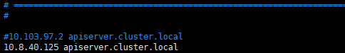

## K8S服务无法启动

jumper-02上的`kubernetes`无法启动，一直是`not ready`状态

尝试： `swapoff -a`之后没有效果。

查看系统日志`tail -n 10000 /var/log/syslog`

发下连不上k8s主服务https://apiserver.cluster.local:6443/api

查看/etc/hosts

对比其他节点发现该域（apiserver.cluster.local）配置的ip地址不同，修改一致后重启kubelet服务成功。

