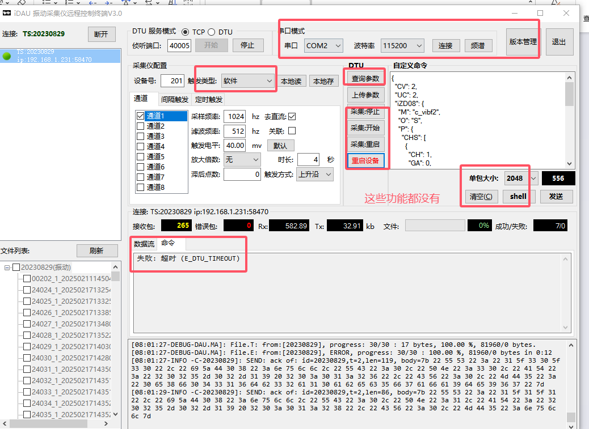
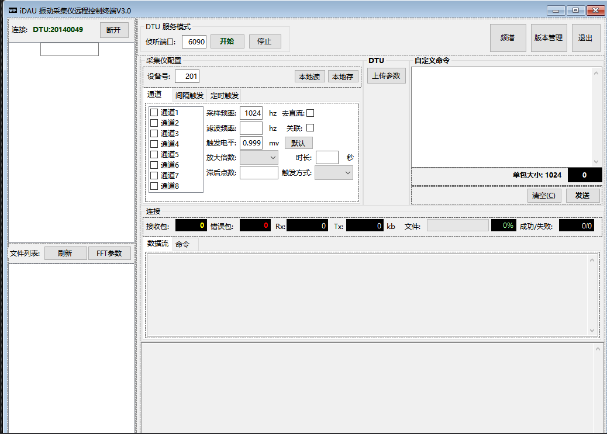
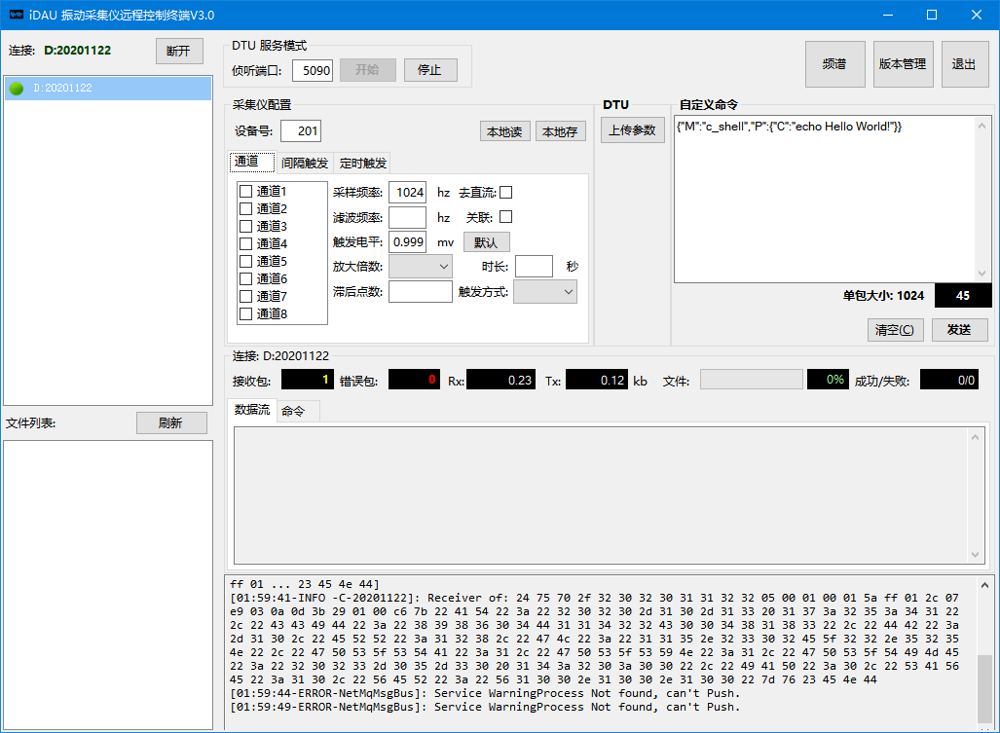
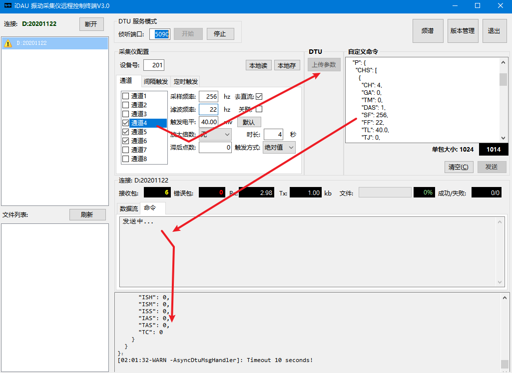
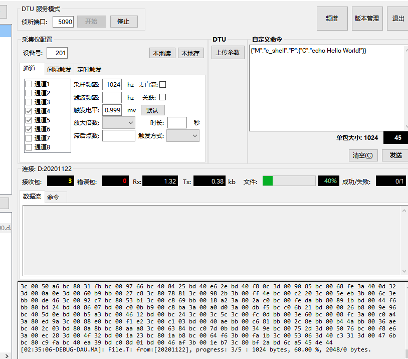

#### `spiDAU` 界面功能适配FS-V08

故障[15032](https://pms.anxinyun.cn/story-view-15032.html) **idau工具功能需求核对，针对没有用的问题进行删除或者屏蔽。**

需求要求：

现在界面：

基础功能验证：（使用模拟报文方式模拟FS-V08设备，验证基础界面功能）

1. 设备上线

   设备连接上后，软件界面左侧列表中显示【在线设备DTU编号】

   

2. 指令下发

   参数能正确从通道内读取，显示在右侧【自定义命令】中，点击【上传参数】可以看到命令中显示‘发送中’，且看到json命令下发日志。

   

3. 文件上传

   模拟文件上传，idau.tool接收成功
   
   

