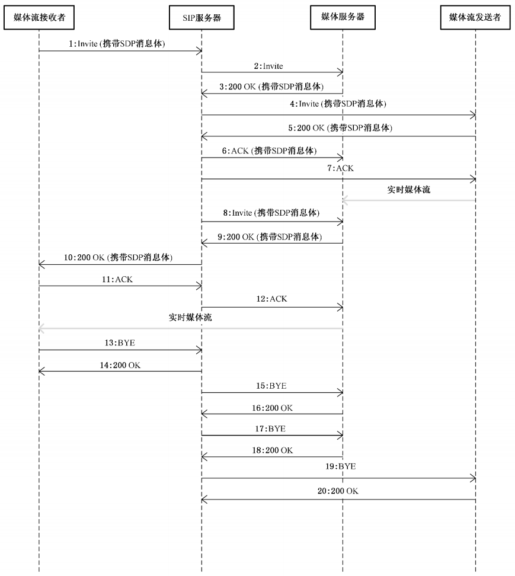

### 商用A

ZLM


WVP


zlm中media流媒体服务器配置：

```yml
#zlm 默认服务器配置
media:
    # [必须修改] zlm服务器唯一id，用于触发hook时区别是哪台服务器,general.mediaServerId
    id: fs-zlm-0
    # [必须修改] zlm服务器的内网IP
    ip: zlm
    # [可选] 返回流地址时的ip，置空使用 media.ip
    stream-ip: 222.186.227.196
    # [可选] wvp在国标信令中使用的ip，此ip为摄像机可以访问到的ip， 置空使用 media.ip
    sdp-ip: 222.186.227.196
    # [可选] zlm服务器的hook所使用的IP, 默认使用sip.ip
    hook-ip: wvp
    # [必须修改] zlm服务器的http.port
    http-port: 31812
    # [可选] zlm服务器的http.sslport, 置空使用zlm配置文件配置
    http-ssl-port:
    # [可选] zlm服务器的rtmp.port, 置空使用zlm配置文件配置
    rtmp-port: 31314
    # [可选] zlm服务器的rtmp.sslport, 置空使用zlm配置文件配置
    rtmp-ssl-port:
    # [可选] zlm服务器的 rtp_proxy.port, 置空使用zlm配置文件配置
    rtp-proxy-port: 30585
    # [可选] zlm服务器的 rtsp.port, 置空使用zlm配置文件配置
    rtsp-port: 31741
    # [可选] zlm服务器的 rtsp.sslport, 置空使用zlm配置文件配置
    rtsp-ssl-port:
    # [可选] 是否自动配置ZLM, 如果希望手动配置ZLM, 可以设为false, 不建议新接触的用户修改
    auto-config: true
    # [可选] zlm服务器的hook.admin_params=secret
    secret: 035c73f7-bb6b-4889-a715-d9eb2d1925cc
    # 启用多端口模式, 多端口模式使用端口区分每路流，兼容性更好。 单端口使用流的ssrc区分， 点播超时建议使用多端口测试
    rtp:
        # [可选] 是否启用多端口模式, 开启后会在portRange范围内选择端口用于媒体流传输
        enable: false
        # [可选] 在此范围内选择端口用于媒体流传输, 必须提前在zlm上配置该属性，不然自动配置此属性可能不成功
        port-range: 30000,30500 # 端口范围
        send-port-range: 40000,40500 # 端口范围
    # 录像辅助服务， 部署此服务可以实现zlm录像的管理与下载， 0 表示不使用
    record-assist-port: 0
```


### 本地

```sh
root@node38:/home/anxin# docker run -it -p 1935:1935 -p 8081:80 -p 8443:443 -p 8554:554 -p 10000:10000 -p 10000:10000/udp -p 8000:8000/udp -p 9000:9000/udp -v /home/anxin/test/zlmconfig:/opt/media/conf zlmediakit/zlmediakit:master
```


### 部署在anxin-m1

```sh
# 启动
root@anxin-m1:/home/anxin/wvp# ./start.sh

nohup java -jar wvp-pro-*.jar --spring.config.location=application.yml > /dev/null 2>&1 &

nohup zlm/MediaServer > /dev/null 2>&1 &
```


> ZLM
>
> + HTTP 31812
> + RTMP 31314
> + RTP 30585
> + SRT 30448
> + RTSP 31741  30710/udp
>
> WVP
>
> + SIP 32339 
> + HTTP 32308
>
> 


测试RTSP推流：

```sh
ffmpeg -re -i C:\Users\yww08\Documents\WXWork\1688858167337977\Cache\Video\2022-12\1670324374844.mp4  -vcodec libx264 -vprofile baseline -g 30 -acodec aac -strict -2 -f rtsp -rtsp_transport tcp rtsp://218.3.126.49:31741/live/test

ffmpeg -re -i C:\Users\yww08\Documents\WXWork\1688858167337977\Cache\Video\2022-12\1670324374844.mp4 -vcodec h264 -acodec aac -f flv rtmp://10.8.30.38:1935/live/test

```

测试RTP推流

> RTP推流无法播放

```sh
ffmpeg -re -i C:\Users\yww08\Documents\WXWork\1688858167337977\Cache\Video\2022-12\1670324374844.mp4  -vcodec h264 -acodec aac -f rtp_mpegts rtp://218.3.126.49:30585/live/test
```

发布地址： http://218.3.126.49:32308/ admin/F***123


### WVP播放超时


[官方说明](https://doc.wvp-pro.cn/#/_content/qa/play_error)

点播超时的情况大致分为两种：点播超时和收流超时

1. 点播超时

   点播超时错误一般为信令的超时，比如长时间为收到对方的回复，可能出现在流程中 “3. 200OK(携带SDP消息体)”这个位置，即我们发送点播消息，但是设备没有回复，可能的原因：

   > 1. 设备内部错误，未能回复消息
   > 2. 网络原因消息未到到达设备

大部分时候是原因2，所以遇到这个错误我们首先要排查我们我的网路，如果你是公网部署，那么也可能时心跳周期太长，导致的路由NAT失效，WVP的消息无法通道原来的IP端口号发送给设备。

1. **收流超时**
   收流超时可能发生在流程中的5和6,可能的原因有：

   > 1. 设备发送了流但是发送到了错误的ip和端口上，而这个信息是在invite消息的sdp中指定的，就是流程2Invite(携带SDP消息体)中，而这个错误很可能来自你的配置错误，比如你设置了127.0.0.1导致设备网127.0.0.1上发流，或者是你WVP在公网，但是你给设备了一个内网ip，导致设备无法把流发送过来；
   > 2. 设备内部错误未发送流；
   > 3. 设备发送了流，但是流无法识别，可能存在于流不规范和网络很差的情况下；
   > 4. 设备发送了流，zlm也收到了，但是zlm无法通过hook通知到wvp，此时原因是你可以检查zlm的配置文件中的hook配置，看看是否无法从zlm连接到wvp；
   > 5. 设备发送了流，但是开启SSRC校验，设备的流不够规范采用错误的ssrc，导致zlm选择丢弃；

   针对这些可能的错误原因我建议的排查顺序：

- 关闭ssrc校验；
- 查看zlm配置的hook是否可以连接到zlm；
- 查看zlm日志是否有流注册；
- 抓包查看流的信息，看看流是否正常发送，甚至可以导出发送原始流，用vlc播放，看看是否可以播放。


### GB28181编码

https://blog.csdn.net/jiuaiwo1314/article/details/104986626

**20**位编码说明：

| 中心编码   | 行业编码 | 类型编码           | 网络标识 | 序号   |
| ---------- | -------- | ------------------ | -------- | ------ |
| 36012101   | 08       | 118                | 7        | 290001 |
|            |          |                    |          |        |
| 类型：     | 118      | NVR                |          |        |
|            | 112      | DVR                |          |        |
|            | 132      | IPC                |          |        |
|            | 200      | 中心信令控制服务器 |          |        |
|            | 216      | 虚拟组织编码       |          |        |
|            |          |                    |          |        |
| 网络标识： | 0~4      | 监控报警专网       |          |        |
|            | 5        | 公安信息网         |          |        |
|            | 6        | 政务网             |          |        |
|            | 7        | Internet           |          |        |

地址中心编码

https://www.gov.cn/test/2011-08/22/content_1930111.htm

南昌县：360121   

镇江京口：321102   




SIP

```json
INVITE的指令

SIP/2.0 200 OK
Via: SIP/2.0/UDP 0.0.0.0:32339;branch=z9hG4bK7990949302;rport=32339;received=218.3.126.49
From: <sip:32110000002000000001@3211000000>;tag=0fd00f5515394dc6b5c19fd57c8a36f8
To: <sip:34020000001310000001@10.8.10.1:2086>;tag=104696745
Call-ID: bf1092a8a706fe40214fe53ed11e2292@0.0.0.0
CSeq: 8 INVITE  // CSeq 头部字段指定请求的序列号以及请求方法。这里是第 8 个请求，使用的是 INVITE 方法。
Contact: <sip:34020000001310000001@10.8.10.1:2086> // Contact 头部字段指定接收请求的用户代理（User Agent）的地址。
Content-Type: application/SDP // Content-Type 头部字段指示消息主体的数据类型，这里是 SDP (Session Description Protocol)。
User-Agent: Embedded Net DVR/NVR/DVS
Content-Length: 184

v=0：SDP 版本。
o=34020000001110000088 0 0 IN IP4 10.8.30.16：会话的起始者和会话的唯一标识等信息。
s=Play：会话的名称。
c=IN IP4 10.8.30.16：连接信息，指示使用的 IP 地址。
t=0 0：会话的时间范围。
m=video 62014 RTP/AVP 96：媒体描述，指示媒体类型、端口等信息。
a=sendonly：媒体传输属性，指示该媒体是发送端。
a=rtpmap:96 PS/90000：指示 RTP Payload 类型，以及时钟频率等信息。
y=0100009958：附加属性，指示某些特定的参数。
f=v/2/5/25/1/4096a///：媒体格式描述，指示媒体的格式。
```


GB级联的流程说明：


