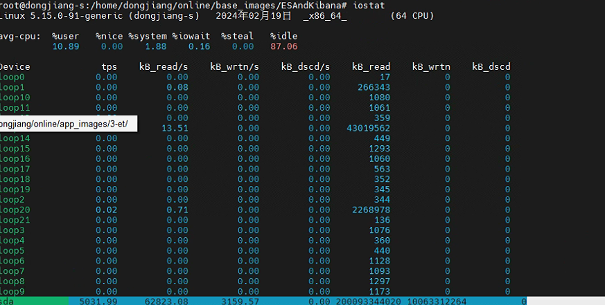
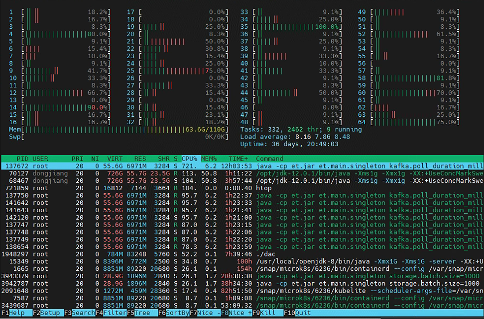

东江ElasticSearch问题排查

> 问题：ES索引速度变慢，普通存储100多条数据需要花费30多秒。

优化ES索引速度的方式总结[如下](https://www.elastic.co/guide/en/elasticsearch/reference/7.0/tune-for-indexing-speed.html#multiple-workers-threads)：

1. 使用批量请求。并且通过不断的基准测试（首先尝试一次索引 100 个文档，然后是 200 个文档，然后是 400 个文档，等等）得出最优速度
2. 使用多线程。应该从多个线程或进程发送数据。除了更好地利用集群的资源之外，这应该有助于降低每次 fsync 的成本。
3. 取消设置或增加刷新间隔。增加到 [`index.refresh_interval`](https://www.elastic.co/guide/en/elasticsearch/reference/7.0/index-modules.html#dynamic-index-settings)
4. 确保操作系统不会通过[禁用交换](https://www.elastic.co/guide/en/elasticsearch/reference/7.0/setup-configuration-memory.html)来交换 java 进程。 `sudo swapoff -a`
5. 使用自动生成的ID
6. 为文件系统缓存提供内存。The filesystem cache will be used in order to buffer I/O operations.
7. 使用更快的硬件。通过配置 RAID 0 阵列将索引跨多个 SSD 进行条带化
8. 索引缓冲区大小。确保 [`indices.memory.index_buffer_size`](https://www.elastic.co/guide/en/elasticsearch/reference/7.0/indexing-buffer.html)足够大，该项目默认内容为10%的JVM设置。


最终：

<font color="red">**通过修改ET写入ES代码，将ID固定去掉解决。**</font>


排查方法记录：

`iostat`查看磁盘IO情况：




通过`htop`查看服务器CPU和内存占用：




查看es配置：

```sh
GET /_cat/settings
```

```json
{
  "native_alarms" : {
    "settings" : {
      "index" : {
        "refresh_interval" : "10s",
        "number_of_shards" : "1",
        "translog" : {
          "sync_interval" : "60s",
          "durability" : "async"
        },
        "blocks" : {
          "read_only_allow_delete" : "false"
        },
        "provided_name" : "native_alarms",
        "creation_date" : "1690429630915",
        "number_of_replicas" : "0",
        "uuid" : "GSLRY5-mQAKFg1tKfjiQJQ",
        "version" : {
          "created" : "6080299"
        }
      }
    }
  },
  "native_themes" : {
    "settings" : {
      "index" : {
        "refresh_interval" : "30s",
        "number_of_shards" : "1",
        "translog" : {
          "sync_interval" : "60s",
          "durability" : "async"
        },
        "blocks" : {
          "read_only_allow_delete" : "false"
        },
        "provided_name" : "native_themes",
        "max_result_window" : "200000",
        "creation_date" : "1690429631317",
        "number_of_replicas" : "0",
        "uuid" : "Bhx2r7yNR8q4oNS5bdLwcg",
        "version" : {
          "created" : "6080299"
        }
      }
    }
  },
  "native_raws" : {
    "settings" : {
      "index" : {
        "refresh_interval" : "30s",
        "number_of_shards" : "1",
        "translog" : {
          "sync_interval" : "60s",
          "durability" : "async"
        },
        "blocks" : {
          "read_only_allow_delete" : "false"
        },
        "provided_name" : "native_raws",
        "creation_date" : "1690429631075",
        "number_of_replicas" : "0",
        "uuid" : "odpWE461QSif97ETe009Wg",
        "version" : {
          "created" : "6080299"
        }
      }
    }
  },
  "native_alarm_details" : {
    "settings" : {
      "index" : {
        "refresh_interval" : "10s",
        "number_of_shards" : "1",
        "translog" : {
          "sync_interval" : "60s",
          "durability" : "async"
        },
        "blocks" : {
          "read_only_allow_delete" : "false"
        },
        "provided_name" : "native_alarm_details",
        "creation_date" : "1690429630841",
        "number_of_replicas" : "0",
        "uuid" : "__gNgCaOT6yXvNtL3rVhnw",
        "version" : {
          "created" : "6080299"
        }
      }
    }
  },
  "native_vbraws" : {
    "settings" : {
      "index" : {
        "refresh_interval" : "30s",
        "number_of_shards" : "1",
        "translog" : {
          "sync_interval" : "60s",
          "durability" : "async"
        },
        "blocks" : {
          "read_only_allow_delete" : "false"
        },
        "provided_name" : "native_vbraws",
        "creation_date" : "1690429631394",
        "number_of_replicas" : "0",
        "uuid" : "LainyYglQyGzdBOgr_qHZA",
        "version" : {
          "created" : "6080299"
        }
      }
    }
  }
}
```


节点状态看起来也很正常：

`_nodes/stats`

```json
{
  "_nodes" : {
    "total" : 1,
    "successful" : 1,
    "failed" : 0
  },
  "cluster_name" : "elasticsearch",
  "nodes" : {
    "ajhDAWNaQ36oCt3n-2yAyg" : {
      "timestamp" : 1708318160755,
      "name" : "ajhDAWN",
      "transport_address" : "10.1.136.205:9300",
      "host" : "10.1.136.205",
      "ip" : "10.1.136.205:9300",
      "roles" : [
        "master",
        "data",
        "ingest"
      ],
      "attributes" : {
        "ml.machine_memory" : "117724819456",
        "xpack.installed" : "true",
        "ml.max_open_jobs" : "20",
        "ml.enabled" : "true"
      },
      "indices" : {
        "docs" : {
          "count" : 2568455083,
          "deleted" : 21738886
        },
        "store" : {
          "size_in_bytes" : 741064571941
        },
        "indexing" : {
          "index_total" : 522807,
          "index_time_in_millis" : 9818234,
          "index_current" : 1,
          "index_failed" : 0,
          "delete_total" : 0,
          "delete_time_in_millis" : 0,
          "delete_current" : 0,
          "noop_update_total" : 0,
          "is_throttled" : false,
          "throttle_time_in_millis" : 0
        },
        "get" : {
          "total" : 1135,
          "time_in_millis" : 223,
          "exists_total" : 1135,
          "exists_time_in_millis" : 223,
          "missing_total" : 0,
          "missing_time_in_millis" : 0,
          "current" : 0
        },
        "search" : {
          "open_contexts" : 1,
          "query_total" : 22103,
          "query_time_in_millis" : 15188135,
          "query_current" : 1,
          "fetch_total" : 13792,
          "fetch_time_in_millis" : 38232,
          "fetch_current" : 0,
          "scroll_total" : 567,
          "scroll_time_in_millis" : 51057090,
          "scroll_current" : 0,
          "suggest_total" : 0,
          "suggest_time_in_millis" : 0,
          "suggest_current" : 0
        },
        "merges" : {
          "current" : 0,
          "current_docs" : 0,
          "current_size_in_bytes" : 0,
          "total" : 253,
          "total_time_in_millis" : 197981,
          "total_docs" : 2112980,
          "total_size_in_bytes" : 684680670,
          "total_stopped_time_in_millis" : 0,
          "total_throttled_time_in_millis" : 0,
          "total_auto_throttle_in_bytes" : 629145600
        },
        "refresh" : {
          "total" : 2669,
          "total_time_in_millis" : 329390,
          "listeners" : 0
        },
        "flush" : {
          "total" : 37,
          "periodic" : 0,
          "total_time_in_millis" : 769
        },
        "warmer" : {
          "current" : 0,
          "total" : 2558,
          "total_time_in_millis" : 1948
        },
        "query_cache" : {
          "memory_size_in_bytes" : 683648,
          "total_count" : 37315,
          "hit_count" : 1382,
          "miss_count" : 35933,
          "cache_size" : 54,
          "cache_count" : 62,
          "evictions" : 8
        },
        "fielddata" : {
          "memory_size_in_bytes" : 30824,
          "evictions" : 0
        },
        "completion" : {
          "size_in_bytes" : 0
        },
        "segments" : {
          "count" : 423,
          "memory_in_bytes" : 841923853,
          "terms_memory_in_bytes" : 410677256,
          "stored_fields_memory_in_bytes" : 261263064,
          "term_vectors_memory_in_bytes" : 0,
          "norms_memory_in_bytes" : 53824,
          "points_memory_in_bytes" : 167376009,
          "doc_values_memory_in_bytes" : 2553700,
          "index_writer_memory_in_bytes" : 3127540,
          "version_map_memory_in_bytes" : 51262,
          "fixed_bit_set_memory_in_bytes" : 261112,
          "max_unsafe_auto_id_timestamp" : -1,
          "file_sizes" : { }
        },
        "translog" : {
          "operations" : 2918064,
          "size_in_bytes" : 1615123641,
          "uncommitted_operations" : 521567,
          "uncommitted_size_in_bytes" : 265344177,
          "earliest_last_modified_age" : 0
        },
        "request_cache" : {
          "memory_size_in_bytes" : 76543,
          "evictions" : 0,
          "hit_count" : 3434,
          "miss_count" : 1313
        },
        "recovery" : {
          "current_as_source" : 0,
          "current_as_target" : 0,
          "throttle_time_in_millis" : 0
        }
      },
      "os" : {
        "timestamp" : 1708318162637,
        "cpu" : {
          "percent" : 7,
          "load_average" : {
            "1m" : 11.07,
            "5m" : 10.86,
            "15m" : 9.64
          }
        },
        "mem" : {
          "total_in_bytes" : 117724819456,
          "free_in_bytes" : 1021054976,
          "used_in_bytes" : 116703764480,
          "free_percent" : 1,
          "used_percent" : 99
        },
        "swap" : {
          "total_in_bytes" : 0,
          "free_in_bytes" : 0,
          "used_in_bytes" : 0
        },
        "cgroup" : {
          "cpuacct" : {
            "control_group" : "/",
            "usage_nanos" : 14702017618355
          },
          "cpu" : {
            "control_group" : "/",
            "cfs_period_micros" : 100000,
            "cfs_quota_micros" : -1,
            "stat" : {
              "number_of_elapsed_periods" : 0,
              "number_of_times_throttled" : 0,
              "time_throttled_nanos" : 0
            }
          },
          "memory" : {
            "control_group" : "/",
            "limit_in_bytes" : "9223372036854771712",
            "usage_in_bytes" : "80246595584"
          }
        }
      },
      "process" : {
        "timestamp" : 1708318162638,
        "open_file_descriptors" : 3645,
        "max_file_descriptors" : 65536,
        "cpu" : {
          "percent" : 1,
          "total_in_millis" : 14701210
        },
        "mem" : {
          "total_virtual_in_bytes" : 780448636928
        }
      },
      "jvm" : {
        "timestamp" : 1708318162641,
        "uptime_in_millis" : 11285623,
        "mem" : {
          "heap_used_in_bytes" : 17309593360,
          "heap_used_percent" : 51,
          "heap_committed_in_bytes" : 33545715712,
          "heap_max_in_bytes" : 33545715712,
          "non_heap_used_in_bytes" : 162944560,
          "non_heap_committed_in_bytes" : 173858816,
          "pools" : {
            "young" : {
              "used_in_bytes" : 61517088,
              "max_in_bytes" : 69795840,
              "peak_used_in_bytes" : 69795840,
              "peak_max_in_bytes" : 69795840
            },
            "survivor" : {
              "used_in_bytes" : 1685528,
              "max_in_bytes" : 8716288,
              "peak_used_in_bytes" : 8716288,
              "peak_max_in_bytes" : 8716288
            },
            "old" : {
              "used_in_bytes" : 17246390744,
              "max_in_bytes" : 33467203584,
              "peak_used_in_bytes" : 17246390744,
              "peak_max_in_bytes" : 33467203584
            }
          }
        },
        "threads" : {
          "count" : 44,
          "peak_count" : 46
        },
        "gc" : {
          "collectors" : {
            "young" : {
              "collection_count" : 13502,
              "collection_time_in_millis" : 4401695
            },
            "old" : {
              "collection_count" : 3,
              "collection_time_in_millis" : 312
            }
          }
        },
        "buffer_pools" : {
          "mapped" : {
            "count" : 1362,
            "used_in_bytes" : 740838544588,
            "total_capacity_in_bytes" : 740838544588
          },
          "direct" : {
            "count" : 26,
            "used_in_bytes" : 33794790,
            "total_capacity_in_bytes" : 33794789
          }
        },
        "classes" : {
          "current_loaded_count" : 17526,
          "total_loaded_count" : 17583,
          "total_unloaded_count" : 57
        }
      },
      "thread_pool" : {
        "analyze" : {
          "threads" : 0,
          "queue" : 0,
          "active" : 0,
          "rejected" : 0,
          "largest" : 0,
          "completed" : 0
        },
        "ccr" : {
          "threads" : 0,
          "queue" : 0,
          "active" : 0,
          "rejected" : 0,
          "largest" : 0,
          "completed" : 0
        },
        "fetch_shard_started" : {
          "threads" : 1,
          "queue" : 0,
          "active" : 0,
          "rejected" : 0,
          "largest" : 2,
          "completed" : 30
        },
        "fetch_shard_store" : {
          "threads" : 0,
          "queue" : 0,
          "active" : 0,
          "rejected" : 0,
          "largest" : 0,
          "completed" : 0
        },
        "flush" : {
          "threads" : 1,
          "queue" : 0,
          "active" : 0,
          "rejected" : 0,
          "largest" : 1,
          "completed" : 2282
        },
        "force_merge" : {
          "threads" : 0,
          "queue" : 0,
          "active" : 0,
          "rejected" : 0,
          "largest" : 0,
          "completed" : 0
        },
        "generic" : {
          "threads" : 11,
          "queue" : 0,
          "active" : 0,
          "rejected" : 0,
          "largest" : 11,
          "completed" : 37214
        },
        "get" : {
          "threads" : 1,
          "queue" : 0,
          "active" : 0,
          "rejected" : 0,
          "largest" : 1,
          "completed" : 1136
        },
        "index" : {
          "threads" : 0,
          "queue" : 0,
          "active" : 0,
          "rejected" : 0,
          "largest" : 0,
          "completed" : 0
        },
        "listener" : {
          "threads" : 0,
          "queue" : 0,
          "active" : 0,
          "rejected" : 0,
          "largest" : 0,
          "completed" : 0
        },
        "management" : {
          "threads" : 5,
          "queue" : 0,
          "active" : 1,
          "rejected" : 0,
          "largest" : 5,
          "completed" : 27227
        },
        "ml_autodetect" : {
          "threads" : 0,
          "queue" : 0,
          "active" : 0,
          "rejected" : 0,
          "largest" : 0,
          "completed" : 0
        },
        "ml_datafeed" : {
          "threads" : 0,
          "queue" : 0,
          "active" : 0,
          "rejected" : 0,
          "largest" : 0,
          "completed" : 0
        },
        "ml_utility" : {
          "threads" : 1,
          "queue" : 0,
          "active" : 0,
          "rejected" : 0,
          "largest" : 1,
          "completed" : 1
        },
        "refresh" : {
          "threads" : 1,
          "queue" : 0,
          "active" : 0,
          "rejected" : 0,
          "largest" : 1,
          "completed" : 192814
        },
        "rollup_indexing" : {
          "threads" : 0,
          "queue" : 0,
          "active" : 0,
          "rejected" : 0,
          "largest" : 0,
          "completed" : 0
        },
        "search" : {
          "threads" : 2,
          "queue" : 0,
          "active" : 0,
          "rejected" : 0,
          "largest" : 2,
          "completed" : 40126
        },
        "search_throttled" : {
          "threads" : 0,
          "queue" : 0,
          "active" : 0,
          "rejected" : 0,
          "largest" : 0,
          "completed" : 0
        },
        "security-token-key" : {
          "threads" : 0,
          "queue" : 0,
          "active" : 0,
          "rejected" : 0,
          "largest" : 0,
          "completed" : 0
        },
        "snapshot" : {
          "threads" : 0,
          "queue" : 0,
          "active" : 0,
          "rejected" : 0,
          "largest" : 0,
          "completed" : 0
        },
        "warmer" : {
          "threads" : 1,
          "queue" : 0,
          "active" : 0,
          "rejected" : 0,
          "largest" : 1,
          "completed" : 6513
        },
        "watcher" : {
          "threads" : 0,
          "queue" : 0,
          "active" : 0,
          "rejected" : 0,
          "largest" : 0,
          "completed" : 0
        },
        "write" : {
          "threads" : 1,
          "queue" : 2,
          "active" : 1,
          "rejected" : 0,
          "largest" : 1,
          "completed" : 5403
        }
      },
      "fs" : {
        "timestamp" : 1708318162642,
        "total" : {
          "total_in_bytes" : 1880161902592,
          "free_in_bytes" : 515020652544,
          "available_in_bytes" : 419438129152
        },
        "least_usage_estimate" : {
          "path" : "/usr/share/elasticsearch/data/nodes/0",
          "total_in_bytes" : 1880161902592,
          "available_in_bytes" : 419479724032,
          "used_disk_percent" : 77.68917009467624
        },
        "most_usage_estimate" : {
          "path" : "/usr/share/elasticsearch/data/nodes/0",
          "total_in_bytes" : 1880161902592,
          "available_in_bytes" : 419479724032,
          "used_disk_percent" : 77.68917009467624
        },
        "data" : [
          {
            "path" : "/usr/share/elasticsearch/data/nodes/0",
            "mount" : "/usr/share/elasticsearch/data (/dev/sda5)",
            "type" : "ext4",
            "total_in_bytes" : 1880161902592,
            "free_in_bytes" : 515020652544,
            "available_in_bytes" : 419438129152
          }
        ],
        "io_stats" : {
          "devices" : [
            {
              "device_name" : "sda5",
              "operations" : 35179518,
              "read_operations" : 34471982,
              "write_operations" : 707536,
              "read_kilobytes" : 2276324056,
              "write_kilobytes" : 29015536
            }
          ],
          "total" : {
            "operations" : 35179518,
            "read_operations" : 34471982,
            "write_operations" : 707536,
            "read_kilobytes" : 2276324056,
            "write_kilobytes" : 29015536
          }
        }
      },
      "transport" : {
        "server_open" : 0,
        "rx_count" : 0,
        "rx_size_in_bytes" : 0,
        "tx_count" : 0,
        "tx_size_in_bytes" : 0
      },
      "http" : {
        "current_open" : 20,
        "total_opened" : 765
      },
      "breakers" : {
        "request" : {
          "limit_size_in_bytes" : 20127429427,
          "limit_size" : "18.7gb",
          "estimated_size_in_bytes" : 0,
          "estimated_size" : "0b",
          "overhead" : 1.0,
          "tripped" : 0
        },
        "fielddata" : {
          "limit_size_in_bytes" : 20127429427,
          "limit_size" : "18.7gb",
          "estimated_size_in_bytes" : 30824,
          "estimated_size" : "30.1kb",
          "overhead" : 1.03,
          "tripped" : 0
        },
        "in_flight_requests" : {
          "limit_size_in_bytes" : 33545715712,
          "limit_size" : "31.2gb",
          "estimated_size_in_bytes" : 318242,
          "estimated_size" : "310.7kb",
          "overhead" : 1.0,
          "tripped" : 0
        },
        "accounting" : {
          "limit_size_in_bytes" : 33545715712,
          "limit_size" : "31.2gb",
          "estimated_size_in_bytes" : 841923853,
          "estimated_size" : "802.9mb",
          "overhead" : 1.0,
          "tripped" : 0
        },
        "parent" : {
          "limit_size_in_bytes" : 23482000998,
          "limit_size" : "21.8gb",
          "estimated_size_in_bytes" : 842272919,
          "estimated_size" : "803.2mb",
          "overhead" : 1.0,
          "tripped" : 0
        }
      },
      "script" : {
        "compilations" : 1,
        "cache_evictions" : 0
      },
      "discovery" : { },
      "ingest" : {
        "total" : {
          "count" : 0,
          "time_in_millis" : 0,
          "current" : 0,
          "failed" : 0
        },
        "pipelines" : {
          "xpack_monitoring_2" : {
            "count" : 0,
            "time_in_millis" : 0,
            "current" : 0,
            "failed" : 0,
            "processors" : [
              {
                "script" : {
                  "count" : 0,
                  "time_in_millis" : 0,
                  "current" : 0,
                  "failed" : 0
                }
              },
              {
                "rename" : {
                  "count" : 0,
                  "time_in_millis" : 0,
                  "current" : 0,
                  "failed" : 0
                }
              },
              {
                "set" : {
                  "count" : 0,
                  "time_in_millis" : 0,
                  "current" : 0,
                  "failed" : 0
                }
              },
              {
                "gsub" : {
                  "count" : 0,
                  "time_in_millis" : 0,
                  "current" : 0,
                  "failed" : 0
                }
              }
            ]
          },
          "xpack_monitoring_6" : {
            "count" : 0,
            "time_in_millis" : 0,
            "current" : 0,
            "failed" : 0,
            "processors" : [ ]
          }
        }
      },
      "adaptive_selection" : {
        "ajhDAWNaQ36oCt3n-2yAyg" : {
          "outgoing_searches" : 0,
          "avg_queue_size" : 0,
          "avg_service_time_ns" : 91286948,
          "avg_response_time_ns" : 1005665573,
          "rank" : "1005.7"
        }
      }
    }
  }
}
```

