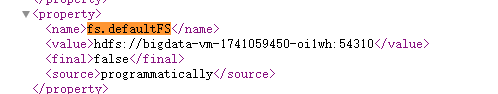
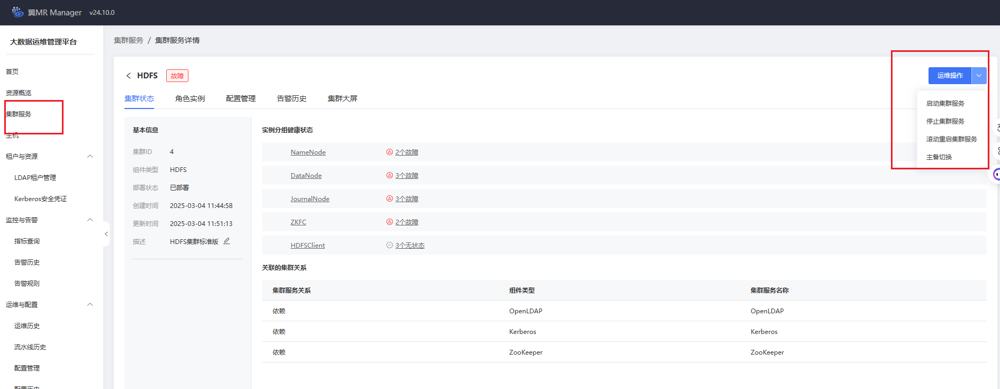
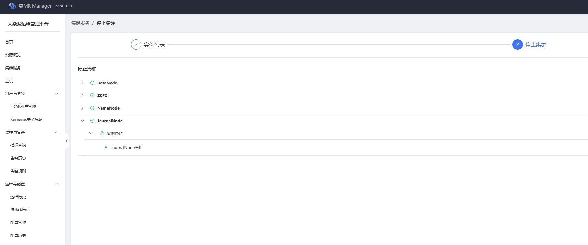
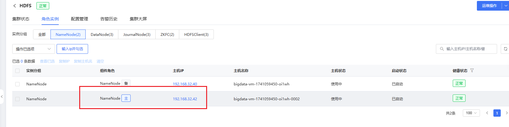
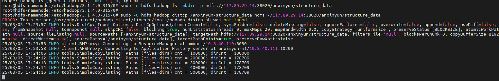

#### 云上HDFS运维

从我们的服务器访问过去 通过HDFS Client请求报错：
```log
root@hdfs-namenode:/etc/hadoop/3.1.4.0-315/0# hadoop dfs -ls hdfs://117.89.29.14:38020/
WARNING: Use of this script to execute dfs is deprecated.
WARNING: Attempting to execute replacement "hdfs dfs" instead.

ls: SIMPLE authentication is not enabled.  Available:[TOKEN, KERBEROS]
```


找到服务端口：

我先把50070端口映射：

http://xxxx:50077/conf 查看配置

```xml
<configuration>
    <!-- 指定 HDFS 的命名服务 -->
    <property>
        <name>fs.defaultFS</name>
        <value>hdfs://namenode-host:8020</value>
    </property>

    <!-- 其他配置项 -->
</configuration>
```




修改配置：

core-site.xml
```xml
<configuration>
    <property>
        <name>hadoop.security.authentication</name>
        <value>simple</value> #原来 kerberos
    </property>

    <property>
        <name>hadoop.security.authorization</name>
        <value>false</value> #true
    </property>
    <!-- 其他配置项 -->
</configuration>
```

hdfs-site.xml

```xml
<configuration>
    <property>
        <name>dfs.namenode.kerberos.principal</name>
        <value></value> #hdfs/_HOST@BIGDATA.CHINATELECOM.CN
    </property>

    <property>
        <name>dfs.namenode.keytab.file</name>
        <value></value> #/etc/security/keytabs/hdfs.keytab
    </property>

    <!-- 其他配置项 -->
</configuration>
```

重启服务：






再次请求，新的报错：

```log

root@hdfs-namenode:/etc/hadoop/3.1.4.0-315/0# hadoop dfs -ls hdfs://117.89.29.14:38020/
WARNING: Use of this script to execute dfs is deprecated.
WARNING: Attempting to execute replacement "hdfs dfs" instead.

ls: Operation category READ is not supported in state standby. Visit https://s.apache.org/sbnn-error

```

原来是因为重启后，HA模式下主备发生了切换



我这边重启了下目前的**`主实例`**，实现了主备切换。


迁移数据：

```sh

## hadoop distcp hdfs://source-cluster:8020/source/path hdfs://destination-cluster:8020/destination/path

sudo -u hdfs hadoop fs -mkdir -p hdfs://117.89.29.14:38020/anxinyun/structure_data

# 同步数据
sudo -u hdfs hadoop distcp /anxinyun/structure_data hdfs://117.89.29.14:38020/anxinyun/structure_data


```



报错：

```log
25/03/05 17:25:14 INFO tools.SimpleCopyListing: Paths (files+dirs) cnt = 1550010; dirCnt = 178983
25/03/05 17:25:14 INFO tools.SimpleCopyListing: Build file listing completed.
25/03/05 17:25:34 INFO tools.DistCp: Number of paths in the copy list: 1550010
25/03/05 17:25:53 INFO tools.DistCp: Number of paths in the copy list: 1550010
25/03/05 17:25:53 INFO client.RMProxy: Connecting to ResourceManager at ambari/10.8.40.110:8050
25/03/05 17:25:53 INFO client.AHSProxy: Connecting to Application History server at anxinyun-n1/10.8.40.111:10200
25/03/05 17:25:54 INFO ipc.Client: Retrying connect to server: ambari/10.8.40.110:8050. Already tried 0 time(s); retry policy is RetryUpToMaximumCountWithFixedSleep(maxRetries=50, sleepTime=1000 MILLISECONDS)
25/03/05 17:25:55 INFO ipc.Client: Retrying connect to server: ambari/10.8.40.110:8050. Already tried 1 time(s); retry policy is RetryUpToMaximumCountWithFixedSleep(maxRetries=50, sleepTime=1000 MILLISECONDS)
25/03/05 17:25:56 INFO ipc.Client: Retrying connect to server: ambari/10.8.40.110:8050. Already tried 2 time(s); retry policy is RetryUpToMaximumCountWithFixedSleep(maxRetries=50, sleepTime=1000 MILLISECONDS)
25/03/05 17:25:57 INFO ipc.Client: Retrying connect to server: ambari/10.8.40.110:8050. Already tried 3 time(s); retry policy is RetryUpToMaximumCountWithFixedSleep(maxRetries=50, sleepTime=1000 MILLISECONDS)
25/03/05 17:25:58 INFO ipc.Client: Retrying connect to server: ambari/10.8.40.110:8050. Already tried 4 time(s); retry policy is RetryUpToMaximumCountWithFixedSleep(maxRetries=50, sleepTime=1000 MILLISECONDS)

```


迁移方法2：

```sh
 sudo -u hdfs hadoop fs -mkdir -p hdfs://117.89.29.14:38020/anxinyun/structure_data/structure_996/raw/2020
 
 sudo -u hdfs hadoop fs -cp -f /anxinyun/structure_data/structure_996/raw/2020 hdfs://117.89.29.14:38020/anxinyun/structure_data/structure_996/raw/2020
```

亦然报错：

```log

root@hdfs-namenode:/etc/hadoop/3.1.4.0-315/0# sudo -u hdfs hadoop fs -cp -f /anxinyun/structure_data/structure_996/raw/2020 hdfs://117.89.29.14:38020/anxinyun/structure_data/structure_996/raw/2020
25/03/05 17:32:57 INFO hdfs.DataStreamer: Exception in createBlockOutputStream blk_1073741825_1001
org.apache.hadoop.net.ConnectTimeoutException: 60000 millis timeout while waiting for channel to be ready for connect. ch : java.nio.channels.SocketChannel[connection-pending remote=/192.168.32.35:1004]
        at org.apache.hadoop.net.NetUtils.connect(NetUtils.java:534)
        at org.apache.hadoop.hdfs.DataStreamer.createSocketForPipeline(DataStreamer.java:253)
        at org.apache.hadoop.hdfs.DataStreamer.createBlockOutputStream(DataStreamer.java:1725)
        at org.apache.hadoop.hdfs.DataStreamer.nextBlockOutputStream(DataStreamer.java:1679)
        at org.apache.hadoop.hdfs.DataStreamer.run(DataStreamer.java:716)
25/03/05 17:32:57 WARN hdfs.DataStreamer: Abandoning BP-81570060-192.168.32.40-1741060145201:blk_1073741825_1001
25/03/05 17:32:57 WARN hdfs.DataStreamer: Excluding datanode DatanodeInfoWithStorage[192.168.32.35:1004,DS-bd482ff3-f02b-4ed1-a54a-1682a4decbbf,DISK]

```

