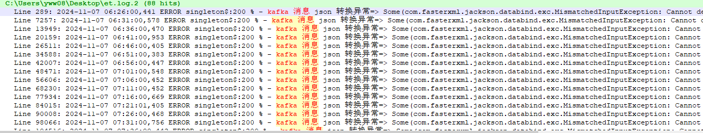

**产品故障分析报告**

**产品名称**：安心云监测平台

**模块**：ET数据处理模块

------

### 问题描述

在平陆混凝土浇筑项目中，监测平台的温度数据出现异常突变。经排查，确定问题为数据在ET处理模块的分组计算过程中丢失，而非设备数据或以太日志的问题。Kafka中原始数据正常，因此怀疑是在ET数据处理过程中出现了数据丢失。

### 初步排查

由于平台的ET日志仅支持查看最近几分钟的记录，无法即时发现长期存在的问题异常。因此，首先对ET日志进行了存储优化：

1. 日志存储改进
   - 使用Log4J进行本地文件存储。
   - 配置`Filebeat`和`Logstash`，将日志同步至ElasticSearch，以便进行历史数据的回溯分析。

通过日志查询，发现了**ERROR**级别的错误日志，提示存在数据解析问题。

```log
2024-11-07 06:26:00,441 ERROR singleton$:200 % - kafka 消息 json 转换异常=> Some(com.fasterxml.jackson.databind.exc.MismatchedInputException: Cannot deserialize instance of `scala.collection.immutable.Map` out of START_ARRAY token
 at [Source: (String)"[{"userId":"ce2d7eb2-e56e-422e-8bbe-95dfa18e32f8","thingId":"5c831cda-cadf-47a3-bb56-638924a511a9","dimensionId":"e6d1e62e-87ed-463b-8626-0ab919d005cc","dimCapId":"5cd8a17d-db86-421f-9b12-760255d78be3","capId":"680b6d1c-5aac-420b-8f5c-19cf1092b0d1","deviceId":"47a58d61-8c69-432a-9402-44d8e0e7ae0c","scheduleId":"0ce548b0-99b0-46da-96c6-e9aca158844f","taskId":"c8fed15c-0032-46a3-ac02-0a88603420d7","jobId":1,"jobRepeatId":1,"triggerTime":"2024-11-07T14:26:00.001449119+08:00","realTime":"2024-11-07T"[truncated 786 chars]; line: 1, column: 625] (through reference chain: java.lang.Object[][0]->comm.models.IotaData["data"]->comm.models.IotaAcqResult["data"]))
```

并且该错误日志出现的频率较高，如果夹在平陆温度数据批次中，将出现温度数据丢失的情况。



### 原因分析

ET模块从Kafka接收以太数据进行处理，因性能问题，此前ET从Flink改为多实例进程运行模式。在本地化版本中，为提升解析速度，ET模块实现了JSON反序列化的优化，通过拼接消息内容后再进行JSON解析。然而，此方法存在潜在风险：当Kafka中接收到格式错误的数据时，整个批次的消息解析将失败，导致数据丢失。

### 解决方案

为平衡性能与容错能力，优化了ET代码逻辑：

1. 代码保护逻辑
   - 在拼接后解析失败的情况下，加入逐条解析的保护机制。该机制确保快速消费的性能，同时避免因单条异常数据导致整个批次丢失的情况。

优化后的代码逻辑如下：

```scala
val records = task.records.filter(filterRecord)
val allrecord = records.mkString("[", ",", "]")
val all_IotaData = JsonHelper.Json2Object[Array[IotaData]](allrecord)
val recvs = if(all_IotaData._1.nonEmpty) all_IotaData._1.get else parseOneByOne(records)


/*
在拼接解析失败后，尝试依次解析
*/
def parseOneByOne(records: Array[String]): Array[IotaData] = {
    val res: Array[IotaData] = records.map(r => {
        val rOpt = JsonHelper.Json2Object[IotaData](r)
        if (rOpt._1.isEmpty) {
            logger.warn(s"json deserialize err: $r ${rOpt._2.get}")
        }
        rOpt._1
    }).filter(_.nonEmpty).map(_.get)
    if (res.nonEmpty) res else null
}
```

### 验证结果

更新后的代码在实际项目中验证成功，未再出现数据丢失的情况，性能与数据完整性均得到保障。

------

**结论**：通过对ET模块的日志存储和数据解析逻辑的优化，成功解决了温度数据异常突变的问题，并提升了平台的数据处理可靠性。

