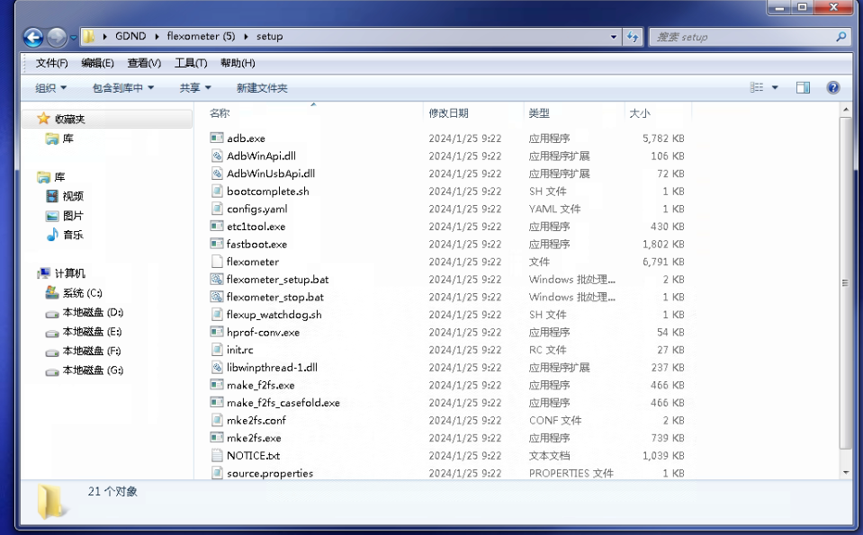
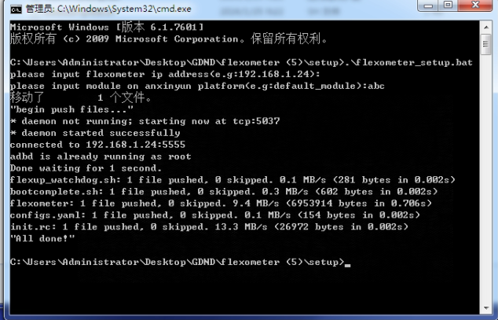
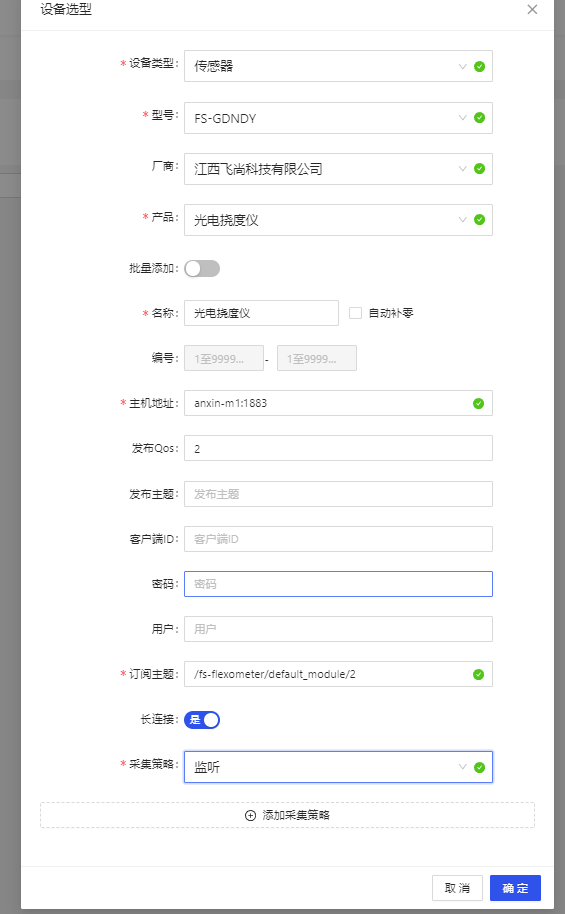
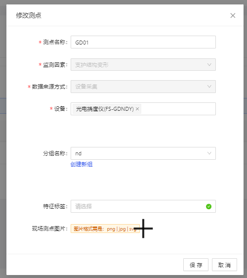
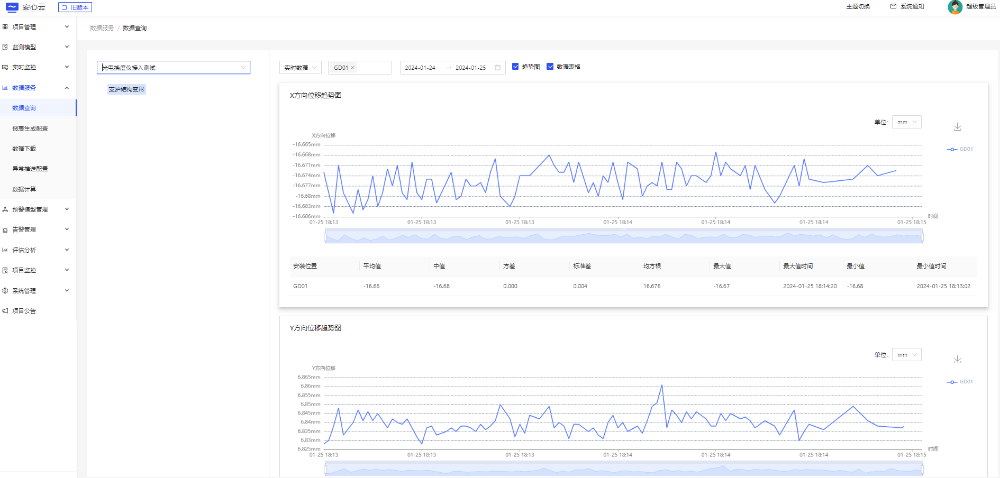

## 光电挠度仪转发代理使用说明

1. 安装包拷贝到电脑上，解压

   测试安装包（ [flexometer.tar](https://jenkins.ngaiot.com/job/flexometer/lastSuccessfulBuild/artifact/flexometer.tar)），实际发布以FTP为主。

   

2. 执行`flexometer_setup.bat`程序

   直接双击运行`flexometer_setup.bat` 或者运行CMD命令到安装目录下，再输入`.\flexometer_setup.bat`回车执行。

   提示输入光电挠度仪IP地址；(直接回车，默认使用192.168.1.24)

   提示输入平台挠度仪模块号（自定义），这里配置为 `abc`;

   安装脚本执行完成显示如下：



> 检查程序是否正确运行，可以在`cmd`窗口中执行以下命令：
>
> ```sh
> adb shell tail -n /data/local/tmp/app.log
> ```

**至此设备安装完成！**


**以下为接入平台的步骤：**

3. 安心云平台接入

+ 新建结构物

+ 点击组网配置

+ 添加“监听”类型的采集策略

+ 添加设备：

  + 其中产品型号为 `FS-GDNDY`
  + 主机地址 `anxin-m1:1883`
  + 订阅主题：`/fs-flexometer/模块号/位置点号` 。 如本例中，配置：`/fs-flexometer/abc/2`
  + 
  + 添加双向位移监测因素
  + 进入测点配置，添加测点：
    + 

  + 查看数据

    