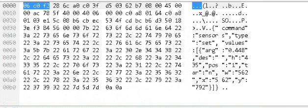
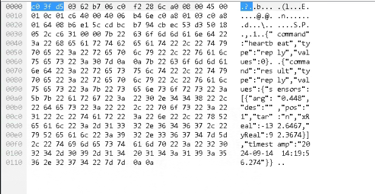
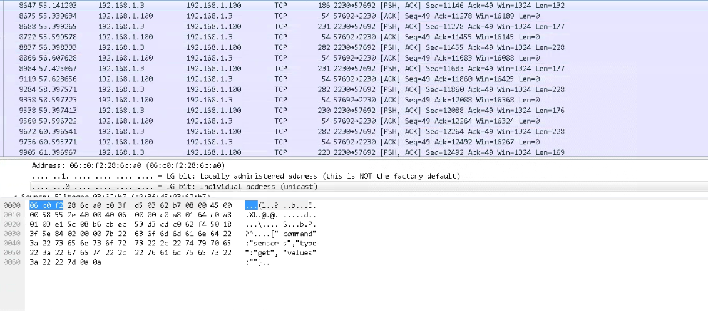
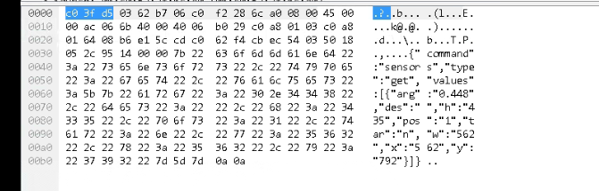

#### 光电挠度仪远程升级

通过Android中Busybox以及平台开发TCP服务端的方式，并通过远程SHELL命令执行进行升级

在服务器运行flex_transfer程序(下面附源码)

```sh
./flex_transfer -file flexdog -port 12345
```

> flexdog构建的最新版本提前拿到服务器上.


执行shell指令：

```sh
busybox nc 218.3.126.49 12345 > /data/local/tmp/flexdog2
```

通过光电挠度仪远程shell发送:

```json
{
	"cmd":"bash",
	"arg":"busybox nc 218.3.126.49 12345 > /data/local/tmp/flexdog2"
}
```

检查文件的md5信息

```json
{
	"cmd":"bash",
	"arg":"busybox md5sum /data/local/tmp/flexdog2"
}
```

> 服务器上同样使用md5sum命令查看，请谨慎检查，如果MD5不一致中断操作，否则可能导致升级后设备与平台断连，无法运维。

设定程序可执行

```json
{
	"cmd":"bash",
	"arg":"chmod +x /data/local/tmp/flexdog2"
}
```

检查程序权限

```json
{
	"cmd":"bash",
	"arg":"ls -al /data/local/tmp/flexdog2"
}
```

要远程修改sh启动文件：/system/bin/flexup_watchdog.sh

```json
{
	"cmd":"bash",
	"arg":"sed -i 's|nohup ./flexdog|nohup ./flexdog2|' /system/bin/flexup_watchdog.sh"
}

{
	"cmd":"bash",
	"arg":"cat /system/bin/flexup_watchdog.sh"
}
```

重启设备。


```golang
package main

import (
	"flag"
	"io"
	"log"
	"net"
	"os"
)

func handleConnection(conn net.Conn, filePath string) {
	defer conn.Close()

	// 打开本地文件
	file, err := os.Open(filePath)
	if err != nil {
		log.Println("Error opening file:", err)
		return
	}
	defer file.Close()

	// 读取文件内容并发送给客户端
	_, err = io.Copy(conn, file)
	if err != nil {
		log.Println("Error sending file:", err)
		return
	}

	log.Println("File sent successfully")
}

func main() {
	// 定义命令行参数
	filePath := flag.String("file", "C:\\Users\\yww08\\Desktop\\setup\\flexdog", "Path to the file to send")
	port := flag.String("port", "12345", "Port to listen on")

	// 解析命令行参数
	flag.Parse()

	if *filePath == "" {
		log.Fatal("File path is required")
	}

	// 监听端口
	listener, err := net.Listen("tcp", ":"+*port)
	if err != nil {
		log.Fatal("Error starting server:", err)
	}
	defer listener.Close()

	log.Println("Server started on port", *port)

	for {
		conn, err := listener.Accept()
		if err != nil {
			log.Println("Error accepting connection:", err)
			continue
		}

		go handleConnection(conn, *filePath)
	}
}
```










