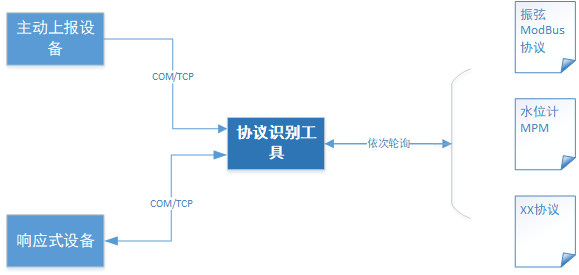
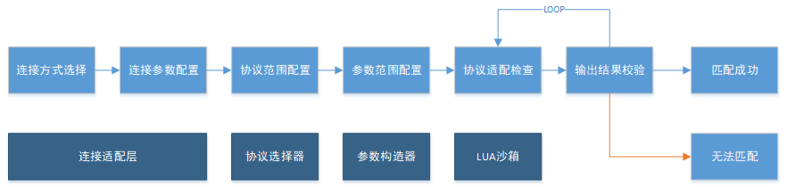

## 协议硬破解设计思路

### 背景

本方案旨在为网络瘫痪场景下的协议破解提供思路，特别是在现场采集和协议交互的情况下，利用现有设备协议经验储备，对未知设备进行破解。方案重点在于不同于协议自动识别的手段，通过手动和工具辅助的方式进行破解，以确保对未知第三方设备数据的正确接入。

在服务器系统瘫痪、软件授权到期或采集软件异常等情况下，数据可能会全部或部分中断。在现场传感器组网已经修复的情况下，以下是可采取的措施：

1. **联系设备供应商或制造商**：尽量获取技术支持和协议文档，这可能是比破解协议更快捷和有效的方法。
2. **更换采集仪/网关**：对于物理信号类传感器（如电压、电流传感器），可以考虑更换采集仪/网关，实现AD转换，重新标定实际测量数值。
3. **尝试协议的暴力破解**。根据数据的交互方式，执行主动命令下发或监听上报码流的方式。

本方案主要讨论通过**暴力破解**的方式，尝试连接设备并与设备正确通信，已达到正确识别设备协议的目的。

### 整体框架

协议识别工具(本方案)可以与设备直连、也可以在数据汇集端通过交换设备与设备连接，采用协议轮询的方式，对设备进行多次通讯尝试，直至返回正确的数据解析。

整个数据处理的流程大致如下：

在使用工具过程中，应该先配置设备与上位机工具的连接方式（支持串口/TCP)，并设置连接参数（可以设定为范围值）；

识别系统默认将以平台所有第三方协议库为范围、并在设备原型参数范围内，进行轮询尝试。在此阶段进行协议范围和参数范围预设定，可以调高识别的效率。

范围配置完成之后，工具将启动LUA沙箱依次使用各设备协议进行判断，并对结果进行校验。

### 功能描述

+ 通信方式选择

  考虑现场实际组网情况，拟支持串口和TCP模式。

  + 串口/485/232: 设备与上位机工具通过485/232直连或者串口服务器连接
  + TCP/UDP/HTTP：设备通过HUB集成或者在工控机/服务器端PC上，通过有线网络连接的情况

+ 通信参数选择

  大部分情况下通信参数也是未知的，所以也需要进行轮询。

  + 串口：串口号（一般固定）、波特率、其他串口属性。
  + TCP：
    + 服务端模式：启动服务端口后等待连接。工具启动后打开指定的端口范围，启动监听
    + 客户端模式：设备IP、端口扫描功能。可以使用第三方工具先进行设备IP和端口检测。

+ 协议范围选择

  提供界面，供用户输入产品厂家、型号、设备类型、工作模式。可填，用于控制判断过程协议选择的优先级：

  + 优先选择相同厂家的协议：厂家信息已知的情况下，如果有同厂家其他设备的协议，可优先尝试这些协议。
  + 优先选择相同类型设备协议：如果有同类型设备的协议，可优先尝试这些协议。
  + 工作模式：轮询或监听模式，已知情况下优先按照模式匹配的协议进行判断
  + 选择简单的协议：优先使用简单的协议进行判断

  协议选取的优先级：

| 优先级 | 内容                                 |
| ------ | ------------------------------------ |
| 1      | 已知厂家，选取平台相同厂家协议       |
| 2      | 已知类型，选取平台相同类型的协议     |
| 3      | 已知工作模式，使用相同工作模式的协议 |
| 4      | 使用标准协议                         |
| 5      | 使用平台使用率较高的协议             |
| 6      | 使用简单的协议                       |
| 7      | 其他                                 |

+ 参数范围选择

  根据对应协议的设备型号信息，可以得到该协议需要配置哪些具体的信息（例如模块号、通道号）。在设备信息未知的情况下，该模块用于限制参数选择的**范围**，如果不填，将默认使用设备/接口属性上变量的取值范围去尝试。

  + 需要输入设备编号：既设备的地址属性，一般为**模块号、通道号**。
  + 需要输入子设备通道等：在采集仪设备协议中，需要设定子设备的通道号配置。
  + 其他参数：具体视设备属性决定。

+ 轮询设定

  通过控制变量法，对所有可变参数依次进行修改后执行协议检验。

  + 设定轮询间隔：用于控制单个变量控制下的等待时间，用于监听模式。
  + 设定允许并发：用于控制**单个连接**读写并发度。对于双工设备采用多线程读写，以提高执行效率。（对于不同的连接，默认并发执行）
  + 设定超时时长：用于控制单次采集的超时时间，用于轮询模式。

+ 协议适配检查

  > 监听到的报文，检查是否为明文。明文报文建议人工干预，直接解析识别可能的传感器数据内容。

  通过以太IOTA驱动LUA协议，需要提前构造LUA执行的变量（device变量属性以及接口属性）

  + 主动采集
    + 等待连接建立
    + 执行协议的`start`方法并等待响应（类似即时采集的能力）
  + 监听模式
    + 收集监听到的报文
    + 尝试使用现有协议的`OnData`方法进行解析，看能否直接识别和解析出有用的数据。

+ 结果判定

  + 协议如果在执行过程中异常退出，判定协议不匹配；
  + 输出结果包含错误码：
    + 大部分为"协议错误"错误，判定到协议不匹配
    + 如果匹配“模块号”错误、“校验错误“等具体错误，该协议列入”疑似“对象，重点记录关注。
  + 输出结果中包含传感器数据，进一步检验数据的准确性
  + 准确性：数据在合理范围（比如非异常大、非负等简单过滤）

+ 日志和进度

  + 本工具需支持日志，记录失败和成功的协议，以及报文交互记录。
  + 本工具需支持进度显示。根据参数选择范围，可以确定需要测试采集过程的总次数，并估算还需多久完成。
  + 本工具有支持断点继续执行的必要。协议识别的过程可能是一个漫长的过程，要有过程记录，保障断点继续执行的功能。

### 方案风险

执行效率是本工具最大的风险所在：

对于主动上报的设备，关键在于与其创建连接的过程以及等待报文的时间，轮询尝试`OnData`方法可能占用较少的时间。但实际场景中，无法确定是否为主动连接，并且可能存在较多种连接参数可能、并且未知设备上报数据的周期，这都将无法准确推断需要执行的时间。

需要轮询采集的设备，设定协议范围、参数范围是必要的，因为变量个数的增长，可能导致最终执行时间指数级别的增长。以等待5秒响应、模块号1~100为例，无通道号参数时执行耗时 8.3 分钟，如果包含8通道参数，执行参数将增长为：66分钟。

