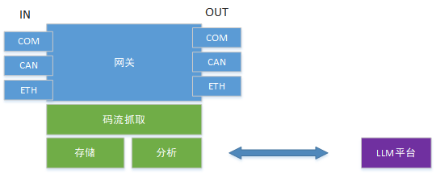
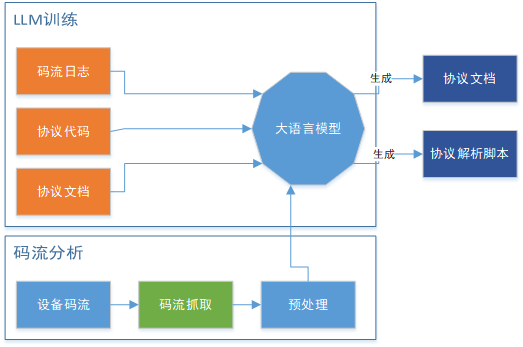
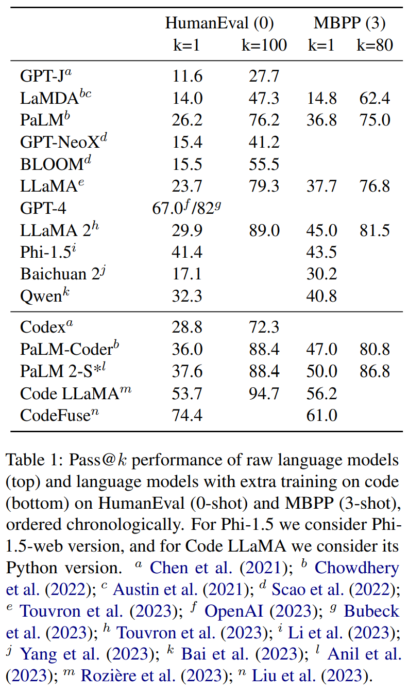

## 协议自动识别

### 整体思路

抓取设备的码流，使用大语言模型对其进行码流相似度匹配。使用我司现有仓库中所有的协议文档、码流日志、协议代码（脚本）等信息进行模型预处理。

这里主要使用LLM大预言模型的NLP自然语言分析模型，创建自己的Fine-Tuning(微调)或者预处理模型，进行相似度文本匹配。

### 功能位置

#### 硬件网关

为了抓取设备码流并不影响原有数据传输，硬件网关设计采用旁路模式（Port Mirroring或Network Tap）。

**处理器**

- 选择性能良好的处理器（如ARM Cortex-A系列或x86架构处理器），以便处理大量数据和多种协议。

**接口**

- 提供多种物理接口，以支持不同类型的传感器：
  - **有线接口**：如RS232、RS485、CAN、Ethernet等。
  - **无线接口**：如Wi-Fi、Bluetooth、Zigbee、LoRa、NB-IoT等。

**存储**

- 内置足够的存储空间（如eMMC、SD卡或SATA SSD），以存储大量的码流数据。
- 考虑使用外部存储设备（如USB硬盘或网络存储）。

**应用**

+ 旁路设计，不影响原先网络拓扑。定量抓取码流包，并将收集的码流包本地存储和调用平台分析能力进行推理。

#### 平台服务

**数据收集**

+ 平台DAC日志。（需要改造，目前日志不完整，且无法于协议对应）。
+ 协议代码（包含注释）需要完善协议的注释。另外，平台协议编程规范，也是作为训练数据的一部分。
+ 协议文档：主要包括各个厂家提供的协议说明文档，需要收集整理。

**训练**

+ 将数据集划分为训练和验证集，并将数据进行结构化。
+ 在商用大模型或开源模型基础上，使用`pytorch`进行模型训练。（基于代码生成的大模型评分见附录）
+ 使用数据集进行模型评估

**应用**

+ 在预训练或调优的模型基础上，发布应用。调用服务，对第三方未知的码流协议进行推演理解，生成协议文档以及协议解析代码。
+ 在预训练或调优的模型上，持续迭代训练和验证数据，进行调优，提高模型推演准确度。

### 整体流程框图

围绕LLM大语言模型构造训练和预演系统，网关负责收集传感器传输码流，调用预训练或微调的大模型进行协议分析和代码

### 处理流程

1. 码流抓取

   使用硬件网关转发、或者非侵入式抓包工具（`WireShark`、`TcpDump`、`SerialMonitor`等）抓取设备协议的上下行码流，抓取到一定体量，并且尽量保证抓取到所有功能样本代码流（如设备数据、诊断、控制、OTA等）。将抓取的码流保存到本地文件中记录。

2. 码流预处理

   可以采用人工或自动的方式实现数据标签，主要考虑对码流进行识别和分组：

   一般从码流明文/密文、码流发送频率、发送模式（主动或轮询）、码流长度等维度考虑，将收集的码流进行分组。

   另外，有一些固化的逻辑判断，包括：

   + 设备上线后立即首包报文，一般为注册帧（状态上报）
   + 固化的协议格式（Modbus）
   + 明显的帧头帧尾
   + 字节流数据解析方式
   + 明文报文格式判断（一般plaintext、`json`、xml等）、明文中包含的关键字段：time/date/timestamp等时间字段、value/data中数据
   + 短字节周期报文，一般为心跳
   + 周期时间点多包同时到达，考虑为分包、分通道数据汇报。

   预处理还包括：

   **格式转换**：将不同格式的数据统一转换为模型可以处理的格式，如将协议文档转换为结构化的文本数据。

   **特征提取**：从码流数据中提取关键特征，如帧头帧尾、时间戳、数据字段等，提高模型的识别和解析能力。

3. LLM分析

   + 模型训练

     基于我司现有协议库，结合现有码流数据、协议文档、代码注释等数据集，进行模式训练。

     模型训练步骤如下：

     1. 加载数据集
     2. 修改定义训练参数
     3. 构造trainer，开始训练
     4. 【训练后步骤】进行模型评估
     5. 【训练后步骤】使用训练后的模型进行推理

     对模式训练的任务目标，主要包括以下：

     1. 码流->文档：解析码流，输出码流协议文档

     2. 码流->代码：解析码流，输出协议解析脚本

     3. 文档->代码：通过协议文档，生成协议解析代码

   + 模型应用

     将训练后的模型部署发布，提供API接口服务。将第三方码流作为输入，进行码流数据分析。

   

### 关键技术

1. LLM码流模型的训练

**预训练模型**：

- **GPT-4 或 BERT**：这些模型在自然语言处理任务中表现优异，具有强大的文本理解和生成能力。可以选择在这些预训练模型的基础上进行微调。

**模型微调**：

- **迁移学习**：使用我司现有的协议文档、码流日志、协议代码等数据，对预训练模型进行迁移学习。这种方法可以利用预训练模型的知识，提高模型的训练效率和效果。
- **微调参数设置**：根据具体任务和数据集的特点，调整微调的参数设置，如学习率、批量大小、训练轮次等。

**训练环境**：

- **硬件配置**：高性能的GPU集群，如NVIDIA A100或V100，可以显著提高模型训练的速度和效果。
- **分布式训练**：在多台GPU上进行分布式训练，充分利用计算资源，加快训练速度。

**训练策略**：

- **超参数调优**：使用超参数调优技术（如网格搜索、随机搜索或贝叶斯优化），找到最优的训练参数组合。
- **动态学习率调整**：采用动态学习率调整策略（如学习率衰减或自适应学习率），提高模型的收敛速度和效果。
- **早停机制**：设置早停机制，防止模型过拟合。

**模型评估**：

- **评估指标**：使用多种评估指标（如准确率、精确率、召回率、F1值等），全面评估模型的性能。
- **交叉验证**：通过交叉验证技术，评估模型的泛化能力和稳定性。
- **对比实验**：与其他方法（如传统的协议解析方法）进行对比实验，验证模型的优越性。

**模型应用**：

- **API接口服务**：将训练好的模型部署为API接口服务，方便外部调用和集成。
- **持续优化**：在实际应用中收集新的数据，不断优化和调整模型，提高其准确度和鲁棒性。

### 参考：

1. 《[大模型在代码处理中的应用](https://www.jiqizhixin.com/articles/2023-11-22-8)》
2. 《[魔塔模型的训练](https://modelscope.cn/docs/%E6%A8%A1%E5%9E%8B%E7%9A%84%E8%AE%AD%E7%BB%83Train)》

### 附录1

