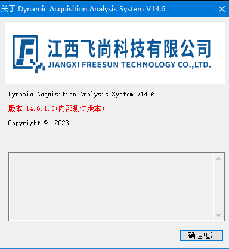

### 后端 EXE 程序版本号和日志优化方案

#### 一、背景与问题

当前运行在外场的程序版本信息不全，尤其是在出现问题或服务器文件丢失时，难以进行故障排查和恢复。此外，不同项目的版本信息存在差异，导致测试团队无法明确发布目标，进一步造成版本管理上的困惑。此问题尤为突出在 Windows 工控机和服务器上的 EXE 程序中。

日志优化主要是指对存储在本地的log文件大小进行限制，不能无限制的增长占用磁盘。

#### 二、目标

1. 制定程序版本信息规范，确保每个版本发布都可追溯构建源和更新内容。
2. 针对不同开发语言和框架，优化版本号和日志管理，方便运维和故障排查。
3. 推行版本管理和日志优化的最佳实践，确保新旧项目和产品在发布、迭代中可控。

------

### 三、方案详细内容

#### 1. 版本信息规范

##### 1.1 版本信息制定原则

每个版本应包含以下关键信息：

- **项目名称**：(如果是项目类型的应用，如宁波交检数据推送省平台进程，定义项目名称 `nbjj`)  明确区分不同的项目版本。
- **版本号**：采用 `Major.Minor.Patch` 格式。
- **构建号**：关联 Jenkins 构建流水线的构建号，确保版本来源可追溯。
- **SVN/Git 版本号**：对应代码仓库的修订号，帮助排查代码位置及改动内容。

##### 1.2 回溯机制

通过版本号可追溯到以下内容：

- **Jenkins 构建流水线号**：可以追踪构建环境和相关流水线任务。
- **SVN/Git Revision 号**：可追踪对应的代码变更内容、负责人以及提交日志。

------

#### 2. 基础包/公共库

##### 2.1 C#（Winform 和 Console 程序）

- Winform 程序

  创建 `Help` 菜单，提供 `About` 窗口，显示以下信息：

  - 项目名称
  - 版本号（格式：`Major.Minor.Patch`）
  - Jenkins 构建号
  - SVN/Git Revision 号

  - 私有库提交到 `Nuget` 私有库，以便共享统一的版本管理工具。

    

- Console 程序

  - 启动时打印基础版本信息，包括：

    - 项目名称
    - 版本号
    - Jenkins 构建号
    - SVN/Git Revision 号

    ```
    Starting NGET Service...
    Version: 1.0.123
    Build Number: 100
    Revision: r12345
    ----------------------------------
    Initializing components...
    Loading configurations...
    NGET Service is running.
    Press any key to exit...
    ```

    

##### 2.2 Golang 程序

- 通过 Jenkins 构建时将版本号和 Revision 信息自动注入到编译产物中，确保每次构建的版本信息准确记录。
- 使用 Git 私库进行版本管理。
- 使用 `iota-log` 库处理日志，指定滚动存储，避免日志文件过大。

##### 2.3 QT 程序

- 针对 QT 程序，考虑将版本信息嵌入到程序中，包含项目名称、版本号及构建信息。进一步的日志优化方案略。

------

#### 3. 日志管理

##### 3.1 C# 程序日志优化

- **日志工具**：使用成熟的 `Log4Net` 滚动存储机制，确保日志文件不会过大。

- **配置检查**：定期检查 `Log4Net` 配置，确保日志滚动和存储策略合理。

  ```xml
  <log4net>
        <appender name="FileAppender" type="log4net.Appender.RollingFileAppender" >
          <file value="Log/log.log" />
          <AppendToFile value="true" />
          <RollingStyle value="Size"/>
          <maxSizeRollBackups value="10" />
          <staticLogFileName value="true" />
          <maximumFileSize value="10MB" />
          <layout type="log4net.Layout.PatternLayout">
            <param name="ConversionPattern" value="[%date] [%t] [%-5p] [%c] :- %m%n" />
          </layout>
          <filter type="log4net.Filter.LevelRangeFilter">
            <param name="LevelMin" value="DEBUG" />
            <param name="LevelMax" value="FATAL" />
          </filter>
        </appender>
      ...
  </log4net>
  ```

  

##### 3.2 Golang 程序日志优化

- **默认日志方案**：系统自带的 `log` 包只适用于简单日志输出，**不建议用于生产环境**。
- **推荐日志方案**：使用 `iota-log`，该库支持指定日志文件大小，并自动进行滚动存储，减少系统负担和磁盘占用。

##### 3.3 QT 程序日志管理

- QT 程序日志优化目前略过，建议后续采用成熟的日志滚动方案。

------

#### 4. 发布与执行规范

##### 4.1 制定发布流程

- **发布前**：确保版本号、构建号和代码修订号准确无误，使用 Jenkins 自动化构建并注入版本信息。
- **发布时**：严格遵循规范，所有发布版本均应记录到版本管理系统中。
- **发布后**：自动化生成发布报告，包含版本信息和相关代码变更记录。

##### 4.2 版本变更记录

- 在每个新版本发布后，生成详细的变更记录文档，包括：
  - 新功能列表
  - 修复的 Bug
  - 代码变更详情
  - 测试报告

------

### 四、技术细节

##### 1. 监控和日志存储技术

- C# 程序中已使用 `Log4Net`，继续采用现有方案。
- Golang 程序采用 `iota-log` 进行滚动存储，避免日志爆满问题。
- QT 程序略过。

##### 2. 构建与版本管理

- Jenkins 自动注入版本号和构建号，确保发布的每个版本可追溯。
- C# 使用 Nuget 私有库，Golang 使用 Git 私库进行版本库管理。


### 附构建版本注入

#### 一、Golang

golang中自动注入构建版本信息

```golang
var (
	VERSION      string
	SVN_REVISION string
	BUILD_NUMBER string
	BUILD_TIME   string
	GO_VERSION   string
)

func main() {
	log.Info("Version: %s", VERSION)
	log.Info("SVN Revision: %s", SVN_REVISION)
	log.Info("Build Number: %s", BUILD_NUMBER)
	log.Info("Build Time: %s", BUILD_TIME)
	log.Info("Go Version: %s", GO_VERSION)
	log.Info("Go OS/Arch: %s/%s", runtime.GOOS, runtime.GOARCH)
    ...
}
```

在构建的Jenkins构建命令：

```sh
CGO_ENABLED=0 GOOS=linux GOARCH=arm64 go build -ldflags "-extldflags -static -X main.VERSION=$VERSION -X main.SVN_REVISION=$SVN_REVISION -X main.BUILD_NUMBER=$BUILD_NUMBER -X main.BUILD_TIME=$BUILD_TIME -X main.GO_VERSION=$GO_VERSION" -tags="netgo" -a -v -o xxxx main.go
```


#### 二、C#

```sh
msbuild YourProject.sln /p:BuildNumber=%BUILD_NUMBER% /p:Revision=%SVN_REVISION%
```

在项目文件（`.csproj`）中，可以使用 `DefineConstants` 将 Jenkins 的构建号和 SVN 修订号作为编译时常量传递给 C# 程序。首先，编辑你的 `.csproj` 文件，在 `<PropertyGroup>` 中添加如下代码：

```xml
<PropertyGroup>
  <BuildNumber Condition="'$(BuildNumber)' == ''">0</BuildNumber>
  <Revision Condition="'$(Revision)' == ''">0</Revision>
  <DefineConstants>BUILD_NUMBER=$(BuildNumber);SVN_REVISION=$(Revision)</DefineConstants>
</PropertyGroup>
```

在你的 C# 代码中，使用 `#define` 常量来访问这些版本信息。你可以在代码的某个地方（例如 `Program.cs` 或 `AssemblyInfo.cs`）中这样定义：

```c#
public static class VersionInfo
{
    public static readonly string BuildNumber = BuildNumberString();
    public static readonly string SvnRevision = SvnRevisionString();

    private static string BuildNumberString()
    {
#if BUILD_NUMBER
        return BUILD_NUMBER;
#else
        return "Unknown";
#endif
    }

    private static string SvnRevisionString()
    {
#if SVN_REVISION
        return SVN_REVISION;
#else
        return "Unknown";
#endif
    }
}
```

