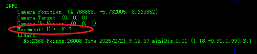
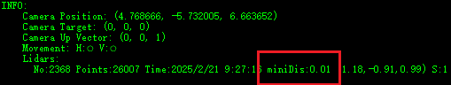
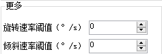
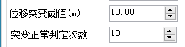
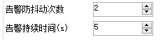
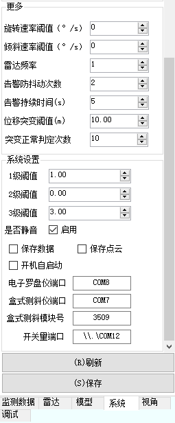
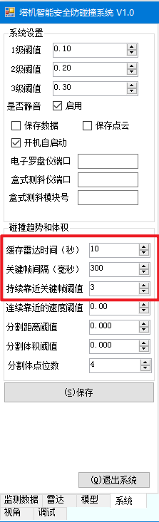
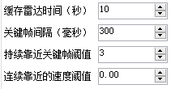
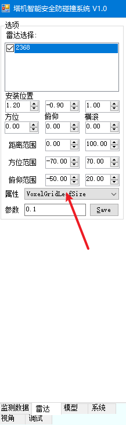
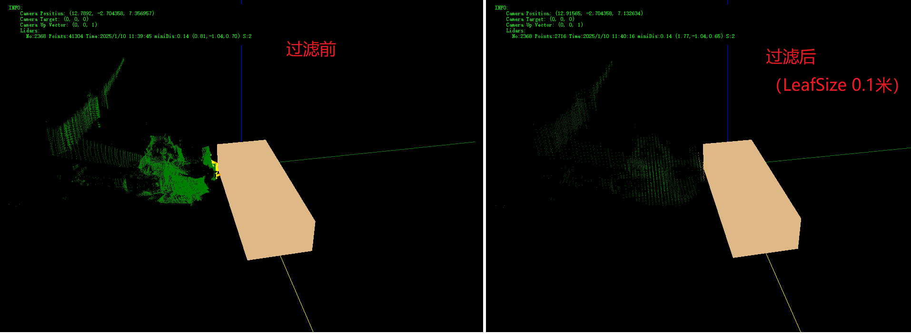

## 塔吊防碰撞功能说明-运动趋势判断

本次主要更新内容：

1. 大臂运动趋势判断
2. 突变数据过滤
3. 告警防抖动以及自动恢复
4. 管理工具UI调整

涉及软件

+ 塔吊控制盒主程序 `towercrane.exe`
+ 管理工具 `towercrane-manage.exe`

### 1.大臂运动趋势判断

系统根据俯仰（盒式倾斜）和旋转（电子罗盘）传感器的连续数据变化情况，判断大臂运动趋势。在管理界面显示当前运动趋势

H表示水平趋势： "←"向左移动，"→"向右移动，"⭕"无水平运动趋势

V表示垂直趋势： "↑"向上移动，"↓"向下移动，"⭕"无垂直运动趋势

**运动趋势和告警的判断**：

**在运动趋势方向上的障碍物才纳入到碰撞距离判断的范围**。

+ 在静止状态，不产生任何告警。
+ 雷达向左运动，只有左侧障碍物才进行距离判断，反向亦然。
+ 雷达向上运动，只有上方障碍物才进行距离判断，反向亦然。

> 无碰撞趋势时雷达碰撞距离默认显示 100米。
>
> 但是每个雷达的测量最小距离还是可以在INFO界面中查看：
>
> 

系统设置中可以设置速率阈值。即当传感器测得运动方向的速率趋势（°/s)大于该阈值，则判定为存在运动趋势，否则为干扰数据。

> 该功能可以关闭，只需在`edge.conf`文件中增加一行配置：
>
> "trend":"false"

### 2.突变数据过滤

防止出现雷达判断距离跳变情况，增加突变数据过滤功能。

在配置【系统】中：

如上配置，描述的是 当某个雷达本次测量的最小距离与上次测量值变化超过**`10`**米, 认为是突变数据，过滤掉当前数据，雷达保持之前值。

当雷达数据连续**`10`**次判定为突变，则认为当前值为正常，雷达取当前测量值。

### 3.告警防抖动以及自动恢复

在配置【系统】中：

告警防抖动：雷达数据超过设定阈值连续 **`2`** 次，才判断是告警。这样防止因为数据抖动，突然产生碰撞告警的情况。

告警持续时间：当雷达测量距离到达设定阈值范围内，产生碰撞告警之后，告警将持续一段时间。如上面配置，告警会持续 **`5`** 秒。之后，告警会消除。除非以下情况，否则不产生新告警

1. 新告警（告警恢复后，再次产生）
2. 更高级别的告警

### 4.管理工具UI调整

+ 雷达频率可在界面设置

  【系统】-【更多】-【雷达频率】可设置。注意修改后需要重启软件

+ 支持滚动，支持刷新读取

  【系统】-【刷新】按钮

### 5. 上一版本的改动

#### 5.1 碰撞趋势 (此功能暂时不用)

控制项包括：

1. 缓存雷达时间：这个默认不需要改动（10s，程序连续缓存10s的雷达数据）
2. 关键帧间隔：单位毫秒。（一般取300~1000）表示多长时间取一次雷达数据作为变化趋势计算关键帧。（不用原始频率计算，是因为高频采集下，如果是低速运动可能位移变化较小，趋势不明显）
3. 连续靠近关键帧阈值：必须大于1。几个关键帧都有靠近趋势，判定大臂有像障碍物逼近的趋势。
4. 连续靠近的速度阈值：配置负数。默认0表示不对速度进行任何限制，只要是逼近障碍物趋势及判定。可以设置任意负数，比如-3,表示大臂靠近障碍物的线速度>-3m/s才认为是逼近趋势。

推荐配置：

#### 5.2 小体积过滤

对比了几个方法：

| **方法**                             | **算法实现难度** | **时间复杂度**                    | **优点**                                         | **缺点**                                 |
| ------------------------------------ | ---------------- | --------------------------------- | ------------------------------------------------ | ---------------------------------------- |
| **区域生长（Region Growing）**       | 中等             | O(N²)（最坏情况）                 | 适用于不规则形状，基于相似性分割，能处理复杂形状 | 对噪声敏感，速度较慢                     |
| **DBSCAN**                           | 中等             | O(N log N)（最佳），O(N²)（最坏） | 能处理噪声，自动检测簇，适应任意形状             | 对参数敏感，最坏情况下较慢               |
| **体素网格过滤（VoxelGrid Filter）** | 低               | O(N)                              | 非常高效，简单实现，适用于大规模点云数据         | 精度较低，可能丢失细节，尤其是小体积对象 |
| **KD-Tree**                          | 高               | O(log N)（查询）                  | 高效的邻域查询，适用于大规模高维数据             | 对高维数据不一定高效，树构建时间较长     |

目前软件实现了 前三个算法，但在实际使用过程中，区域生长、DBSCAN无法达到`ms`级别，不适用于我们防碰撞场景。

> 如果要应用DBSCAN需要配置：
>
> 【系统】>【碰撞趋势和体积】 配置以下项目：
>
> 1. 分割距离阈值（Epsilon, ε） [SegmentDis]
>
>    分割距离阈值决定了点与点之间是否属于同一簇的距离范围。也就是说，**ε** 是一个球形区域的半径，若两个点之间的距离小于或等于该值，则认为它们属于同一个簇。
>
> 2. 分割体积阈值（Minimum Volume, V_min） [SegmentVol]
>
>    这个参数决定了簇必须包含的最小体积，只有大于此体积的簇才会被视为有效簇。体积可以通过对簇中点的空间分布进行计算（例如，计算凸包、外接盒体积等）来得出。
>
> 3. 分割体点位数（Min Points, MinPts） [SegmentPoints]
>
>    分割体积阈值决定了一个簇中至少需要包含多少个点才能被认为是有效的簇。如果一个簇中的点数少于 **MinPts**，则该簇会被视为噪声或小体积区域。

**体素网格过滤（VoxelGrid Filter）**使用说明：

> 注意：VoxelGridFilter过滤是一种常用的 **下采样**（Downsampling）技术，广泛用于处理点云数据，尤其在处理大型点云数据集时非常有效。它通过将点云划分成规则的网格（体素），并用每个体素的代表点代替其中的多个点，从而减少点云的体积和复杂度，同时尽量保持点云的主要形状特征。
>
> 所以，VoxelGridFilter可能会损失一部分精度。

【雷达】界面中属性选中【**VoxelGridLeafSize**】分叶的大小（单位米）

【系统】>【碰撞趋势和体积】中设置【分割体点位数】。 这个表示每个叶子中至少有多少个点，才认为是一个合理的障碍物点云叶子。以此过滤小体积毛刺。

效果：

点位数： 41000 -> 2500

本次测量最小距离：0.14m -> 0.14m

计算时间：40ms -> 12ms