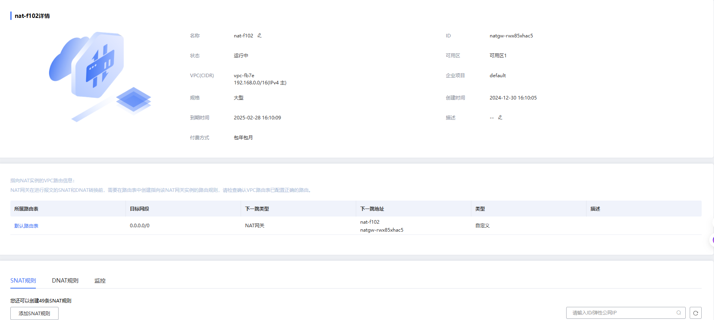
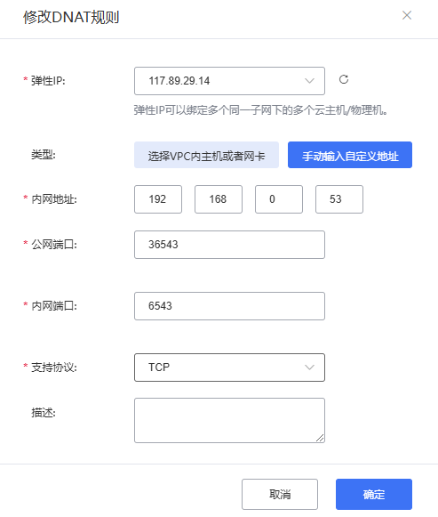
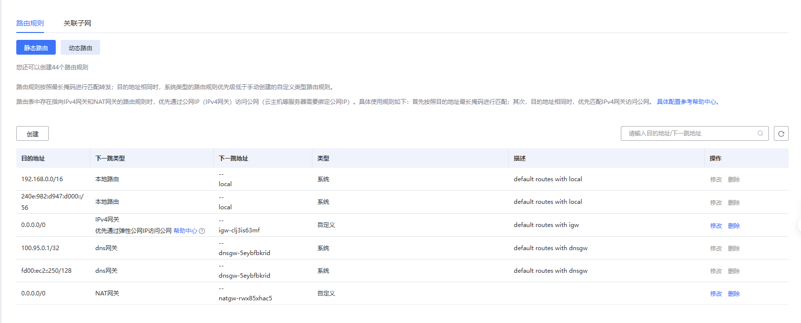
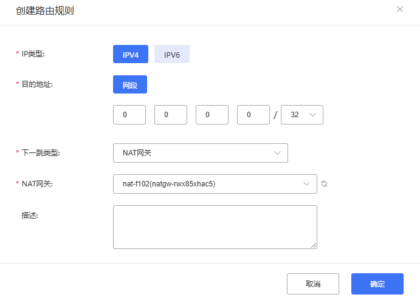
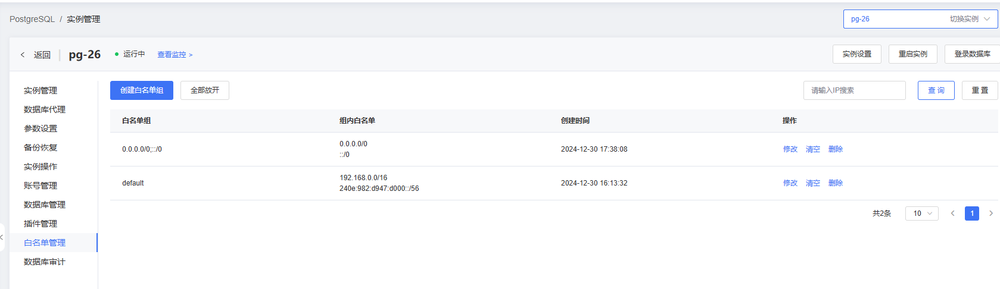

## 天翼云暴露云上服务

上云服务器选用PG数据库服务，建立一个数据库实例：

现需要将其暴露到公网提供服务

天翼云通过DNAT（Destination Network Address Translation，目标地址转换）暴露云上服务的方式，可以使得外部网络能够访问云上的内部服务。具体来说，DNAT通常通过云防火墙或负载均衡器等网络设备来实现，将外部请求映射到云内部的目标服务器上。以下是常见的操作步骤：

1. 进入网络控制台，选中 NAT网关 > 公网

   【创建NAT网关】

   

   添加【DNAT】规则

   可以选择VPC，但因为PG服务不在VPC中，故采取`手动输入自定义地址`方式

   

2. 配置一条到NAT网关的默认路由

   【路由表】中配置，选中目前子网`vpc-fb7e`在用的【默认路由表】

   

   创建一条默认静态路由：

   【下一跳转类型】选择【NAT网关】

   

3. 访问控制——安全组——出端口和入端口需要打开放通对应的端口

   因为看到【出方向规则】中已允许所有端口，故只需添加【入方向规则】。在这里放开PG内部和公网端口6543以及36543.

   

4. 以上全部执行后，发现还是无法在公网环境访问pg数据库。提示是数据库pg_hba文件中没有当前用户的路由权限。因为天翼云托管PG数据库服务无法修改pg_hba文件，故在pg控制台加入白名单控制：

   

   

#### 总结

1. **创建NAT网关并配置DNAT规则**
   - 在天翼云网络控制台中，首先创建一个NAT网关并选择公网。
   - 在NAT网关上配置DNAT规则，将外部请求映射到内部的PG数据库服务器。
   - 由于PG服务不在VPC中，使用“手动输入自定义地址”方式配置DNAT规则，确保公网流量能正确路由到数据库实例。
2. **配置路由表**
   - 在【路由表】中，选择当前子网 `vpc-fb7e` 使用的【默认路由表】。
   - 添加一条默认静态路由，将流量引导到NAT网关，确保外部流量能够经过NAT网关转发到目标数据库。
3. **配置安全组规则**
   - 由于默认的出方向规则已允许所有端口，因此只需在入方向规则中放开PG数据库需要使用的端口（如 `6543` 和 `36543`）。
   - 确保安全组规则已正确配置，允许从公网访问这些端口，避免因网络访问控制导致的连接问题。
4. **修改数据库访问控制**
   - 如果依然无法在公网环境访问PG数据库，可能是由于PG数据库的`pg_hba.conf`文件中未配置相应的用户访问权限。
   - 由于天翼云托管的PG数据库服务无法直接修改`pg_hba.conf`文件，需要通过PG控制台进行配置，手动加入允许的公网IP白名单。
   - 进入PG数据库控制台，加入公网访问的IP地址，确保外部客户端能够连接到PG数据库。

#### 关键点

- **NAT网关和DNAT规则**：确保公网流量能够正确映射到云上的数据库服务。
- **路由配置**：保证外部流量经过NAT网关转发到目标数据库实例。
- **安全组配置**：放开数据库端口，允许外部访问。
- **白名单配置**：修改PG数据库的访问控制，允许外部客户端通过公网访问。

通过上述配置，你可以将天翼云上的PG数据库实例暴露到公网，允许外部网络访问数据库服务。