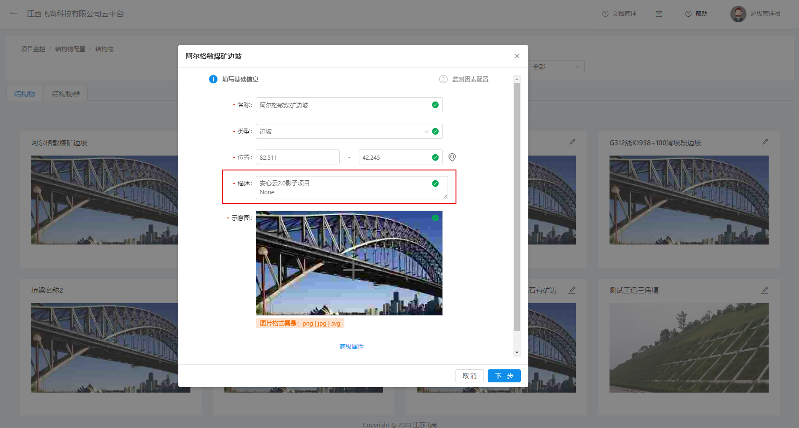

### 运维中-安心云2.0告警同步操作指南


#### 更新数据大屏统计进程

更新数据大屏统计进程et-statistics，使其统计的时候忽略2.0同步来的结构物（已执行2023-10-26）


#### 同步结构物信息到安心云平台

程序：`move.py` `python`脚本

运行环境：可以连接安心云2.0数据库，以及可以访问安心云3.0 WEB-API的**`Windows`**服务器。


##### 方式一：通过python脚本运行

修改move.py开头部分的参数配置

```python
# 尝试从环境变量中获取参数
# 安心云2.0数据库连接地址
server = os.environ.get('DB_SERVER', '10.8.30.107')
database = os.environ.get('DB_DATABASE', 'DW_iSecureCloud_Empty_20180223')
username = os.environ.get('DB_USERNAME', 'FS')
password = os.environ.get('DB_PASSWORD', '123')
# 安心云3.0 API地址以及token
axyUrl = os.environ.get('AXY_API', 'http://10.8.30.71:30455')
axyToken = os.environ.get('AXY_TOKEN', '5051ad55-cfa6-4c05-9cce-21a13573890b')
```


安装python解释器。

`Python3`安装完成后，运行`pip install`命令安装依赖包。

```sh
C:\Users\yww08\Desktop\tmp>python --version
Python 3.9.12

pip install -i https://pypi.tuna.tsinghua.edu.cn/simple pyodbc
```


修改完成配置后，执行：

```python
python move.py

C:\Users\yww08\Desktop\tmp>python move.py
将同步项目：127个，结构物：374个
按任意键继续。。。
```


##### 方式二：运行打包的二进制程序

直接运行 `move.exe` 执行程序

> 具体打包方式见附录Extra


同步完成后，可以在安心云3.0平台上查看结构物信息：




##### 执行SQL语句，指定安心云2.0结构物外部标签

执行完成同步之后，会在程序目录下生成 `structures.txt`，即新建的结构物ID数组, 作为以下SQL 的ID范围条件。

```sql
update t_structure set external_platform='axy2.0' where id in (1156,1157,1158,1159,1160);
```


#### 同步告警信息

平台上跟新以下配置文件后重启`localstash`进程

projects.xml

```xml
<?xml version="1.0" encoding="utf-8"?>
<projects>
    ...
    <project>
        <name>axy2.0</name>
        <description>安心云2.0平台</description>
        <handles>
            <handle>sensor</handle>
            <handle>alarm</handle>
            <handle>theme</handle>
        </handles>
    </project>
</projects>

```


客户端`logstash`运行在安心云2.0服务器上

> 提前打包logstash.zip中已更新 `config/local-warning.conf`配置 以及增加了`mssql`的jar驱动.
>
> 并且确保  `comm2.0-mssql` 脚本复制到 `logstash/scripts` 目录下


用文本编辑器打开start.bat。配置安心云2.0数据库连接信息

```bat
REM START LOGSTASH ADD IT TO BOOTSTART

set DEST_URL=http://pipeline.ngaiot.com/data
set DB_CONNECTION=jdbc:sqlserver://10.8.30.107:1433;database=DW_iSecureCloud_Empty_20180223;encrypt=false;
set DB_USER=FS
set DB_PASSWORD=123
set PROJECT_NAME=axy2.0
set SCHEDULE_CRON=0 */1 * * * *

set DB_DRIVER=com.microsoft.sqlserver.jdbc.SQLServerDriver
set DB_DRIVER_LIB=./logstash-core/lib/jars/mssql-jdbc-7.4.0.jre8.jar


REM 创建数据导出记录项
set LAST_RUN_DIR=last_run
if not exist %LAST_RUN_DIR% (
    mkdir %LAST_RUN_DIR%
)

./bin/logstash.bat -f ./config/local-warning.conf
```


运行 `start.bat` 启动客户端程序


#### EXTRA:

python打包成exe的方法 https://zhuanlan.zhihu.com/p/40716095

```text
pip install pyinstaller
pyinstaller --help
pyinstaller -cF move.py
```


#### 经验总结：

连接JDBC 连接SqlServer数据库报错。

> 如出现报错“：javax.net.ssl.SSLHandshakeException: The server selected protocol version TLS10 is not accepted by client preferences [TLS13, TLS12]
>
> Go to folder *C:\Program Files (x86)\Java\jre1.8.0_291\lib\security*. （在openjdk 17中在conf文件夹下）
>
> In file *java.security*, find option *jdk.tls.disabledAlgorithms* and delete *TLSv1*.

除了改动上面的之外，还需要设置连接字符串关闭tsl

```sh
jdbc:sqlserver://10.8.30.107:1433;database=DW_iSecureCloud_Empty_20180223;encrypt=false;
```


连接Microsoft SQL Server 2008 R2最终选择如下jdbc库

```
mssql-jdbc-7.4.0.jre8.jar
```