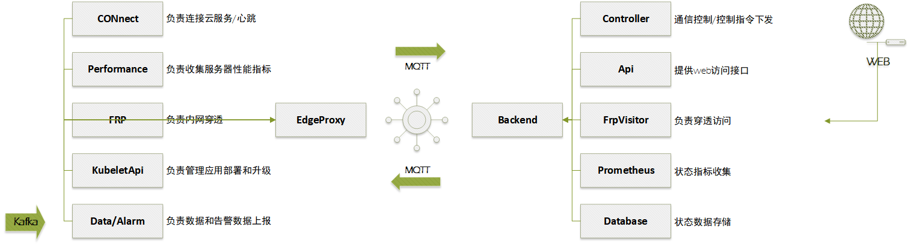

# 山西省集群化桥梁健康监测项目软件具体实施方案

## 一、组成内容

本系统软件主要包含两部分内容：

1. **数据集成和推送**

   + 使用安心云本地化4.0系统
   + 定制数据上报服务
   + 定制数据处理分析服务

2. **设备运维平台建设**
   + 服务器（云平台）
     + 设备运维管理平台
     + MQTT代理服务
   + 工控机（边缘网关）
     + `EdgeProxy`网关代理服务


## 二、部署清单

分布在各桥梁工控机以及云服务器上的运维管理平台中,主要的软件应用清单如下：

**工控机**

| 应用名        | 说明                                            | 分类                         |
| ------------- | ----------------------------------------------- | ---------------------------- |
| EMQX          | `mqtt`代理服务                                  | 本地化4.0安装包内置-基础服务 |
| PG            | 配置信息数据库                                  | 本地化4.0安装包内置-基础服务 |
| Redis         | 缓存字典数据库                                  | 本地化4.0安装包内置-基础服务 |
| `InfluxDB`    | 采集数据存储时序库                              | 本地化4.0安装包内置-基础服务 |
| Kafka         | 消息总线                                        | 本地化4.0安装包内置-基础服务 |
| RPC           | python计算服务RPC                               | 本地化4.0安装包内置-专有应用 |
| DAC           | 采集服务                                        | 本地化4.0安装包内置-专有应用 |
| ET            | 计算服务（Go-ET）                               | 本地化4.0安装包内置-专有应用 |
| iota-api      | 采集相关接口服务                                | 本地化4.0安装包内置-专有应用 |
| iota-proxy    | 采集相关接口代理                                | 本地化4.0安装包内置-专有应用 |
| web-api       | 本地化系统配置接口                              | 本地化4.0安装包内置-专有应用 |
| web-console   | 本地化系统控制台网站                            | 本地化4.0安装包内置-专有应用 |
| config-center | 配置更新服务                                    | 本地化4.0安装包内置-专有应用 |
| ET-Analysis   | 数据处理分析、拥堵时间分析、抓拍等处理模块/程序 | 定制服务                     |
| upload        | 数据上报监测平台                                | 定制服务                     |
| EdgeProxy     | 网关运维代理服务                                | 定制服务                     |


**运维服务器**

| 应用名       | 说明                           |
| ------------ | ------------------------------ |
| EMQX         | `mqtt`代理服务                 |
| PostgreSQL   | 运维管理平台配置数据库         |
| *Clickhouse* | 运维管理平台综合数据仓库(OLAP) |
| Poms-Console | 运维管理平台                   |
| Poms-Api     | 运维管理平台接口               |
| EdgeBackend  | 运维后台服务                   |
| Deliver      | 邮件/短信分发服务              |


应用系统组成可以表示为图示：


为了便于部署和运维，所有应用均采用容器化+**K8S**部署的方式运行，底层操作系统选用Linux，脱离底层服务器配置差异，实现多桥多系统的统一化管理和快速部署运维。


## 三、边缘代理

边缘工控机除了安心云4.0本地化采集系统之外，开发边缘代理服务，实现以下功能：

+ 设备在线率统计
+ 设备控制指令下发（若设备支持）

+ 支持远程电源控制
+ 支持工控机性能指标收集
+ 支持工控机应用部署和升级
+ 支持工控机重启等运维指令
+ 支持工控机穿透访问（SSH以及部署配置）

设计工控机边缘代理以及平台边缘节点管理程序，整体架构如下图所示：



其中：

**边缘端模块**：

- **CONNect**：负责连接云服务/心跳发送。每个边缘工控机必须有唯一编码，注册到服务器。
- **Performance**：负责收集集群服务器性能指标。
- **FRP**：负责内网穿透。
- **KubeletApi**：MicroK8S提供的管理接口，通过调用来管理应用部署和升级。
- **Data/Alarm**：负责数据和告警数据上报。接收来自**Kafka**消息队列采集的监测数据以及告警数据。

**EdgeProxy**：作为边缘代理，接收上述模块的数据，通过MQTT协议传递给后端。


**服务端Backend**：后端服务器，接收EdgeProxy传来的数据，并进行处理。

**Backend后端模块**：

- **Controller**：通信控制/控制指令下发。
- **Api**：提供web访问接口。
- **FrpVisitor**：负责穿透访问。提供本地化系统web端口以及SSH远程的代理穿透。
- **Prometheus**：状态指标收集。包括性能指标、数据中断、设备异常告警等数据的指标。
- **Database**：状态数据存储。

**WEB**：提供最终用户访问界面，通过网络与后端模块进行交互。


## 四、模块说明

### 3.1 实时数据采集分析

​	使用本地化4.0系统实现实时数据的采集。本系统升级使用Go-ET作为后台ETL服务，升级`InfluxDB`作为本地数据存储服务，实现对高频采集数据的实时解析、过滤、计算和入库。同时，使用InfluxDB的持续聚集功能，替换原有聚集进程，聚集数据可能用于后续的上报任务。同时InfluxDB中设置数据生存时间TTL使本地数据保存不超过3个月。

​	除了已有的精简本地化采集系统，本系统的难点在于：

+ 对动应变和动挠度数据在进行异常数据处理之后，实时分离出车辆荷载；
+ 以及对拥堵事件的监听，并计算拥堵状态下，桥梁关键位置的应力、挠度情况；推送拥堵照片、小视频，拥堵开始与结束时间；
+ 通过对车辆荷载产生的挠度进行分析，当达到设定阈值时，与桥面视频抓拍联动，获取桥面通行的车牌信息，获取桥面视频小片段，并推送至平台；


### 3.2 视频处理

​	通过在现场搭建流媒体服务器(如NVR)，将视频存储于现场工控机，平台可根据需要随时访问历史视频，并通过智能识别，提供拥堵事件、车牌识别等功能。视频数据，可以通过萤石云或者国标G/B28181协议，上报到运维平台以及健康监测平台中。


其中：
视频监控系统通过多个摄像头连接到NVR，用于实时监控和录像。
视频服务的几个功能模块主要：
拥堵事件：监控系统检测到桥梁上的交通拥堵事件。
视频抓拍：在检测到特定事件或数据异常时，调用视频SDK对相关视频进行抓拍。
车牌识别：系统能够识别车辆车牌信息，用于记录和分析车辆流量。
录像回看：用户可以通过系统回看NVR记录的历史视频，并供外部接口调用。
事件触发：当检测到拥堵事件时，系统会触发相应的处理逻辑，包括计算桥梁的挠度，或者到数据库中查询历史挠度、车流量等数据，并记录拥堵的开始和结束时间。
超阈值处理：当挠度或其他监测数据超出设定阈值时，系统会调用视频抓拍功能，记录视频证据并识别车牌信息。

### 3.3 容器化&K8S

​	在本项目中，为了便于部署和运维，所有应用均采用容器化和Kubernetes（K8S）部署的方式运行。底层操作系统选用Linux，脱离底层服务器配置差异，实现多桥多系统的统一化管理和快速部署运维 。

​	

### 3.4 云边协同

​	云边协同架构设计旨在实现云端与边缘设备之间的高效数据处理与协同工作。通过在云端和边缘设备上部署数据处理模块，系统可以在边缘设备上进行初步的数据过滤和分析，然后将处理后的数据上报至云端进行进一步分析和存储。这种协同工作方式能够减少数据传输的延迟，提高数据处理的效率。

​	本系统中，边缘工控机负责采集和数据处理，承担数据计算和分发的职责，然后将设备数据、诊断数据上报到运维平台；

​	运维平台负责设备节点状态的收集、管理。并支持对单个节点的控制（电源管理、穿透访问）;

​	

​	其中对节点诊断状态的管理，可以参考《边缘网关FS-EDGE V1.0设计方案》

​	边缘工控机通过心跳定时发送到服务端；

```go
**//** **单位****M**
MemTotal    uint64  `json:"mt,omitempty"` 内存总和M
MemFree     uint64  `json:"mf,omitempty"` 内存空闲M
MemUsedPercent float64 `json:"mp,omitempty"` 内存使用百分比

**//** **单位****M**
DiskTotal  uint64  `json:"dt,omitempty"` 磁盘总和M
DiskFree   uint64  `json:"df,omitempty"` 磁盘空闲M
DiskPercent float64 `json:"dp,omitempty"` 磁盘使用百分比
 
Uptime  uint64 `json:"u,omitempty"` 系统启动时间
Platform string `json:"pform,omitempty"` 系统平台版本
Version  string `json:"pver,omitempty"` 系统版本信息
 
Load1  float64 `json:"load1,omitempty"` 1分钟平均负载
Load5  float64 `json:"load5,omitempty"` 5分钟平均负载
Load15 float64 `json:"load15,omitempty"` 15分钟平均负载
```


最终的消息格式如下：

```json
{
 "time": 1642734937400741643, -- 当前数据的设备时间（用于校时）
 "ver": {
  "pv": "v0.0.1" -- 当前配置版本（包括设备配置和采集配置）
 },
 "machine": {
  "mt": 3845, -- 总内存
  "mf": 2616, -- 空闲内存
  "mp": 10.074738688877986, -- 内存使用比
  "dt": 12031, -- 总磁盘
  "df": 7320, -- 剩余磁盘空间
  "dp": 36, -- 磁盘使用率
  "u": 7547, -- 系统启动时长
  "pform": "ubuntu", -- 系统信息
  "pver": "18.04", -- 系统版本
  "load1": 0.09, -- 1分钟内平均负载
  "load5": 0.02, -- 5分钟内平均负载
  "load15": 0.01 -- 15分钟内平均负载
 }
}
```


​	服务端抓取到心跳信息，在前端界面中实时更新展示：

 

同时，通过Prometheus监控这些指标。其中对应的指标项如下表：

| 指标项                          | 类型    | 标签                | 描述           |
| ------------------------------- | ------- | ------------------- | -------------- |
| edge_status                     | Gauge   | Sn(设备序列号)      | 设备在线状态   |
| edge_traffic_package_size_bytes | Counter | SN，Direction(流向) | 数据流量       |
| edge_mem_used                   | Gauge   | SN                  | 内存使用比     |
| edge_disk_used                  | Gauge   | SN                  | 磁盘使用比     |
| edge_load1                      | Gauge   | SN                  | 一分钟平均负载 |
| edge_load5                      | Gauge   | SN                  | 五分钟平均负载 |
| edge_load15                     | Gauge   | SN                  | 15分钟平均负载 |

 

用户需要在服务器上额外配置Prometheus抓取规则，最终可以通过`Grafana`查看监控指标；示例：


### 3.5 内网穿透

[frp](https://github.com/fatedier/frp) 是一个快速的反向代理,用golang语言开发。可以帮助您将本地服务器暴露在 NAT 或防火墙后面的互联网上。

在“边缘网关FS-EDGE V1.0”产品中已有使用。集成在边缘端[WatchDog](https://svn.anxinyun.cn/Iota/trunk/code/gowork)进程（Linux服务，非容器化部署；便于SSH控制主机）。


其中服务端代理SSH的配置如下：

```json
# 网关穿透visitor配置模板
[common]
# 服务端IP 端口
server_addr = 127.0.0.1
server_port = 7000

[secret_ssh_visitor]
type = stcp
role = visitor
# 必须与被访问端服务名一致
server_name = sec_ssh
# 必须与被访问端sk一致
sk = sk
bind_addr = 127.0.0.1
bind_port = 6000
```

搭建这套穿透访问系统之后，运维平台即可直接远程到工控机或者直接访问工控机上的本地化控制台WEB界面。


