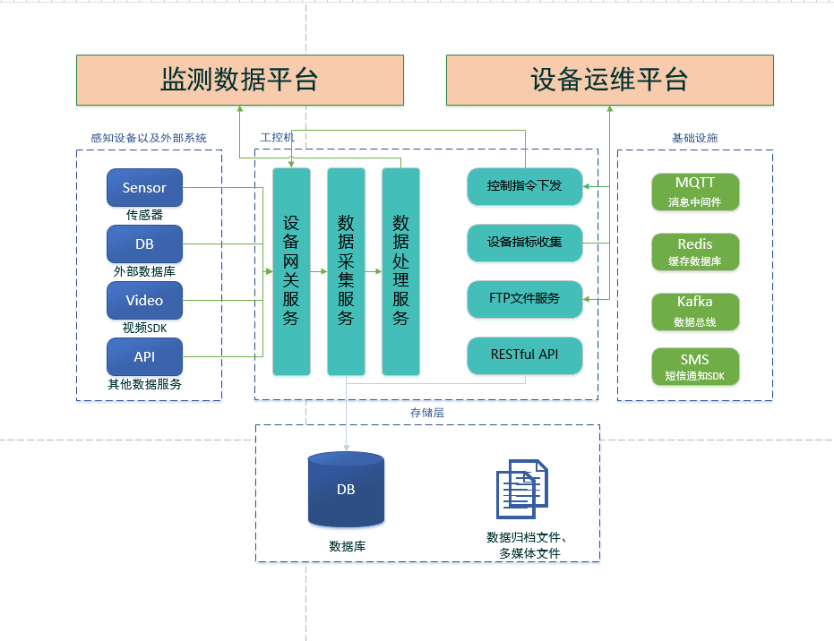
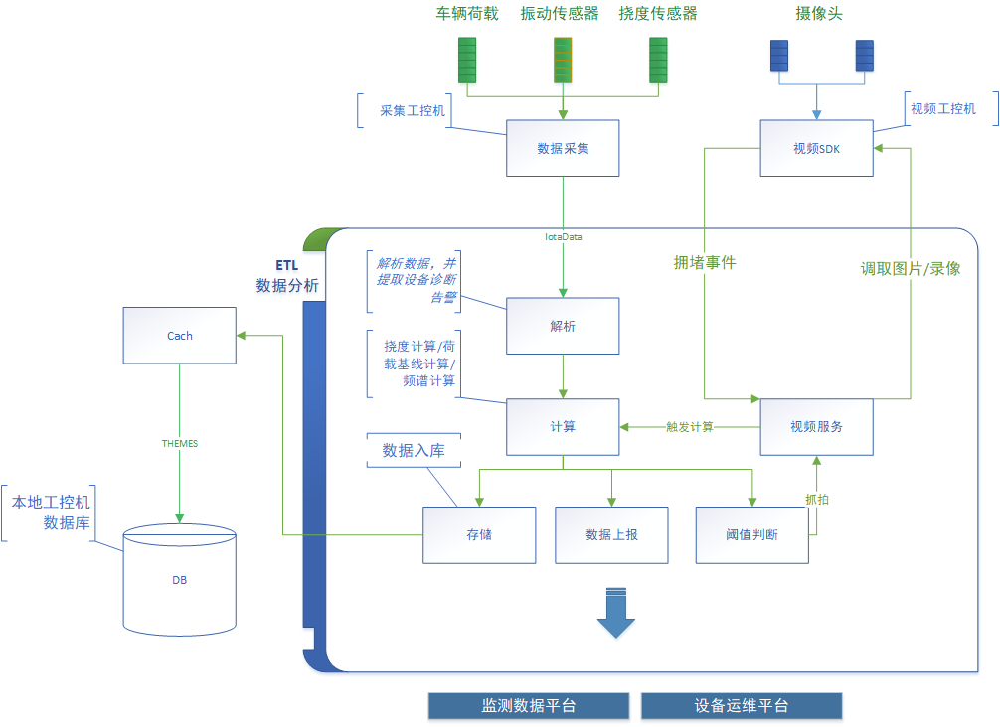

# 山西省集群化桥梁健康监测项目软件整体框架设计

## 一、整体建设内容

长大桥梁集群监测桥梁共计63座，现场部署工控机进行数据采集、计算处理和推送。

整体功能参见《***桥梁集群化健康监测项目实施方案***》中设备安装与集成内容图例：

整体软件平台框架如下：

我司主要建设内容包括：

1. **数据集成和推送**

   负责数据的采集接入，并对数据进行清洗**过滤**、处理**分析**，本地时序库临时**存储**，并按照上级平台要求格式将数据**上报**。

2. **设备运维平台建设**

   主要包括两部分：

   + 设备的集中化运维
     + 设备在线率统计
     + 设备控制指令下发（若设备支持）
   + 服务器运维
     + 支持远程电源控制
     + 支持工控机性能指标收集
     + 支持工控机应用部署和升级
     + 支持工控机重启等运维指令
     + 支持工控机穿透访问（SSH以及部署配置）

## 二、软件整体技术架构

整体架构图如下:

**1. 监测数据平台**

本系统由第三方提供。

**2. 数据网关**

数据网关负责收集数据并将数据上传至第三方监测平台。

- **感知设备以及外部系统**：
  - **Sensor（传感器）**：收集桥梁健康监测数据。
  - **DB（外部数据库）**：存储外部数据库的数据。
  - **Video（视频SDK）**：现场通过NVR集成摄像头视频数据并提供SDK供网关服务调用。
  - **API（其他数据服务）**：通过API接口与其他数据服务进行交互。
- **设备网关服务**：负责与感知设备及外部系统进行通信和数据传输，即链路通信层。
- **数据采集服务**：负责收集从设备网关服务传输的数据。这里主要是指DAC进程。
- **数据处理服务**：对收集到的数据进行清洗过滤、计算分析。

**3. 设备运维平台**

- **控制指令下发**：发送控制指令至设备。
- **设备指标收集**：收集设备运行指标数据。
- **FTP文件服务**：提供FTP文件传输服务。
- **RESTful API**：提供基于REST架构的API接口。用于穿透访问。

**4. 基础设施**

- **MQTT（消息中间件）**：用于消息传递,负责传感器数据接收以及内部消息通信。选用`EMQX`组件。
- **Redis（缓存数据库）**：用于缓存数据，提升数据处理性能。
- **Kafka（数据总线）**：用于数据流处理，主要用于本地化内部数据的传输。
- **SMS（短信通知SDK）**：提供短信通知服务。

**5. 存储层**

- **DB（数据库）**：工控机本地存储处理后的数据。这里选型为`InfluxDB`。
- **数据归档文件，多媒体文件**：用于存储归档文件和多媒体文件。

## 三、数据处理流程

这里介绍下数网关上的数据处理流程设计，整体设计如图所示：

### 3.1 数据采集部分：

1. **车载荷载、振动传感器、挠度传感器**：
   - 这些传感器安装在桥梁上，用于监测桥梁的不同状态参数，如车载荷载、振动和挠度。
   - **数据采集**：这些传感器将采集到的数据发送至数据采集模块。
2. **摄像头**：
   - 摄像头用于监控桥梁的视觉信息。
   - **视频SDK**：摄像头接入到视频服务器/NVR中，对外提供SDK接口。

### 3.2 数据处理部分：

1. **数据采集模块**：
   - 收集传感器数据，进行初步处理后将数据发送至数据分析模块。
2. **视频工控机**：
   - 处理来自摄像头的视频数据，订阅拥堵事件，并将处理后的数据发送至视频服务模块。
3. **数据分析（ETL）**：
   - **数据解析**：解析采集到的数据，实现对异常数据的过滤，并提取设备诊断告警信息。
   - **计算**：进行挠度计算、荷载基线计算、频谱计算等分析。
   - **数据入库**：将处理后的数据存入数据库。
   - **数据上报**：将数据上报到第三方健康监测系统，进行进一步分析和决策。
   - **阈值判断**：判断数据是否超过预设的阈值，若超出，则触发相应事件。
   - **触发计算**：根据设定的触发条件(摄像头拥堵事件、挠度超阈值事件等)，触发计算过程（）。
4. **视频服务**：
   - 处理和存储视频数据，提供视频的抓拍和录像功能（由硬盘录像机提供）。
   - **抓拍**：在特定事件触发时进行视频抓拍，或调取历史指定时间段的录像。

### 3.3 数据存储部分：

1. DB（本地工控机数据库）：
   - 存储原始数据、处理后的数据及分析结果。
   - **Cache**：用于临时存储处理过程中产生的缓存数据，提高网关数据分析性能。

