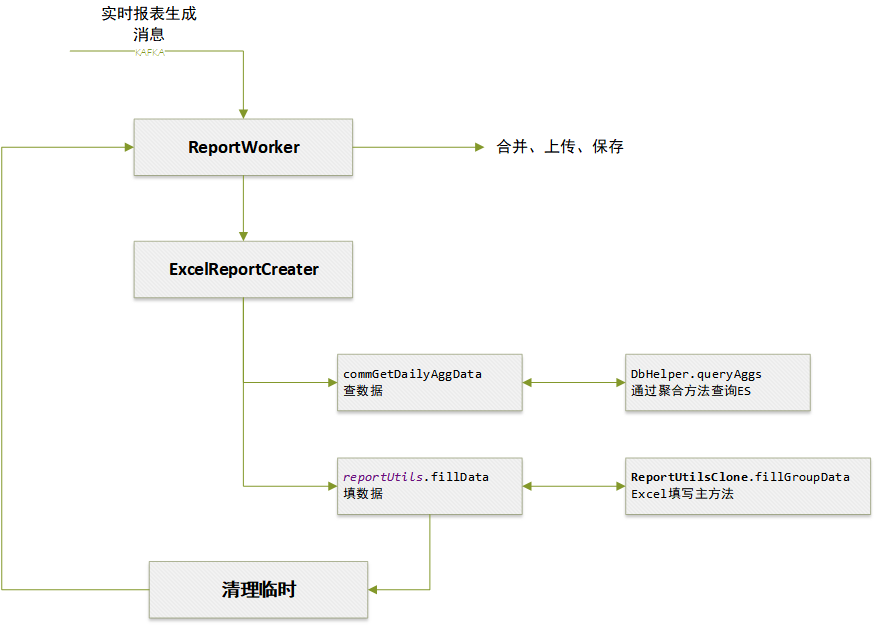
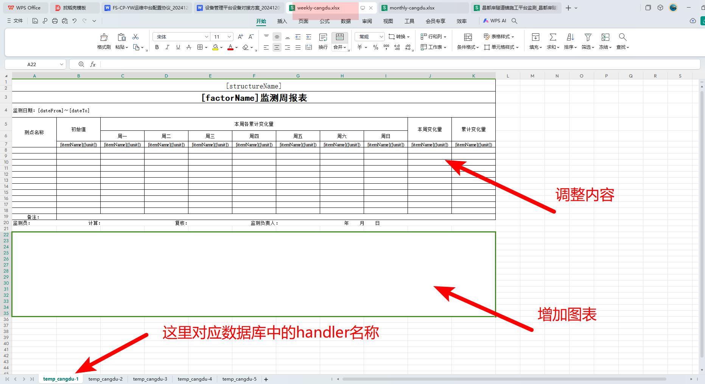
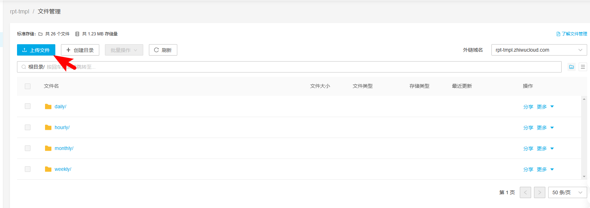
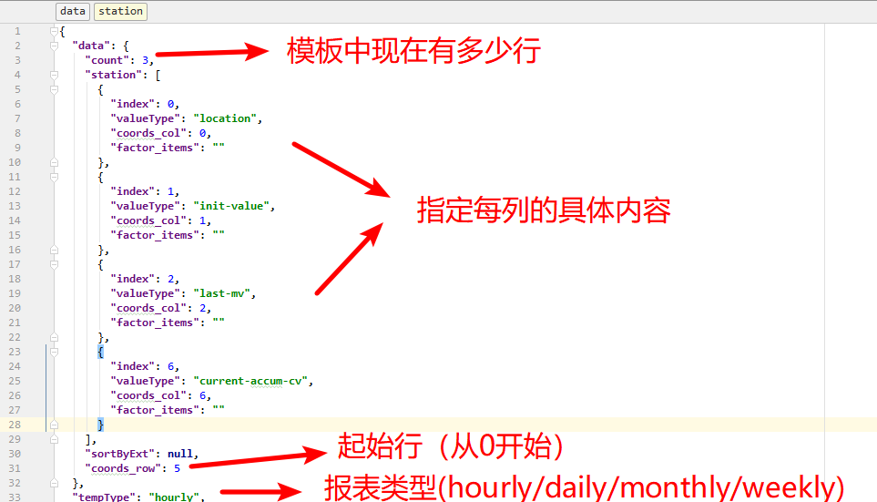
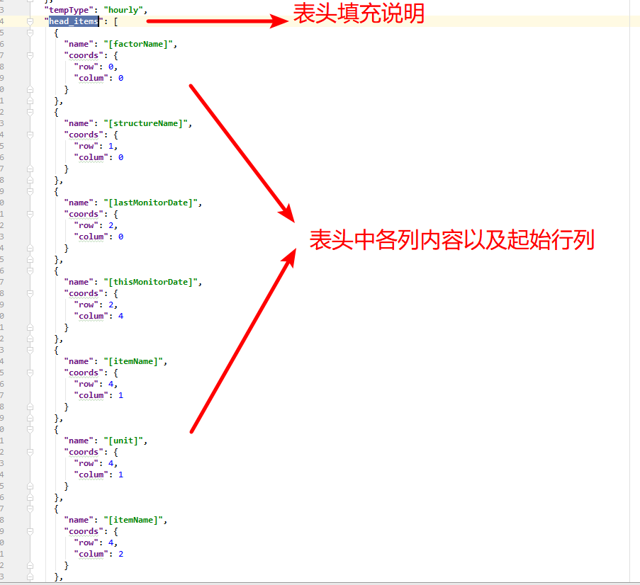

## 报表编程说明

现在采用 Scala代码编写 `ReportClient`服务

代码路径：http://10.8.30.22/FS-Anxinyun/trunk/codes/services/report_client

构建： https://jenkins.ngaiot.com/job/report/


系统流程架构图（只关注Excel结构监测报告代码部分）




> 报表生成消息由 Report-Master 统一管理。可以是定时生成的，也可以是前端立即触发的。


创建报表模板：

>  现在本地添加（templates目录下，用于测试）




报表模板表中增加对应模板配置

```sql
INSERT INTO public.t_report_template (name, description, handler, file_link, factor_proto, structure, report_type, manual, cells, struct_type, params, doc_type)
VALUES ('昌都周报模板', null, 'temp_cangdu', 'weekly/weekly-cangdu.xlsx', null, null, 1, false,
        '{}','{}', null, 'excel');
INSERT INTO public.t_report_template (name, description, handler, file_link, factor_proto, structure, report_type, manual, cells, struct_type, params, doc_type)
VALUES ('昌都月报模板', null, 'temp_cangdu', 'monthly/monthly-cangdu.xlsx', null, null, 2, false,
        '{}', '{}', null, 'excel');
```


报表文件上传7牛

> 上传文件的目录和文件名，必须和数据库中的 flie_link一致

> 提供模板文件给测试部同事上传，更新CDN外链可以立即测试

https://portal.qiniu.com/kodo/bucket/resource-v2?bucketName=rpt-tmpl




本例中是多Sheet页，需要改代码 （所以数据库中的cells的`json`为空，在代码里定义）

```scala
if (template.handler == "temp_cangdu") {
                                    template.handler = s"${template.handler}-${factor_items.length}"
                                    template.cells = getReportTemplateConfigCangdu(reportConf.report_type, factor_items.length, template.man_monit)
                                }
```


数据具体是怎么填充的，就是通过Cell的`json`说明的：





如果要添加曲线图：

```json
# 曲线图的具体位置
"chart_coords": [
    {
      "coords": {
        "endCol": 11,
        "endRow": 41,
        "startCol": 0,
        "startRow": 21
      },
      "factorItem": ""
    }
  ]
```


报表中还有很多代码，主要是一些定制的数据获取、模板填写（高定制报表、人工报表）、还有Review上线审核报表。这里先告一段落。。。


> 报表模板添加后，要等待redis刷新
>
> 可以发送 到kafka savoir_config立即刷新：
>
> ```
> {"model":"report_template","ids":[1],"operation":"redis"}
> ```
>
> 

