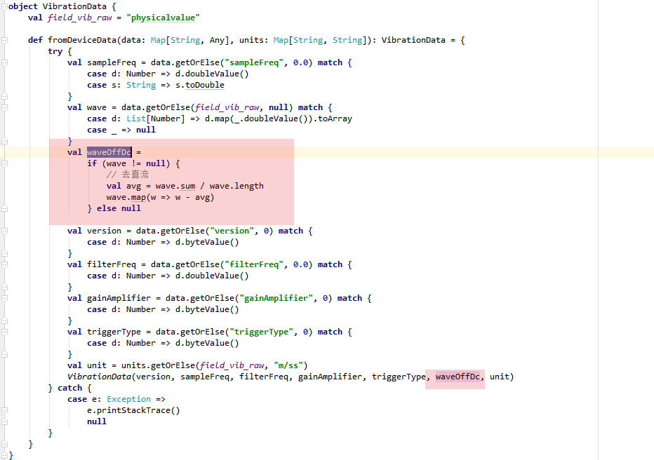

设备接入平台到原始波形的展示，经过了**灵敏度系数换算和去直流**算法。


1. 云振动设备通过精简协议FS_SP_iDAU数据接入。数据为原始数据，协议部分进行去直流和灵敏度系数计算，代码如下：

```lua
if device.props.das == "true" then
			for i= 1, floatcount do
				vols[i]=(vols[1]- mean)/subdevice.props.k
			end
		end
        local rst = {
            data={
                _data_type='vib',
                physicalvalue=vols,
                sampleFreq=samplefreq,
                filterFreq=filterfreq,
                gainAmplifier=gainamplifier,
                triggerType=triggertype,
                version=version
            },
            device=subdevice.id,
            type=1,
            time=os.date("%Y-%m-%dT%H:%M:%S+08:00",os.time({year = year, month = mon, day =day, hour =hour, min =min, sec = sec}))   
        }
```


2. 数据解析完后，数据传到ET进行处理

ET中原始波形存储，有**去直流**算法



以上数据解析完即入库，即前端查询的**原始波形**数据。