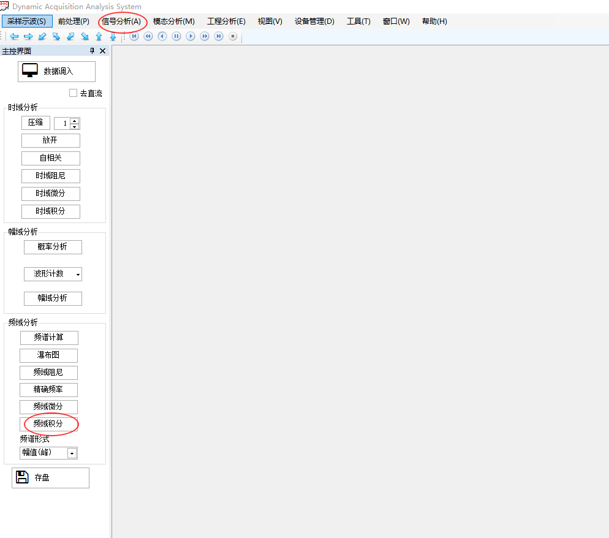
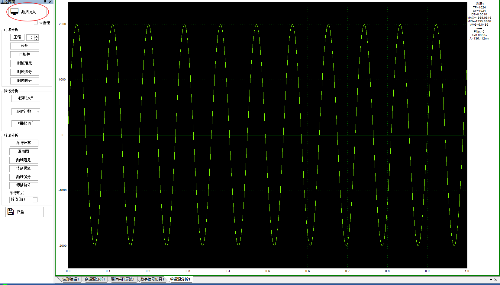
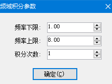
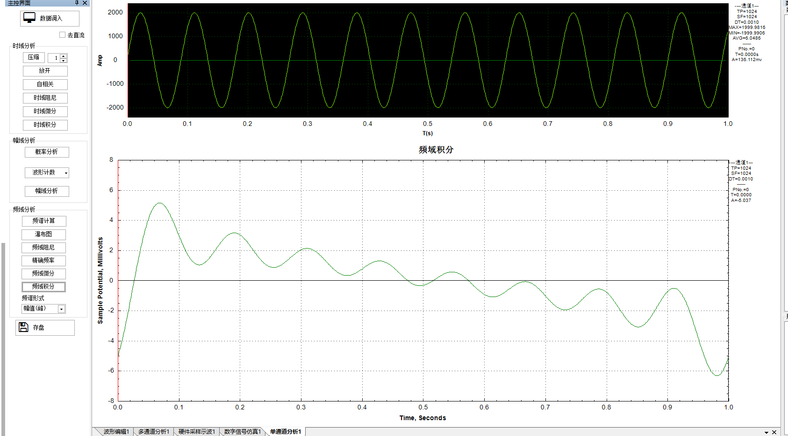
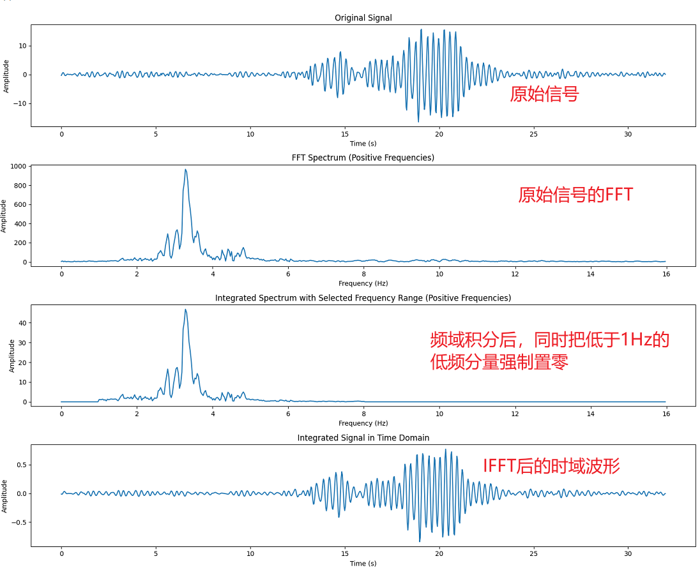

# 振动频率积分算法说明

## 功能说明

软件名称：动态数据采集分析软件 DAAS

版本： 14.7.1.3

功能: 修改信号分析模块中，频率积分算法。

位置： 信号分析 > 单通道分析 > 频域积分




## 操作步骤：

1. 数据调入



2. 点击【频域积分】

   如下，弹出参数输入对话框。输入：频率下限、频率上限、积分次数

   

3. 最终展示积分后的时域曲线，如下

   


## 算法说明

算法提供者： 王辅宋

参考：https://mp.weixin.qq.com/s?__biz=MzI2Njc2OTI4Nw==&mid=2247484894&idx=1&sn=2279825d10956ef17d58ed079a994c4a&chksm=ea884336ddffca205def8e4029e3574da64ad44b4e83f0cf5c05297391018c98031804fb79f&scene=2623&from=industrynews#rd



原始代码Python

```py
import numpy as np
from scipy.fft import fft, ifft, fftfreq
import matplotlib.pyplot as plt

# 从外部txt文件读取数据
data = np.loadtxt("频域积分1.txt")  # 替换为您的数据文件路径

# 采样频率和点数
fs = 32  # 采样频率
num_points = 1024  # 分析点数

# 截取指定点数的数据进行处理
signal = data[:num_points]

# 进行FFT
spectrum = fft(signal)
freqs = fftfreq(num_points, 1/fs)  # 频率数组

# 定义频率范围
low_freq = 1  # 最低频率
high_freq = 8  # 最高频率

# 将不在频率范围内的频率置零
mask = (np.abs(freqs) < low_freq) | (np.abs(freqs) > high_freq)
spectrum_masked = spectrum.copy()  # 保留未经修改的FFT结果
spectrum_masked[mask] = 0

# 频域积分
epsilon = 1e-9
integrated_spectrum = -1j * spectrum_masked / (2 * np.pi * (freqs + epsilon))

# 计算反变换得到积分后的时域信号
integrated_signal = np.real(ifft(integrated_spectrum))

# 时域数组
t_integrated = np.arange(len(integrated_signal)) / fs

# 绘制结果
plt.figure(figsize=(15, 12))

# 原始信号的时域波形
plt.subplot(4, 1, 1)
plt.plot(np.arange(len(signal)) / fs, signal)
plt.title('Original Signal')
plt.xlabel('Time (s)')
plt.ylabel('Amplitude')

# FFT频谱
plt.subplot(4, 1, 2)
plt.plot(freqs[:num_points//2], np.abs(spectrum)[:num_points//2])
plt.title('FFT Spectrum (Positive Frequencies)')
plt.xlabel('Frequency (Hz)')
plt.ylabel('Amplitude')

# 频域积分后的频谱
plt.subplot(4, 1, 3)
plt.plot(freqs[:num_points//2], np.abs(integrated_spectrum)[:num_points//2])
plt.title('Integrated Spectrum with Selected Frequency Range (Positive Frequencies)')
plt.xlabel('Frequency (Hz)')
plt.ylabel('Amplitude')

# 积分后的时域波形
plt.subplot(4, 1, 4)
plt.plot(t_integrated, integrated_signal)
plt.title('Integrated Signal in Time Domain')
plt.xlabel('Time (s)')
plt.ylabel('Amplitude')

plt.tight_layout()
plt.show()
```

