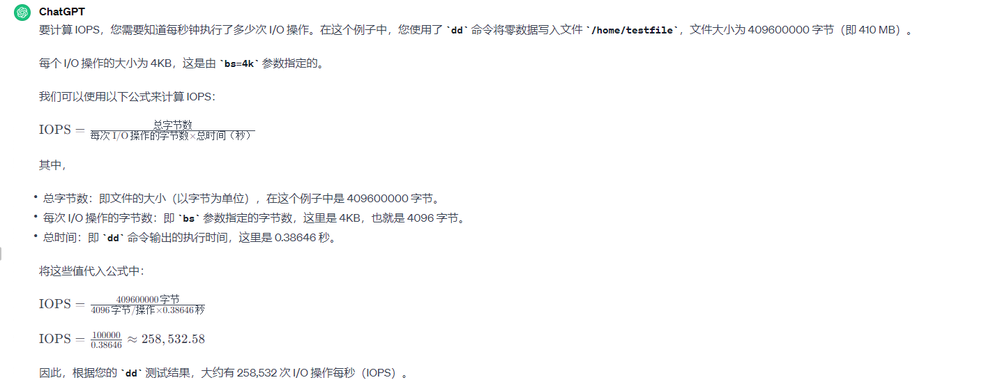

测算磁盘的IOPS

在购买天翼云CK服务器的时候对方提供高IO和超高IO的选型方案，提到高IO的写入IOPS达到5000，故打算测试下我们目前的Clickhouse(210)服务器的IO情况。

IOPS（Input/Output Operations Per Second），您可以使用一些工具和方法来执行测试。以下是一种常用的方法：

1. **选择合适的工具**：
   - **fio**：灵活的 I/O 测试工具，可以模拟各种读取和写入负载，并提供详细的性能统计信息。
   - **ioping**：用于测试磁盘 I/O 延迟的简单工具，可以测量每秒钟的 IOPS。
   - **dd**：基本的命令行工具，用于执行简单的磁盘 I/O 测试。

写入：

```shell
root@node-13:/home/anxinyun# dd if=/dev/zero of=/home/testfile bs=4k count=100000
100000+0 records in
100000+0 records out
409600000 bytes (410 MB, 391 MiB) copied, 0.38646 s, 1.1 GB/s
```



读取：

```shell
root@node-13:/home# dd if=/home/testfile of=/dev/null bs=4k count=100000
100000+0 records in
100000+0 records out
409600000 bytes (410 MB, 391 MiB) copied, 0.160826 s, 2.5 GB/s
```

按照如上计算方式，得到读取的IOPS高达：621,790