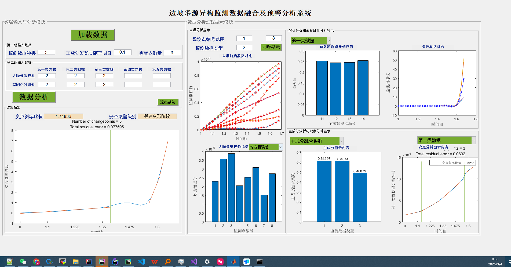

#### 石家庄铁道大学-MATLAB程序接口说明

MATLAB资料：[SVN地址](http://10.8.30.22/FS-Anxinyun/trunk/codes/services/tools/安信边坡算法Python脚本/2025-2-24) (>Matlab2019B)

PYTHON依赖：3.5

商用部署： 218.3.150.108  `ToDesk`远程地址：`256 199 874` / 108fwq**

程序GUID：如下



接口请求示例：

```shell
curl --location 'http://localhost/values' \
--header 'Content-Type: application/json' \
--data '{
  "Data_Type_num": 3,
  "Contri_thre": 0.1,
  "ChaPoint_Num": 3,
  "lev": [2,2,2],
  "kkk": [2,2,2],
  "startTime": "2025-02-04",
  "endTime": "2025-03-04"
}
'
```

参数说明：

```json
 "Data_Type_num": 监测因素个数,
  "Contri_thre": 主成分贡献率阈值,
  "ChaPoint_Num": 突变点数量,
  "lev": [2,2,2] # int数组，个数=Data_Type_num,
  "kkk": [2,2,2],# int数组，个数=Data_Type_num,
  "startTime": "2025-02-04",
  "endTime": "2025-03-04"
```

返回说明：

```json
参考matlab代码
```


样例：

```json
{
    "COEFF": [
        [
            0.6185241701878124,
            -0.33909596511734763,
            0.7087481530184752
        ],
        [
            0.617091099165882,
            -0.3473484701901392,
            -0.7050637820874659
        ],
        [
            0.4857720405787118,
            0.8721365420926185,
            -0.005808867633224912
        ]
    ],
    "Change_Point_Slope": 2.41982028283832,
    "Change_Result_Comp": [
        [
            1.65,
            3.764426680204995
        ],
        [
            1.65,
            1.7097438414102748
        ],
        [
            1.6,
            0.784892038234056
        ]
    ],
    "Change_Result_Pri": [
        [
            1.65,
            2.41982028283832
        ]
    ],
    "Data_Comp_Cell": [
        [
            [
                0.0014883370966387792
            ],
            [
                0.0018840042126286943
            ],
            [
                0.0028744538776791853
            ],
            [
                0.004742604474988413
            ],
            [
                0.007287057303006948
            ],
            [
                0.010184272542670429
            ],
            [
                0.013622543282846834
            ],
            [
                0.017742434338068613
            ],
            [
                0.022412612663851837
            ],
            [
                0.027596532730735805
            ],
            [
                0.03164752719854487
            ],
            [
                0.03214605082841042
            ],
            [
                0.02766984342104908
            ],
            [
                0.016117121022327124
            ],
            [
                0.0058891924778589205
            ],
            [
                0.010166686530966092
            ],
            [
                0.03221974649644184
            ],
            [
                0.0783037731387872
            ],
            [
                0.16408859918524468
            ],
            [
                0.305770255967162
            ],
            [
                0.3066511061584402
            ],
            [
                -0.11856331520859816
            ],
            [
                -0.2504272037245125
            ],
            [
                0.925427269909468
            ],
            [
                4.9846355684689225
            ],
            [
                14.362213296381407
            ],
            [
                29.426724416522905
            ]
        ],
        [
            [
                2.2235659554949637e-05
            ],
            [
                -5.366412528256588e-05
            ],
            [
                -0.0002640926020770992
            ],
            [
                -0.0006905900537638125
            ],
            [
                -0.0014703638197142317
            ],
            [
                -0.002789464618639576
            ],
            [
                -0.0028815953479360496
            ],
            [
                0.0008251461756285801
            ],
            [
                0.009739795897292458
            ],
            [
                0.026061302205414
            ],
            [
                0.03980796804716306
            ],
            [
                0.03546094298105025
            ],
            [
                0.00596778504405601
            ],
            [
                -0.06048796403321503
            ],
            [
                -0.12758628877570016
            ],
            [
                -0.135978053137476
            ],
            [
                -0.06337250185214426
            ],
            [
                0.13067507911968906
            ],
            [
                0.3382485697892478
            ],
            [
                0.37682628330605283
            ],
            [
                0.18627654495415252
            ],
            [
                -0.34838536040499085
            ],
            [
                -0.71179196472663
            ],
            [
                -0.07943548594579962
            ],
            [
                1.896828113935844
            ],
            [
                5.808980746799157
            ],
            [
                9.178949505576922
            ]
        ],
        [
            [
                17756.06980110195
            ],
            [
                18893.13485650142
            ],
            [
                20100.32466791923
            ],
            [
                21439.08953938293
            ],
            [
                22947.527126410678
            ],
            [
                24896.616094317364
            ],
            [
                27473.74776784926
            ],
            [
                30270.80141760407
            ],
            [
                33191.48244070959
            ],
            [
                36315.21229600716
            ],
            [
                39709.875026050526
            ],
            [
                43440.14320774082
            ],
            [
                47564.44225670485
            ],
            [
                51877.65559144219
            ],
            [
                56603.873855353166
            ],
            [
                61369.13225194391
            ],
            [
                66297.20511279687
            ],
            [
                71373.04256018129
            ],
            [
                76577.55595712263
            ],
            [
                81917.28867691409
            ],
            [
                87559.30383764477
            ],
            [
                93255.79607359256
            ],
            [
                100166.44040925856
            ],
            [
                113357.33424840654
            ],
            [
                119328.40982588507
            ],
            [
                123169.35343853867
            ],
            [
                127021.01745212197
            ]
        ]
    ],
    "Data_Dn_Cell": [
        [
            [
                0.0010269750495381978,
                0.0010819445438858268,
                0.0011371085382041381,
                0.0012281843809302984,
                0.0013133586398183803,
                0.0014484358508046738,
                0.001508642064654187,
                0.0013859008370939682,
                0.0012736420038044923,
                0.0013954561777428547,
                0.0016194695376008472,
                0.0017616529525913756,
                0.0016381349781895943,
                0.0009662292696225214,
                0.0007463927978336518,
                0.0008599402546991732,
                0.0010536655155308145,
                0.00093467748657243,
                0.0008695549648556716,
                0.0003522368663377066,
                0.0001227711863300159
            ],
            [
                0.0015182584290718767,
                0.0015989237484986094,
                0.0016841293750784624,
                0.001828357974901723,
                0.001973340552272173,
                0.0021906940166810363,
                0.002271908041625314,
                0.0020787713132063824,
                0.001914986122732482,
                0.0021095211501574412,
                0.002326236039307154,
                0.0020798165317539104,
                0.0018597366352042918,
                0.0013023438377612884,
                0.0010989620225208946,
                0.0012661967255265198,
                0.0015402727639654034,
                0.001366731897384596,
                0.0012751955889856754,
                0.0005196680129557028,
                0.0001802560523309465
            ],
            [
                0.002405041955046696,
                0.0025320775022748855,
                0.0026714335815407834,
                0.0029110468906794282,
                0.0031708685356332937,
                0.0035354364296475396,
                0.003653217434227792,
                0.003333290346777552,
                0.0030752739760187744,
                0.0034001713818268406,
                0.0035343214949042447,
                0.003274239296399218,
                0.0029293786254027928,
                0.0018198454033447084,
                0.001734568908130776,
                0.0019988940925898227,
                0.0024232595257770344,
                0.00215173038369208,
                0.002013289011992863,
                0.0008230316062023916,
                0.0002836332519078163
            ],
            [
                0.003462437014707943,
                0.0036443976557872983,
                0.003846555015224597,
                0.0042015472392340205,
                0.004634555361770091,
                0.005160406414637729,
                0.00531272243755717,
                0.004847568277173397,
                0.00446260466182592,
                0.004929814996949589,
                0.0048785589768813005,
                0.006195233398416095,
                0.005803533169254698,
                0.002252357531562311,
                0.00248157233876879,
                0.0028668053285636898,
                0.003509833902956246,
                0.0031287831263955056,
                0.0029415629312818966,
                0.001192665964838577,
                0.0004026047936940751
            ],
            [
                0.004562616741189243,
                0.00480148643572436,
                0.00506791426627177,
                0.005543464497142157,
                0.006183124532331566,
                0.006867591121332247,
                0.007049501324681893,
                0.006436869192379456,
                0.005910465594203752,
                0.006517211048744504,
                0.006010815472442833,
                0.010748054210653127,
                0.010418568847058982,
                0.002308436051161009,
                0.0032518982408726808,
                0.0037660179718956304,
                0.0046635052565793065,
                0.00417309870693265,
                0.003939875381694036,
                0.0015827341654793786,
                0.0005235966513866237
            ],
            [
                0.00543760568676227,
                0.00572143959983548,
                0.006037850744963922,
                0.006609190869814158,
                0.007447278689608802,
                0.008247523346170637,
                0.008445098421671265,
                0.0077189898960852476,
                0.007069553682985667,
                0.007777502193314727,
                0.006318219258293998,
                0.0168039793084229,
                0.016709255910112433,
                0.0015140664101868113,
                0.0038568571294622335,
                0.004476700350024283,
                0.005609001527599527,
                0.005036692571631621,
                0.00477247287090644,
                0.0018996494265606917,
                0.0006166084075709533
            ],
            [
                0.006222106793580379,
                0.006546044687962314,
                0.006906034360433006,
                0.00756524025711762,
                0.008604210908712188,
                0.00949655059796713,
                0.009701950702920693,
                0.00887949684700997,
                0.008107659019937506,
                0.008895940978109598,
                0.0076249542554712064,
                0.022689798006033608,
                0.022823913920795903,
                0.002166486920631532,
                0.004390045599993615,
                0.005108932055064725,
                0.006482405011114263,
                0.005842628827723011,
                0.005556013538855459,
                0.002189828485793311,
                0.0006967858256014333
            ],
            [
                0.007215893935638239,
                0.00759097595472584,
                0.008006755051003664,
                0.008780617998054286,
                0.010036962705724762,
                0.01104917859230059,
                0.011271558671997828,
                0.010327755057799445,
                0.009403795742345091,
                0.010298134594008551,
                0.012720868352791136,
                0.025611469180733468,
                0.025662779944791405,
                0.0076869386313313005,
                0.005066954328262627,
                0.005911170828949832,
                0.007570526053692746,
                0.00684399002853179,
                0.006525629303990432,
                0.0025529206099794595,
                0.0008001738245398572
            ],
            [
                0.008267325216637585,
                0.008696721849826738,
                0.009171218403926519,
                0.010071704438927706,
                0.011533872417418392,
                0.012667705676278423,
                0.012911232808888173,
                0.011843883798932801,
                0.01075313920792993,
                0.01175655818566006,
                0.022644039070451424,
                0.023971419552874997,
                0.023531968400597417,
                0.01967693686181623,
                0.005777822115925994,
                0.006757736973889577,
                0.008720564562872658,
                0.007905322814652397,
                0.007553695720528669,
                0.0029365584055791724,
                0.0009091403415452319
            ],
            [
                0.009314673214949385,
                0.009798398520960231,
                0.010330548845223046,
                0.011365629771904678,
                0.013002860663209295,
                0.014247267969880635,
                0.01451497835622314,
                0.013333034323566638,
                0.012064547817776319,
                0.013169327155159333,
                0.03929682543289281,
                0.01541102100340689,
                0.013887875486647041,
                0.040792072438289737,
                0.0064758212463134285,
                0.007596627408274458,
                0.00987048536301062,
                0.008972980187866122,
                0.00859006383148602,
                0.0033193587786492073,
                0.0010162127256969102
            ],
            [
                0.01039027643172247,
                0.010929220494521252,
                0.01152315119696001,
                0.012699295047222553,
                0.014486676035850467,
                0.015838021323652356,
                0.016133902028427297,
                0.014839837683913488,
                0.013382369869980495,
                0.01458579243229533,
                0.05384377460752175,
                0.007259453113118816,
                0.0046374142687101065,
                0.05881749009200725,
                0.007184589548051524,
                0.008450079826487494,
                0.011070227730213975,
                0.010091441150995745,
                0.009675678861412036,
                0.003716720781858997,
                0.0011252475121670466
            ],
            [
                0.01140383586079175,
                0.011992890263018918,
                0.012651665445157178,
                0.013957346736035561,
                0.015872506334227154,
                0.017314166958395133,
                0.017635696180194733,
                0.01624195718111003,
                0.014597556249942205,
                0.015882692206041184,
                0.05231425063338973,
                0.011346386020951473,
                0.008581675455446492,
                0.054637641218707185,
                0.00783967381563114,
                0.009236646659341211,
                0.012261062906458267,
                0.0112095954206755,
                0.010762630127629683,
                0.004105394543534003,
                0.0012252921563764183
            ],
            [
                0.012422669026846933,
                0.013059601867052906,
                0.013793047212783533,
                0.015221618864720064,
                0.017242763974394528,
                0.018769650869734388,
                0.019118105257601836,
                0.017627432141165866,
                0.015792096816698426,
                0.017151341626497705,
                0.02856486038120747,
                0.032279571561277684,
                0.030671804061616494,
                0.01966952352887848,
                0.008488172095053863,
                0.010007556893156773,
                0.013523721776862058,
                0.012400040400210253,
                0.011918316966576923,
                0.00451166641859161,
                0.0013241930007197452
            ],
            [
                0.013554247814782545,
                0.014241432524796493,
                0.015069958244920911,
                0.016621290506080123,
                0.018736378941149368,
                0.02036280456930645,
                0.020744255633787564,
                0.019142722361979295,
                0.017103875015922376,
                0.018545106013029593,
                -0.027734484130354047,
                0.07835050035169776,
                0.07982958513766332,
                -0.06048039923147339,
                0.009206566145003831,
                0.010845463914315477,
                0.014987128714800868,
                0.013778105107788737,
                0.013250053568615508,
                0.00497758699917938,
                0.0014344946040606454
            ],
            [
                0.014724433420167604,
                0.015463547434192038,
                0.016399325346693708,
                0.01806546967220261,
                0.02025851162078995,
                0.021987103173795337,
                0.022405128604687727,
                0.02068971449446286,
                0.018441471170772647,
                0.019949474564420942,
                -0.08446073673828239,
                0.12763132783253697,
                0.13238392088741416,
                -0.1413563057601124,
                0.009932796794286514,
                0.011687285456764625,
                0.01656981179667915,
                0.01527034138774345,
                0.014690077966160564,
                0.005478193076393983,
                0.0015477691343150077
            ],
            [
                0.015868779298621863,
                0.01666329041469349,
                0.017707162008192702,
                0.01947731996733966,
                0.02172532427373171,
                0.023548014853832188,
                0.024005673735093533,
                0.02218436303199522,
                0.01972431349585252,
                0.02125739536288634,
                -0.08900903995480214,
                0.14313979175285405,
                0.14839813816430925,
                -0.15025875357032892,
                0.010607787130754323,
                0.012480364911368195,
                0.018181958094731054,
                0.016794892146074554,
                0.016163185213115404,
                0.005988418068247071,
                0.0016570259745978834
            ],
            [
                0.017014769153403123,
                0.017871576354287523,
                0.01902558870592695,
                0.02088755794957828,
                0.023180381085265555,
                0.025095455029913498,
                0.025596459003918787,
                0.02367205238207012,
                0.020996086202614304,
                0.022505672318126113,
                -0.021573494503674944,
                0.10765397966118861,
                0.10926585112225254,
                -0.05984617588283402,
                0.011243551333477184,
                0.013241673565045076,
                0.019861819029231953,
                0.018385449742642966,
                0.01770191088715648,
                0.006522269377341421,
                0.001765495675452129
            ],
            [
                0.018151847673535972,
                0.01908088420613751,
                0.02034336802315308,
                0.022280581718988397,
                0.024620898719282216,
                0.026626620592421865,
                0.02717367727609386,
                0.025149540582567277,
                0.0222547679524644,
                0.02367474205756699,
                0.15370526648274987,
                -0.00938908237409452,
                -0.018015842577168956,
                0.1794424682208915,
                0.01182132478224146,
                0.01395758254399101,
                0.021601363337650007,
                0.02003393410222735,
                0.019300430147243485,
                0.007079670892670825,
                0.0018720352348731283
            ],
            [
                0.01930528605682565,
                0.020315700826365617,
                0.02168205985667944,
                0.0236828165989858,
                0.026067124347689926,
                0.02816291895614409,
                0.02876005262641192,
                0.02663762181442098,
                0.023515226863061685,
                0.02487234608245219,
                0.3412188145352436,
                -0.06301966549750501,
                -0.0770228027529102,
                0.4354395465841006,
                0.01239234564182451,
                0.014667759547212427,
                0.023443859920778982,
                0.021784650309443654,
                0.020997478424556733,
                0.007673612994557524,
                0.0019787188594074016
            ],
            [
                0.02053915631764712,
                0.02163801650538006,
                0.023104614910852646,
                0.025165288822006093,
                0.027584120945479892,
                0.029775666288939285,
                0.030428944592734014,
                0.028202093839940174,
                0.024833351781789137,
                0.02629960310433898,
                0.379247248992732,
                0.17174519754480166,
                0.17502002713498732,
                0.48459812842731564,
                0.01305603957795365,
                0.015451788930087765,
                0.025491126980680005,
                0.02373745258447257,
                0.022881935765004496,
                0.008333674711756197,
                0.0020915164482141384
            ],
            [
                0.021858803258717936,
                0.023054570326621972,
                0.024610272330139682,
                0.02672974254192492,
                0.029177683631830032,
                0.031469505965939594,
                0.03218494325983437,
                0.02984812866959791,
                0.026209823371000234,
                0.0280243672701125,
                0.2145341983761698,
                0.3727280834161272,
                0.39064751734890935,
                0.25329102218476846,
                0.013837536256778742,
                0.016329847191349785,
                0.02775554523216685,
                0.0259073425803749,
                0.02496705146815237,
                0.009065389444116384,
                0.00221037572476299
            ],
            [
                0.02328030340692332,
                0.024581689883296277,
                0.026206975753057162,
                0.028389887457395114,
                0.03086085917829447,
                0.033256270723674576,
                0.03404031948247861,
                0.03158803120902161,
                0.027649681636110496,
                0.030162255092639794,
                -0.2547846582855137,
                0.10204347883764653,
                0.09763176492568959,
                -0.3992973453223287,
                0.01478666130298585,
                0.01734084969730975,
                0.03026520364854555,
                0.028325916213212874,
                0.02728017307449938,
                0.009878422397391097,
                0.0023360827845338283
            ],
            [
                0.024719569966124053,
                0.026126786273934475,
                0.027805009218363128,
                0.030050746743453746,
                0.03253969627697286,
                0.035037803970364885,
                0.035892787749857526,
                0.03332498516577605,
                0.02907784253927455,
                0.032728216641868285,
                -0.5685545465427205,
                0.22229088171498002,
                0.22506108130638192,
                -0.8385280068835663,
                0.015827542559538294,
                0.018409196523569323,
                0.032859263129670274,
                0.03083456410095367,
                0.029671589563373384,
                0.01071935455185423,
                0.002462012574587571
            ],
            [
                0.026026441848867675,
                0.02752849415750346,
                0.02924673552104315,
                0.03154337725048026,
                0.034049363429037444,
                0.036640393710992085,
                0.03756180682540839,
                0.03488977605495525,
                0.030360867465911844,
                0.0356501678829197,
                0.008818877147257351,
                1.8459901865532682,
                1.9709676403253067,
                -0.04964462128536874,
                0.016805141577307437,
                0.019389515835096616,
                0.03526000794022614,
                0.03315963264337444,
                0.03188548936884798,
                0.011497922418845917,
                0.002575921380584162
            ],
            [
                0.02714032357085253,
                0.02871744970725254,
                0.0304608700393291,
                0.03279730375978204,
                0.035316005585404174,
                0.0379850904324445,
                0.038965037334771545,
                0.0362049354614882,
                0.03143492660723266,
                0.039025752365885256,
                1.7888389948531187,
                7.692326934985483,
                8.267631165434983,
                2.396712460737373,
                0.017694176940914078,
                0.020246515136294354,
                0.03734785210812221,
                0.03518630691318205,
                0.03381118828869087,
                0.012173392140322323,
                0.002672644259140321
            ],
            [
                0.027958258377639496,
                0.029577815412824497,
                0.03133287828475533,
                0.033695488884998126,
                0.036218478010232306,
                0.038943446910285014,
                0.03996866909173836,
                0.037144388343837396,
                0.03219870879952914,
                0.042926401182446235,
                5.300536765076806,
                21.906641531821048,
                23.58519991517618,
                7.229991684864494,
                0.018423895337010356,
                0.020901748010088473,
                0.03892357713233098,
                0.03672073357611391,
                0.0352639502205198,
                0.012678313647325756,
                0.0027436835681032674
            ],
            [
                0.028523192639601836,
                0.030162006256531013,
                0.031918699128081894,
                0.034296403604809775,
                0.03681950427872857,
                0.03958201614264922,
                0.04064044985732806,
                0.0377722064807574,
                0.03270611590088643,
                0.04680794117119039,
                8.323786384970768,
                47.856113866942174,
                51.56240449621537,
                11.392300025426616,
                0.018991944682964026,
                0.021376046297446594,
                0.04004906806178363,
                0.037820660061047146,
                0.03630126686625131,
                0.013035469447414962,
                0.0027927719719881075
            ]
        ],
        [
            [
                3.327839740218717e-06,
                1.084508422003419e-05,
                3.756022917260087e-06,
                7.70864375646411e-06,
                3.149943434153059e-05,
                3.3053379898038554e-05,
                1.2354989228022726e-05,
                3.227640711978458e-05,
                1.2167287183182661e-05,
                3.559431803526745e-05,
                5.9653516711107386e-05,
                1.3720113353976256e-05,
                -4.845418901083685e-05,
                9.404582769621087e-05,
                1.5203075797054556e-05,
                2.8374724596537756e-05,
                5.237260681259205e-06,
                1.6335067524501485e-05,
                1.5278739848583705e-05,
                0.00017722571803393915,
                5.886754481033796e-06
            ],
            [
                4.99834965004984e-06,
                1.5937694342163243e-05,
                5.6419713230703925e-06,
                1.0541286155339146e-05,
                4.931254305447121e-05,
                5.114682790340677e-05,
                1.723240230874571e-05,
                5.0229685478938975e-05,
                1.6339860712564874e-05,
                5.9059579581084784e-05,
                2.4667150621357735e-05,
                2.1878181559705953e-05,
                -0.00015648982796184917,
                5.0791198196744175e-05,
                2.248597978888657e-05,
                4.201134424608376e-05,
                7.5953046417095935e-06,
                2.3701158174847724e-05,
                2.2132288572290125e-05,
                0.0002579747751536268,
                9.252919173748378e-06
            ],
            [
                7.904998695938015e-06,
                2.5274088497413928e-05,
                8.832557562103756e-06,
                1.6823911133658794e-05,
                8.183429205862489e-05,
                8.338322489031149e-05,
                2.5816786831785732e-05,
                8.260875847446815e-05,
                2.378643297860436e-05,
                0.00010117809601769895,
                -7.186998837645619e-05,
                3.124674882211332e-05,
                -0.00043677890951031626,
                -8.866949643934451e-05,
                3.564444428817672e-05,
                6.665317594852986e-05,
                1.1829979101260662e-05,
                3.727771472227829e-05,
                3.3463813707231744e-05,
                0.00040537984526090823,
                1.5142556923473162e-05
            ],
            [
                1.0737144464476488e-05,
                3.782446313831714e-05,
                1.4535707440554172e-05,
                3.2369453743637974e-05,
                0.00012288198559046894,
                0.0001183957350188038,
                3.469680547291251e-05,
                0.0001206388603046363,
                3.335943973337473e-05,
                0.00014898855581497073,
                -0.0002274566448094592,
                2.6602699320349886e-05,
                -0.0009989741114604473,
                -0.00037731860836425515,
                5.14052724648339e-05,
                9.832280970022222e-05,
                1.724139494781481e-05,
                5.602988867470618e-05,
                4.0241028815967e-05,
                0.0005980351569343603,
                2.0840631017143303e-05
            ],
            [
                1.3232469633887834e-05,
                5.180895703998114e-05,
                2.1392178314925286e-05,
                5.410626245554508e-05,
                0.0001672032479007566,
                0.0001525138420923713,
                4.297349762827864e-05,
                0.00015985854499656388,
                4.36460862378279e-05,
                0.00019697374022394453,
                -0.000517835126631936,
                2.3657711787651987e-06,
                -0.00198422762718215,
                -0.0009483561034062978,
                6.78554196726674e-05,
                0.00013260886048580464,
                2.3065230114723866e-05,
                7.724121043155081e-05,
                4.257228448880902e-05,
                0.0008095230548018853,
                2.5855553262028058e-05
            ],
            [
                1.465555685570255e-05,
                6.399105536741457e-05,
                2.7505916749794298e-05,
                7.817367381319685e-05,
                0.00020448504421985856,
                0.00017689438546371184,
                4.834200686720756e-05,
                0.00019068971484178528,
                5.2035062769538454e-05,
                0.0002328677607483618,
                -0.001040403237586909,
                -5.1957181747374045e-05,
                -0.00358313729694149,
                -0.00198321351421197,
                8.100436207491691e-05,
                0.00016121370592278534,
                2.787014054342441e-05,
                9.610060033545502e-05,
                3.856260455127246e-05,
                0.0009904126740670684,
                2.873136824839191e-05
            ],
            [
                1.542991680719137e-05,
                7.605218185630666e-05,
                3.486215107711714e-05,
                0.00010565676538581208,
                0.00023936564273958997,
                0.00019619174135093539,
                5.226071618531051e-05,
                0.00021777869204526277,
                6.035304125572004e-05,
                0.00026368033635145306,
                -0.0012480562264952364,
                -8.713172008529345e-05,
                -0.003796526641851309,
                -0.0019521638752881428,
                9.281166219045347e-05,
                0.000188816263877069,
                3.2388600454220466e-05,
                0.00011504873620445642,
                2.998285925109575e-05,
                0.0011662316725256983,
                3.0411883226707446e-05
            ],
            [
                1.6779360098836925e-05,
                9.090335005488933e-05,
                4.5753114078457544e-05,
                0.0001354220508252497,
                0.00028144613073399863,
                0.0002224402134942375,
                5.842668373748642e-05,
                0.0002519431721141181,
                7.176977839199188e-05,
                0.0003055901434472167,
                -0.0003570618292148942,
                -2.5416669293779912e-05,
                0.0002946034442249163,
                0.0013640971497951948,
                0.00010763953649476798,
                0.00022403201744582648,
                3.8006308939124955e-05,
                0.00013809766370452277,
                2.3597910792604084e-05,
                0.0013838761361514614,
                3.3526762645603805e-05
            ],
            [
                1.8249516068229743e-05,
                0.00010699357518888725,
                6.04840384353816e-05,
                0.0001657036424128399,
                0.00032472020917415697,
                0.0002502934166771098,
                6.561456383690974e-05,
                0.0002875068129256334,
                8.543604530709438e-05,
                0.0003520605812304032,
                0.002046459868443396,
                0.0001668099205749901,
                0.010300510529604566,
                0.009170194846469358,
                0.0001231986225015229,
                0.0002630667162562131,
                4.400694115557451e-05,
                0.0001629516573892333,
                1.8113812156458693e-05,
                0.0016187400695973303,
                3.724364792346165e-05
            ],
            [
                1.9669028518947072e-05,
                0.0001238583266957853,
                8.043124920861485e-05,
                0.00019551601413482988,
                0.0003663645163811677,
                0.0002775207484679738,
                7.352681630047943e-05,
                0.00032194263242457075,
                0.00010159622174709822,
                0.0004010802732004322,
                0.006628324587920039,
                0.0005462453206928207,
                0.028723579689716765,
                0.023356831936128333,
                0.00013851730461030988,
                0.0003051032771050616,
                5.01582607612349e-05,
                0.00018889621871178287,
                1.335138091001887e-05,
                0.0018628248265635037,
                4.1333406764649875e-05
            ],
            [
                2.0827564463535635e-05,
                0.00014157047170213985,
                0.00010231362158753992,
                0.00022425936181769447,
                0.0004076427905937839,
                0.0003054869830236932,
                8.238421427778826e-05,
                0.00035656488680873866,
                0.00011998464135831485,
                0.0004524030689514843,
                0.012058135597758457,
                0.0010130979836349818,
                0.04417803876791018,
                0.03536863878542323,
                0.00015428599574028096,
                0.00034948536155364896,
                5.483649541787255e-05,
                0.00021613147905294165,
                1.2431778545979565e-05,
                0.0021239094905601804,
                4.593285573075556e-05
            ],
            [
                2.0857477814129317e-05,
                0.00015892242975023183,
                0.00012038616396997399,
                0.0002516927105992233,
                0.000446023308880586,
                0.0003306211036679352,
                9.079827825081638e-05,
                0.0003883222062742606,
                0.00013877545032917624,
                0.0004982582512081311,
                0.016062102636952985,
                0.0013879330262631356,
                0.038968525407530416,
                0.031897771055728254,
                0.00016950754564398136,
                0.00039136166993697716,
                5.50845699936231e-05,
                0.00024314355848052655,
                1.6661078879652933e-05,
                0.0023919497755090593,
                5.0021189215313984e-05
            ],
            [
                1.9755422142270253e-05,
                0.00017648143455394516,
                0.00013309902622557558,
                0.00027688835878020567,
                0.0004835534970842284,
                0.0003556585169805156,
                9.960890429426127e-05,
                0.00041960600703237213,
                0.0001586156401341278,
                0.0005410726398805186,
                0.0179785843929102,
                0.0016281084377280264,
                0.00504319962627235,
                0.0069070236427950325,
                0.00018532106446954915,
                0.00043186342858325937,
                4.973151740970392e-05,
                0.00027078928100483454,
                2.9946163806850843e-05,
                0.0026813163183681205,
                5.415348188377268e-05
            ],
            [
                1.7499417362379804e-05,
                0.00019510612926922538,
                0.00013727943497989046,
                0.0002991215259784275,
                0.0005239599598385666,
                0.0003848092545012258,
                0.00010991048982211769,
                0.00045438460716989623,
                0.00018009727350731453,
                0.0005841632551978112,
                0.016423194071997587,
                0.0016351567046138586,
                -0.07108361226784644,
                -0.04972439194002486,
                0.00020356556727663423,
                0.00047241709471017865,
                3.704246121117569e-05,
                0.0003004063799419832,
                5.759719942540841e-05,
                0.003013842289467214,
                5.90510006304017e-05
            ],
            [
                1.4600034635911353e-05,
                0.0002159579241080732,
                0.00013545854152001037,
                0.0003189225932721,
                0.0005645054154709735,
                0.00041555217760894586,
                0.00012094107266730859,
                0.0004900287965399597,
                0.00020259394933095157,
                0.000616690456482632,
                0.009853446715391689,
                0.0012625486218129924,
                -0.14796974732943458,
                -0.10687978542703497,
                0.00022176803712075225,
                0.0005123536801113251,
                2.26633513774167e-05,
                0.0003316431893913503,
                9.622829381673672e-05,
                0.003376088787459395,
                6.425913870806729e-05
            ],
            [
                1.2195790480049921e-05,
                0.00024125923464206767,
                0.00013394102716793215,
                0.00033713685784718454,
                0.0006024282215117702,
                0.0004459401612813541,
                0.00013225796764134714,
                0.0005241841913965619,
                0.00022605493767401634,
                0.0006267300794293132,
                -0.002881101205644694,
                0.00038395387350258664,
                -0.1579017024873532,
                -0.11370694946380498,
                0.0002368424390642501,
                0.0005529630654171502,
                1.6070790427168522e-05,
                0.0003646897659139605,
                0.00014039063138463734,
                0.0037533691427403385,
                6.960524464028527e-05
            ],
            [
                1.0718817755515338e-05,
                0.00027280343825784355,
                0.00013223602670410812,
                0.00035461158244381194,
                0.0006389683476934555,
                0.00047710038676298985,
                0.00014390524019886316,
                0.0005580343672282227,
                0.00025020818632850143,
                0.0006074521354835899,
                -0.024366116548848626,
                -0.0012215474811254792,
                -0.07544548205959432,
                -0.05110818446778487,
                0.0002482066215826456,
                0.0005949047808897669,
                2.1042154276076715e-05,
                0.0004004992849830928,
                0.00019033660657823644,
                0.004152136941062215,
                7.51422785740136e-05
            ],
            [
                1.088202150502647e-05,
                0.0003128730509553469,
                0.00013168389115238713,
                0.00037288809212061743,
                0.000674096059245136,
                0.0005087340239413129,
                0.00015548298759987365,
                0.0005914150415932244,
                0.0002744770665022067,
                0.0005474649626807792,
                -0.05755197640456431,
                -0.0038171510609050006,
                0.14554741851368733,
                0.11556703724090343,
                0.0002540773359854897,
                0.000638712702790708,
                4.428518395717968e-05,
                0.00043985860421890316,
                0.0002436724295199899,
                0.004571015852389753,
                8.065215109950456e-05
            ],
            [
                1.3140825921232357e-05,
                0.00035990786237588297,
                0.00013279266592931363,
                0.00039158793571297145,
                0.000708244316325225,
                0.0005413866381552229,
                0.00016748277519494135,
                0.0006248154772402243,
                0.00030000997430266996,
                0.0005062829557712376,
                -0.08472615540987727,
                -0.0059755884563618775,
                0.38189446558346796,
                0.2939109572572009,
                0.0002598447413135411,
                0.0006883590981303583,
                8.121870996003033e-05,
                0.00048025286787084395,
                0.0003052649712418726,
                0.005023156375479773,
                8.629182003235337e-05
            ],
            [
                1.760823279604143e-05,
                0.0004106101525827244,
                0.00013334450505844524,
                0.00040975546150959246,
                0.0007432367777389551,
                0.0005766658384298825,
                0.00018079610955855306,
                0.000659951308084419,
                0.0003284648460979956,
                0.000574738820631866,
                -0.07994112136511504,
                -0.005590305802141938,
                0.42526815908526794,
                0.3276166822761936,
                0.000274648197222405,
                0.0007488815863515839,
                0.0001208306317792221,
                0.0005179542429788066,
                0.000384619710930668,
                0.005533943548384197,
                9.235263596812771e-05
            ],
            [
                2.5316126534108098e-05,
                0.00046521881311033426,
                0.00013628603270759635,
                0.00042869244654084705,
                0.0007791778759158862,
                0.0006143839517970619,
                0.0001954648900229148,
                0.000696780913856474,
                0.0003604934031746249,
                0.0007968790074881139,
                -0.029273410577604547,
                -0.0015621028490516839,
                0.20701537572679257,
                0.16520903731264883,
                0.00030167477765516215,
                0.0008245269253357643,
                0.00016476499020038582,
                0.000551308536830599,
                0.00048241782407651613,
                0.006110313097597863,
                9.876121354993994e-05
            ],
            [
                3.73316083662236e-05,
                0.0005227324980379185,
                0.00014471776982203464,
                0.00044939289905790143,
                0.0008163459690256075,
                0.0006545011992793334,
                0.00021177754240790607,
                0.0007354235841524707,
                0.0003973459357812899,
                0.0012448118822463393,
                0.08954720647901807,
                0.007885661783392065,
                -0.4041255402885425,
                -0.2917617889746897,
                0.0003467853337485503,
                0.0009211397531339046,
                0.00021124626668540407,
                0.0005773957812519026,
                0.0006014595763963868,
                0.006764246526778468,
                0.00010552386639068134
            ],
            [
                5.230487227201252e-05,
                0.0005796545642503054,
                0.00015582924445842623,
                0.00047022511883820095,
                0.0008528892152737598,
                0.0006948512361772732,
                0.0002287293246004442,
                0.0007738702257255165,
                0.0004364559044469286,
                0.001976709011148432,
                0.30484345002511815,
                0.02479644963810219,
                -0.8211238494113038,
                -0.6007273467977791,
                0.00040516240178454995,
                0.001026783807336147,
                0.0002577173854187917,
                0.0005965264149537232,
                0.0007318267274266793,
                0.00744918655326693,
                0.00011227732949309935
            ],
            [
                6.824742222514391e-05,
                0.0006325162035801546,
                0.0001666099553979535,
                0.0004892687565707013,
                0.0008853021953931898,
                0.0007315977574738566,
                0.0002444716959322767,
                0.0008084499764335234,
                0.0004733745753888273,
                0.0030335937529856307,
                0.6451156243652164,
                0.05111708060624043,
                -0.10462298925656198,
                -0.05384880151371798,
                0.0004656314818782683,
                0.0011219890312390293,
                0.0003056479388746376,
                0.0006108904659047535,
                0.0008549084807404034,
                0.008086601492350682,
                0.0001183707779358601
            ],
            [
                8.437652413687466e-05,
                0.0006765267516469747,
                0.0001760397277749071,
                0.000505365695798722,
                0.000912189358424486,
                0.0007627501254898337,
                0.00025840492939534356,
                0.0008374697419571597,
                0.0005068897361823903,
                0.004520351515282053,
                1.1514956306843633,
                0.08995348898098408,
                2.1416973141327187,
                1.648078133627295,
                0.000528826455251443,
                0.0012000658320089834,
                0.00034855922742212206,
                0.0006183614311907831,
                0.000964755922613328,
                0.008644427157846104,
                0.0001235124550662968
            ],
            [
                9.900342534109248e-05,
                0.0007054081392612261,
                0.00018120030956769894,
                0.0005163539639861285,
                0.0009311918208457593,
                0.0007852753656865557,
                0.00026942559101032673,
                0.0008582335932661575,
                0.0005344275044297667,
                0.006549265117489974,
                1.8718330465726134,
                0.1448582043038654,
                6.591968061029514,
                5.013584352152334,
                0.0005919674663562764,
                0.0012477278684185882,
                0.0003787718511529038,
                0.0006175695542450747,
                0.001050413449180627,
                0.009067084116706108,
                0.00012724732540119726
            ],
            [
                0.00011159083812719598,
                0.0007228502099618139,
                0.00018360397500341946,
                0.0005234411082077325,
                0.0009436954270330869,
                0.0008005637456238694,
                0.00027767352685071126,
                0.000872129586328478,
                0.0005558789730906542,
                0.008732768620513255,
                2.660120320806148,
                0.20479042962100644,
                10.425922449901272,
                7.912214060300066,
                0.0006494961382865679,
                0.0012729248898318546,
                0.00039959754044646245,
                0.0006118270897384126,
                0.0011136360720498963,
                0.009370495760872479,
                0.00012978632783571063
            ]
        ],
        [
            [
                10719.995453388656,
                22510.000599316343,
                20279.99999999994,
                23024.99999996234,
                17479.999999984644,
                11269.94116934726,
                23689.999999979358,
                13649.999999985292,
                13659.999999988724,
                15759.999999984715
            ],
            [
                10280.052711092978,
                22150.002657638423,
                19449.999999992804,
                24959.999999955886,
                18994.999999982545,
                12210.208411503463,
                25779.9999999772,
                15069.999999984278,
                14609.99999998782,
                17069.999999983473
            ],
            [
                10160.125911257246,
                21789.99969189475,
                18749.999999985615,
                26999.99999995193,
                20559.99999998147,
                13200.277379106445,
                27919.99999997633,
                16489.999999984288,
                15609.99999998769,
                18449.999999983287
            ],
            [
                10050.188687011225,
                21449.98243060232,
                18109.99999998033,
                29414.999999954704,
                22199.999999981977,
                14319.51635494804,
                30079.99999997742,
                17919.999999985623,
                16709.99999998862,
                19899.99999998451
            ],
            [
                9934.12752095178,
                21159.984688759836,
                17520.002050102637,
                32512.499999961314,
                23889.999999983487,
                15469.326146431311,
                32309.999999980282,
                19359.999999987976,
                17859.999999990298,
                21419.99999998682
            ],
            [
                9820.77520359617,
                20910.054241103902,
                17070.009091191303,
                37567.499999967666,
                25654.99999998586,
                16681.605562841552,
                34629.99999998442,
                20819.99999999121,
                19039.99999999264,
                22999.99999999004
            ],
            [
                9713.528355439763,
                20680.07219058631,
                19389.99894600285,
                43604.99999997331,
                27454.999999987,
                17938.942732119285,
                36969.99999998707,
                22339.99999999366,
                20239.99848854714,
                24629.99912001312
            ],
            [
                9607.963314663488,
                20519.874126720708,
                22529.939898727123,
                49919.999999978456,
                29334.999999985554,
                19280.23842042112,
                39389.99999998655,
                23879.999999994245,
                21479.993297529632,
                26319.99609775227
            ],
            [
                9510.662916640396,
                20389.824623122244,
                25929.94762341542,
                56467.49999998213,
                31274.9999999834,
                20659.999999982,
                41889.99999998481,
                25489.999999994638,
                22790.000777032827,
                28080.00045239281
            ],
            [
                9418.470329344991,
                20350.417863191236,
                29800.185547469497,
                63374.999999984015,
                33324.99999998264,
                22149.99999998063,
                44499.999999984655,
                27169.999999995693,
                24160.04430941939,
                29920.025797376387
            ],
            [
                9326.788151292954,
                20349.724835854642,
                33740.24694890563,
                70184.99999998031,
                35904.99999998278,
                24649.999999980377,
                47159.999999985186,
                28889.999999996955,
                25590.03861442226,
                31840.022481693963
            ],
            [
                9240.129149437817,
                20350.062051211742,
                37959.56941377144,
                77324.99999996554,
                38974.999999982894,
                27729.999999980333,
                50219.99999998545,
                30669.999999998014,
                27069.86320579395,
                33819.92035706922
            ],
            [
                9153.288514996733,
                20379.999999997108,
                42419.40007230028,
                84899.99999995135,
                42639.99999998256,
                31499.999999980162,
                53779.99999998491,
                32499.999999998185,
                28599.81793781306,
                35849.894001606524
            ],
            [
                9059.392419893546,
                20409.999999996944,
                46881.42942274502,
                92549.99999995806,
                46659.99999998001,
                35659.99999997829,
                57659.99999998175,
                34429.9999999966,
                30200.31744808757,
                37960.18482139126
            ],
            [
                8962.613950448505,
                20449.999999997024,
                51459.05872089657,
                100499.99999996458,
                51524.999999978485,
                40209.999999977415,
                62839.99999997956,
                36399.999999994936,
                31860.44229446294,
                40140.25750817578
            ],
            [
                8866.137958595364,
                20539.99999999738,
                56050.21226424628,
                108599.99999996282,
                56364.99999998288,
                44759.99999998231,
                67969.99999998351,
                38439.99999999591,
                33598.94616335266,
                42389.38644595629
            ],
            [
                8751.85071924894,
                20739.99999999787,
                60789.99999999732,
                117224.9999999593,
                61254.9999999889,
                49399.99999998833,
                73109.99999998951,
                40539.99999999766,
                35400.69395453014,
                44700.40402713915
            ],
            [
                8621.958657934603,
                20979.99999999819,
                65470.00000000171,
                126224.999999935,
                66309.9999999906,
                54249.99999999009,
                78369.99999999111,
                42679.999999997635,
                37249.84350896257,
                47049.90888938074
            ],
            [
                8491.045505985321,
                21229.99999999844,
                69990.00000000684,
                135524.99999993588,
                71549.9999999912,
                59279.999999990694,
                83819.99999999165,
                44899.99999999719,
                39159.99999999697,
                49459.99999999696
            ],
            [
                8759.0030051619,
                21529.999999998785,
                75240.00000001046,
                144974.99999995,
                76749.99999999221,
                64309.999999991756,
                89189.99999999262,
                47149.999999997024,
                41119.99999999688,
                51939.999999996806
            ],
            [
                9336.991097504799,
                21849.999999999116,
                80670.000000014,
                154949.99999996336,
                82314.99999999434,
                69729.99999999431,
                94899.9999999944,
                49489.99999999748,
                43139.999999997344,
                54469.99999999732
            ],
            [
                9930.000899431569,
                22179.999999999975,
                86590.00000001848,
                165374.9999999813,
                87605.00000000502,
                74910.00000000514,
                100300.00000000493,
                51850.000000001855,
                45210.000000001295,
                57050.000000002074
            ],
            [
                10540.00080599244,
                22550.000000001106,
                93940.00000002296,
                180525.00000000827,
                93065.00000002072,
                80230.00000002072,
                105900.00000002072,
                54280.00000000842,
                47340.00000000725,
                59680.00000000921
            ],
            [
                11059.999818245546,
                22940.00000000181,
                97220.0000000246,
                230250.00000006767,
                98910.00000003118,
                86020.00000003104,
                111800.00000003134,
                56680.00000001265,
                49490.00000001112,
                62330.000000013875
            ],
            [
                11510.000000003123,
                23260.000000002445,
                97520.0000000253,
                246000.00000011892,
                104350.00000003968,
                91400.00000003925,
                117300.00000004018,
                59030.0000000162,
                51630.000000014435,
                64960.00000001784
            ],
            [
                12060.000000004635,
                23590.00000000326,
                98380.00000002897,
                249600.0000001678,
                110085.0000000499,
                97070.00000004917,
                123100.00000005058,
                61470.00000002055,
                53860.00000001843,
                67670.00000002258
            ],
            [
                12670.000000005797,
                24040.00000000394,
                99160.00000003437,
                253050.00000017352,
                115900.00105478801,
                102800.00000005597,
                129000.00000005781,
                64000.00000002386,
                56170.00000002145,
                70460.00000002624
            ]
        ]
    ],
    "Data_Dn_V_Cell": [
        [
            [
                0.0016194695376008472,
                0.0017616529525913756,
                0.0016381349781895943,
                0.0009662292696225214
            ],
            [
                0.002326236039307154,
                0.0020798165317539104,
                0.0018597366352042918,
                0.0013023438377612884
            ],
            [
                0.0035343214949042447,
                0.003274239296399218,
                0.0029293786254027928,
                0.0018198454033447084
            ],
            [
                0.0048785589768813005,
                0.006195233398416095,
                0.005803533169254698,
                0.002252357531562311
            ],
            [
                0.006010815472442833,
                0.010748054210653127,
                0.010418568847058982,
                0.002308436051161009
            ],
            [
                0.006318219258293998,
                0.0168039793084229,
                0.016709255910112433,
                0.0015140664101868113
            ],
            [
                0.0076249542554712064,
                0.022689798006033608,
                0.022823913920795903,
                0.002166486920631532
            ],
            [
                0.012720868352791136,
                0.025611469180733468,
                0.025662779944791405,
                0.0076869386313313005
            ],
            [
                0.022644039070451424,
                0.023971419552874997,
                0.023531968400597417,
                0.01967693686181623
            ],
            [
                0.03929682543289281,
                0.01541102100340689,
                0.013887875486647041,
                0.040792072438289737
            ],
            [
                0.05384377460752175,
                0.007259453113118816,
                0.0046374142687101065,
                0.05881749009200725
            ],
            [
                0.05231425063338973,
                0.011346386020951473,
                0.008581675455446492,
                0.054637641218707185
            ],
            [
                0.02856486038120747,
                0.032279571561277684,
                0.030671804061616494,
                0.01966952352887848
            ],
            [
                -0.027734484130354047,
                0.07835050035169776,
                0.07982958513766332,
                -0.06048039923147339
            ],
            [
                -0.08446073673828239,
                0.12763132783253697,
                0.13238392088741416,
                -0.1413563057601124
            ],
            [
                -0.08900903995480214,
                0.14313979175285405,
                0.14839813816430925,
                -0.15025875357032892
            ],
            [
                -0.021573494503674944,
                0.10765397966118861,
                0.10926585112225254,
                -0.05984617588283402
            ],
            [
                0.15370526648274987,
                -0.00938908237409452,
                -0.018015842577168956,
                0.1794424682208915
            ],
            [
                0.3412188145352436,
                -0.06301966549750501,
                -0.0770228027529102,
                0.4354395465841006
            ],
            [
                0.379247248992732,
                0.17174519754480166,
                0.17502002713498732,
                0.48459812842731564
            ],
            [
                0.2145341983761698,
                0.3727280834161272,
                0.39064751734890935,
                0.25329102218476846
            ],
            [
                -0.2547846582855137,
                0.10204347883764653,
                0.09763176492568959,
                -0.3992973453223287
            ],
            [
                -0.5685545465427205,
                0.22229088171498002,
                0.22506108130638192,
                -0.8385280068835663
            ],
            [
                0.008818877147257351,
                1.8459901865532682,
                1.9709676403253067,
                -0.04964462128536874
            ],
            [
                1.7888389948531187,
                7.692326934985483,
                8.267631165434983,
                2.396712460737373
            ],
            [
                5.300536765076806,
                21.906641531821048,
                23.58519991517618,
                7.229991684864494
            ],
            [
                8.323786384970768,
                47.856113866942174,
                51.56240449621537,
                11.392300025426616
            ]
        ],
        [
            [
                -4.845418901083685e-05,
                9.404582769621087e-05
            ],
            [
                -0.00015648982796184917,
                5.0791198196744175e-05
            ],
            [
                -0.00043677890951031626,
                -8.866949643934451e-05
            ],
            [
                -0.0009989741114604473,
                -0.00037731860836425515
            ],
            [
                -0.00198422762718215,
                -0.0009483561034062978
            ],
            [
                -0.00358313729694149,
                -0.00198321351421197
            ],
            [
                -0.003796526641851309,
                -0.0019521638752881428
            ],
            [
                0.0002946034442249163,
                0.0013640971497951948
            ],
            [
                0.010300510529604566,
                0.009170194846469358
            ],
            [
                0.028723579689716765,
                0.023356831936128333
            ],
            [
                0.04417803876791018,
                0.03536863878542323
            ],
            [
                0.038968525407530416,
                0.031897771055728254
            ],
            [
                0.00504319962627235,
                0.0069070236427950325
            ],
            [
                -0.07108361226784644,
                -0.04972439194002486
            ],
            [
                -0.14796974732943458,
                -0.10687978542703497
            ],
            [
                -0.1579017024873532,
                -0.11370694946380498
            ],
            [
                -0.07544548205959432,
                -0.05110818446778487
            ],
            [
                0.14554741851368733,
                0.11556703724090343
            ],
            [
                0.38189446558346796,
                0.2939109572572009
            ],
            [
                0.42526815908526794,
                0.3276166822761936
            ],
            [
                0.20701537572679257,
                0.16520903731264883
            ],
            [
                -0.4041255402885425,
                -0.2917617889746897
            ],
            [
                -0.8211238494113038,
                -0.6007273467977791
            ],
            [
                -0.10462298925656198,
                -0.05384880151371798
            ],
            [
                2.1416973141327187,
                1.648078133627295
            ],
            [
                6.591968061029514,
                5.013584352152334
            ],
            [
                10.425922449901272,
                7.912214060300066
            ]
        ],
        [
            [
                20279.99999999994,
                23024.99999996234,
                17479.999999984644,
                11269.94116934726,
                23689.999999979358,
                13649.999999985292,
                13659.999999988724,
                15759.999999984715
            ],
            [
                19449.999999992804,
                24959.999999955886,
                18994.999999982545,
                12210.208411503463,
                25779.9999999772,
                15069.999999984278,
                14609.99999998782,
                17069.999999983473
            ],
            [
                18749.999999985615,
                26999.99999995193,
                20559.99999998147,
                13200.277379106445,
                27919.99999997633,
                16489.999999984288,
                15609.99999998769,
                18449.999999983287
            ],
            [
                18109.99999998033,
                29414.999999954704,
                22199.999999981977,
                14319.51635494804,
                30079.99999997742,
                17919.999999985623,
                16709.99999998862,
                19899.99999998451
            ],
            [
                17520.002050102637,
                32512.499999961314,
                23889.999999983487,
                15469.326146431311,
                32309.999999980282,
                19359.999999987976,
                17859.999999990298,
                21419.99999998682
            ],
            [
                17070.009091191303,
                37567.499999967666,
                25654.99999998586,
                16681.605562841552,
                34629.99999998442,
                20819.99999999121,
                19039.99999999264,
                22999.99999999004
            ],
            [
                19389.99894600285,
                43604.99999997331,
                27454.999999987,
                17938.942732119285,
                36969.99999998707,
                22339.99999999366,
                20239.99848854714,
                24629.99912001312
            ],
            [
                22529.939898727123,
                49919.999999978456,
                29334.999999985554,
                19280.23842042112,
                39389.99999998655,
                23879.999999994245,
                21479.993297529632,
                26319.99609775227
            ],
            [
                25929.94762341542,
                56467.49999998213,
                31274.9999999834,
                20659.999999982,
                41889.99999998481,
                25489.999999994638,
                22790.000777032827,
                28080.00045239281
            ],
            [
                29800.185547469497,
                63374.999999984015,
                33324.99999998264,
                22149.99999998063,
                44499.999999984655,
                27169.999999995693,
                24160.04430941939,
                29920.025797376387
            ],
            [
                33740.24694890563,
                70184.99999998031,
                35904.99999998278,
                24649.999999980377,
                47159.999999985186,
                28889.999999996955,
                25590.03861442226,
                31840.022481693963
            ],
            [
                37959.56941377144,
                77324.99999996554,
                38974.999999982894,
                27729.999999980333,
                50219.99999998545,
                30669.999999998014,
                27069.86320579395,
                33819.92035706922
            ],
            [
                42419.40007230028,
                84899.99999995135,
                42639.99999998256,
                31499.999999980162,
                53779.99999998491,
                32499.999999998185,
                28599.81793781306,
                35849.894001606524
            ],
            [
                46881.42942274502,
                92549.99999995806,
                46659.99999998001,
                35659.99999997829,
                57659.99999998175,
                34429.9999999966,
                30200.31744808757,
                37960.18482139126
            ],
            [
                51459.05872089657,
                100499.99999996458,
                51524.999999978485,
                40209.999999977415,
                62839.99999997956,
                36399.999999994936,
                31860.44229446294,
                40140.25750817578
            ],
            [
                56050.21226424628,
                108599.99999996282,
                56364.99999998288,
                44759.99999998231,
                67969.99999998351,
                38439.99999999591,
                33598.94616335266,
                42389.38644595629
            ],
            [
                60789.99999999732,
                117224.9999999593,
                61254.9999999889,
                49399.99999998833,
                73109.99999998951,
                40539.99999999766,
                35400.69395453014,
                44700.40402713915
            ],
            [
                65470.00000000171,
                126224.999999935,
                66309.9999999906,
                54249.99999999009,
                78369.99999999111,
                42679.999999997635,
                37249.84350896257,
                47049.90888938074
            ],
            [
                69990.00000000684,
                135524.99999993588,
                71549.9999999912,
                59279.999999990694,
                83819.99999999165,
                44899.99999999719,
                39159.99999999697,
                49459.99999999696
            ],
            [
                75240.00000001046,
                144974.99999995,
                76749.99999999221,
                64309.999999991756,
                89189.99999999262,
                47149.999999997024,
                41119.99999999688,
                51939.999999996806
            ],
            [
                80670.000000014,
                154949.99999996336,
                82314.99999999434,
                69729.99999999431,
                94899.9999999944,
                49489.99999999748,
                43139.999999997344,
                54469.99999999732
            ],
            [
                86590.00000001848,
                165374.9999999813,
                87605.00000000502,
                74910.00000000514,
                100300.00000000493,
                51850.000000001855,
                45210.000000001295,
                57050.000000002074
            ],
            [
                93940.00000002296,
                180525.00000000827,
                93065.00000002072,
                80230.00000002072,
                105900.00000002072,
                54280.00000000842,
                47340.00000000725,
                59680.00000000921
            ],
            [
                97220.0000000246,
                230250.00000006767,
                98910.00000003118,
                86020.00000003104,
                111800.00000003134,
                56680.00000001265,
                49490.00000001112,
                62330.000000013875
            ],
            [
                97520.0000000253,
                246000.00000011892,
                104350.00000003968,
                91400.00000003925,
                117300.00000004018,
                59030.0000000162,
                51630.000000014435,
                64960.00000001784
            ],
            [
                98380.00000002897,
                249600.0000001678,
                110085.0000000499,
                97070.00000004917,
                123100.00000005058,
                61470.00000002055,
                53860.00000001843,
                67670.00000002258
            ],
            [
                99160.00000003437,
                253050.00000017352,
                115900.00105478801,
                102800.00000005597,
                129000.00000005781,
                64000.00000002386,
                56170.00000002145,
                70460.00000002624
            ]
        ]
    ],
    "Data_ini_Cell": [
        [
            [
                0.00081514,
                0.00085606,
                0.00089968,
                0.00096942,
                0.0010287,
                0.001141,
                0.001189,
                0.0010912,
                0.0010056,
                0.0011025,
                0.0012355,
                0.0013277,
                0.0012473,
                0.00076035,
                0.00059483,
                0.00068369,
                0.00082536,
                0.00072829,
                0.00067586,
                0.00027806,
                9.8737e-05
            ],
            [
                0.0016864,
                0.0017777,
                0.0018735,
                0.0020335,
                0.0021896,
                0.0024334,
                0.0025262,
                0.0023109,
                0.0021326,
                0.0023563,
                0.0027246,
                0.0031392,
                0.0029632,
                0.00165,
                0.0012236,
                0.0014071,
                0.0017074,
                0.0015128,
                0.0014089,
                0.0005752,
                0.00020106
            ],
            [
                0.0025773,
                0.0027166,
                0.0028654,
                0.0031198,
                0.003409,
                0.0037914,
                0.003919,
                0.0035763,
                0.0032978,
                0.0036437,
                0.0042597,
                0.0050471,
                0.004779,
                0.0025665,
                0.0018594,
                0.0021429,
                0.002615,
                0.002325,
                0.0021752,
                0.00088533,
                0.00030348
            ],
            [
                0.0034875,
                0.0036717,
                0.0038752,
                0.004229,
                0.0046748,
                0.0051976,
                0.0053513,
                0.0048835,
                0.0044928,
                0.0049577,
                0.0058335,
                0.0070444,
                0.0066889,
                0.0035113,
                0.0024992,
                0.0028877,
                0.0035497,
                0.003166,
                0.002978,
                0.0012052,
                0.0004059
            ],
            [
                0.0044167,
                0.0046473,
                0.0049067,
                0.0053662,
                0.0059796,
                0.0066439,
                0.0068192,
                0.0062285,
                0.0057165,
                0.0063032,
                0.0074656,
                0.0091963,
                0.0087735,
                0.0045052,
                0.003144,
                0.0036415,
                0.0045104,
                0.0040358,
                0.0038122,
                0.0015325,
                0.00050723
            ],
            [
                0.0053522,
                0.0056289,
                0.0059383,
                0.0065072,
                0.0073368,
                0.0081294,
                0.0083195,
                0.0076038,
                0.0069637,
                0.0076717,
                0.0091435,
                0.011487,
                0.011023,
                0.0055432,
                0.0037957,
                0.0044072,
                0.0055104,
                0.0049491,
                0.00469,
                0.0018673,
                0.00060581
            ],
            [
                0.0063081,
                0.0066354,
                0.0070001,
                0.0076746,
                0.0087136,
                0.0096256,
                0.0098348,
                0.008999,
                0.0082217,
                0.0090379,
                0.011,
                0.014657,
                0.014153,
                0.0067631,
                0.0044508,
                0.0051826,
                0.0065497,
                0.0059018,
                0.0056115,
                0.0022125,
                0.000705
            ],
            [
                0.0072782,
                0.0076567,
                0.0080729,
                0.0088559,
                0.010122,
                0.011145,
                0.01137,
                0.010415,
                0.0094877,
                0.010396,
                0.013132,
                0.018679,
                0.018161,
                0.0081915,
                0.0051135,
                0.0059689,
                0.0076227,
                0.0068904,
                0.0065681,
                0.0025717,
                0.00080585
            ],
            [
                0.0082735,
                0.008704,
                0.0091762,
                0.010078,
                0.011536,
                0.012667,
                0.012913,
                0.011847,
                0.010753,
                0.011751,
                0.015474,
                0.023151,
                0.022627,
                0.0097484,
                0.0057844,
                0.006765,
                0.0087228,
                0.0079078,
                0.0075562,
                0.0029367,
                0.00091033
            ],
            [
                0.0092856,
                0.0097682,
                0.010301,
                0.011327,
                0.012967,
                0.014203,
                0.014469,
                0.013293,
                0.012024,
                0.013104,
                0.018031,
                0.028049,
                0.027532,
                0.011433,
                0.0064615,
                0.0075726,
                0.00986,
                0.0089638,
                0.0085814,
                0.003315,
                0.001015
            ],
            [
                0.010324,
                0.01086,
                0.011457,
                0.012616,
                0.014405,
                0.015742,
                0.016035,
                0.01475,
                0.013299,
                0.014455,
                0.020867,
                0.033669,
                0.03316,
                0.013316,
                0.0071427,
                0.0083881,
                0.011038,
                0.010063,
                0.00965,
                0.0037057,
                0.0011195
            ],
            [
                0.011386,
                0.011973,
                0.012638,
                0.013934,
                0.015852,
                0.017291,
                0.017611,
                0.016219,
                0.014576,
                0.015809,
                0.023784,
                0.039531,
                0.039028,
                0.015273,
                0.0078259,
                0.0092105,
                0.012286,
                0.011233,
                0.010786,
                0.0041123,
                0.0012242
            ],
            [
                0.012468,
                0.013106,
                0.013843,
                0.015277,
                0.017298,
                0.018836,
                0.019186,
                0.017687,
                0.01585,
                0.017162,
                0.027097,
                0.046525,
                0.046037,
                0.017532,
                0.0085164,
                0.01004,
                0.013572,
                0.012443,
                0.011957,
                0.0045262,
                0.0013291
            ],
            [
                0.013569,
                0.014259,
                0.015077,
                0.016647,
                0.018761,
                0.020394,
                0.020776,
                0.019172,
                0.017134,
                0.018524,
                0.030425,
                0.053671,
                0.053188,
                0.019832,
                0.0092065,
                0.010872,
                0.014917,
                0.013709,
                0.013185,
                0.0049593,
                0.0014343
            ],
            [
                0.014696,
                0.015438,
                0.016365,
                0.018041,
                0.020227,
                0.021954,
                0.022372,
                0.020661,
                0.018418,
                0.01989,
                0.034171,
                0.062186,
                0.061718,
                0.022497,
                0.0098866,
                0.011672,
                0.016444,
                0.015153,
                0.01458,
                0.0054383,
                0.0015429
            ],
            [
                0.015845,
                0.016638,
                0.017688,
                0.019458,
                0.021703,
                0.023523,
                0.02398,
                0.022162,
                0.019708,
                0.021262,
                0.038095,
                0.071459,
                0.071013,
                0.025362,
                0.010557,
                0.012449,
                0.018138,
                0.016753,
                0.016122,
                0.0059726,
                0.0016542
            ],
            [
                0.017017,
                0.017875,
                0.01903,
                0.020883,
                0.023185,
                0.025098,
                0.025599,
                0.023675,
                0.020998,
                0.022635,
                0.042451,
                0.0823,
                0.081886,
                0.028641,
                0.011226,
                0.013223,
                0.019921,
                0.018441,
                0.017755,
                0.0065394,
                0.0017665
            ],
            [
                0.018205,
                0.019138,
                0.0204,
                0.022332,
                0.024675,
                0.026683,
                0.027233,
                0.025205,
                0.022295,
                0.024019,
                0.047336,
                0.095182,
                0.094828,
                0.032466,
                0.011899,
                0.014001,
                0.021743,
                0.020171,
                0.01943,
                0.0071265,
                0.0018777
            ],
            [
                0.019417,
                0.020425,
                0.021798,
                0.023795,
                0.026175,
                0.028278,
                0.028881,
                0.026747,
                0.0236,
                0.025413,
                0.052719,
                0.11018,
                0.10995,
                0.036875,
                0.012565,
                0.014785,
                0.02371,
                0.022043,
                0.021241,
                0.0077577,
                0.0019905
            ],
            [
                0.020647,
                0.021741,
                0.023211,
                0.025276,
                0.027692,
                0.02989,
                0.030547,
                0.028309,
                0.024915,
                0.026823,
                0.059046,
                0.12904,
                0.12909,
                0.04233,
                0.013239,
                0.015582,
                0.025698,
                0.023941,
                0.023074,
                0.0084014,
                0.0021016
            ],
            [
                0.021898,
                0.023093,
                0.024638,
                0.026764,
                0.029213,
                0.031507,
                0.032223,
                0.029883,
                0.026237,
                0.028253,
                0.066731,
                0.15383,
                0.15452,
                0.04936,
                0.013916,
                0.016389,
                0.027853,
                0.026006,
                0.02506,
                0.0090938,
                0.0022136
            ],
            [
                0.023165,
                0.024468,
                0.026085,
                0.028268,
                0.030738,
                0.033127,
                0.033908,
                0.031467,
                0.027558,
                0.029708,
                0.077312,
                0.19177,
                0.194,
                0.059789,
                0.014603,
                0.017211,
                0.029984,
                0.028052,
                0.027019,
                0.0097908,
                0.0023242
            ],
            [
                0.024437,
                0.025848,
                0.027539,
                0.029779,
                0.032273,
                0.034755,
                0.035598,
                0.033059,
                0.028877,
                0.031241,
                0.10034,
                0.28876,
                0.29668,
                0.085341,
                0.015339,
                0.018076,
                0.032218,
                0.030204,
                0.02908,
                0.010513,
                0.0024349
            ],
            [
                0.025703,
                0.027202,
                0.028929,
                0.031217,
                0.033723,
                0.036293,
                0.037194,
                0.034545,
                0.030078,
                0.033319,
                0.37366,
                1.7539,
                1.8723,
                0.45266,
                0.016456,
                0.019104,
                0.034626,
                0.032536,
                0.0313,
                0.011298,
                0.0025479
            ],
            [
                0.026913,
                0.028458,
                0.030192,
                0.032515,
                0.03503,
                0.037682,
                0.038645,
                0.035897,
                0.031181,
                0.036939,
                1.4511,
                7.7566,
                8.3365,
                1.9298,
                0.017662,
                0.020142,
                0.036973,
                0.034822,
                0.033467,
                0.012054,
                0.0026571
            ],
            [
                0.028184,
                0.029798,
                0.031545,
                0.033911,
                0.036432,
                0.039168,
                0.040202,
                0.037358,
                0.032366,
                0.043424,
                3.959,
                21.873,
                23.549,
                5.3802,
                0.018786,
                0.021149,
                0.039378,
                0.03717,
                0.035687,
                0.012826,
                0.0027651
            ],
            [
                0.029496,
                0.03119,
                0.032951,
                0.035362,
                0.037888,
                0.040718,
                0.041838,
                0.038898,
                0.033615,
                0.054521,
                8.5733,
                47.865,
                51.572,
                11.737,
                0.019836,
                0.022149,
                0.041977,
                0.039704,
                0.038074,
                0.013646,
                0.0028736
            ]
        ],
        [
            [
                3.1872e-06,
                7.669e-06,
                1.7735e-06,
                2.9584e-06,
                2.3955e-05,
                2.6809e-05,
                9.803e-06,
                2.5382e-05,
                9.6792e-06,
                2.8283e-05,
                2.7594e-05,
                8.7592e-06,
                3.0088e-06,
                6.7425e-05,
                1.1966e-05,
                2.1687e-05,
                4.0278e-06,
                1.2423e-05,
                1.2249e-05,
                0.00013548,
                5.1505e-06
            ],
            [
                5.5798e-06,
                1.745e-05,
                5.1914e-06,
                1.1626e-05,
                5.4807e-05,
                5.7241e-05,
                1.9422e-05,
                5.6024e-05,
                1.7653e-05,
                6.7291e-05,
                9.0505e-05,
                2.8812e-05,
                1.8655e-05,
                0.00019826,
                2.4984e-05,
                4.5687e-05,
                8.2664e-06,
                2.5822e-05,
                2.4949e-05,
                0.00028295,
                1.0425e-05
            ],
            [
                7.486e-06,
                2.8265e-05,
                9.7547e-06,
                2.1205e-05,
                8.8256e-05,
                8.8577e-05,
                2.7917e-05,
                8.84165e-05,
                2.5167e-05,
                0.00010729,
                0.00016014,
                4.7816e-05,
                6.368e-05,
                0.00033885,
                3.8312e-05,
                7.1601e-05,
                1.2516e-05,
                4.0461e-05,
                3.6266e-05,
                0.00044029,
                1.5585e-05
            ],
            [
                1.0166e-05,
                3.8909e-05,
                1.4322e-05,
                3.4856e-05,
                0.00012331,
                0.00011876,
                3.5123e-05,
                0.000121035,
                3.4186e-05,
                0.00014843,
                0.00023685,
                6.663e-05,
                0.00011969,
                0.00049154,
                5.1845e-05,
                9.9274e-05,
                1.6998e-05,
                5.6881e-05,
                4.1637e-05,
                0.0006071,
                2.0553e-05
            ],
            [
                1.3073e-05,
                5.003e-05,
                2.0074e-05,
                5.202e-05,
                0.00016227,
                0.00014775,
                4.1514e-05,
                0.00015501,
                4.2882e-05,
                0.00019193,
                0.00032789,
                7.2556e-05,
                0.00018781,
                0.00067068,
                6.5621e-05,
                0.00012834,
                2.2015e-05,
                7.5107e-05,
                4.0033e-05,
                0.00078336,
                2.5231e-05
            ],
            [
                1.5045e-05,
                6.2275e-05,
                2.8078e-05,
                7.7012e-05,
                0.00020137,
                0.00017378,
                4.679e-05,
                0.000187575,
                5.071e-05,
                0.00023682,
                0.00043384,
                6.4366e-05,
                0.00027051,
                0.00087469,
                7.966e-05,
                0.00015916,
                2.8058e-05,
                9.4633e-05,
                3.4605e-05,
                0.00097381,
                2.8594e-05
            ],
            [
                1.6872e-05,
                7.6165e-05,
                3.735e-05,
                0.00010252,
                0.00024261,
                0.00020007,
                5.3121e-05,
                0.00022134,
                6.0534e-05,
                0.00027446,
                0.00062115,
                1.7828e-05,
                0.00043877,
                0.0012073,
                9.3986e-05,
                0.0001923,
                3.393e-05,
                0.00011549,
                3.3259e-05,
                0.0011749,
                3.1409e-05
            ],
            [
                1.7529e-05,
                9.1641e-05,
                4.8435e-05,
                0.00013467,
                0.00028455,
                0.00022466,
                5.8949e-05,
                0.000254605,
                7.2611e-05,
                0.00031109,
                0.00095076,
                6.16e-05,
                0.00069366,
                0.001678,
                0.00010868,
                0.00022746,
                3.9405e-05,
                0.00013837,
                2.695e-05,
                0.0013926,
                3.3029e-05
            ],
            [
                1.8109e-05,
                0.00010758,
                6.1526e-05,
                0.00016672,
                0.00032424,
                0.00025048,
                6.6108e-05,
                0.00028736,
                8.6265e-05,
                0.00034963,
                0.0013976,
                0.00014664,
                0.0010068,
                0.0022255,
                0.00012366,
                0.00026398,
                4.5007e-05,
                0.00016298,
                2.2517e-05,
                0.0016189,
                3.7203e-05
            ],
            [
                1.896e-05,
                0.00012386,
                7.7717e-05,
                0.00019823,
                0.00036493,
                0.00027597,
                7.3253e-05,
                0.00032045,
                0.00010121,
                0.00038738,
                0.0019319,
                0.00023833,
                0.0013815,
                0.0028505,
                0.00013883,
                0.00030295,
                4.9353e-05,
                0.00018904,
                1.1642e-05,
                0.0018627,
                4.1461e-05
            ],
            [
                1.9102e-05,
                0.00014101,
                9.6974e-05,
                0.0002258,
                0.00040515,
                0.0003026,
                8.1668e-05,
                0.000353875,
                0.00011886,
                0.00042545,
                0.0025762,
                0.00034046,
                0.0018525,
                0.0036025,
                0.0001541,
                0.00034384,
                5.1571e-05,
                0.00021616,
                1.3494e-07,
                0.0021201,
                4.5726e-05
            ],
            [
                1.9149e-05,
                0.00015841,
                0.00011536,
                0.00025144,
                0.00044584,
                0.00032993,
                9.0542e-05,
                0.000387885,
                0.00013841,
                0.00046496,
                0.0032406,
                0.00044412,
                0.0023739,
                0.0043981,
                0.0001695,
                0.00038749,
                5.0237e-05,
                0.00024415,
                1.6162e-05,
                0.0023986,
                5.0064e-05
            ],
            [
                1.9585e-05,
                0.00017657,
                0.00013581,
                0.00027547,
                0.00048466,
                0.00035778,
                0.00010005,
                0.00042122,
                0.00015879,
                0.00050699,
                0.004056,
                0.00056716,
                0.0030472,
                0.0053919,
                0.00018525,
                0.00043253,
                4.9113e-05,
                0.00027152,
                3.5208e-05,
                0.0026867,
                5.4449e-05
            ],
            [
                1.8731e-05,
                0.00019539,
                0.00014422,
                0.0002976,
                0.00052577,
                0.00038573,
                0.0001099,
                0.00045575,
                0.00018008,
                0.00054934,
                0.0048648,
                0.00068268,
                0.0037674,
                0.0064121,
                0.00020096,
                0.00047828,
                4.489e-05,
                0.00029958,
                5.9852e-05,
                0.0029959,
                5.8849e-05
            ],
            [
                1.6948e-05,
                0.00021628,
                0.00013856,
                0.00031864,
                0.00056334,
                0.00041504,
                0.00012072,
                0.00048919,
                0.00020218,
                0.00059485,
                0.0058382,
                0.00082327,
                0.0046836,
                0.0076738,
                0.00021651,
                0.00051576,
                2.9328e-05,
                0.00033032,
                9.3511e-05,
                0.0033466,
                6.3868e-05
            ],
            [
                1.2982e-05,
                0.00023937,
                0.00013365,
                0.00033698,
                0.00060167,
                0.00044525,
                0.00013197,
                0.00052346,
                0.00022472,
                0.00064167,
                0.0068786,
                0.00097458,
                0.0057256,
                0.0090755,
                0.00023171,
                0.00055234,
                3.9693e-06,
                0.0003656,
                0.00013635,
                0.0037435,
                6.9446e-05
            ],
            [
                9.3077e-06,
                0.00027302,
                0.00013081,
                0.00035587,
                0.00063934,
                0.00047695,
                0.00014394,
                0.000558145,
                0.00025015,
                0.00069122,
                0.008093,
                0.0011478,
                0.0070005,
                0.010756,
                0.00024694,
                0.00059331,
                2.2111e-05,
                0.00040174,
                0.00018939,
                0.0041675,
                7.5275e-05
            ],
            [
                8.1869e-06,
                0.00031669,
                0.00012877,
                0.00037442,
                0.00067494,
                0.00051002,
                0.00015634,
                0.00059248,
                0.00027712,
                0.00074428,
                0.0095206,
                0.0013442,
                0.0085659,
                0.012806,
                0.00026248,
                0.00063763,
                4.9218e-05,
                0.00043909,
                0.0002499,
                0.0046077,
                8.0984e-05
            ],
            [
                1.6161e-05,
                0.00036252,
                0.00013035,
                0.00039118,
                0.00071041,
                0.00054416,
                0.00016912,
                0.000627285,
                0.00030455,
                0.0007984,
                0.011162,
                0.0015626,
                0.010443,
                0.015247,
                0.00027808,
                0.00069165,
                8.4389e-05,
                0.00047856,
                0.00032152,
                0.0050911,
                8.7072e-05
            ],
            [
                2.3352e-05,
                0.00041039,
                0.00013287,
                0.00041178,
                0.00074533,
                0.00057934,
                0.00018198,
                0.000662335,
                0.00033272,
                0.00085872,
                0.013198,
                0.0018083,
                0.012993,
                0.018382,
                0.00029425,
                0.00075573,
                0.00012148,
                0.00051428,
                0.00039761,
                0.0055902,
                9.287e-05
            ],
            [
                2.7714e-05,
                0.00046562,
                0.00014005,
                0.00042906,
                0.0007806,
                0.00061511,
                0.00019573,
                0.000697855,
                0.00036238,
                0.00092745,
                0.015827,
                0.0020899,
                0.016682,
                0.022572,
                0.00031124,
                0.00083056,
                0.00016614,
                0.00055118,
                0.00048815,
                0.0061385,
                9.8908e-05
            ],
            [
                3.3378e-05,
                0.00052084,
                0.0001461,
                0.00044748,
                0.0008133,
                0.00065169,
                0.00021068,
                0.000732495,
                0.00039273,
                0.0010115,
                0.01974,
                0.0024269,
                0.023188,
                0.029051,
                0.00032898,
                0.00091122,
                0.00020816,
                0.00057824,
                0.00058714,
                0.0066917,
                0.00010478
            ],
            [
                4.2492e-05,
                0.00057433,
                0.00015463,
                0.00046738,
                0.00084746,
                0.0006882,
                0.00022528,
                0.00076783,
                0.00042486,
                0.0011455,
                0.029321,
                0.0030493,
                0.042454,
                0.04575,
                0.0003522,
                0.0010101,
                0.00025109,
                0.00060294,
                0.00069198,
                0.0072743,
                0.00011069
            ],
            [
                6.077e-05,
                0.00062532,
                0.0001642,
                0.00048563,
                0.00087836,
                0.00072324,
                0.00023935,
                0.0008008,
                0.00045988,
                0.0017175,
                0.16236,
                0.013882,
                0.36288,
                0.29732,
                0.00042467,
                0.0011134,
                0.00029555,
                0.00061723,
                0.00081913,
                0.0079134,
                0.00011709
            ],
            [
                8.1358e-05,
                0.000664,
                0.00017237,
                0.00050114,
                0.00090657,
                0.00075555,
                0.00025452,
                0.00083106,
                0.00049998,
                0.0033186,
                0.69892,
                0.056645,
                1.7005,
                1.3203,
                0.0005311,
                0.0011824,
                0.00033617,
                0.00061842,
                0.00094326,
                0.0085409,
                0.00012281
            ],
            [
                0.0001058,
                0.00070855,
                0.00018176,
                0.00051852,
                0.00093571,
                0.00078969,
                0.00027268,
                0.0008627,
                0.00054311,
                0.0067615,
                1.9493,
                0.153,
                4.876,
                3.7219,
                0.0006421,
                0.0012514,
                0.00038251,
                0.00061276,
                0.0010758,
                0.0091908,
                0.00012832
            ],
            [
                0.00013235,
                0.00075684,
                0.00019138,
                0.00053738,
                0.0009656,
                0.00082848,
                0.00029207,
                0.00089704,
                0.00059255,
                0.013143,
                4.2474,
                0.32312,
                10.749,
                8.1538,
                0.00072108,
                0.001335,
                0.00043837,
                0.00060055,
                0.001226,
                0.0098951,
                0.00013395
            ]
        ],
        [
            [
                10720.0,
                22510.0,
                20280.0,
                23025.0,
                17480.0,
                11270.0,
                23690.0,
                13650.0,
                13660.0,
                15760.0
            ],
            [
                10280.0,
                22150.0,
                19450.0,
                24960.0,
                18995.0,
                12210.0,
                25780.0,
                15070.0,
                14610.0,
                17070.0
            ],
            [
                10160.0,
                21790.0,
                18750.0,
                27000.0,
                20560.0,
                13200.0,
                27920.0,
                16490.0,
                15610.0,
                18450.0
            ],
            [
                10050.0,
                21450.0,
                18110.0,
                29415.0,
                22200.0,
                14320.0,
                30080.0,
                17920.0,
                16710.0,
                19900.0
            ],
            [
                9934.0,
                21160.0,
                17520.0,
                32512.5,
                23890.0,
                15470.0,
                32310.0,
                19360.0,
                17860.0,
                21420.0
            ],
            [
                9821.0,
                20910.0,
                17070.0,
                37567.5,
                25655.0,
                16680.0,
                34630.0,
                20820.0,
                19040.0,
                23000.0
            ],
            [
                9714.0,
                20680.0,
                19390.0,
                43605.0,
                27455.0,
                17940.0,
                36970.0,
                22340.0,
                20240.0,
                24630.0
            ],
            [
                9608.0,
                20520.0,
                22530.0,
                49920.0,
                29335.0,
                19280.0,
                39390.0,
                23880.0,
                21480.0,
                26320.0
            ],
            [
                9511.0,
                20390.0,
                25930.0,
                56467.5,
                31275.0,
                20660.0,
                41890.0,
                25490.0,
                22790.0,
                28080.0
            ],
            [
                9418.0,
                20350.0,
                29800.0,
                63375.0,
                33325.0,
                22150.0,
                44500.0,
                27170.0,
                24160.0,
                29920.0
            ],
            [
                9326.0,
                20350.0,
                33740.0,
                70185.0,
                35905.0,
                24650.0,
                47160.0,
                28890.0,
                25590.0,
                31840.0
            ],
            [
                9240.0,
                20350.0,
                37960.0,
                77325.0,
                38975.0,
                27730.0,
                50220.0,
                30670.0,
                27070.0,
                33820.0
            ],
            [
                9154.0,
                20380.0,
                42420.0,
                84900.0,
                42640.0,
                31500.0,
                53780.0,
                32500.0,
                28600.0,
                35850.0
            ],
            [
                9060.0,
                20410.0,
                46880.0,
                92550.0,
                46660.0,
                35660.0,
                57660.0,
                34430.0,
                30200.0,
                37960.0
            ],
            [
                8962.0,
                20450.0,
                51460.0,
                100500.0,
                51525.0,
                40210.0,
                62840.0,
                36400.0,
                31860.0,
                40140.0
            ],
            [
                8866.0,
                20540.0,
                56050.0,
                108600.0,
                56365.0,
                44760.0,
                67970.0,
                38440.0,
                33600.0,
                42390.0
            ],
            [
                8752.0,
                20740.0,
                60790.0,
                117225.0,
                61255.0,
                49400.0,
                73110.0,
                40540.0,
                35400.0,
                44700.0
            ],
            [
                8622.0,
                20980.0,
                65470.0,
                126225.0,
                66310.0,
                54250.0,
                78370.0,
                42680.0,
                37250.0,
                47050.0
            ],
            [
                8491.0,
                21230.0,
                69990.0,
                135525.0,
                71550.0,
                59280.0,
                83820.0,
                44900.0,
                39160.0,
                49460.0
            ],
            [
                8759.0,
                21530.0,
                75240.0,
                144975.0,
                76750.0,
                64310.0,
                89190.0,
                47150.0,
                41120.0,
                51940.0
            ],
            [
                9337.0,
                21850.0,
                80670.0,
                154950.0,
                82315.0,
                69730.0,
                94900.0,
                49490.0,
                43140.0,
                54470.0
            ],
            [
                9930.0,
                22180.0,
                86590.0,
                165375.0,
                87605.0,
                74910.0,
                100300.0,
                51850.0,
                45210.0,
                57050.0
            ],
            [
                10540.0,
                22550.0,
                93940.0,
                180525.0,
                93065.0,
                80230.0,
                105900.0,
                54280.0,
                47340.0,
                59680.0
            ],
            [
                11060.0,
                22940.0,
                97220.0,
                230250.0,
                98910.0,
                86020.0,
                111800.0,
                56680.0,
                49490.0,
                62330.0
            ],
            [
                11510.0,
                23260.0,
                97520.0,
                246000.0,
                104350.0,
                91400.0,
                117300.0,
                59030.0,
                51630.0,
                64960.0
            ],
            [
                12060.0,
                23590.0,
                98380.0,
                249600.0,
                110085.0,
                97070.0,
                123100.0,
                61470.0,
                53860.0,
                67670.0
            ],
            [
                12670.0,
                24040.0,
                99160.0,
                253050.0,
                115900.0,
                102800.0,
                129000.0,
                64000.0,
                56170.0,
                70460.0
            ]
        ]
    ],
    "Evaluate_Denoise_Cell": [
        [
            [
                0.0002299574358530415,
                0.000241096287665136,
                0.00024248970375693785,
                0.0002518143054059606,
                0.0002554414814096871,
                0.0002728443663246859,
                0.0002866939919638447,
                0.0002677354989204604,
                0.0002207854573053227,
                0.0016445664661224229,
                0.32919234139936343,
                0.06929309866547054,
                0.07469255325475517,
                0.4541742163705285,
                0.00022754845951351057,
                0.0001948089075128918,
                0.000442572092534103,
                0.0004317912751825785,
                0.00040630201490520103,
                0.00014058467463339797,
                2.0340801575841532e-05
            ],
            [
                85.59541280528192,
                85.7204555593573,
                86.80815791861882,
                87.69137485117082,
                89.1892310955504,
                89.40926570495769,
                88.87868429956904,
                88.72433533996991,
                89.98533417851635,
                53.270911301713085,
                34.422648925454226,
                99.92051516580504,
                99.90777869889814,
                34.223485775246594,
                77.38298778633028,
                83.44657848376733,
                77.52681988952648,
                76.68810086308271,
                77.11778202322003,
                78.11646073071549,
                88.29617595518626
            ],
            [
                0.9443077770278,
                0.9452617528518283,
                0.9505206233636698,
                0.9538773122534359,
                0.9589412196843236,
                0.9596466014308193,
                0.9573976559323559,
                0.9567073533761395,
                0.9611183553636229,
                0.43588232171873886,
                0.8813714748501577,
                0.9993383518663461,
                0.9993368738309655,
                0.880680624433623,
                0.8911983247468989,
                0.9322920969631472,
                0.9054269296247118,
                0.9009337313111563,
                0.9045399028960146,
                0.9097042267657361,
                0.9549803267133318
            ]
        ],
        [
            [
                5.1960605333173265e-06,
                7.35680058047389e-06,
                3.1163509863865285e-06,
                3.499515722279317e-06,
                5.539064960195532e-06,
                6.5620353153207954e-06,
                3.33244110816924e-06,
                6.032538855083185e-06,
                8.328528928836426e-06,
                0.0009359302402495324,
                0.337216329500769,
                0.025260146860673936,
                0.4225112584190403,
                0.3173993648941171,
                2.229221237046106e-05,
                1.3548735411196385e-05,
                8.945470008323465e-06,
                3.296046597549865e-06,
                2.553999976182034e-05,
                0.00011916266074925775,
                1.0351870672872876e-06
            ],
            [
                41.76198041268101,
                77.71988061421693,
                72.61910132809108,
                90.57079289292787,
                93.30328302757158,
                85.41310360175984,
                76.23577212011125,
                89.4654019995322,
                70.37352567831431,
                23.18559372128561,
                19.853695850068483,
                20.305521288484133,
                33.85480220326622,
                34.08180618629586,
                51.51092758682501,
                77.83569095216185,
                58.04791098284344,
                95.14653551833558,
                57.76889609207592,
                73.76056209664213,
                85.66689315069367
            ],
            [
                0.5878321904783801,
                0.9316888129344978,
                0.9166900967454543,
                0.969832559406558,
                0.9722788029073598,
                0.9428860175978587,
                0.8796475004988301,
                0.9598026502048687,
                0.8419766609682467,
                0.2346771113575106,
                0.22070475489934088,
                0.22937726707683218,
                0.8777067952346818,
                0.8796220466676034,
                0.6152598356596077,
                0.9274468464881666,
                0.8246852202966378,
                0.9774823972317243,
                0.8095203142654495,
                0.8868238842602216,
                0.949741793685234
            ]
        ],
        [
            [
                0.31121200413294975,
                0.107061880880348,
                0.3662363458980138,
                6.429132124996227e-08,
                0.00020299404781273108,
                0.4111554830916865,
                2.312582772975144e-08,
                1.0278497740463615e-08,
                0.27000639214558236,
                0.1572003721998546
            ],
            [
                207.32904181140313,
                244.18663662339674,
                240.08227979112306,
                566.7454670044491,
                391.109214529904,
                235.32204051317973,
                575.7662690900282,
                579.3837687204116,
                235.12480257089982,
                250.4643599992524
            ],
            [
                0.9999645547531244,
                0.9999967194675188,
                0.9999992083548146,
                1.000000000002245,
                1.000000027622708,
                1.000000321635999,
                1.000000000001758,
                1.0000000000016354,
                1.0000000579232124,
                1.0000000925337134
            ]
        ]
    ],
    "Every_Pri_Contri": [
        [
            0.8108436915117776
        ],
        [
            0.1856583241226836
        ],
        [
            0.003497984365538735
        ]
    ],
    "Pri_Component": [
        [
            0.0
        ],
        [
            0.015627682106995167
        ],
        [
            0.03223737279441896
        ],
        [
            0.05067668257141844
        ],
        [
            0.07140791645665534
        ],
        [
            0.09806397624666485
        ],
        [
            0.13376029741551854
        ],
        [
            0.17367073923909226
        ],
        [
            0.2168782116777519
        ],
        [
            0.26512180951789144
        ],
        [
            0.31620848913495814
        ],
        [
            0.3661815534634413
        ],
        [
            0.41360942991099003
        ],
        [
            0.45196144740592903
        ],
        [
            0.49592480235350683
        ],
        [
            0.559283330353088
        ],
        [
            0.650674529708289
        ],
        [
            0.7825125853027243
        ],
        [
            0.9240795216152871
        ],
        [
            1.0229288356218227
        ],
        [
            1.0439467824490478
        ],
        [
            0.9212368880199353
        ],
        [
            0.8951853637355418
        ],
        [
            1.3808610147661329
        ],
        [
            2.4529544143360584
        ],
        [
            4.599209342325544
        ],
        [
            7.150529748127074
        ]
    ],
    "Security_Level": "鍒濆姞閫熷彉褰㈤樁娈�",
    "Time_Cell": [
        [
            [
                1.025
            ],
            [
                1.05
            ],
            [
                1.075
            ],
            [
                1.1
            ],
            [
                1.125
            ],
            [
                1.15
            ],
            [
                1.175
            ],
            [
                1.2
            ],
            [
                1.225
            ],
            [
                1.25
            ],
            [
                1.275
            ],
            [
                1.3
            ],
            [
                1.325
            ],
            [
                1.35
            ],
            [
                1.375
            ],
            [
                1.4
            ],
            [
                1.425
            ],
            [
                1.45
            ],
            [
                1.475
            ],
            [
                1.5
            ],
            [
                1.525
            ],
            [
                1.55
            ],
            [
                1.575
            ],
            [
                1.6
            ],
            [
                1.625
            ],
            [
                1.65
            ],
            [
                1.675
            ]
        ],
        [
            [
                1.025
            ],
            [
                1.05
            ],
            [
                1.075
            ],
            [
                1.1
            ],
            [
                1.125
            ],
            [
                1.15
            ],
            [
                1.175
            ],
            [
                1.2
            ],
            [
                1.225
            ],
            [
                1.25
            ],
            [
                1.275
            ],
            [
                1.3
            ],
            [
                1.325
            ],
            [
                1.35
            ],
            [
                1.375
            ],
            [
                1.4
            ],
            [
                1.425
            ],
            [
                1.45
            ],
            [
                1.475
            ],
            [
                1.5
            ],
            [
                1.525
            ],
            [
                1.55
            ],
            [
                1.575
            ],
            [
                1.6
            ],
            [
                1.625
            ],
            [
                1.65
            ],
            [
                1.675
            ]
        ],
        [
            [
                1.025
            ],
            [
                1.05
            ],
            [
                1.075
            ],
            [
                1.1
            ],
            [
                1.125
            ],
            [
                1.15
            ],
            [
                1.175
            ],
            [
                1.2
            ],
            [
                1.225
            ],
            [
                1.25
            ],
            [
                1.275
            ],
            [
                1.3
            ],
            [
                1.325
            ],
            [
                1.35
            ],
            [
                1.375
            ],
            [
                1.4
            ],
            [
                1.425
            ],
            [
                1.45
            ],
            [
                1.475
            ],
            [
                1.5
            ],
            [
                1.525
            ],
            [
                1.55
            ],
            [
                1.575
            ],
            [
                1.6
            ],
            [
                1.625
            ],
            [
                1.65
            ],
            [
                1.675
            ]
        ]
    ],
    "Vpoint_id_Cell": [
        [
            [
                11.0,
                12.0,
                13.0,
                14.0
            ]
        ],
        [
            [
                13.0,
                14.0
            ]
        ],
        [
            [
                3.0,
                4.0,
                5.0,
                6.0,
                7.0,
                8.0,
                9.0,
                10.0
            ]
        ]
    ],
    "Weight_Cell": [
        [
            [
                0.24844311066825212,
                0.24478459169966418,
                0.24572989819404706,
                0.26104239943803653
            ]
        ],
        [
            [
                0.5039309454179851,
                0.49606905458201483
            ]
        ],
        [
            [
                0.1487047496540195,
                0.1941637558801939,
                0.1351968786228201,
                0.18695270599476763,
                0.10578012639132307,
                0.07941337321628525,
                0.07193310540522531,
                0.07785530483536816
            ]
        ]
    ]
}
```

