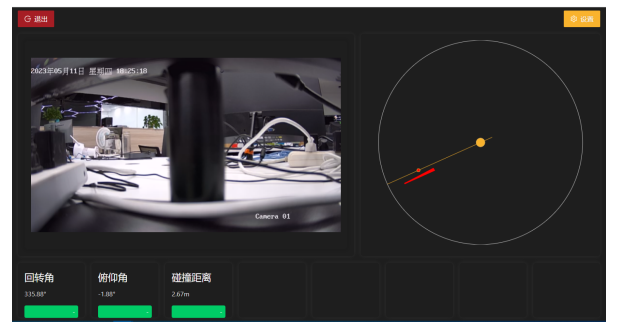

## 选型&回顾

基于边缘网关上开发，软件实现方案：

**选型过程**

1. 整体程序结构： 主机程序（`GO-FYNE`） -> C/S架构 (`Electron`)-> C/S浏览器

> GO-FYNE 没有找到Go技术栈视频播放和绘图组件库
>
> C/S Electron 构建和发布问题
>
> C/S浏览器：用户需要先打开浏览器输入网址进入。退出方法修改为直接kill浏览器进程
>
> 其他：考虑过Android/C#等开发。

2. 推流选型：选取的开源GB视频推流服务 m7s -> ZLMediaKit -> WVP -> m7s

> m7s容器化部署在开发板上运行，出现异常退出的问题，不稳定
>
> ZLMediaKit 需要搭配WVP使用，直接对接口开发接口难度大
>
> WVP体量较大，放弃
>
> 选型回到m7s, 目前在windows工控机上表现良好

3. 播放组件：`flv.js` -> `jessibuca`

> flv.js播放延迟较高，后选用`kessibuca`，延迟能控制到(1~3秒)，但是内存暂用较高。

4. 部署环境：从飞凌开发板 -> Windows工控机（4核8G）

> 在飞凌上的`firefox`中播放视频时，CPU占用高卡顿严重。
>
> 边缘网关无散热系统
>
> 购买外部工控机，目前运作性能满足。

## 问题&发展

目前在工控机上功能和稳定性测试正常。但是还存在运维难度大、内容展示简单的问题。有业务调查的问题，也有结构设计的问题。

以下是目前主要问题: 

> 3、电子罗盘和倾角数据采样频率太慢，需要调整到1HZ； 责任人：殷伟文 （待完成）
>
> 4、吊机图形显示界面可视化效果差，需要优化，最好先把吊机周围的地形地貌先扫描出来形成点云，再把三维吊机放在上面显示； 责任人：殷伟文 （待完成）
> 5、数据存储、历史数据查看功能完善； 责任人：殷伟文 （待完成）
>
> 6、一体机显示屏增加防强光挡光设计； 责任人：徐辉辉 （待完成）
>
> 7、激光雷达考虑增加散热设计；责任人：徐辉辉 （待完成）

内容上主要是丰富内容和三维展示吊机状态的需求。

另外，构建和部署方面，目前问题

> 应为是windows工控机无容器环境，几个程序都是手动打包后拷贝的。（188）
>
> 之前在arm上发布容器，也没有环境直接构建出镜像。（nodejs无问题，主要是golang的交叉编译Cross-Compile）
>
> 另外，arm容器中的限制

在架构上，以下是考虑的几种方向：

1. 继续沿用工控机，但是程序会做整合打包（至少部署和看门狗），如果继续使用C/S架构也要能保证程序长时间运行在界面前端。所以，后续推荐修改为Electron打包部署方式。（过度方案）
2. 继续沿用飞凌开发板的网关系统，用Android系统开发UI界面。这是最优的方案，从现场使用着立场来看，Android作为驾驶舱中的用户交互的最佳体验（输入、触摸、摄像头等）。 但是目前开发的go采集服务和接口，需要适配Android系统。（最总方案）

## 反思&总结

1. 在arm架构中开发程序限制还是较多的，包括构建和部署（jenkins打包之类）。这个在前期占用了较大的时间精力

   > 特殊项目环境必须尽早识别。保证项目尽快上线，可以提前准备备选方案（类似此次改为Windows工控机）

2. 这是一个与硬件绑定较深的开发项目，尽量尽快在本地搭建和使用场景完全一致的测试环境。才能尽早发现问题。

   > 因为没有搭建视频和雷达同时的环境，性能问题没有尽早发现。
   >
   > 软件的开发基于硬件环境，选型需要把它考虑进去，性能分析也是重中之重。

3. 容器虽然简化了部署，但是和操作系统、硬件交互部分，带来不便。

   > 比如：串口需要映射的问题、声音播放的问题
   >
   > 目前还需要在外部部署一个代理程序，考虑其他部署方式

4. Linux上开发UI展示程序，尤其这种单机项目，要更多考虑用户场景，形成一套程序方案。

