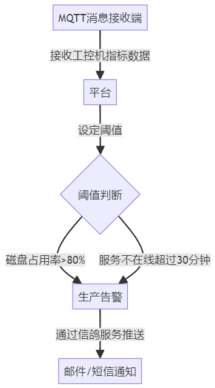
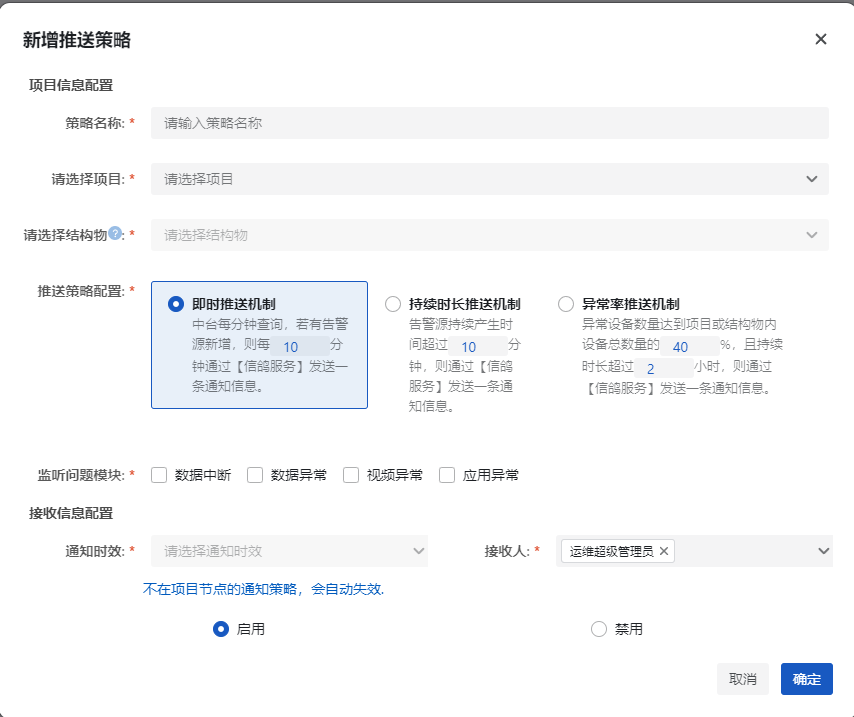

## 硬盘容量监控方案 & 监控软件关闭后告警通知方案

### 项目背景

随着公司物联网项目的快速发展，越来越多的项目需要远程本地化部署。在这些部署中，采集工控机是数据汇聚的核心，现场运行多种采集软件（如统一采集、振动采集、称重采集等），还可能包含第三方软件。为了有效维护大量分布在不同项目中的设备，我们需要关注现场磁盘使用情况、程序运行状态，及时发现并处理异常情况（如程序宕机等）。

目前，现场工控机上部署的看门口软件 **FS-Check** 已经被广泛使用。为了不影响现有的稳定功能，我们将基于 **FS-Check** 进行功能升级，重点增加磁盘容量监控及程序异常告警功能。

本方案适用于以下几种典型部署环境：

1. **Windows 工控机**
2. **Linux 工控机**（部署 mk8s）
3. **Windows 工控机 + Docker 环境**
4. **Windows 工控机 + Linux 虚拟机环境**

本方案采用 **CS 架构**，云端负责收集监控指标并进行预警。工控机必须具备网络访问能力。程序拟用 **Golang** 实现，保证跨平台兼容性和轻量化运行。

### 系统架构

系统主要由客户端的代理程序 **FS-Check** 和后端服务 **FS-POMS-OpsCenter** 组成：

- **客户端 FS-Check**：部署在工控机上，负责收集并上传监控数据（磁盘容量、程序状态等）。
- **服务端 OpsCenter**：运维平台的一部分，负责接收客户端的数据，并通过信鸽服务发送告警通知。运维基础信息存储在 PostgreSQL，性能指标存储在 Clickhouse。

### 客户端监控功能

客户端通过 **MQTT + JSON** 协议向云端传输数据，主要包括以下几类监控内容：

1. **心跳**
   - 确保工控机和看门狗程序正常运行。
   - 若心跳丢失，及时告知运维工程师。
   - 服务端使用 Prometheus 监控各客户端连接状态（1-在线，0-离线）。
2. **服务运行状态**
   - **Windows 工控机**：汇报当前运行的程序清单，包括内存、CPU 使用情况。部分进程可进行定制化监控（如 `NGEtService.exe`、`DAAS.exe`、`UDAS.exe` 等），并返回特定的配置信息（如磁盘目录使用情况、设备在线情况等）。
   - **Linux 工控机**：通过 mk8s API 对进程进行控制操作（重启、升级等）。
   - 支持远程配置修改和服务手动重启（触发 kill 关闭）。
3. **系统监控指标**
   - 返回工控机的整体运行情况，包括机器型号、CPU/内存/磁盘配额等。
   - 对实时内存、CPU 使用情况进行监控，特别是磁盘容量预警。
4. **远程指令**
   - 支持通过协议远程执行指令。
   - **Windows** 工控机通过特定方案实现远程指令下发。
   - **Linux** 工控机通过 FRP 穿透实现远程操作。
5. **文件传输**
   - 支持通过 FTP 或七牛云存储进行文件传输。
6. **远程升级**
   - 在文件传输基础功能上，支持快速升级远程进程。
7. **数据同步联动**
   - 与现有本地化系统的数据同步功能联动，实现快速部署数据同步功能。

### 服务端功能

服务端是运维中台（POMS）的一部分，主要功能包括：

1. **客户端管理**：收集客户端的唯一编号、项目归属、机器位置等基本信息。

   客户端在运维中台中进行管理，与项目进行绑定。

2. **指标收集与存储**：通过 Prometheus 收集各客户端的状态和性能指标，存储在 Clickhouse 中，便于后续分析和告警。

3. **告警通知**：通过信鸽服务发送异常告警，支持自定义告警规则（如磁盘容量超限、程序异常等）。

   

### 关键技术

1. **Prometheus + Clickhouse**：用于监控和存储客户端的性能指标。
2. **MQTT + JSON**：轻量化协议，保证数据传输高效。
3. **Golang**：实现跨平台支持，运行轻量化，不影响工控机性能。
4. **FRP 内网穿透技术**，实现工控机远程访问或远程指令下发

### 方案总结

本方案在确保现有 **FS-Check** 稳定运行的基础上，增加了硬盘容量监控、程序状态监控及远程操作功能。通过云端的运维平台收集数据并及时告警，帮助运维团队轻松管理大量现场设备。

以下是一些草图设计

<!DOCTYPE html>
<html lang="zh">
<head>
  <meta charset="UTF-8">
  <meta name="viewport" content="width=device-width, initial-scale=1.0">
  
</head>
<body>
  <h4>工控机监控界面</h4
      >
  <table>
      <thead>
          <tr>
              <th>位置</th>
              <th>代号</th>
              <th>在线情况</th>
              <th>异常情况</th>
              <th>操作</th>
          </tr>
      </thead>
      <tbody>
          <tr>
              <td>xxx边坡</td>
              <td>IC-001</td>
              <td>在线</td>
              <td>无</td>
              <td class="operation"><button class="button">运维</button></td>
          </tr>
          <tr>
              <td>xxx大桥左幅南侧机箱</td>
              <td>IC-002</td>
              <td>离线</td>
              <td>程序状态异常</td>
              <td class="operation"><button class="button">运维</button></td>
          </tr>
          <tr>
              <td>xxx政务机房</td>
              <td>IC-003</td>
              <td>在线</td>
              <td>无</td>
              <td class="operation"><button class="button">运维</button></td>
          </tr>
      </tbody>
  </table>
</body>
</html>

在运维中台的信鸽服务中，增加相关类型的告警推送策略：

