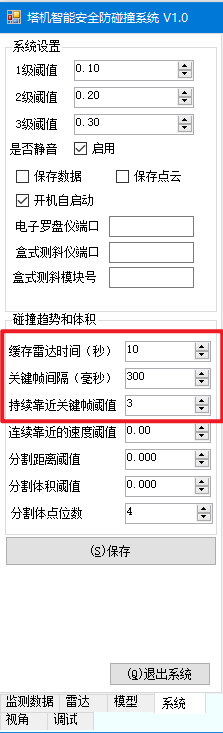
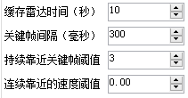
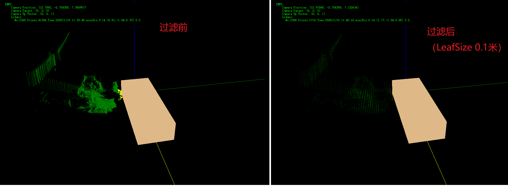

## 碰撞趋势和小体积障碍物过滤

> 背景：
>
> 塔吊防碰撞系统在海上平台部署时，出现扰动情况，导致异常告警。

软件算法进行如下优化

1. 碰撞趋势： 当大臂接近障碍物过程，激光雷达测得位移逐步减小，仅在有靠近趋势下进行报警和开关量输出
2. 小体积障碍物过滤：个别毛刺点云（或抖动造成部分排查区域外泄），使用障碍物体积计算和阈值判断进行过滤可避免这部分的扰动。

### 一、 碰撞趋势

控制项包括：

1. 缓存雷达时间：这个默认不需要改动（10s，程序连续缓存10s的雷达数据）
2. 关键帧间隔：单位毫秒。（一般取300~1000）表示多长时间取一次雷达数据作为变化趋势计算关键帧。（不用原始频率计算，是因为高频采集下，如果是低速运动可能位移变化较小，趋势不明显）
3. 连续靠近关键帧阈值：必须大于1。几个关键帧都有靠近趋势，判定大臂有像障碍物逼近的趋势。
4. 连续靠近的速度阈值：配置负数。默认0表示不对速度进行任何限制，只要是逼近障碍物趋势及判定。可以设置任意负数，比如-3,表示大臂靠近障碍物的线速度>-3m/s才认为是逼近趋势。

推荐配置：

### 二、小体积过滤

对比了几个方法：

| **方法**                             | **算法实现难度** | **时间复杂度**                    | **优点**                                         | **缺点**                                 |
| ------------------------------------ | ---------------- | --------------------------------- | ------------------------------------------------ | ---------------------------------------- |
| **区域生长（Region Growing）**       | 中等             | O(N²)（最坏情况）                 | 适用于不规则形状，基于相似性分割，能处理复杂形状 | 对噪声敏感，速度较慢                     |
| **DBSCAN**                           | 中等             | O(N log N)（最佳），O(N²)（最坏） | 能处理噪声，自动检测簇，适应任意形状             | 对参数敏感，最坏情况下较慢               |
| **体素网格过滤（VoxelGrid Filter）** | 低               | O(N)                              | 非常高效，简单实现，适用于大规模点云数据         | 精度较低，可能丢失细节，尤其是小体积对象 |
| **KD-Tree**                          | 高               | O(log N)（查询）                  | 高效的邻域查询，适用于大规模高维数据             | 对高维数据不一定高效，树构建时间较长     |

目前软件实现了 前三个算法，但在实际使用过程中，区域生长、DBSCAN无法达到`ms`级别，不适用于我们防碰撞场景。

> 如果要应用DBSCAN需要配置：
>
> 【系统】>【碰撞趋势和体积】 配置以下项目：
>
> 1. 分割距离阈值（Epsilon, ε） [SegmentDis]
>
>    分割距离阈值决定了点与点之间是否属于同一簇的距离范围。也就是说，**ε** 是一个球形区域的半径，若两个点之间的距离小于或等于该值，则认为它们属于同一个簇。
>
> 2. 分割体积阈值（Minimum Volume, V_min） [SegmentVol]
>
>    这个参数决定了簇必须包含的最小体积，只有大于此体积的簇才会被视为有效簇。体积可以通过对簇中点的空间分布进行计算（例如，计算凸包、外接盒体积等）来得出。
>
> 3. 分割体点位数（Min Points, MinPts） [SegmentPoints]
>
>    分割体积阈值决定了一个簇中至少需要包含多少个点才能被认为是有效的簇。如果一个簇中的点数少于 **MinPts**，则该簇会被视为噪声或小体积区域。

**体素网格过滤（VoxelGrid Filter）**使用说明：

> 注意：VoxelGridFilter过滤是一种常用的 **下采样**（Downsampling）技术，广泛用于处理点云数据，尤其在处理大型点云数据集时非常有效。它通过将点云划分成规则的网格（体素），并用每个体素的代表点代替其中的多个点，从而减少点云的体积和复杂度，同时尽量保持点云的主要形状特征。
>
> 所以，VoxelGridFilter可能会损失一部分精度。

【雷达】界面中属性选中【**VoxelGridLeafSize**】分叶的大小（单位米）

【系统】>【碰撞趋势和体积】中设置【分割体点位数】。 这个表示每个叶子中至少有多少个点，才认为是一个合理的障碍物点云叶子。以此过滤小体积毛刺。

效果：

点位数： 41000 -> 2500

本次测量最小距离：0.14m -> 0.14m

计算时间：40ms -> 12ms