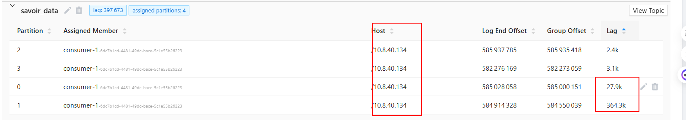

移走ES节点&恢复ES





dac-15上

```log

2024/12/04 09:34:26.604742 metrics.go:39: INFO Non-zero metrics in the last 30s: libbeat.logstash.call_count.PublishEvents=1 libbeat.logstash.publish.read_bytes=6 libbeat.logstash.publish.read_errors=1 libbeat.logstash.publish.write_bytes=13158 libbeat.logstash.published_and_acked_events=163 libbeat.logstash.published_but_not_acked_events=1740
2024/12/04 09:34:47.727249 sync.go:85: ERR Failed to publish events caused by: read tcp 10.244.2.69:41288->10.98.119.198:5044: i/o timeout
2024/12/04 09:34:47.727277 single.go:91: INFO Error publishing events (retrying): read tcp 10.244.2.69:41288->10.98.119.198:5044: i/o timeout
2024/12/04 09:34:56.604730 metrics.go:39: INFO Non-zero metrics in the last 30s: libbeat.logstash.call_count.PublishEvents=1 libbeat.logstash.publish.read_errors=1 libbeat.logstash.publish.write_bytes=4330 libbeat.logstash.published_and_acked_events=73 libbeat.logstash.published_but_not_acked_events=1667
```


logstash报错：

```log

09:40:50.530 [[main]>worker14] INFO  logstash.outputs.elasticsearch - retrying failed action with response code: 429 ({"type"=>"es_rejected_execution_exception", "reason"=>"rejected execution of processing of [16692458][indices:data/write/bulk[s][p]]: request: BulkShardRequest [[iota-log-2024.12.04][2]] containing [41] requests, target allocation id: GqBYu4f4QSejFIbW15jNeA, primary term: 1 on EsThreadPoolExecutor[name = es-n6/write, queue capacity = 1000, org.elasticsearch.common.util.concurrent.EsThreadPoolExecutor@13f4dbbc[Running, pool size = 33, active threads = 33, queued tasks = 179486, completed tasks = 22977990]]"})
09:40:50.530 [[main]>worker14] INFO  logstash.outputs.elasticsearch - Retrying individual bulk actions that failed or were rejected by the previous bulk request. {:count=>41}
```


Kibana上看到