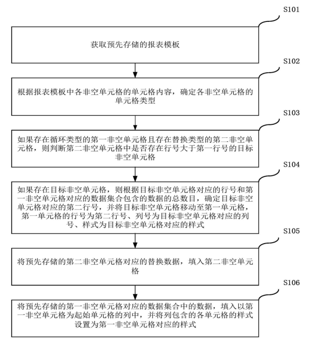
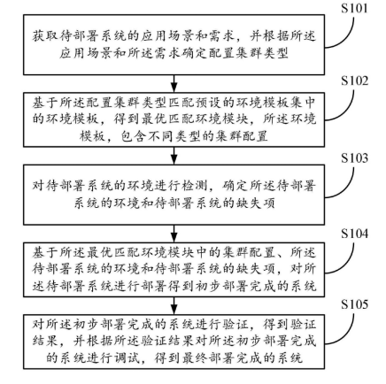

竞品公司

1. 基康仪器

   公司官网：https://www.geokon.com.cn/

   基康仪器股份有限公司创立于1998年，是一家专业从事智能监测终端的研发、生产与销售，同时提供安全监测物联网解决方案及服务的专精特新“小巨人”企业，产品主要用于工程安全监测及野外环境监测领域。

   公司自主知识产权产品在水电站、核电站、风电场、油气储运、水利工程、地铁、高铁、桥梁、隧洞、港口码头、市政建筑、文物、矿山、地质灾害等应用领域中得到了广泛应用，其中包括三峡、白鹤滩，南水北调、小浪底水利工程，港珠澳大桥，大连湾海底隧道，云南地质灾害监测预警、中国天眼等项目。公司以优越的产品质量和及时有效的技术服务赢得了广大用户的认可和信赖，致力于成为一家受人尊敬的企业。

2. 西安敏文

   公司官网：http://www.min-win.com/

   西安敏文测控科技有限公司专业为行业用户提供结构安全在线智能监测一站式服务，致力于将测绘技术应用于结构安全监测领域，是国内领先的高新技术企业。公司位于环境优美的西安市航天基地产业园，依托武汉大学测绘学科的技术优势，核心团队均为行业高科技人才。经过多年的技术积累，目前公司在智能交通及健康监测领域已完成了产品研发阶段，多项核心技术拥有自主知识产权，在同行业中处于绝对的领先地位，并已实现产业化。

   本公司基于嵌入式系统、云端软件和人工智能（AI）、识别技术与普适计算等技术手段的融合，专注于物联网、智能监测领域。主要从事新型传感器、结构安全监测系统和高端工业级测量无人机的研发、生产和销售。现广泛应用于智能交通、轨道交通、智慧城市、智慧港口等方向，为市政、地铁、矿山、水利工程、地质灾害、特种设备、港口等九大行业客户提供技术咨询、方案设计、系统运维、数据评估等全方位技术服务。公司自主研发的智能采集系统和运维软件平台已完成桥梁、隧道、边坡、地铁等基础设施30余座，涉及陕西、济南、甘肃、佛山、厦门、辽宁、安徽、武汉、宁波、福建等省市。并已同深圳大学、中交养护集团、桥科院、长江水利委等建立了长期战略合作关系。

3. 智博联

   公司官网：https://www.zbl.cn/

   北京智博联科技股份有限公司（以下简称公司）成立于2002年，注册资本3960万元。公司于2014年完成股份改制，并于同年正式在新三板挂牌。公司是经北京市科委认定的高新技术企业、中关村科技园区“瞪羚计划重点培育企业”、中国土木工程学会无损检测专业委员会委员单位、中国交通试验检测工作委员会委员单位。

     公司长期从事建设工程无损检测和在线安全监测技术方法研究，并进行相关智能检测仪器及系统的开发、生产和销售。公司服务于建筑、交通、铁路、水利、物探、电力、高校及其它多个领域，可为客户提供自主研发的ZBL-U5 系列非金属超声检测仪、ZBL-R6 系列混凝土钢筋检测仪、ZBL-P8 系列基桩动测仪、ZBL-Y 系列智能张拉应力检测仪、高支模实时监测报警系统等共十余类三十多种产品，并提供 “工程检测信息化管理系统”和 “工程施工及运营在线安全监测系统”。先后获得发明专利、软件著作权、实用新型专利、外观设计专利等知识产权一百多项。

4. 北京源清慧虹信息科技有限公司

   公司官网：http://www.smartbow.net/

   北京源清慧虹信息科技有限公司是由清华大学孵化的国家级高新技术企业，2013年成立至今，专注于工业互联网技术创新应用，服务于交通、城市应急、能源环境、文旅、水利等多个行业。

   

5. 南京峟思工程仪器有限*公司*

   公司官网：http://www.njysiot.com/

   南京峟思工程仪器有限公司坐落于南京市高新开发区江北新区。公司专注于岩土工程安全监测智能仪器、智能仪表、振弦式传感器、自动化监测软件、云平台的自主研发、生产及销售。公司研发的安全监测传感器、自动化数据采集设备及数据采集系统被广泛应用于大坝、隧道、边坡、桥梁、尾矿库、市政、建筑、地铁等行业，并为用户提供包含咨询、研发、集成在内的全方位售前、售后信息技术服务。

   公司产品经过多年积累和完善，形成了一整套从感知系统(传感器)、采集传输系统(MCU系列自动化采集设备)到云端展示系统(峟思云平台)的全方位解决方案。传感器涵盖振弦式传感器(振弦式渗压计、振弦式位移计、振弦式应变计、振弦式钢筋计、振弦式土压力计、振弦式锚索测力计等，均支持参数识别，识别距离大于1800米)、智能传感器(量水堰计、固定测斜仪、倾斜仪、高精度水位计、静力水准仪、温湿度计等)。自动化采集设备涵盖(1、4、8、16、20、32、40通道)单功能、全功能版本，拥有行业领先的全隔离测量，防雷设计，支持4G/5G全网通、WIFI、低功耗LORA、蓝牙等多种通讯方式。采集软件以云平台为主，友好的第三方数据对接接口，同时支持单机版、客户端。

   峟思秉承“始于用户的需求、终于用户的满意”为宗旨，致力为合作伙伴提供更好的物联网、云计算、智能结构安全监测系统。

   

6.  南京葛南

   公司官网：https://www.njgn.com/

    南京葛南实业有限公司及其南京葛南智能物联有限公司(下称公司)，葛南实业创建于1998年3月，自有甲级办公楼2500平米，是专业从事岩土工程安全监测传感器、采集系统、云平台的研发、生产、销售、服务的高科技型企业，南京葛南智能物联有限公司为国家级高新技术企业。

    公司现有发明及实用专利、软件著作权、质量体系等荣誉资质90余项，是国家级高新技术企业、江苏省民营科技企业、江苏省科技型中小企业、江苏省五星级上云企业，参加起草国家标准GB/T13606-2007《振弦式传感器通用技术条件》、JJF1401-2013《振弦式频率读数仪校准规范》、DL/T1104-2009《电位器式仪器测量仪》、DL/T1135-2009《电位器式位移计》、参加编纂《岩土工程安全监测手册》，是中国水利大坝安全专业委员会委员。 

   公司产品三大类：智能传感器、自动化测量系统、云平台及软件，类别有：应变、应力、水位、压力、位移、温度、倾斜、沉降、标定设备、电缆及附件、测量仪表、自动化设备、环境量监测、云平台及软件，产品广泛应用于水利大坝、铁路隧道、基坑建筑、尾矿边坡、海洋闸门、桥梁构件、地质灾害等监测领域。

   ​    未来，公司仍将以创新投入为方向、用户需求为核心，执持“智能化、云平台、大数据”的科技趋势，用智能识别、智能诊断、智能混接、云平台监测、大数据分析的先进技术为您的岩土工程提供整体解决方案。

   

7. 浙江博远电子科技有限公司

   公司官网：https://boyuandianzi.com/

   浙江博远电子科技有限公司位于浙江省嘉兴市,主营业务为提供结构健康监测的系统解决方案，涉及桥梁、大坝、隧道、高速公路边坡、输电塔、高层结构、爆破振动等方面。拥有自主的硬件设备研发生产、工程施工、软件集成服务能力。公司通过嘉兴市政府的领军人才计划落户嘉兴市,通过高新技术企业认定,通过ISO9001认证,具有计量器具型式批准。近年来参与过合肥市智慧城市建设、佛山市智慧城市建设、虎门大桥、石济黄河铁路桥、商杭线芜湖长江大桥、石门水库大桥、普立特大桥、深圳地铁、长沙地铁、新疆吉林台一级水坝、金华九峰水库、天津大学超大型水下振动台基础、山西平遥文庙大成殿等一系列健康监测系统的设计、硬件供货、项目施工(部分);与国内众多桥梁监测单位，如长安大学、交通部公路科研院、铁科院、中铁大桥科学研究院、招商局重庆交通科研设计院等机构保持常年的合作关系。

   博远电子是一家高科技产业公司,拥有以博士团队为基础的专业技术力量,在传感技术、计量技术、信号分析处理、结构动力学特性分析技术领域汇集了一批具有科研院所背景的博士团队。拥有自主专利、软件著作数十项,并参与了一些结构健康监测、文物保护性监测的地方性标准和行业标准的编制工作。

【北京源清慧虹信息科技】专利分析：

1. 《基于CAN总线和无线通讯的桥梁结构健康监测系统》

   本实用新型提供了一种基于CAN总线和无线通讯的桥梁结构健康监测系统，包括：有线传感节点系统，用于采集桥梁内部各部位的振动、竖向位移、温度、应变、倾角；无线传感节点系统，用于采集桥面各部位的索力、倾角、风速风向；无线中继器，与无线传感节点系统连接，用于转发无线传感节点系统采集的数据；有线网关，与有线传感节点系统连接；无线网关，与无线中继器连接；服务器，与有线网关、无线网关连接，用于存储有线传感节点系统采集的数据和无线传感节点系统采集的数据；采用CAN总线和无线通讯两种方式进行通讯，布线少，设备成本低，系统稳定性好，后期维护成本也少。

2. 《基于单轴加速度传感器的倾角测量方法和装置》

   本申请涉及一种基于单轴加速度传感器的倾角测量方法和装置。该方法包括：获取第一传感器对应的第一单位向量、第二传感器对应的第二单位向量和目标物体对应的第三单位向量；接收在目标物体发生倾斜时第一传感器和第二传感器发送的第一倾斜夹角和第二倾斜夹角；根据第一单位向量、第二单位向量、第三单位向量、第一倾斜夹角、第二倾斜夹角、第一夹角、第二夹角和旋转公式，确定目标物体发生倾斜后第一传感器的第一z坐标对应的表达式和第二传感器的第二z坐标对应的表达式；根据第一z坐标表达式和第二z坐标表达式，确定第三倾斜夹角的近似解；如果第三倾斜夹角大于预设的倾斜角度阈值，则输出告警信息。采用本方法能够检测物体的倾斜程度。

3. 《一种监测钢结构疲劳损伤的方法及装置》

   本发明公开了一种监测钢结构疲劳损伤的方法及装置，其中方法包括：利用传感器以预设频率测量预设时间内目标钢结构的基准应变峰值，并将基准应变峰值传至服务器；通过服务器根据基准应变峰值建立目标钢结构的应变散列表，并将应变散列表传至传感器中存储；再将传感器采集的应变数据与应变散列表中的基准数据进行映射而得出目标钢结构的疲劳损伤结果；最后将该疲劳损伤结果传送至服务器，可以降低无线传感网的传输功耗，并且提高无线传感网的工作效率。

4. 《报表的生成方法、装置、计算机设备和可读存储介质》

   本申请涉及一种报表的生成方法、装置、计算机设备和可读存储介质。该方法包括：根据报表模板中各非空单元格的单元格内容确定各非空单元格的单元格类型；如果存在循环类型的第一非空单元格和替换类型的第二非空单元格，则判断第二非空单元格中是否存在行号大于第一行号的目标非空单元格；根据目标非空单元格对应的行号和第一非空单元格对应的数据集合包含的数据的总数目，确定目标非空单元格对应的第二行号，并将目标非空单元格移动至行号为第二行号的第一单元格；将第二非空单元格对应的替换数据填入第二非空单元格；将第一非空单元格对应的数据集合中的数据，填入以第一非空单元格为起始单元格的列中。采用本申请可以提高报表生成的效率。

   专利的要点归纳如下：

   + 背景: 基于传统的读写技术，对于不同的数据，技术人员需要编写不同的程序代码，导致生成报表的效率低下
   + 获取预先存储的报表模板，所述报表模板包括多个非空单元格；
   + 根据所述报表模板中各非空单元格的单元格内容，确定所述各非空单元格的单元格类型，所述单元格类型包括循环类型和替换类型
   + 移动模块、填充模块

   

   专利提示：

   在自动化报表方面，我司目前的报表系统也有相关的技术积累可以提炼成专利

   + 报表模板读取，包含EXCEL和WORD的模板
   + 报表模板定义文件，采用json格式，可任意定义任意位置的填充
   + 支持表格样式复制，报表模板样式定义所见即所得
   + 报表数据源接口丰富，满足各类监测行业报表数据的需求（如累计位移计算、日变化速率计算等等）

5. 《一种基于低代码的桥梁结构健康监测系统》

   本发明提供了一种基于低代码的桥梁结构健康监测系统，包括：配置模块，用于获取监测对象的桥梁结构特征，基于桥梁结构特征确定对桥梁结构健康监测的目标监测要求，且基于目标监测要求对监测设备进行配置；数据接入模块，用于基于配置好的监测设备实时对监测对象进行监测，并获取监测数据，同时，将监测数据进行数据处理，获得目标监测数据；管理模块，用于对目标监测数据进行分析，并基于低代码对运维项目进行编辑，且基于运维项目对分析结果进行运维。保障对监测对象进行监测的准确性，保障数据的准确性以及缓解数据存储压力，快速创建一款桥梁监测管理软件，无需过分依赖IT人员，从而大大缩减时间成本和人力成本。

6. 《一种通用物联网数据处理系统》

   本发明提供一种通用物联网数据处理系统，包括：数据采集模块，用于采集设备上的数据信息，并将所采集到的数据信息进行封装处理后生成原始数据并发送至数据处理模块；数据处理模块，用于对原始数据进行解析、汇聚、计算处理后得到最终数据并上传至云平台模块，用于接收并存储最终数据；其中，数据采集模块、数据处理模块、云平台模块上预先加载有预设格式的配置文件。通过本发明，能够通过配置式的方式支持新设备的接入，避免了大量定制开发工作，同时能够统一多种传感器数据的处理，提高物联网系统的工作效率。

7. 《自动化部署方法、系统、设备和存储介质》

   本申请提供了一种自动化部署方法、系统、设备和存储介质，涉及数据处理领域。该方法包括：获取待部署系统的应用场景和需求，并根据应用场景和需求确定配置集群类型；基于配置集群类型匹配预设的环境模板集中的环境模板，得到最优匹配环境模块，对待部署系统的环境进行检测，确定待部署系统的环境和待部署系统的缺失项；基于最优匹配环境模块中的集群配置、待部署系统的环境和待部署系统的缺失项对待部署系统进行部署得到初步部署完成的系统，对初步部署完成的系统进行验证，得到验证结果，根据验证结果对初步部署完成的系统进行调试，得到最终部署完成的系统。解决了当前监测系统部署过程复杂低效、容错率低、迭代升级困难和维护难度的问题。

   主要要点归纳如下：

   + 随着监测设备种类和数量的增多，手动配置和部署监测系统变得越来越困难。人为运维困难
   + 基于匹配的环境模板和检测结果定制化地部署系统，可以弥补环境缺失
   + 当回归测试结果满足预设的调试验证条件时，得到最终部署完成的系统
   + 实时监测镜像IP地址的变化情况，若镜像IP地址变化，根据预设的自动化更新脚本自动更新注册IP地址集中的IP地址

   

   专利提示：

   在自动化部署和安装方面，江西飞尚科技也有不少的技术积累，现有的多款产品均支持一键化的安装部署和监控，满足长期在线监测复杂场景下的应用。其中主要产品有如下：

   安心云2.0平台（包含本地化）的“小护士”实现了自动化部署、监控和升级功能，同样具有：

   + 通过模板配置，针对不通的集群环境可以实现不同的配置清单，满足各类监测数据处理场景
   + 可以启动运行监控，
   + 可以进行部署升级，通过获取部署升级包进行离线升级
   + 在程序出现异常时可以通过邮件短信等方式进行告警

   同时2.0本地化实现了一键安装功能，也有自动化部署的功能：

   + 支持系统环境检测和基础依赖的自动安装
   + 支持程序模板化参数配置，满足各种定制场景，列入多种数据库类型
   + 支持安装进度和结果日志查看

   在安心云3.0本地化系统中，我们通过shell脚本配合k8s实现了一键化部署：

   + 支持离线和在线两种安装模式
   + 支持程序容器镜像一键化拉取和导入
   + 支持参数模板化配置可灵活修改
   + 依赖k8s的调度能力轻松监管所有服务运行

   

8. 《长期监测场景下的索力自适应识别方法》 审核中

   本发明提供了一种长期监测场景下的索力自适应识别方法，包括，基于索的结构参数，建立索的仿真模型，并基于所述仿真模型，得到索的理论前n阶频率，并仿真计算频率与索力之间的二次函数关系；通过对索的振动数据进行功率谱分析，提取功率谱上的峰值序列作为备选频率序列；将所述备选频率序列中的每一个频率假设为第1、2…n阶，计算该假设下的其他阶次频率理论值，根据所述备选频率序列与频率理论值之间的偏差，确定目标频点序列；基于所述目标频点序列，利用所述二次函数关系，求解得到索力值集合，并从所述索力值集合中选取出现概率最大的作为最终索力值；本发明实现频率阶次的准确识别，进而实现索力的准确识别。

   

