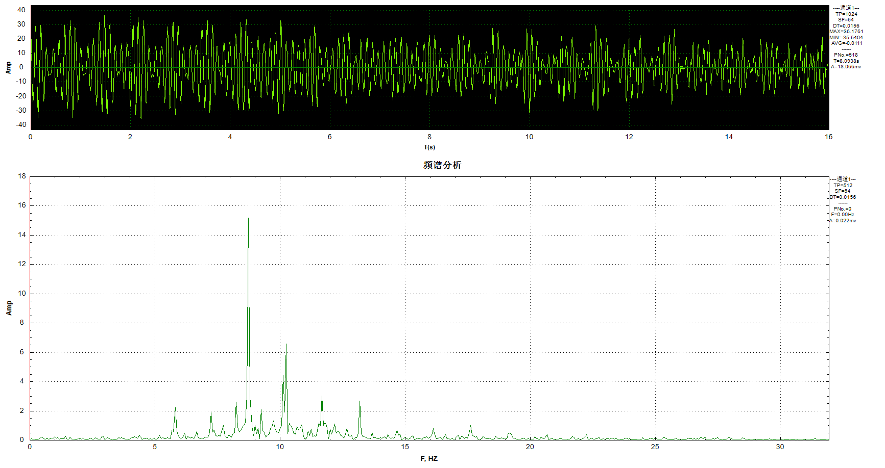
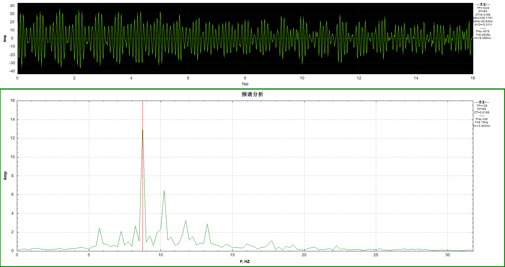
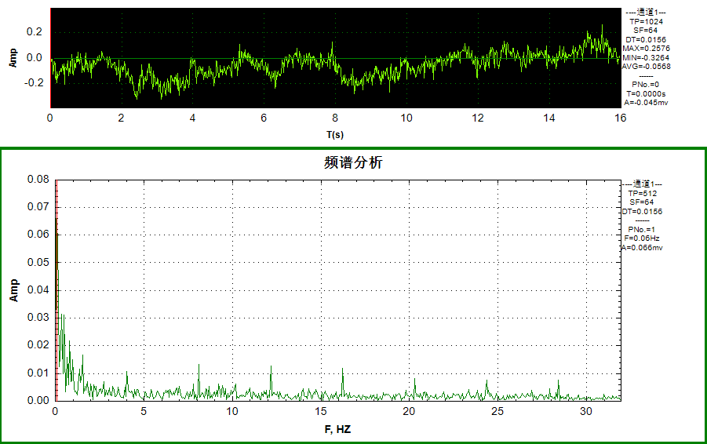
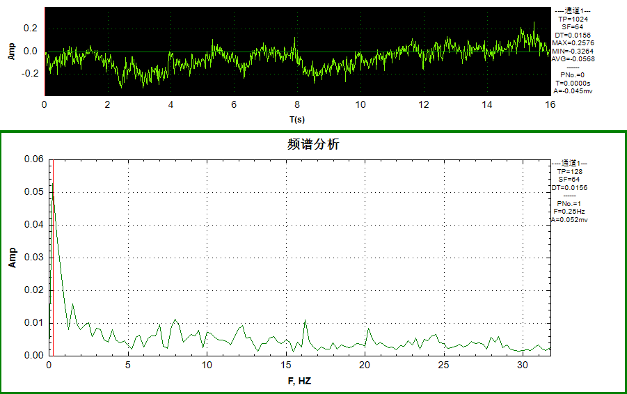
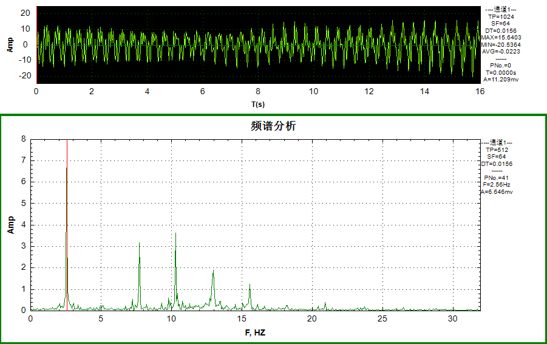
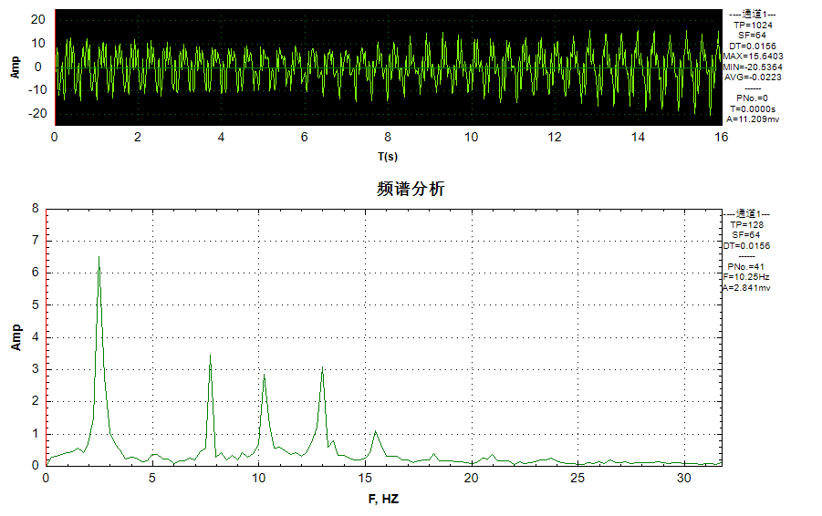

### 索力识别中频谱计算全量和分段平均差异对比

总结：通过使用DAAS分析软件中的【信号分析】【单通道分析】功能，对比南昌八一大桥现场索力测试数据的频谱。

> 1. 通过分段多次，可以获得更加平滑的频谱，平均可以去除部分噪声的影响，利于后期寻找谐波频率
> 2. 另外，需要保证基本的分析点数，才能保证识别到的峰值频率精度

以下是对比内容：

A.【25242-1通道 2023.9.22 0:27】

|                                       | 人工识别的基频 | 计算索力 |
| ------------------------------------- | -------------- | -------- |
| 【全量】数据采样频率64Hz 采样点数1024 | 1.47Hz         | 14916.   |
| 【256点 线性平均】                    | 1.5Hz          | 15532    |

【全量】数据采样频率64Hz 采样点数1024.

【256点 线性平均】

B.【25242-2通道 2023.9.22 0:27】

|                                       | 人工识别的基频 | 计算索力 |
| ------------------------------------- | -------------- | -------- |
| 【全量】数据采样频率64Hz 采样点数1024 | 未识别         | -        |
| 【256点 线性平均】                    | 未识别         | -        |

【全量】数据采样频率64Hz 采样点数1024.

【256点 线性平均】

C.【14799-5通道 2023.9.22 8:57】

|                                       | 人工识别的基频 | 计算索力 |
| ------------------------------------- | -------------- | -------- |
| 【全量】数据采样频率64Hz 采样点数1024 | 2.56           | -偏大    |
| 【256点 线性平均】                    | 2.50           | -偏大    |

【全量】数据采样频率64Hz 采样点数1024.

【256点 线性平均】

