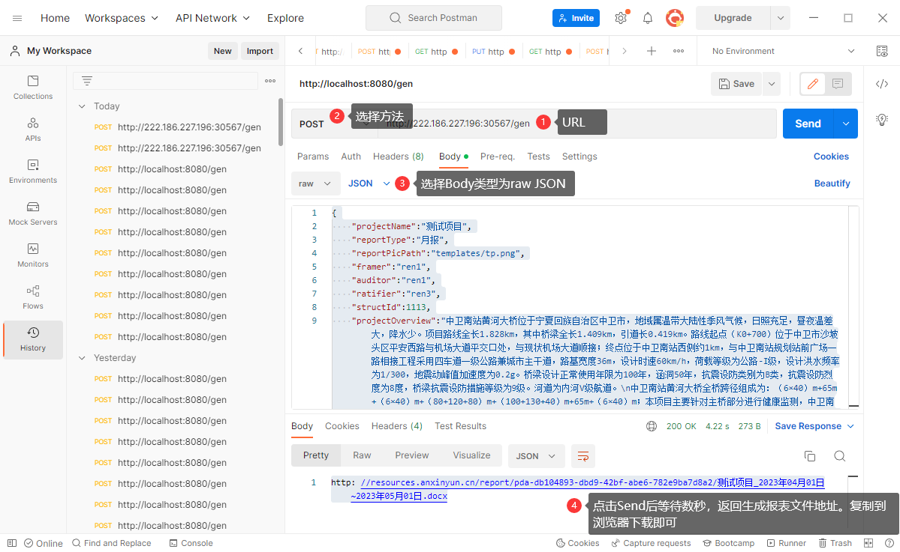

### 自动化报告功能试用说明

**目前仅支持接口调用**

接口地址: http://222.186.227.196:30567/gen

以下为`PostMan`调用示例：




### 参数说明

```json
{
    "projectName":"测试项目", //* 结构物名称
    "reportType":"月报", // 报表类型
    "reportPicPath":"templates/tp.png",  // 首页图片文件路径,支持网络图片地址，如 http://images.ngaiot.com/upload/things/ce2d7eb2-e56e-422e-8bbe-95dfa18e32f8/b552abeb-2622-4db8-bd68-1d5f42ea5c9b/dde96caa336fc-image.png
    "framer":"ren1", // 制定
    "auditor":"ren1",// 审核
    "ratifier":"ren3",// 批准
    "projectOverview":"中卫南站黄河大桥位于宁夏回族自治区中卫市，balabala", // 结构物描述
    "reportStartTime":"2023-04-01 00:00:00", // 报告开始时间
    "reportEndTime":"2023-05-01 00:00:00", // 报告结束时间
    "factors":[ // 配置监测因素
        {
            "codeName":"SLJC", // 监测因素代号 (WSDJC,FSFXJC,SSFJC,SLJC,YLYBJC,NDJC,ZDJC,CLZHJC,ZZWYJC,QTPWJC,LFJC,QDQXJC.JGWDJC)
            "pointDescrip":"索力的布点描述", // 布点描述
            "pointPicPath":"templates/tp.png", // 布点图片文件路径
            "factorDescrip":"", // 索力监测描述(需根据项目类型和设备区分，只有codeName=SLJC 时填)
            "sensorNames":[ // 需要展示的测点id和名称数组 Array(Map("id"->4596,"name"->"温湿度测点1"))。如果这个值不填，选择该监测因素下所有测点
                {
                    "name":"索力测点1"
                }
            ],
            "startTime":"2023-04-23 00:00:00", // 数据开始时间。如果这个值不填，使用报告开始时间
            "endTime":"2023-04-25 00:00:00", // 数据结束时间。如果这个值不填，使用报告结束时间
            "tempName":[ //  关联温度传感器(单个)和需要关联温度进行关联性分析的测点(变化量最大的测点)"，如果这个值不填，取设备自带的温度字段数据
                {
                    "name":"测点名称"
                }
            ],
            "initialTime":"2023-04-22 00:00:00", // 数据初始时间，用于获取测点初始值(例如索力、挠度、裂缝、桥墩倾斜)
            "glStaName":"", // 需要关联温度的测点名称
            "tempStaName":"", // 关联温度名称
            "releStartTime":null, // 关联显示开始时间
            "releEndTime":null, // 关联显示结束时间
        },
        {
            "codeName":"WSDJC" // 
        },
        {
            "codeName":"NDJC",
            "pointDescrip":"挠度的布点描述",
            "pointPicPath":"http://images.ngaiot.com/upload/things/ce2d7eb2-e56e-422e-8bbe-95dfa18e32f8/b552abeb-2622-4db8-bd68-1d5f42ea5c9b/dde96caa336fc-image.png",
            "factorDescrip":"",
            "sensorNames":[
                {
                    "name":"挠度测点1"
                }
            ],
            "startTime":"2023-04-23 00:00:00",
            "endTime":"2023-04-25 00:00:00",
            "tempName":[
                {
                    "name":"温度测点1"
                },
                {
                    "name":"挠度测点1"
                }
            ],
            "glStaName":"挠度测点1",
            "tempStaName":"温度测点1",
            "initialTime":"2023-04-22 00:00:00",
            "releStartTime":"2023-04-22 00:00:00",
            "releEndTime":"2023-04-25 00:00:00",
            "zdSensorName":"振动监测点名称"
        }
    ]
}
```

