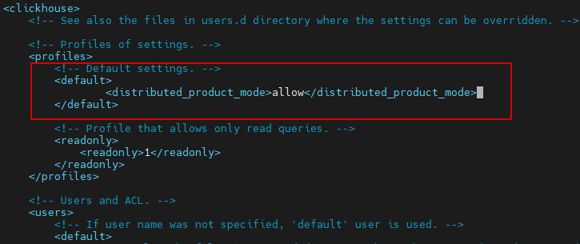
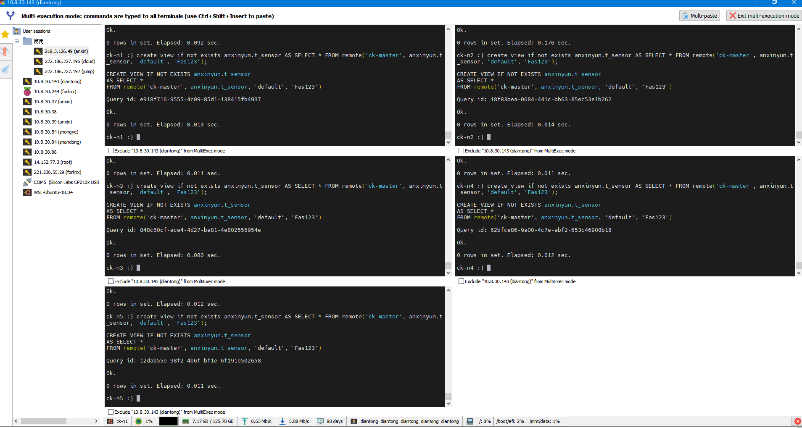

### 记一次CK迁移新集群的问题

由于老集群CK性能指标和容量都可能接近瓶颈，建立一个新的CK集群环境，如下：


然后修改所有应用服务的CK地址到ck-master。

迁移过程中，出现了以下一些问题：

1. PG不同步

   使用`MaterializedPostgreSQL`进行CK中PG数据库的同步：

   哪个数据库不同步，就去CK中删除后重建该数据库。

   ```sql
   -- 到指定数据库下：
   
   select * from pg_catalog.pg_publication;  
   
   DROP PUBLICATION "video-access_ch_publication";
   ```

   

2. 一些语法不再支持

   >  Unknown table expression identifier 'member' in scope SELECT 
   >
   > ```sql
   > SELECT hrMember.`member.pep_user_id` AS pepUserId, hrMember.*,
   >        user.name AS userName,
   >        user.people_code AS userCode,
   >        basicDataPost.name AS userPost,
   >        role.name AS roleName,
   >        role.id AS roleId,
   >        department.name AS depName, department.id AS depId, user.job AS userJob, user.active_status AS userActiveStatus, user.organization AS userOrganization
   > FROM (SELECT vacateDayStatistic.duration AS vacateDayStatisticDuration, vacateCountStatistic.count AS vacateCount, member.* FROM member
   >     INNER JOIN pepca.user AS user ON member.pep_user_id = user.id LEFT JOIN (SELECT vacate.pep_user_id AS pepUserId, sum(vacate_day.duration) AS duration
   >     FROM vacate_day INNER JOIN vacate ON vacate.id = vacate_day.vacate_id GROUP BY vacate.pep_user_id) AS vacateDayStatistic
   >         ON vacateDayStatistic.pepUserId = member.pep_user_id LEFT JOIN (SELECT vacate.pep_user_id AS pepUserId, countDistinct(pep_process_story_id) AS count
   >         FROM vacate GROUP BY vacate.pep_user_id) AS vacateCountStatistic ON vacateCountStatistic.pepUserId = member.pep_user_id WHERE member.del = '0'
   > ORDER BY user.people_code DESC LIMIT 0, 10) AS hrMember LEFT JOIN pepca.user AS user ON pepUserId = user.id LEFT JOIN pepca.user_role AS user_role
   >     ON pepca.user_role.user = user.id LEFT JOIN pepca.role AS role ON pepca.role.id = user_role.role LEFT JOIN pepca.basicdata_post AS basicDataPost
   >         ON pepca.basicdata_post.id = user.post LEFT JOIN pepca.department_user AS department_user ON department_user.user = user.id LEFT JOIN pepca.department
   >             AS department ON department.id = department_user.department;
   > ```
   >
   > 直接修改为： 
   >
   > ```sql
   > SELECT hrMember.`pep_user_id` ...
   > ```

3. 双重分布式操作禁止

   ```
   error: path: /alarm/data/list, error: Error: 500: Code: 288. DB::Exception: Double-distributed IN/JOIN subqueries is denied 
   (distributed_product_mode = 'deny'). You may rewrite query to use local tables in subqueries, or use GLOBAL keyword, or set distributed_product_mode to suitable value. (DISTRIBUTED_IN_JOIN_SUBQUERY_DENIED) (version 24.3.2.23 (official build))	
   ```

   `ChatGPT`:sa:

   >**调整查询**： 你可以尝试重写查询以避免在子查询中使用`IN`或`JOIN`。可能需要将子查询改为使用本地表。
   >
   >```
   >sql复制代码-- 原查询示例（可能存在问题）
   >SELECT *
   >FROM large_table
   >WHERE id IN (SELECT id FROM small_table);
   >
   >-- 修改后的查询（将子查询改为使用JOIN）
   >SELECT l.*
   >FROM large_table l
   >JOIN small_table s ON l.id = s.id;
   >```
   >
   >**使用`GLOBAL`关键字**： 如果你的数据库支持，可以使用`GLOBAL`关键字来允许在分布式环境中使用`IN`或`JOIN`子查询。例如：
   >
   >```
   >sql复制代码SELECT *
   >FROM large_table
   >WHERE id IN GLOBAL (SELECT id FROM small_table);
   >```
   >
   >**修改`distributed_product_mode`设置**： 如果你有权限修改数据库配置，可以将`distributed_product_mode`设置为`allow`，允许双重分布式操作。这通常需要访问数据库的配置文件或通过管理员界面进行设置。
   >
   >```
   >sql
   >复制代码
   >SET distributed_product_mode = 'allow';
   >```

   最终，我是到clickhouse的配置文件目录中修改`user.xml`，添加配置:

   

   

4. HTML Form Exception

   

   ZB: 因为IN语句中条件太多导致SQL过长，需要改写法。

   

5. DB not found

   JOIN查询时报错：

   ```sql
   select * from alarms
   LEFT JOIN anxinyun.t_structure on anxinyun.t_structure.id=alarms.StructureId
   LEFT JOIN anxinyun.t_alarm_code on anxinyun.t_alarm_code.code=alarms.AlarmTypeCode
   LEFT JOIN anxinyun.t_alarm_type on anxinyun.t_alarm_type.id=alarms.AlarmTypeId
   where SourceId='axy2.0:14598';
   ```

   报错如下：

   > ```
   > 2024-07-25T21:23:06.398497760+08:00 2024-07-25T13:23:06.398Z - error: path: /alarm/data/list, error: Error: Database anxinyun does not exist. Stack trace:\n\n0. DB::Exception::Exception(DB::Exception::MessageMasked&&, int, bool) @ 0x000000000cbcedbb\n1. DB::Exception::Exception<String>(int, FormatStringHelperImpl<std::type_identity<String>::type>, String&&) @ 0x000000000765c563\n2. DB::DatabaseCatalog::getDatabase(String const&) const @ 0x000000001055adf9\n3. DB::Context::resolveStorageID(DB::StorageID, DB::Context::StorageNamespace) const @ 0x00000000104be7f3\n4. DB::(anonymous namespace)::QueryAnalyzer::tryResolveTableIdentifierFromDatabaseCatalog(DB::Identifier const&, std::shared_ptr<DB::Context const>) @ 0x0000000010be5273\n5. DB::(anonymous namespace)::QueryAnalyzer::tryResolveIdentifier(DB::(anonymous namespace)::IdentifierLookup const&, DB::(anonymous namespace)::IdentifierResolveScope&, DB::(anonymous namespace)::IdentifierResolveSettings) @ 0x0000000010be0fd2\n6. DB::(anonymous namespace)::QueryAnalyzer::resolveQuery(std::shared_ptr<DB::IQueryTreeNode> const&, DB::(anonymous namespace)::IdentifierResolveScope&) @ 0x0000000010bc68bc\n7. DB::QueryAnalysisPass::run(std::shared_ptr<DB::IQueryTreeNode>&, std::shared_ptr<DB::Context const>) @ 0x0000000010bc4d25\n8. DB::QueryTreePassManager::run(std::shared_ptr<DB::IQueryTreeNode>, unsigned long) @ 0x0000000010bc3821\n9. DB::(anonymous namespace)::buildQueryTreeAndRunPasses(std::shared_ptr<DB::IAST> const&, DB::SelectQueryOptions const&, std::shared_ptr<DB::Context const> const&, std::shared_ptr<DB::IStorage> const&) (.llvm.17547086829861056443) @ 0x0000000010e541b8\n10. DB::InterpreterSelectQueryAnalyzer::InterpreterSelectQueryAnalyzer(std::shared_ptr<DB::IAST> const&, std::shared_ptr<DB::Context const> const&, DB::SelectQueryOptions const&) @ 0x0000000010e52fb1\n11. std::unique_ptr<DB::IInterpreter, std::default_delete<DB::IInterpreter>> std::__function::__policy_invoker<std::unique_ptr<DB::IInterpreter, std::default_delete<DB::IInterpreter>> (DB::InterpreterFactory::Arguments const&)>::__call_impl<std::__function::__default_alloc_func<DB::registerInterpreterSelectQueryAnalyzer(DB::InterpreterFactory&)::$_0, std::unique_ptr<DB::IInterpreter, std::default_delete<DB::IInterpreter>> (DB::InterpreterFactory::Arguments const&)>>(std::__function::__policy_storage const*, DB::InterpreterFactory::Arguments const&) (.llvm.17547086829861056443) @ 0x0000000010e55f8c\n12. DB::InterpreterFactory::get(std::shared_ptr<DB::IAST>&, std::shared_ptr<DB::Context>, DB::SelectQueryOptions const&) @ 0x0000000010de7ef9\n13. DB::executeQueryImpl(char const*, char const*, std::shared_ptr<DB::Context>, DB::QueryFlags, DB::QueryProcessingStage::Enum, DB::ReadBuffer*) @ 0x000000001126f9c8\n14. DB::executeQuery(String const&, std::shared_ptr<DB::Context>, DB::QueryFlags, DB::QueryProcessingStage::Enum) @ 0x000000001126bf9a\n15. DB::TCPHandler::runImpl() @ 0x0000000012351d84\n16. DB::TCPHandler::run() @ 0x000000001236d099\n17. Poco::Net::TCPServerConnection::start() @ 0x0000000014c9bef2\n18. Poco::Net::TCPServerDispatcher::run() @ 0x0000000014c9cd39\n19. Poco::PooledThread::run() @ 0x0000000014d954a1\n20. Poco::ThreadImpl::runnableEntry(void*) @ 0x0000000014d93a3d\n21. ? @ 0x00007febd7d22609\n22. ? @ 0x00007febd7c47353\n: While executing Remote. (UNKNOWN_DATABASE) (version 24.3.2.23 (official build))"
   > ```

   在DataGrip中查询复制出来的SQL语句，结果发现：

   

   在分布式节点上没有从PG同步过来的物化库（使用的是`MaterializedPostgreSQL`实验特性）。暂时的解决办法是在**每个节点**上创建主节点数据库表的视图：

   ```sql
   create database if not exists anxinyun;
   -- in anxinyun
   create view if not exists anxinyun.t_structure AS SELECT * FROM remote('ck-master', anxinyun.t_structure, 'default', 'Fas123');
   create view if not exists anxinyun.t_alarm_code AS SELECT * FROM remote('ck-master', anxinyun.t_alarm_code, 'default', 'Fas123');
   create view if not exists anxinyun.t_alarm_type AS SELECT * FROM remote('ck-master', anxinyun.t_alarm_type, 'default', 'Fas123');
   create view if not exists anxinyun.t_sensor AS SELECT * FROM remote('ck-master', anxinyun.t_sensor, 'default', 'Fas123');
   ```

   

   

   

6. 数据不同步问题，数据库处理步骤

   ```sql
   -- CK中执行：删除数据库
   drop database pepca;
   
   -- 创建物化同步库
   SET allow_experimental_database_materialized_postgresql=1;
   CREATE DATABASE IF NOT EXISTS pepca
   ENGINE = MaterializedPostgreSQL('10.8.40.210', 'pepca', 'postgres', 'postgres')
   SETTINGS materialized_postgresql_max_block_size = 65536,
           materialized_postgresql_schema = 'public';
           
   -- 查看数据表是否同步创建
   show tables in pepca;
   
   -- 当查询不到数据表的时候，需要到PostgreSQL数据库中执行以下语句：
   -- 到对应的PG数据库下查询
   select * from pg_catalog.pg_publication;  
   
   -- 在PG数据库中执行，删除对应的副本槽
   DROP PUBLICATION "video-access_ch_publication";
   
   ```

7. 数据表进入readonly模式

   <font color='red'>没有解决，重建表</font>

   https://kb.altinity.com/altinity-kb-setup-and-maintenance/suspiciously-many-broken-parts/

   https://github.com/ClickHouse/ClickHouse/issues/58126

   https://github.com/ClickHouse/ClickHouse/issues/58126

   https://kb.altinity.com/altinity-kb-useful-queries/detached-parts/

   **断电重启时出现问题**

   clickhouse 启动失败： <Error> alarm.themes_local (ReplicatedMergeTreeRestartingThread): Failed to restart the table. Will try again: Code: 84. DB::Exception: Directory /mnt/data/clickhouse/store/723/7233ee16-c4dc-4f3e-8e99-38898010ddbc/detached/covered-by-broken_202407_2022814_2031296_2509_try9 already exists and is not empty. (DIRECTORY_ALREADY_EXISTS), Stack trace (when copying this message, always include the lines below):

   ```sql
   SELECT *
   FROM system.replicas;
   ```

   查看其中列： "last_queue_update_exception" 确认是否还有recover文件存在问题。 另外查看 readonly列是否为0，为0表示恢复

   

   ClickHouse 启动失败，错误信息显示某个目录已经存在且不为空。这个错误通常发生在 ReplicatedMergeTree 表的重启过程中。解决此问题的步骤如下：

   1. **检查目录内容**： 检查报错提到的目录 `/mnt/data/clickhouse/store/723/7233ee16-c4dc-4f3e-8e99-38898010ddbc/detached/covered-by-broken_202407_2022814_2031296_2509_try9`，查看其内容。确认其中的文件和目录。

   2. **备份和删除冲突的目录**： 为防止数据丢失，先备份该目录，然后删除或移动这个冲突的目录。

      ```
      bash
      复制代码
      mv /mnt/data/clickhouse/store/723/7233ee16-c4dc-4f3e-8e99-38898010ddbc/detached/covered-by-broken_202407_2022814_2031296_2509_try9 /mnt/data/clickhouse/store/723/7233ee16-c4dc-4f3e-8e99-38898010ddbc/detached/backup_covered-by-broken_202407_2022814_2031296_2509_try9
      ```

   3. **尝试重新启动 ClickHouse**： 备份和删除冲突的目录后，重新启动 ClickHouse 服务。

      ```
      bash
      复制代码
      sudo systemctl restart clickhouse-server
      ```

   4. **检查日志文件**： 如果问题仍然存在，查看 ClickHouse 日志文件以获取更多详细信息，通常位于 `/var/log/clickhouse-server/clickhouse-server.log`。

   5. **修复元数据**： 如果以上步骤无效，可以尝试修复表的元数据。运行以下命令修复表：

      ```
      sql
      复制代码
      SYSTEM RESTART REPLICA database.table;
      ```

8. 