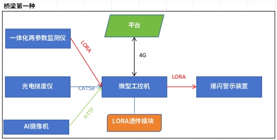
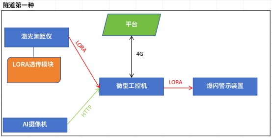
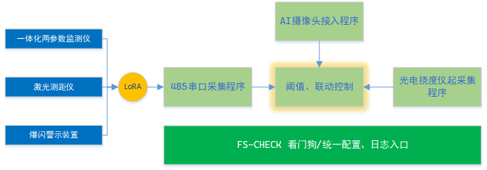

## 边缘端采集控制

### 背景

​	河北秦皇岛、承德、张家口桥隧坡监测预警项目中，五种场景中2种涉及【微型工控机】上，实现本地传感器数据的采集，以及告警逻辑判断，并驱动现场爆闪设备。






整体方案参见《桥隧坡监测预警需求说明文档》。本文档主要包括**微型工控机上的软件组成和数据流转标准，以指导边缘系统上软件开发和各个模块的集成。**


### 软件实现方案

软件系统框架如下图所示：



| 模块名               | 作用                                                         | 输入     | 输出                            |
| -------------------- | ------------------------------------------------------------ | -------- | ------------------------------- |
| AI摄像头接入程序     | 作HTTP服务端接收AI摄像头的数据                               |          | 监测数据                        |
| 串口采集程序         | 采集一体化两参数监测仪和激光采集仪，并支持下发控制爆闪装置（3个LoRA设备接入） |          | 1. 监测数据<br/>2. 能力下发接口 |
| 光电挠度仪起采集程序 | 接入光电挠度仪数据                                           |          | 监测数据                        |
| 阈值、联动控制       | 从消息通道种汇集各个传感器的数据，判断是否超阈值，并且支持调用爆闪 | 监测数据 |                                 |
| FS-CHECK 看门狗      | 看门狗服务、并提供统一配置、日志入口                         |          |                                 |
|                      |                                                              |          |                                 |

技术选型

| 内容     | 说明      |
| -------- | --------- |
| 开发语言 | Golang    |
| 消息框架 | MQTT+JSON |
|          |           |
|          |           |


数据输出MQTT JSON

```
type IotData struct {
   Id     string                 `json:"id"`
   Time   time.Time              `json:"time"`
   Data   map[string]interface{} `json:"data"`
}
```


能力调用HTTP （485采集程序支持即时能力调用）

POST http://localhost:2233/cap/invoke

Body: 

```json
{
    "id":"设备ID",
    "cap":"能力标识",
    "params":{
        "xx":"能力参数"
    }
}
```

