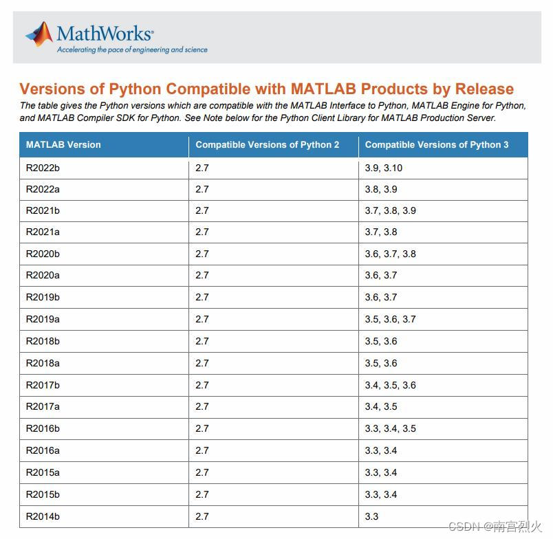
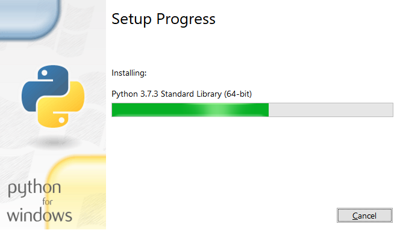
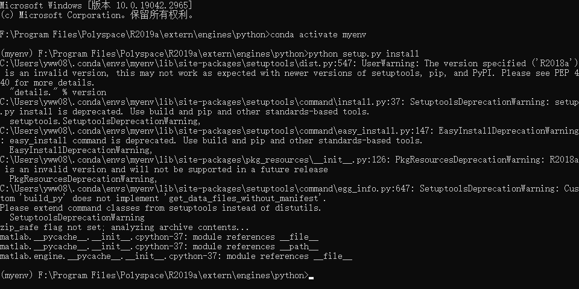
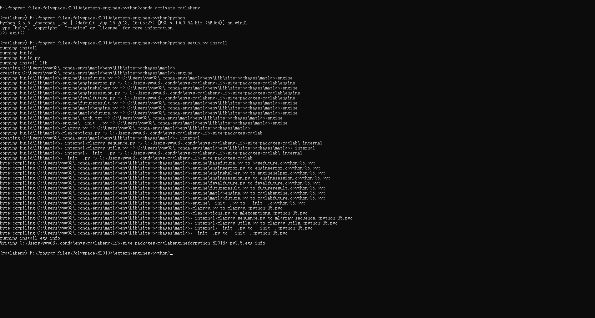

## 通过Python调用Matlab

在Windows10上安装64位的matlab;

https://mp.weixin.qq.com/s/_lEsW63poRYjAgXOwqDRWg

注意：ISO装载、离线安装、替换Crack中文件。


在MATLAB Engine API for Python提供了一个供Python调用MATLAB作为计算引擎的包。该引擎支持参考实现（CPython）。

各个版本的兼容情况



安装3.7版本的Python




因为我本机装了Anaconda，执行以下命令激活3.8的虚拟环境（到这个目录下执行）

```shell
F:\Program Files\Polyspace\R2019a\extern\engines\python
conda create --name matlabenv python=3.7
conda activate matlabenv
python setup.py install
```




出现问题：

```shell
setuptools.extern.packaging.version.InvalidVersion: Invalid version: 'R2018a'
```


重新制定**3.5**的python就可以了：



查看虚拟环境路径地址：

(matlabenv) F:\Program Files\Polyspace\R2019a\extern\engines\python>conda env list
# conda environments:

#
base                     C:\ProgramData\Anaconda3
matlabenv             *  C:\Users\yww08\.conda\envs\matlabenv
torch2                   C:\Users\yww08\.conda\envs\torch2

> 网上说需要把生成的lib拷贝到venv的Lib\Site-Package下 F:\Program Files\Polyspace\R2019a\extern\engines\python\build\lib\matlab\engine 。
>
> 但是我生成的默认就包含。下面开始写程序：


新建add.m

```matlab
function c=add(a,b)
    c=a+b;
end
```

新建pmatlab.py

```python
import matlab.engine
eng=matlab.engine.start_matlab()
c=eng.add(1,2)
print(c)
```

在这两个代码文件的文件夹下运行python程序（记得提前激活虚拟环境）

```shell
C:\Users\yww08\Desktop\资料\资料>conda activate matlabenv

(matlabenv) C:\Users\yww08\Desktop\资料\资料>python pmatlab.py
3
```


上实际项目：

