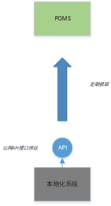
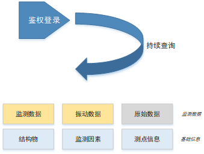

### 概述

通过调用安心云历史数据接口查询数据，并导入到运维中台clickhouse数据库中。




程序执行流程图如下：

类似爬虫程序的开发，通过Login接口进行登录验证。



```go
func GetDBdatas(safetyFactorType *ds.SafetyFactorType) (returnBodys [][]byte) {
   defer func() {
      if r := recover(); r != nil {
         log.Warn("获取数据失败；监测因素：%s %v", safetyFactorType.String(), r)
      }
   }()

   beginQueryTime := time.Now()
   if !isNeedQuery(safetyFactorType, beginQueryTime) {
      return nil
   }
   columnsName := safetyFactorType.ColumnsName
   columnsNames := strings.Split(columnsName, ",")

   execSQL := DB.GetDBSql(safetyFactorType)
   log.Info("查询数据库SQL:%s %s", safetyFactorType.String(), execSQL)
   rows, err := DB.Raw(execSQL).Rows()
   if err != nil {
      log.Warn("查询数据库失败%s %s", safetyFactorType.String(), err.Error())
   } else {
      columns, e := rows.Columns()
      if e != nil {
         log.Warn("获取列信息失败: %v", err)
         return nil
      }

      defer func() {
         if len(returnBodys) == 0 {
            // 没有查到数据，下次从当前时间一小时前开始查询
            DB.SetFactorSensorLatest(safetyFactorType.SafetyFactorId, time.Now().Add(-1*time.Hour))
            setEmptyQuery(safetyFactorType, beginQueryTime)
         }
         DB.SaveSensorLatest()
         log.Info("（￣︶￣）↗　查询完成 %s 共 %d 条记录", safetyFactorType.String(), len(returnBodys))
      }()
      // 创建一个与查询结果列对应的空接口切片
      values := make([]interface{}, len(columns))
      for i := range columns {
         values[i] = new(interface{})
      }
      var result = make(map[string]interface{})

      // 遍历查询结果
      for rows.Next() {
         // 扫描查询结果到接口切片中
         if err = rows.Scan(values...); err != nil {
            log.Warn("扫描查询结果失败: %v", err)
            continue
         }

         // 打印查询结果
         for i, column := range columns {
            value := *(values[i].(*interface{}))
            result[strings.ToLower(column)] = value
         }

         if result["acquisition_datetime"] == nil {
            continue
         }

         now := time.Now()
         var collectTime = result["acquisition_datetime"].(time.Time)
         //if config.ZoneOffset != 0 {
         // collectTime = collectTime.Add(time.Hour * config.ZoneOffset)
         //}
         if safetyFactorType.TimeColumnType != ds.DB_DATA_TYPE_TIMEWITHZONE { // 数据库
            collectTime = collectTime.Add(time.Hour * -8).In(time.Local)
         }
         DB.SetFactorSensorLatest(safetyFactorType.SafetyFactorId, collectTime)

         tempStruct := uploadDataStruct{
            Project: config.ProjectId,
            Tags: []string{
               config.ProjectId, "theme",
            },
            Version:     config.Version,
            TimeStamp:   now.Format("2006-01-02T15:04:05Z"),
            SensorId:    config.ProjectId + ":" + fmt.Sprintf("%d", result["sensor_id"].(int64)),
            CollectTime: collectTime,
         }

         // 获取数据列
         tempStruct.Values = GetValuesFromColumns(result, columnsNames...)
         // 序列化结构体为 JSON 字符串
         jsonData, err := json.Marshal(tempStruct)
         if err != nil {
            log.Warn("Failed to marshal struct to JSON: %v", err)
            continue
         }
         returnBodys = append(returnBodys, jsonData)
      }
   }
   return
}
```