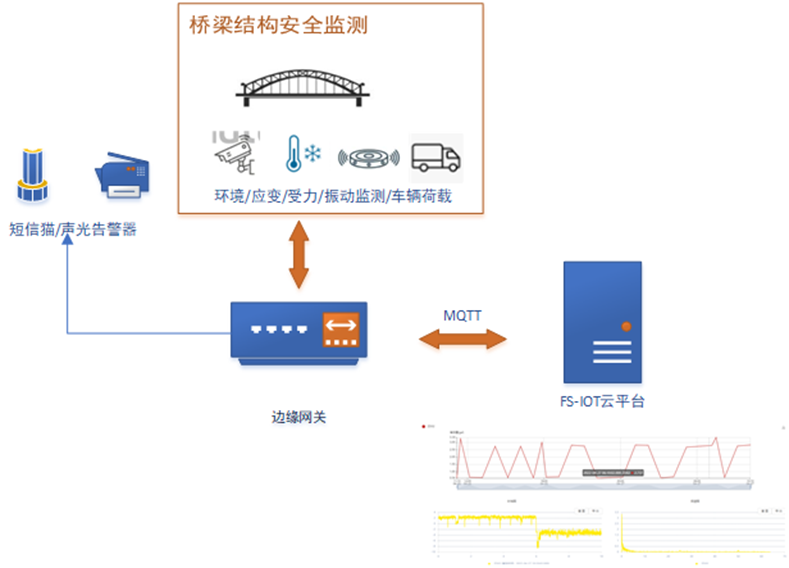
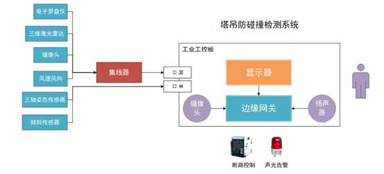

## 智能物联网关 FS-EDGE

基于⻜尚物联⽹云平台打造的边缘计算网关产品，集数据采集、传输存储、云边协同与一体，提供物联网数据接入和协同控制能力。

控制台地址：https://console.edge.ngaiot.com/

## 功能特性

1. 兼容性强

   支持与飞尚IoT物联平台协同工作，云端配置下发为边缘网关提供了海量的设备协议，并提供丰富的数据连接接口

2. 稳定性强

   容器化的部署方式保证连续稳定运行。看门口服务提供系统信息记录和状态日志服务，提供远程控制管理，并提供OTA在线固件升级保障。

3. 私密性强

   本地数据加密存储，数据传输支持MQTT加密传输，具有隐私保护、安全性高的有点

4. 强大的硬件性能

   高算力的嵌入式核心，单节点即可提供大量设备的汇集接入，支持高频动态数据的接入和动态存储

5. 轻量化

   轻量化的数据传输协议，有效降低网络流量，缓解流量压力、云端存储压力。

6. 更高效

   通过内网穿透对外提供访问接口，支持即时数据采集调试和远程运维功能

## 场景案例

提供边缘端数据接入和分发能力

### 应用领域

1. 结构物安全监测

   在桥梁安全监测场景下，边缘网关负责控制与设备间的协议通信和数据解析。数据通过边缘网关提取、清洗和加载，存储在本地的数据库中，同时会通过现场4G网络将数据回传IOT云平台。云平台上对桥梁监测点位进行配置，并将数据处理规则和告警条件下发到网关，网关处理数据后进行告警判断，当结构物安全发生告警时，可以通过现场的告警设备（短信猫/声光告警设备）发出报警。

   

2. 智慧公厕

   在智慧公厕场景下，边缘网关采集公厕下环境指标和人流量指标，并对数据进行存储。用户可以通过平台进行边缘网关采集策略的配置，网关的采集结果数据也同时连接到平台。在现场，配合大屏进行数据面板展示，实时更新当前公厕环境指标和人员流动情况。

   

   

3. 塔吊防碰撞系统

在塔吊防碰撞系统中，边缘网关扮演现场设备集成、数据采集、报警输出、反向控制的应用软件角色，集成了电子罗盘仪、三维激光雷达、摄像头等传感器设备，可通过有线网络部署集成，同时，网关上配套显示器支持塔吊运行期间轨迹展示，算法判断碰撞风险，并通过界面显示、扬声器等方式向外报警。集合网关的高性能，支持视频接入、人脸识别、断路器驱动等功能模块，发挥了强大的实时采集和控制能力。

