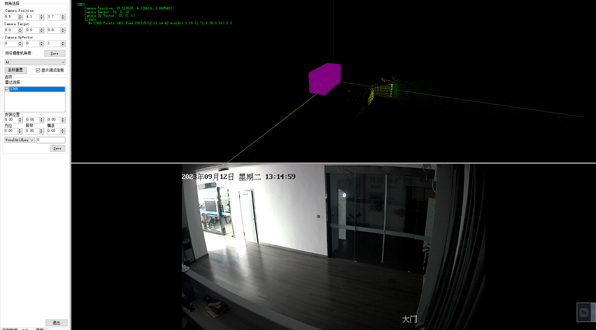

# 防碰撞系统优化方案

## 覆盖角度问题

现有用的是汽车级别 140度广角，目前工业级别最高精尖的；现场提到覆盖问题可以通过增加一台雷达满足要求，成本上我们再想办法控；
但是想用一台雷达满足所有角度的覆盖，目前技术上比基本较难达到；

三个雷达，能够覆盖水平面所有区域，安装在大臂前端，安装示意图如下：

雷达传感器的基本参数如下：

重新进行页面设计，展示雷达的三维区域和障碍物点云坐标。

## 防爆问题

客户需要明确具体防爆等级，明确后会通过防爆箱及其它辅材达到防爆要求；

## 传感器接入现场PLC问题

不建议这样做，如果这样做逻辑会比较复杂，现场原有的PLC设备也不一定支持；

需要提供PLC接口协议，将本系统的结果输出到PLC上。

