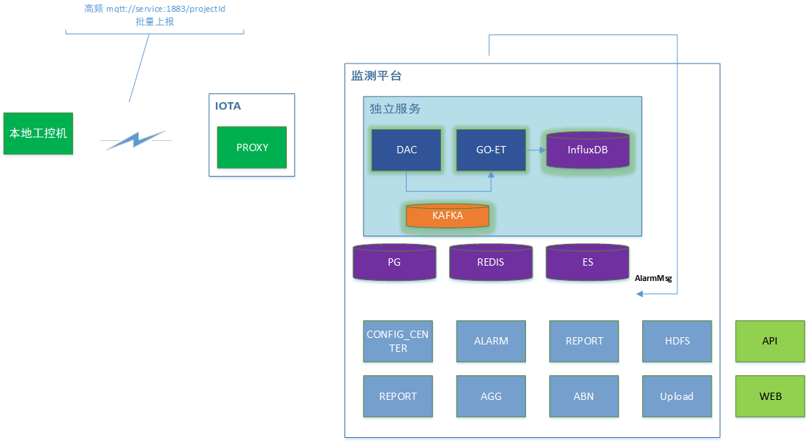

高频数据接入及多租户资源分配方法


总体思路： 在云上部署“轻量化本地化监测系统”，按资源收费，数据采集、存储部分单独部署，性能消耗小的部分使用云上公共服务。


用户使用场景：

用户可以创建资源包（类似`ECS`弹性云主机），选择不同规格的资源包。需要计入的资源：接入带宽、CPU、内存、存储量。

用户选择资源包后可以进行初始化，安装部署本独立系统。

用户在创建结构物的时候，用户可以选择“高性能资源包”，即进行结构物和资源包的绑定。

> 目前平台系统等价于“默认资源包”，不额外收费但接入但限制接入频率`1Hz`。

用户可以指定数据保存的时间，超出时间范围的数据将被清理（聚集数据不删除）


如何在k8s中进行多租户资源分配? (见附录)


服务端改造内容：



#### (一)、DAC

被纳入“资源包”中的结构物，从以太**编排器**中脱管，同时，对应资源包中DAC能够正确识别该Thing并纳入管理，DAC向Proxy发送注册。

这样，流量就会转发到对应资源包的`DAC`中。同时，因为该DAC没有被编排其纳管，所以`ZOOKEEPER`中没有该资源，DAC中需要修改获取资源分配的方法，以正确处理前端更新deploy时的通知消息。


#### (二)、GO-ET

需要达到性能指标要求。

数据存储到InfluxDB。

支持高频数据告警低频解析发送至告警进程。

流程简化：解析-计算-阈值-存储的基本流程


#### (三)、存储

以InfluxDB为存储媒介，按照监测因素存储采集时序数据。

InfluxDB中配置数据TTL，通过设置数据保留策略（Retention Policies）来实现。

自动配置持续聚集（Continuous Queries，CQ），将数据聚集保存到数据库中。


#### (四)、接口

根据结构物上的标志（是否与高性能资源包）确认数据源类型，并根据。

数据查询接口（最新数据、历史数据、聚集数据等），需支持InfluxDB


#### 附录

如何在k8s中进行多租户资源分配? 

1. **Namespace 隔离**：每个租户一个 `Namespace`。
2. **资源限制**：使用 `ResourceQuota` 和 `LimitRange` 约束资源。
3. **Helm/Operator 自动化管理**：动态创建 ETL 和 InfluxDB。
4. **监控 & 扩展**：使用 Prometheus + HPA 进行监控和自动扩展。

**推荐存储方案**：

- **数据量大**（TB 级以上）：**每个租户独立 InfluxDB**。
- **数据量小**（GB 级别）：**共享 InfluxDB，多租户数据库分隔**。


其中`ResourceQuota`可以实现对指定命名空间的资源限制：

```yaml
apiVersion: v1
kind: ResourceQuota
metadata:
  name: tenant-a-quota
  namespace: tenant-a
spec:
  hard:
    cpu: "2"
    memory: 4Gi
    persistentvolumeclaims: "5"
    requests.storage: 100Gi
```

> 通过`kubectl patch resourcequota tenant-a-quota -n tenant-a --type='merge' -p '{"spec":{"hard":{"cpu": "4", "memory": "8Gi", "requests.storage": "200Gi"}}}'`指令，可以动态调整资源分配。
>
> 查看当前资源使用情况：
>
> `kubectl get resourcequota -n tenant-a`