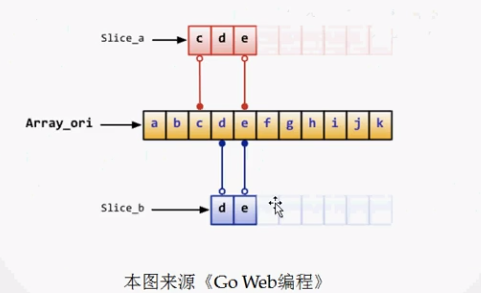
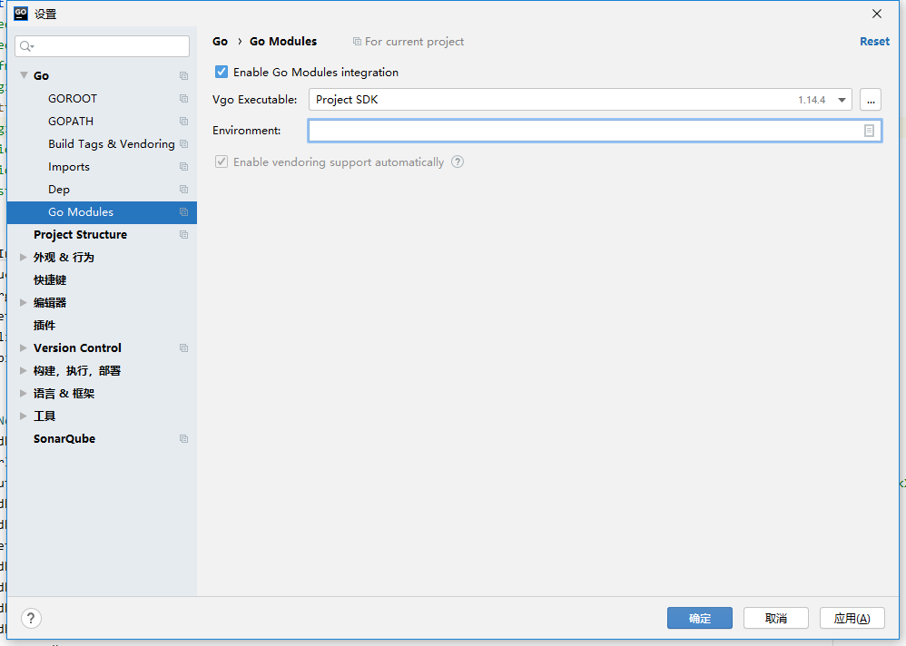
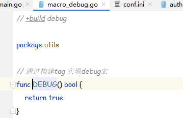
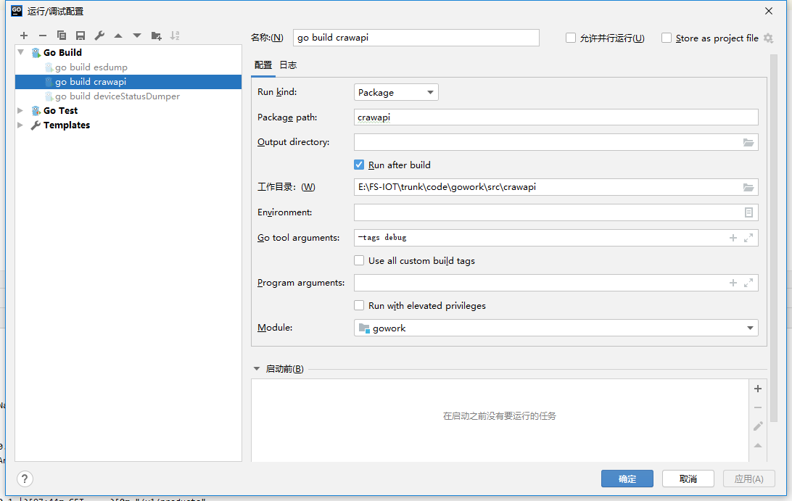

下载：https://go.dev/dl/ 或者 在 goland中GO> GOROOT > + > Download中下载（默认下载到c:\users\xx\go\go1.16目录下）


# Day 1


## why go?


+ 编译速度快。语言容易解析，编译轻快。

+ Go语法清晰和容易理解。

+ Go是一门强静态类型语言。

+ Go更好地支持`并发编程`。

+ Go提供两个集合类型： slices (引用变长数组)和 maps (key-value hashes或dictionaries)。

+ Go支持过程编程（procedural programming）和面向对象编程（object-oriented programming）。

+ Go 可扩展编程+快速编译，应用在分布式系统和多核网络。

## 环境安装

[Go中文](https://studygolang.com/)

安装后设置环境变量

```shell
GOROOT ： go安装的位置； $GOROOT\bin 加入系统路径

GOPATH :  go程序所在的位置
    src 项目源文件
    bin 编译后的可执行文件
    pkg 编译后的包文件
```

`提示缺少gcc`，需要安装 [mingw-w64-install.exe](www.baidu.com)

## IDE

### GOLAND

[pojie2020](\\10.8.30.117\h\安装文件)


### visual studio code
    ~~~

----------

## HelloWorld


```golang
package main

import (
    "fmt"
)

func main() {
    fmt.Print("hello go")
}
```

# Day 2

## GO cmds

1. go get

    `包管理器`
    
     = `git clone`  +  `go install`
    
2. go build
3. go run
4. go package
5. go install

## [go-callvis](go-callvis) 代码分析工具
Requirements
+ Go 1.12+
+ [Graphviz](http://www.graphviz.org/download/)
  
    apt install graphviz

Installation
+ go get -u github.com/ofabry/go-callvis
+ `or`
+ git clone https://github.com/ofabry/go-callvis.git
  
    cd go-callvis && make install

+ 手动下载安装在linux下报错：

    `GIT_DISCOVERY_ACROSS_FILESYSTEM not set, fatal: You are on a branch yet to be born`

    cd dir

    git init

    git remote add origin https://github.com/ofabry/go-callvis.git

    git fetch

Usage
+ 检出代码 
  
    svn checkout http://10.8.30.22/Iota --username yinweiwen
+ 执行命令

    ```shell
    C:\Users\yww08>go-callvis -group pkg,type -focus main E:\Iota\trunk\code\gowork\src\iota
        2020/07/09 14:26:47 http serving at http://localhost:7878
        2020/07/09 14:26:47 converting dot to svg..
        生成svg可能要等待数分钟
    ```
    访问 http://localhost:7878
    


    生成图片
    ```shell
    go-callvis -group pkg,type -focus main E:\Iota\trunk\code\gowork\src\iota | dot -Tpng -o xxx.png
    
    上面只生成main包的调用情况，下面这条指令生成所有
    
    go-callvis -group pkg,type -file all.png -focus "" -limit iota/ -include iota/ -nostd E:\Iota\trunk\code\gowork\src\iota
    ```
    
    以太dac代码结构如图：
    


​    
--------

以下是[网易云学堂 GO](https://study.163.com/course/courseLearn.htm?courseId=306002#/learn/video?lessonId=421015&courseId=306002)学习笔记：

# Day 3


## 类型与变量

补充说明：
`type newint int `并不能说是`int`的别名，称之为自定义类型，他们底层的数据结构相同。

这两个是别名：`byte` -> `uint8`  `rune`->`int32`

不是别名的话，需要调用显示转化

上堂作业
```go
func main(){
    var a int =65
    b:=string(a)
    fmt.Println(b)
}

## A

import (
    strconv
)

strconv.Itoa(65) -> '65' <数字转字符串>

strconv.Atoi("64") -> 65
```


常量的定义：
+ 在编译时就确定
+ 数据格式和变量基本相同
+ 右侧必须是常量或常量表达式
+ 常量表达式中的函数必须是内置函数

```go
const (
    a int = 1
    test="123"
    length=len(test)
    num=a*20
)


const (
    a = 1
    b
    c
)

const (
    a,b =1,"2"
    c,d
)

// go的枚举 -- 使用常量‘
// iota 是常量计数器，从0开始，没遇到一个const关键字重置
const (
    a= iota
    b
    c
)

const (
    a= 'A'
    b=iota
    c=iota
    d
)
```

### 运算符

```go
! ^
* / % << >> & &^
== != < <= >= >
<- (专用于channel)
&& 
||
```

作业:
尝试结合iota和<<运算实现计算机存储单位

```go
const (
    _ = iota
    KB ByteSize = 1 << (10*iota)
    MB
    GB
    TB
    PB
    EB
    ZB
    YB
)
func (b ByteSize) String() string{
    switch {
        case b >= YB:
            return fmt.Sprintf("%.2fYB",b/YB)
        case b >= ZB:
            return fmt.Sprintf("%.2fZB",b/ZB)
        case b >= EB:
            return fmt.Sprintf("%.2fEB",b/EB)
        case b >= PB:
            return fmt.Sprintf("%.2fPB",b/PB)
        case b >= TB:
            return fmt.Sprintf("%.2fTB",b/TB)
        case b >= GB:
            return fmt.Sprintf("%.2fGB",b/GB)
        case b >= MB:
            return fmt.Sprintf("%.2fMB",b/MB)
        case b >= KB:
            return fmt.Sprintf("%.2fKB",b/KB)

    }
    return fmt.Sprintf("%.2fB",b)
}
```

## 控制语句

补充：
___指针___ go中保留了指针，但不支持指针运算符以及(->)运算符，而是直接使用“.“来操作指针的对象。
- & 取变量地址 * 通过指针访问目标对象
- 默认值为 `nil ` 而非 NULL
```go
a:=1
vap p *int=&a
println(*p)
```

在GO中，++和--是作为语句而并不是作为表达式
```go
a=a++  (X)
```


## 判断语句IF
```go
if a:=1;a>1{

}


a:=10
if a:=1;a>1{
    fmt.Println(a)
}
fmt.Println(a)
// 10
```

## 循环语句for

```go
// 1.无限循环
a:=1
for{
    a++
    if a>3{
        break;
    }
    ...
}

// 2.有限循环
for a<=3{
    ...
}>

// 3.经典循环
for i:=0;i>3;i++{
    //
}
```
## 选择语句switch

- 可以选择任何类型和表达式作为条件语句
- 不需要写break，条件满足自动终止
- 若希望继续执行下一条case，使用fallthrough语句
- 支持一个初始表达式，右侧需跟分号
```go
a:=1
switch a {
    case 0:
        ...
    default:
        ...
}

switch {
    case a>=0:
        ...
        fallthrough
    case ...
}


```

__控制语句中定义的变量`作用域`仅在控制语句范围内__ 

## 跳转语句 goto break continue
- 可以配合标签使用
- goto是调整执行位置，和break/continue执行结果不相同
```go
LABLE1:
    for {
        for {
            if i>3 {
                break LABEL1 // 跳出最外层循环
                // 如果这里使用goto，程序会跳转到LABEL1位置继续执行形成无限循环
            }
        }
    }
```

# Day 4

## 数组 array
- 长度是类型的一部分
- `值类型`
```go
var a [2]int
b:=[20]int{19:1} // 索引19的元素为1
c:=[...]int{2,3,4,12:2}

pa := [...]*int{&a,&7} // 指针数组

fmt.Println(a==b) // 数组对比（长度必须一样）

p:= new ([10]int) // 指向数组的指针

a:=[2][3]int{
    {1,2,3},
    {2,3,4}
} // 多维数组
```

## 切片 slice
- 底层指向一个数组
- 为引用类型
- 如果多个slice指向相同底层数组，其中一个值改变会影响全部
- make([]T,len,cap) cap<容量>可省略
```go
a:=[10]int{} // 这是定义一个数组

s1:=[]int{1,2,3} // 这是定义一个slice

s1:=a[5:10] // 从数组获取一个slice [ )
// a[:] a[5:]

s1:=make([]int,3,6)

s2:=s1[1:2] // reslice ： cap()是底层数组的容量，不要越界
```

```go
s1 = append (s1,1,2,3) // append超出cap后自动扩容，注意扩容后指针地址会改变，对其元素的改变不会再影响远slice/array中元素值

copy(s1,s2) // s2 -> s1
copy(s1[2:4],s2[1,3])

```

# Day 5
## map
- key必须是支持==或!=比较运算的类型
```go
m:= map[int]string

m:= make(map[int]string)

m[1]="OK"

delete(m,1)

if a,ok:=m[1];ok { // 获取元素 ok表示存在该key

}

for i,v:=range slice {
    // i=index v=value
}

for k,v:=range map {

}

// slice 排序
import "sort"
sort.Ints(slice)

```

## 函数 function
- `不支持` __嵌套__ 、__重载__、__默认参数__
- `支持` 无需声明原型、不定长变参、多值返回、命名返回、匿名函数、闭包
- 函数可以作为一种类型使用
```go
func A(a ,c int) (int,string){

}

func A() (a,b,c int) { // 命名返回
}

func A(a ...int) { // 变长参数；和传递slice类似，但·它是值拷贝传递·
}

a:=A // 函数（一切）皆类型

a:=func(){
    ...
}
func(){}() // 匿名函数

/**
* 闭包
**/
func closure(x int) func(int) int{
    return func(y int) int{
        return x+y
    }
}

```
### defer
- 按`相反顺序`执行（类似析构函数）（通常执行资源清理、流关闭等操作）
- 函数发生严重错误也会执行(异常处理)

```go
fmt.Println(1)
defer fmt.Println(2)
defer fmt.Println(3)
// 1 3 2

// 闭包和defer
for i:=0;i<3;i++ {
    defer func() {
        fmt.Println(i)
    }()
}
// 3 3 3 闭包中传入的是i的指针
```

- panic/recover (recover必须在defer中调用)
```go
func A() {
    defer func(){
        if err:=recover();err!=nil {
            ...
        }
    }()

    ...

    panic("...")
}
```

# Day 6

## 结构 struct
- GO struct ~= C struct ... 代替 class的作用 面向对象
- `值类型`

```go
// 类型定义
type Person struct {
    Name string
    Age int
}

a := Person{Name:"joe"}

// 匿名结构
a := struct {
    Name string
}{
    Name: "joe"
}

// 嵌套中的匿名结构
type Person struct {
    Name string
    Age int
    Contact struct {
        Phone,City string
    }
}

a := Person {
    Name :"joe"
}
a.Contact.Phone="13213242123"

// 匿名字段
type Person struct {
    string
    int
}

// 值类型对比
b:=Person("joe",1)
if a==b {

}

// `继承`
type teacher struct {
    Person
    Class string
}
t:=teacher{Person:Person{Name:"tc",Age:20},Class:"English"}
t.Name="yinweiwen" // 支持匿名字段中属性的直接调用
```
[作者的小网站](http://gowalker.org)

## 方法 method

- 通过显示说明`receiver`来实现与某个类型的组合 （receiver语法糖，他是函数的第一个参数）
- Receiver可以是类型的值或者指针
- 不存在方法重载
- 类型别名不会拥有底层类型所附带的方法
- 方法可以调用结构中的非公开字段(小写字符开头的)

```go
// 指针传递写法
func (a *A) Function(){
    a.Name=""
    ... 
}

// 类型别名方法
type TZ int
func (a *TZ) X(){
    ...
}

var a TZ
a.X
(*TZ).X(&a)
```

# Day 7
## 接口 interface
- 接口是n个方法签名的集合
- 某个类型实现了所有方法签名，即算实现该接口(Structual Typing)
-  可以匿名嵌入其他接口或结构中
- 空接口可作为任何类型类型的容器

```go
type Connecter interface {
    Connect()
}

type USB interface {
    Name() string
    Connecter // 嵌入接口
}

type PhoneConnecter struct{
    Name string
}

func (pc PhoneConnecter) Name() string {
    return pc.Name
}
func (pc PhoneConnecter) Connect() {
    ...
}

// 空接口
func Disconnect(usb interface{}) {
    if pc,ok:=usb.(PhoneConnecter);ok {
        ... // 类型判断
    }

    switch v:=usb.(type){ // swiitch 类型选择
        case PhoneConnecter:
            ...
    }

    USB(usb).Connect() // 强制类型转换
}
```

# Day 8
## 反射 reflectioin
- TypeOf ValueOf
- 反射会将匿名字段作为独立字段（匿名字段本质）
- 想要利用反射修改对象状态，前提是interface.data是settable，即 pointer-interface
```go
import "reflect"

type User struct {
    Id int
    Name string
}

type Manager struct {
    User // 匿名字段
    title string 
}

func (u User) Hello(name string){
    ...
}

func Info(o interface{}){
    t:=reflect.TypeOf(o)

    if k:=t.Kind();k!=reflect.Struct {
        ... // 传入参数的非结构体
        return
    }

    v:=reflect.ValueOf(o)

    for i:=0;i<t.NumField();i++ {
        f:=t.Field(i) // 按索引取字段
        val:=v.Field(i).interface() // 获取值
    }

    for i:=0;i<t.NumMethod();i++ {
        m:=t.Method(i) // 按索引取方法
    }

    // 匿名字段
    t.FieldByIndex([]int{0,0}) // 取出Manager中User的Id字段
}

func x(){
    // 对基本类型的操作
    x:=123
    v:=reflect.ValueOf(&x)
    v.Elem().SetInt(999)
}

// 修改结构体中字段 (必须传入Pointer-Interface,即示例中传入 '*user' )
func Mod(o interface{}){
    v:=reflect.ValueOf(o)
    if v.Kind()==reflect.Ptr && !v.Elem().CanSet() {
        ...
        return
    }else{
        v=v.Elem() // v和v.Elem都是reflect.Value对象，所以这里可以直接赋值
    }

    f:=v.FieldByName("Name")
    if(!f.IsValid()){
        ...
        return
    }
    if f.Kind()==reflect.String {
        f.SetString("BYE")
    }
}

// 调用方法
func x(u User){
    v:=reflect.ValueOf(u)
    mv:=v.MethodByName("Hello")
    args:=[]reflect.Value{reflect.ValueOf("joe")}
    mv.Call(args)
}
```

# Day 9
## 并发 concurrency
- 协程 goroutine (每个实例4~5kb，高效实现高并发)
- `Concurrency Is Not Parallelism` 并发不是并行 
(并发是通过切换时间片来实现*同时*运行，而并行则是直接利用计算机的多核实现多线程的运行)

启动一个协程
```go
package main

import (
    "fmt"
    "time"
)
func main() {
    go Go()
    time.Sleep(2*time.Second)
}

func Go(){
    ...
}
```

___Goroutine奉行通过通信来共享内存，而不是共享内存来通信___ 即 `Channel` 机制

## Channel
- 类似unix中的管道(pipe) 先进先出 线程安全
- channel 是 goroutine沟通的桥梁
- make创建 close关闭
- channel是引用类型
- 可以通过for range来迭代不断操作channel
- 可以设置单向或双向通道
- 可以设置缓存大小，在未被填满前不会发生阻塞

简单应用
```go
package main

import (
    "fmt"
)
func main() {
    c:=make(chan bool) // 创建一个channel
    go func(){
        ...
        c <- true // 为channel传入一个值
    }()
    <-c // 取出channel中的值(阻塞)
}
```

for-range应用
```go
func main() {
    c:=make(chan bool)
    go func(){
        ...
        c <- true
        ...
        close(c)
    }()

    for v:= range c { // 一直迭代取c通道中的信号，直至通道被关闭
        ...
    }
}
```
单向/双向通道
```go
var readChan <-chan int // 只读
var writeChan chan<- int // 只写
```
缓存大小

`channel分为无缓存和有缓存两种，无缓存的channel是同步阻塞的，有缓存的channel是异步的`
> No Buffer: By default, sends and receives block until the other side is ready

> With Buffer: Sends to a buffered channel block only when the buffer is full. Receives block when the buffer is empty.
```go
func main() {
    c:=make(chan bool 1) // 设置一个缓存长度为1的channel
    go func(){
        ... // 这里不会执行，主线程c被写入后退出。但如果c是无缓存的，这里依旧会执行
        <- c
    }()
    c<-true
}
```
新手 __坑__ 
```go
package main
import (
    "fmt"
    "runtime"
)

func main(){
    runtime.GOMAXPROCS(runtime.NumCPU()) // 设置多线程
    c:=make(chan bool)
    for i:=0;i<10;i++ {
        go Go(c,i)
    }
    <- c
}

func Go(c chan bool,index int) {
    ... // do some cost thing

    if index==9 { // last goroutine
        c <- true 
    }
    // 错误： 因为设置了多线程执行，这里index=9的不一定是最后一个执行的goroutine，从而导致所有任务没有全部完成就退出

    // 解决思路：
    // 1.设置缓存长度10的channel
    // 2.sync.WaitGroup 方法
}
```

## Select
- 可处理一个或`多个`channel的发送和接收
- 同时有多个可用的channel时按随机顺序处理
- 可用空的select来阻塞main函数
- 可设置超时

举个栗子
```go
select 用于多个channel监听并收发消息，当任何一个case满足条件则会执行，若没有可执行的case，就会执行default，如果没有default，程序就会阻塞。
// 语法示例：
select {
case i := <-c:
    // use i
default:
    // receiving from c would block
}

// for select 例子
// 读取channel1和channel2中的数据直到某个通道被关闭
exitChan:= make(chan bool)
for {
    select {
        case v,ok <- c1:
            if !ok{
                exitChan <- true
                break
            }
            ...
        case v,ok <- c2:
            if !ok{
                exitChan <- true
                break
            }
            ...
    }
}
<-exitChan

// select 实现超时
select {
    case v:<-c:
        ...
    case <- time.After(3*time.Second):
        ... // time out
}
```
延伸阅读

- [goroutine背后的系统知识](https://blog.csdn.net/bytxl/article/details/47339043)
- [Advanced Go Concurrency Patterns]()
- [What exactly does runtime.Gosched do?]()


# Go Mod

Golang新的包管理方式mod介绍，参考文章 [简书](https://www.jianshu.com/p/760c97ff644c)

在Go>1.12版本以后可以使用。

需设置环境变量：

```sh
GO111MODULE=auto // on - 始终使用go.mod里require的包
GOPROXY=https://goproxy.cn,direct // 使用七牛云的
```

go mod 命令使用说明

```sh
Usage:
    go mod <command> [arguments]

The commands are:

    download    download modules to local cache
    edit        edit go.mod from tools or scripts
    graph       print module requirement graph
    init        initialize new module in current directory
    tidy        add missing and remove unused modules
    vendor      make vendored copy of dependencies
    verify      verify dependencies have expected content
    why         explain why packages or modules are needed


go.mod文件中语法支持：
module 语句指定包的名字（路径）
require 语句指定的依赖项模块
replace 语句可以替换依赖项模块
exclude 语句可以忽略依赖项模块
```


## 使用步骤

### 1. go mod init

在项目目录下执行，生成go.mod文件

### 2.代码中引用

```go
import "github.com/astaxie/beego"
```

### 3. 执行 go run，自动完成包下载

也可以使用`go tidy`执行包的同步更新。

在查看go.mod文件

```go
module hello

go 1.12

require github.com/astaxie/beego v1.11.1
```

默认下载到 $GOPATH/pkg/mod


### 从vendor转到 mod

以iota项目为例，iota项目原先使用vendor作为包管理工具

```sh
E:\Iota\trunk\code\gowork\src\iota>go mod init iota
go: creating new go.mod: module iota
go: copying requirements from vendor\vendor.json

转换中遇到问题：
go: finding module for package git.eclipse.org/gitroot/paho/org.eclipse.paho.mqtt.golang.git
iota/test tested by
        iota/test.test imports
        git.eclipse.org/gitroot/paho/org.eclipse.paho.mqtt.golang.git: module git.eclipse.org/gitroot/paho/org.eclipse.paho.mqtt.golang.git: git ls-remote -q origin in E:\Iota\trunk\code\gowork\pkg\mod\cache\vcs\ba71d568b86c02e8a61f
9315f442345cc818f8c2174cd87c0391f04161f8c52c: exit status 128:
        fatal: unable to connect to git.eclipse.org:
        git.eclipse.org[0: 198.41.30.196]: errno=Unknown error

解决：删掉test类
```


### 平行模块间的互相引用

```
module edge

go 1.14

require (
   github.com/influxdata/influxdb-client-go v1.4.0
   github.com/influxdata/influxdb-client-go/v2 v2.5.1
   iota v0.0.0-00010101000000-000000000000
)

replace iota => ../iota
```


IDE 在goland中使用Go Mod




gcc报错：

安装mingw

https://sourceforge.net/projects/mingw-w64/

选择下载可执行文件安装 选择x86_64   安装完成后添加到环境变量 
## Go WSL

在windows环境构建arm板上go应用程序

```sh
# 启用WSL环境 安装Ubuntu
wget https://studygolang.com/dl/golang/go1.16.4.linux-amd64.tar.gz
sudo rm -rf /usr/local/go
sudo tar -C /usr/local -xzf go1.16.4.linux-amd64.tar.gz
sudo sh -c "echo 'export PATH=\$PATH:/usr/local/go/bin'>> /etc/profile"
source /etc/profile
go version

yww@DESKTOP-5R6F0H1:~$ go env -w GO111MODULE=on
yww@DESKTOP-5R6F0H1:~$ go env -w GOPROXY=https://goproxy.io,direct

sudo apt-get update
sudo apt-get install -y gcc-aarch64-linux-gnu
aarch64-linux-gnu-gcc -v

# 到windows机器上的go代码目录
cd /mnt/E
CGO_ENABLED=1 CC=aarch64-linux-gnu-gcc GOOS=linux GOARCH=arm64 go build -ldflags '-s -w --extldflags "-static -fpic"' -o ./edge

```


## GO DEBUG




```sh
-tags debug
```

