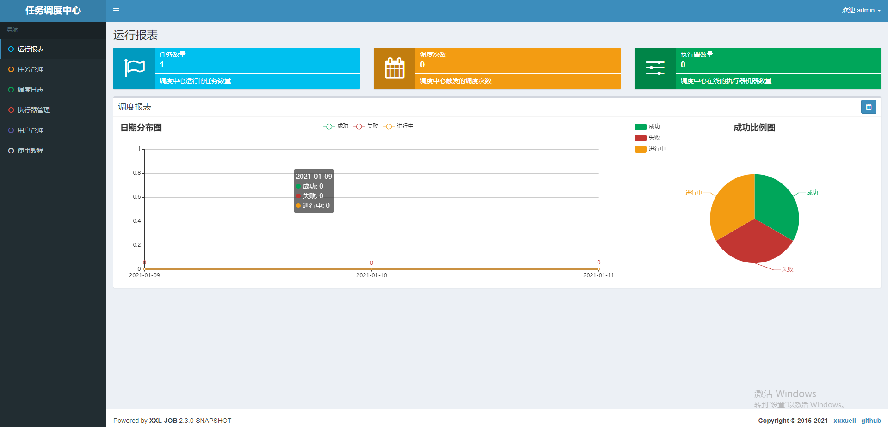

# 任务调度
===============

## XXL-Job

### 部署
[xxl-job搭建部署](https://www.cnblogs.com/liconglong/p/11753147.html)

执行 xxl-job\doc\db\tables_xxl_job.sql (mysql;)

配置文件中修改xxl-job\xxl-job-admin\src\main\resources\application.properties
```properties
spring.datasource.url=jdbc:mysql://***:3306/xxl_job?Unicode=true&characterEncoding=UTF-8
spring.datasource.username=root
spring.datasource.password=123456

```

访问：http://localhost:8080/xxl-job-admin/ 默认密码 admin/123456



--------------

1. 执行器配置 AppName(匹配xxl-job项目中的appname)
2. 定时任务配置
	+ 执行器
	+ 路由策略 FIRST/LAST/ROUND轮询/RANDOM随机/CONSISTENT_HASH(一致性HASH)/LEAST_FREQUENTLY_USED（最不经常使用）/LEAST_RECENTLY_USED（最近最久未使用）/FAILOVER(故障转移)/BUSYOVER(忙碌转移）/SHARDING_BROADCAST(分片广播)
	+ CRON 
	+ 运行模式 BEAN(JobHandler属性匹配) / GLUE(java)模式(源码方式Groovy调度)/ GLUE(shell)/ GLUE(python)/ GLUE(PHP)/ GLUE(NodeJs)/ GLUE(PowerShell)
	+ jobHandler 注解中名称
	+ 阻塞策略 单机串行（默认）/弃后续调用/覆盖之前调度
	+ 子任务ID 本任务调度成功后触发子任务的一次主动调度
	+ 任务超时时间
	+ 失败重试次数
	+ 报警邮件
	+ 负责人
	+ 执行参数(,号分隔)

### 调度Helloworld
config:
```properties
### xxl-job admin address list, such as "http://address" or "http://address01,http://address02"
xxl.job.admin.addresses=http://127.0.0.1:8080/xxl-job-admin

### xxl-job, access token
xxl.job.accessToken=

### xxl-job executor appname
xxl.job.executor.appname=xxl-job-executor-sample
### xxl-job executor registry-address: default use address to registry , otherwise use ip:port if address is null
xxl.job.executor.address=
### xxl-job executor server-info
xxl.job.executor.ip=
xxl.job.executor.port=9996
### xxl-job executor log-path
xxl.job.executor.logpath=/data/applogs/xxl-job/jobhandler
### xxl-job executor log-retention-days
xxl.job.executor.logretentiondays=30
```

启动job：
```java
		XxlJobSimpleExecutor xxlJobExecutor = new XxlJobSimpleExecutor();
        xxlJobExecutor.setAdminAddresses(xxlJobProp.getProperty("xxl.job.admin.addresses"));
        xxlJobExecutor.setAccessToken(xxlJobProp.getProperty("xxl.job.accessToken"));
        xxlJobExecutor.setAppname(xxlJobProp.getProperty("xxl.job.executor.appname"));
        xxlJobExecutor.setAddress(xxlJobProp.getProperty("xxl.job.executor.address"));
        xxlJobExecutor.setIp(xxlJobProp.getProperty("xxl.job.executor.ip"));
        xxlJobExecutor.setPort(Integer.valueOf(xxlJobProp.getProperty("xxl.job.executor.port")));
        xxlJobExecutor.setLogPath(xxlJobProp.getProperty("xxl.job.executor.logpath"));
        xxlJobExecutor.setLogRetentionDays(Integer.valueOf(xxlJobProp.getProperty("xxl.job.executor.logretentiondays")));

        // registry job bean
        xxlJobExecutor.setXxlJobBeanList(beans); // List<Object> java beans

        // start executor
        try {
            xxlJobExecutor.start();
        } catch (Exception e) {
            logger.error(e.getMessage(), e);
        }
```

Job编写：
```scala
// scala 
class XxlJobDemo {

    @XxlJob("ywwtest")
    def a(): Unit = {
        println("hello world")

        (1 to 6).foreach(i => {
            println(s"tick $i")
            Thread.sleep(1000)
        })
    }

    @XxlJob("ywwshard")
    def b(): Unit = {
        val shardIndex = XxlJobHelper.getShardIndex
        val shardTotal = XxlJobHelper.getShardTotal
        XxlJobHelper.log(s"shard $shardIndex/$shardTotal") // shardTotal=实际online executor个数
    }
}
```
### 源码分析

```java
xxl-job-core
	biz:
		AdminBiz <interface> (callback registry registryRemove)+
		 + AdminBizClient  通过post方法(api/callback  api/registry  api/registryRemove)
		ExecutorBiz (beat/idleBeat/run/kill/log)
		 + ExecutorBizClient 通过post方法(beat/idleBeat/run/kill/log)
		 + impl
			ExecutorBizImpl
	server
		EmbedServer
		 embedServer.start(address, port, appname, accessToken);
		 + start / stop / startRegistry / stopRegistry
		 通过netty实现RPC通信
			EmbedHttpServerHandler  (channelRead0 -> process(<-->ExecutorBizImpl) -> writeResponse)
```

### 容器化部署

--------------

## PowerJob
=============
[中文文档](https://www.yuque.com/powerjob/guidence/ztn4i5)

调试步骤：

+ 支持postgres修改：
```java
	// @Lob 注释掉
    @Column(columnDefinition="TEXT")
    private String peDAG;
```
+ IDEA （2020）中修改properties配置中的数据库连接
+ 启动后访问 http://127.0.0.1:7700/  执行应用注册 （应用名 == worker中指定的app-name）
+ 任务管理-新建任务
```shell

```
