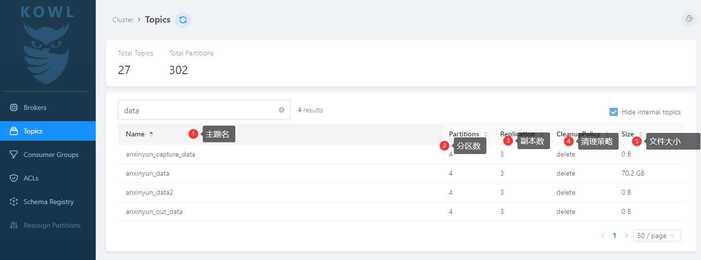
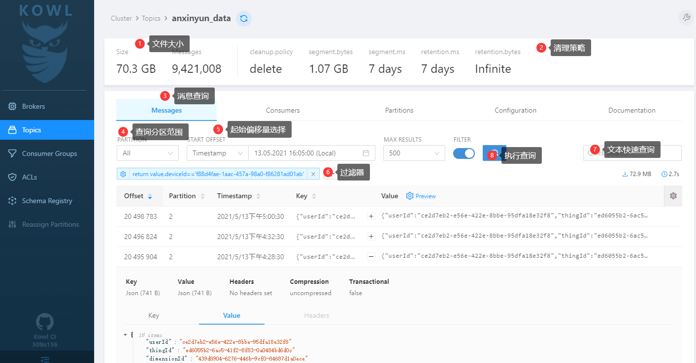
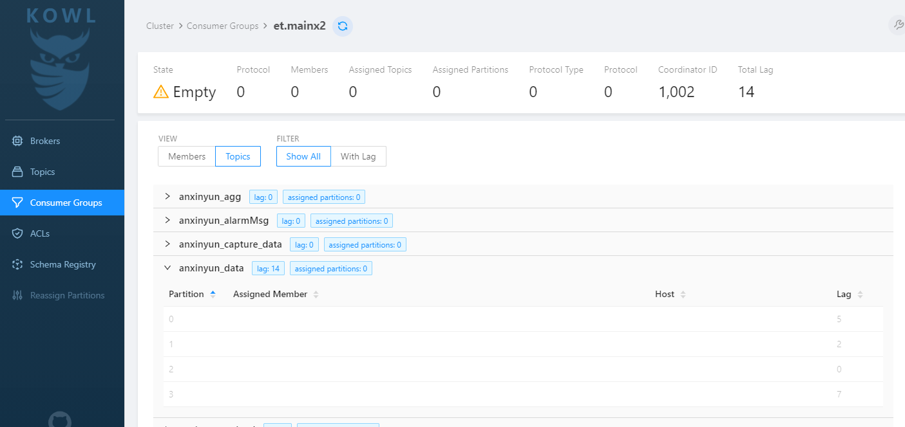
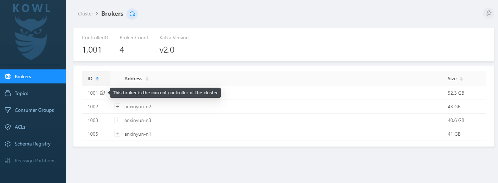
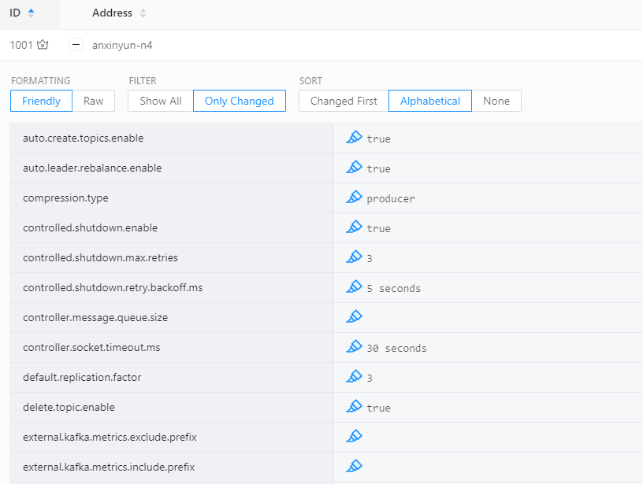

# KAFKA KOWL管理平台使用

## 介绍：KOWL

安心云Kafka管理平台地址：https://kafka.anxinyun.cn/

## kafka消息查询

进入 `Topics` 菜单



点击具体的`Topic`，进入如下界面：



其中起始偏移量设置：

- Newest 最新
- Newest-MaxResults 最新前页
- Oldest 最旧
- Custom 自定义偏移量
- Timestamp 按时间戳

其余Tab页：

- Consumers 显示当前Topic上的消费者（Group.Id和Lag)
- Partitions 显示当前Topic的分区情况（各分区的Broker、偏移量范围、消息数）
- Configuration 显示当前Topic的配置（不可修改）

通过过滤表达式实现查询设备ID：

```js
return value.deviceId=='f88d4fae-1aac-457a-98a0-f86281ad01ab'
```


## kafka消费情况查看

点击菜单`Consumer Group`进入选择 对应点group.id, 如平台ET使用的是 `et.mainx2`； 进入如下页面。可以查看对应Topic下的Lag情况。检查lag判断数据处理是否有积压。




## Broker信息查询

点击菜单 `Brokers` 进入管理界面：



点击 Adress列对应的+号，显示当前Broker下的配置信息。

