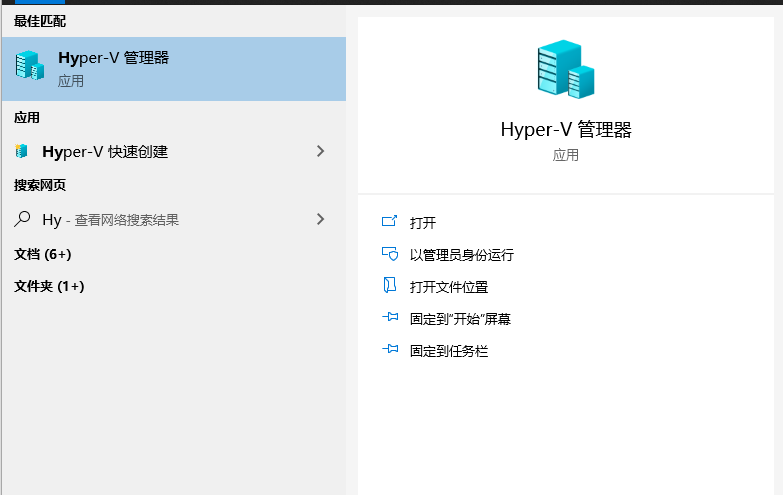
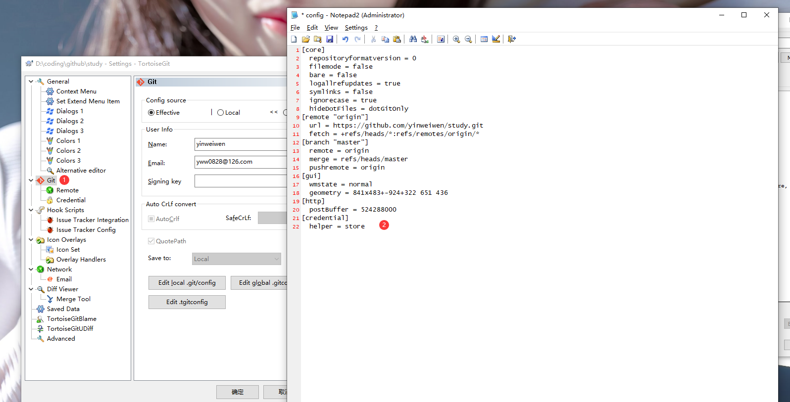

## 安装nodejs

```sh
# 无法获得锁 /var/lib/dpkg/lock-frontend - open

rm /var/lib/dpkg/lock-frontend
rm /var/lib/dpkg/lock
dpkg --configure -a
# sudo systemctl restart accounts-daemon


apt-get install nodejs
apt-get install nodejs-legacy
apt-get install npm

npm config set registry https://registry.npm.taobao.org
npm config list

npm install -g pm2

ls

pm2 start index.js --name "etwatcher"
#pm2 restart api
#pm2 delete api
#pm2 kill

// 查看dac进程实例中占用内存最该的实例内存
ps aux | grep dac | sort -nr -k4 | head -n1 | awk '{print $6}'
```


## 安装python

https://www.cnblogs.com/mo-nian/p/12506853.html

在Jenkins容器内部安装python3.8：

```sh
wget https://www.python.org/ftp/python/3.8.6/Python-3.8.6.tgz

sudo apt-get install python-dev
sudo apt-get install libffi-dev
sudo apt-get install libssl-dev
sudo apt-get install -y make build-essential libssl-dev zlib1g-dev libbz2-dev libreadline-dev libsqlite3-dev wget curl llvm libncurses5-dev libncursesw5-dev xz-utils tk-dev

./configure prefix=/usr/local/python3
make && make install

mv /usr/bin/python /usr/bin/python.bak
ln -s /usr/local/python3/bin/python3 /usr/bin/python
python -V

```


## netstat

-a all
-t tcp
-u udp
-l listen
-p pid list

## ps

-A ：所有的进程均显示出来，与 -e 具有同样的效用；
-a ： 显示现行终端机下的所有进程，包括其他用户的进程；
-u ：以用户为主的进程状态 ；
x ：通常与 a 这个参数一起使用，可列出较完整信息。
输出格式规划：
l ：较长、较详细的将该 PID 的的信息列出；
j ：工作的格式 (jobs format)
-f ：做一个更为完整的输出。


进程内存监控：


## nc 网络调试

```shell
test tcp
# nc -z -v [hostname/IP address] [port number]
test udp
# nc -z -v -u [hostname/IP address] [port number]

```

## step by step 安装ubuntu

1. rufus-2.15.exe 制作 ubuntu-16.04
2. sudo apt-get install openssh-server
3. sudo apt-get install openjdk-8-jdk

挂载网络磁盘(Samba服务)
mkdir -p localdir
apt install cifs-utils
mount -t cifs //10.8.30.163/versions /var/jenkins-version -o rw

>> tail:
tail -f 循环读取
tail -n 行数

>> 列出所有版本信息
[root@localhost ~]# lsb_release -a

>> Systemctl  (https://linux.cn/article-5926-1.html)
Systemctl是一个systemd工具，主要负责控制systemd系统和服务管理器。
分析启动耗时
systemd-analyze [blame]/各进程  [critical-chain]/关键链
systemctl list-unit-files 列出所有可用单元
systemctl list-units 列出所有运行中单元
systemctl --failed  列出所有失败单元
systemctl is-enabled crond.service 检查某个单元（如 cron.service）是否启用
systemctl status firewalld.service 检查某个单元或服务是否运行 
systemctl start httpd.service

systemctl restart httpd.service

systemctl stop httpd.service

systemctl reload httpd.service

systemctl status httpd.service


>> hdfs
查看hdfs存储空间：
hdfs dfs -du -h / 
hdfs dfs -rmr  hdfs://node35:9000/user/anxin/check-point
docker logs xxx container_id

>> hadoop 集群部署时确保所有机器上用户必须一样
	如
	useradd hadoop
	passwords hadoop
	// 加入sudoers
	su
	chmod 777 /etc/sudoers
	vi /etc/sudoers
		-- hadoop    ALL=(ALL)       ALL
	chmod 440 /etc/sudoers

	su hadoop
	sudo mkdir /home/hadoop
	sudo chown /home/hadoop

## 内存问题排查

	free [-m -g...]
	 total        used        free      shared  buff/cache   available
Mem:       12219288     7485148      271236       27104     4462904     4311184
Swap:             0           0           0
	mem:物理内存 swap硬盘上交换分区的使用情况。只有mem被当前进程实际占用完,即没有了buffers和cache时，才会使用到swap
	MEM -- total: 总物理内存大小  used: 总计分配给缓存使用的数量(包含buff/cache)  free: 未被分配的内存  shared: 共享内存(一般系统不会用到)
			buff/cache： 分配但未被使用的cache和buffer数量
	<https://blog.csdn.net/tianlesoftware/article/details/5463790>
	

	dmidecode -t processor memory [bios, system, baseboard, chassis, processor, memory, cache, connector, slot]
	
	top -d 1(1秒更新一次)  -c（显示完整的路径名称）  -i(不现实任何Idle和zombie进程)  -m(更新次数，完成后退出)
	【】【】     【优先级】				  
	PID USER      PR  NI【优先级别数值】    VIRT【进程占用的虚拟内存值】    RES【进程占用的物理内存值】
	SHR【进程使用的共享内存值】 S【进程的状态，其中S表示休眠，R表示正在运行，Z表示僵死状态，N表示该进程优先值是负数】
	%CPU %MEM     TIME+ COMMAND                                                                                                                       
 3581 root      20   0  415048 266628  21956 S   6.3  2.2 512:58.32 kube-apiserver                                                                                                                
  730 root      20   0  708712  61548  16404 S   4.7  0.5 333:30.48 kubelet                                                                                                                       
 3241 root      20   0  139472  57008  15800 S   4.0  0.5 353:34.31 kube-controller  
	

	top下支持的操作：
	 《空格》：立刻刷新。
	
	P：根据CPU使用大小进行排序。
	
	T：根据时间、累计时间排序。
	
	q：退出top命令。
	
	m：切换显示内存信息。
	
	t：切换显示进程和CPU状态信息。
	
	c：切换显示命令名称和完整命令行。
	
	M：根据使用内存大小进行排序。
	
	W：将当前设置写入~/.toprc文件中
	
	SHIFT+M 固定按内存排序


?	
	uptime 显示系统运行时长 最近1分钟/5分钟/15分钟的系统负载
	17:38:07 up 6 days,  1:13,  4 users,  load average: 0.32, 0.36, 0.45
	
	vmstat显示
	procs -----------memory---------- ---swap-- -----io---- -system-- ------cpu-----
	 r  b   swpd   free   buff  cache   si   so    bi    bo   in   cs us sy id wa st
	 0  0      0 251324 477184 3994764    0    0     8    48   10   12  3  2 94  1  0
	 其中：
	 io:
		bi - 从磁盘每秒读取的块数（blocks/s）
		bo - 每秒写到磁盘的块数（blocks/s）
	 cpu:
		us - 用户进程占cpu比例
		sy - 系统占用比例
		id - 空闲时间比例
		wa - cpu等待未决的磁盘IO时间比例
		
	iostat 用于统计CPU的使用情况及tty设备、硬盘和CD-ROM的I/0量

## GREP查询多个条件

kubectl logs spark-et-driver-savoir | grep 'a\|b'
kubectl logs -n savoir savoir-recv2-d55c84956-lwt47 --tail 100000 | egrep 'savoir_data.*d931eb76-7703-4d8c-a240-8158a02ceeae.*"result":{"code":3002'
netstat -an | grep -E "ESTABLISHED|WAIT"

使用方式：egrep [OPTIONS] PATTERN [FILE...] 

　　grep -E [OPTIONS] PATTERN [FILE...]

　　-i：忽略字符的大小写
　　-o：仅显示匹配到的字符串本身
　　-v：显示不被模式匹配到的行
　　-q：静默模式，即不输出任何信息
　　-A #：显示被模式匹配的行及其后#行
　　-B #：显示被模式匹配的行及其前#行
　　-C #：显示被模式匹配的行及其前后各#行
　　-G:支持基本正则表达式


## chmod 用法
	u -- User 文件或目录的拥有者
	g -- Group 所属群组
	o -- Other
	a -- 全部用户
	r -- 读取权限，数字代号4
	w -- 写入权限，数字代号2
	x -- 执行或切换权限，数字代号1
	- -- 不具任何权限，数字代号0
	s -- 特殊功能说明：变更文件或目录的权限
	-R 递归处理
	chmod u+x f01 // 设置拥有者的可执行属性
	chmod u=rwx,g=rw f01
	chmod 764 f01
	
	- rw- r-- r-- 
	第一个字符"-"表示普通文件 "d"表示目录
	后面三组分别为 u/g/o 用户的权限


## 查找/删除 指定日期的文件
	find .  -type f  -name *.*  -mtime +10  -exec rm {} \;
	. 当前目录
	-type f 查找文件
	-name *.log 查找名称后缀log的文件
	-mtime +180  查询180天以前的文件
	find . -type f -mtime -180 -exec ls -l {} \; | more
	find . -newermt '2016-11-03' ! -newermt '2016-11-04' -exec ls -l {} \;
	
	find . -type d -ctime +10 | xargs rm -rf;
	删除修改时间超过10天的所有文件夹 （等价于 find /path/to/base/dir/* -type d -ctime +10 -exec rm -rf {} \;）
	
	// 到version目录执行
	find . -type d -mindepth 1 -maxdepth 2  -ctime +10 | xargs rm -rf
	...TO LERN MORE
	
	>>
	-amin <分钟> 查找在指定时间曾被存取过的文件或目录
	-anewer <参考文件或目录> 查找其存取时间交指定文件或目录的存取时间更新的
	-atime<24小时数>：查找在指定时间曾被存取过的文件或目录，单位以24小时计算；
	-depth 目录层次
	-daystart 从本日开始计算时间
	-empty 寻找空文件或文件夹
	-name "*.txt" 查找文件名
	-iname "*.txt" 同上，忽略大小写
	find . -type f -size +10k 搜索大于10KB的文件
	find . -maxdepth 3 -type f 向下最大深度限制为3
	find . -mindepth 2 -type f 搜索出深度距离当前目录至少2个子目录的所有文件
	find /usr/ -path "*local*" 路径匹配
	find . -regex ".*\(\.txt\|\.pdf\)$" 基于正则表达式匹配文件路径

## 磁盘空间 和 查找大文件
```bash
find / -type f -size +200M 2>/dev/null|xargs du -shm|sort -nr|awk '{print $2}'|ls -l

ls -ll
du -h �Cmax-depth=1 *  可以查看当前目录下各文件、文件夹的大小
du -sh 查询当前目录总大小

```


?	
## 后台启动进程
  *nohup 如果宿主ssh进程关闭，后台nohup进程也会被关闭
  建议使用 screen
  apt-get install screen
  > screen 按Enter，进入新的screen
	> 在新的screen里面使用nohup（或者直接启动）启动我们的进程
	> Ctrl A + D 退出
	> 显示 [detached from 8377.pts-12.node35]
  > 列出当前用户所有screen -ls
  > 进入已有screen -r 8377.pts-12.node35

## 关闭交换分区
https://serverfault.com/questions/684771/best-way-to-disable-swap-in-linux
	1. Identify configured swap devices and files with cat /proc/swaps.
	2. Turn off all swap devices and files with swapoff -a.
	3. Remove any matching reference found in /etc/fstab.
	4. Optional: Destroy any swap devices or files found in step 1 to prevent their reuse. Due to your concerns about leaking sensitive information, you may wish to consider performing some sort of secure wipe.
	
	1. run swapoff -a: this will immediately disable swap
	2. remove any swap entry from /etc/fstab
	3. reboot the system. If the swap is gone, good. If, for some reason, it is still here, you had to remove the swap partition. Repeat steps 1 and 2 and, after that, use fdisk or parted to remove the (now unused) swap partition. Use great care here: removing the wrong partition will have disastrous effects!
	4. reboot

## xshell使用
	属性里面可以设置默认语言为UTF-8
	属性里可以设置外观颜色(标识出重要的连接)
	sudo apt install lrzsz安装后可以实现文件传输（拖拽上传/rz 上传/sz 下载）

## git Permission denied (github)
	ssh-keygen
	copy C:\Users\yww08/.ssh/id_rsa.pub 内容
	github.com >personal settings>SSH > New SSH Key
	[ref](https://stackoverflow.com/questions/2643502/how-to-solve-permission-denied-publickey-error-when-using-git)


?	
## 别名 alias

	alias ka='kubectl get pods -n anxinyun'
	alias
	
	在~/.bashrc文件中添加
	alias ka='kubectl get pods -n anxinyun -o wide'
	alias kla='kubectl logs -n anxinyun '
	alias ksa='kubectl get services -n anxinyun -o wide'
	alias klat='kubectl logs -n anxinyun --tail 1000'
	alias kda='kubectl delete pod -n anxinyun'
	alias ks='kubectl get pods -n savoir -o wide'
	alias kss='kubectl get services -n savoir -o wide'
	alias kls='kubectl logs -n savoir '
	alias klst='kubectl logs -n savoir --tail 1000'

## Linux <> Windows 文件互传
	rz 
	sz file

## ElasticSearch数据导出
	https://www.npmjs.com/package/elasticdump
	
	npm install elasticdump -g
	
	elasticdump \
  --input=http://iota-m2:9200/aqi_division_hour \
  --output=/home/anxin/tools/aqi_division_hour_mapping.json \
  --type=mapping

  elasticdump \
  --input=http://production.es.com:9200/my_index \
  --output=http://staging.es.com:9200/my_index \
  --type=analyzer
elasticdump \
  --input=http://production.es.com:9200/my_index \
  --output=http://staging.es.com:9200/my_index \
  --type=mapping

  curl -X PUT 'http://172.16.3.5:9200/shining_index' -d@/data/shining_index_mapping.json

  

 ## Ubuntu 16.04 安装jenkins
 https://www.jianshu.com/p/845f267aec52

首先照着输入
systemctl status jenkins.service
看到
Failed to start LSB: Start Jenkins at boot time

>> 查看是否安装jdk
>> 是否端口号重读，修改jenkins端口 https://blog.csdn.net/csfreebird/article/details/9033443

jenkins上持续集成go项目：
https://blog.csdn.net/aixiaoyang168/article/details/82965854

## HDFS
Missing Blocks
1 hdfs fsck -list-corruptfileblocks
1 hdfs fsck / | egrep -v '^\.+$' | grep -v eplica
查看上面某一个文件的情况
1 hdfs fsck /path/to/corrupt/file -locations -blocks -files

解决方法
如果文件不重要，可以直接删除此文件(hdfs fsck -delete)；或删除后重新复制一份到集群中
如果不能删除，需要从上面命令中找到发生在哪台机器上，然后到此机器上查看日志。


hadoop fs  -stat %r /anxinyun


163DORCKER
sudo nsenter --target `sudo docker inspect -f {{.State.Pid}} a699a640d325` --mount --uts --ipc --net --pid 
chown 1000:1000 /var/run/docker.sock

## k8s批量删除pod
kubectl get pods -n savoir| grep savoir-jupyter | awk '{print $1}' | xargs kubectl delete pod -n savoir

## mosquitto管理
	ps -ef | grep mosq
	
	/etc/mosquitto/mosquitto.conf

## ambari 节点上的服务 显示心跳丢失

重启ambari代理
解决方法： service ambari-agent restart


## journalctl

```shell
journalctl -eu kubelet

# 内核日志
journalctl  -k 

--no-full, --full, -l
如果字段内容超长 则以省略号(…)截断以适应列宽。 默认显示完整的字段内容 (超长的部分换行显示或者被分页工具截断)。

老旧的 -l/--full 选项 仅用于撤销已有的 --no-full 选项，除此之外没有其他用处。

-a, --all
完整显示所有字段内容，即使其中包含非打印字符或者字段内容超长。 默认情况下，包含非打印字符的字段将被缩写为"blob data"(二进制数据)。 注意，分页程序可能会再次转义非打印字符

-f, --follow
只显示最新的日志项， 并且不断显示新生成的日志项。 此选项隐含了 -n 选项。

-e, --pager-end
在分页工具内 立即跳转到日志的尾部。 此选项隐含了 -n1000 以确保分页工具不必缓存太多的日志行。 不过这个隐含的行数可以被明确设置的 -n 选项覆盖。 注意，此选项仅可用于 less(1) 分页器。

-n, --lines=
限制显示最新的日志行数。 --pager-end 与 --follow 隐含了此选项。 此选项的参数：若为正整数则表示最大行数； 若为 "all" 则表示不限制行数； 若不设参数则表示默认值10行。

--no-tail
显示所有日志行， 也就是用于撤销已有的 --lines= 选项(即使与 -f 连用)。

-r, --reverse
反转日志行的输出顺序， 也就是最先显示最新的日志。

-o, --output=
控制日志的 输出格式。 可以使用如下选项：

short 
这是默认值， 其输出格式与传统的 syslog 文件的格式相似， 每条日志一行。

short-full 
与 short 类似，只是将时间戳字段 按照 --since= 与 --until= 接受的格式显示。 与 short 的不同之处在于， 输出的时间戳中还包含星期、年份、时区信息，并且与系统的本地化设置无关。

short-iso 
与 short 类似，只是将时间戳字段以 ISO 8601 格式 显示。

short-iso-precise 
与 short-iso 类似，只是将时间戳字段的秒数 精确到了微秒级别(百万分之一秒)。

short-precise 
与 short 类似，只是将时间戳字段的秒数 精确到了微秒级别(百万分之一秒)。

short-monotonic 
与 short 类似，只是将时间戳字段的零值 从内核启动时开始计算。

short-unix 
与 short 类似，只是将时间戳字段显示为从"UNIX时间原点"(1970-1-1 00:00:00 UTC)以来的秒数。 精确到微秒级别。

verbose 
以结构化的格式显示 每条日志的所有字段。

export 
将日志序列化为二进制字节流 (大部分依然是文本)， 以适用于备份与网络传输(详见 Journal Export Format 文档)。亦可使用 systemd-journal-remote.service(8) 工具将二进制字节流转换为本地 journald 格式。

json 
将日志项格式化为 JSON 对象，并用换行符分隔(也就是每条日志一行，详见 Journal JSON Format 文档)。 字段值通常按照 JSON 字符串规范进行编码，但是如下三种情况例外：

大于4096字节的字段将被编码为 null 值(可以使用 --all 选项关闭此特性，但是这样做会导致生成又大又长的 JSON 对象)。

日志中允许存在同名字段，但是在 JSON 对象中不允许。 因此，同名字段的多个值在 JSON 对象中将会被 编码为一个数组。

包含非打印字符或非UTF8字符的字段， 将被编码为包含原始二进制字节的数组(其中的每个字节都视为一个无符号整数)。

注意，这种编码方式是可逆的(存在空间大小的限制)。

json-pretty 
将日志项按照JSON数据结构格式化， 但是每个字段一行， 以便于人类阅读。

json-sse 
将日志项按照JSON结构格式化，每条日志一行，但是用大括号包围， 以符合 Server-Sent Events 的要求。

json-seq 
将日志项按照JSON结构格式化， 同时为每条日志加上一个ASCII记录分隔符(0x1E)前缀以及一个ASCII换行符(0x0A)后缀，以符合 JavaScript Object Notation (JSON) Text Sequences ("application/json-seq") 的要求。

cat 
仅显示日志的实际内容， 而不显示与此日志相关的 任何元数据(包括时间戳)。

with-unit 
与 short-full 类似， 但是在日志项前缀中使用单元名称代替传统的 syslog 标识。 这对于从模板实例化而来的单元比较有意义， 因为会在单元名称中包含实例化参数。

--output-fields=
一个逗号分隔的字段名称列表，表示仅输出列表中的字段。 仅影响默认输出全部字段的输出格式(verbose, export, json, json-pretty, json-sse, json-seq)。注意， "__CURSOR", "__REALTIME_TIMESTAMP", "__MONOTONIC_TIMESTAMP", "_BOOT_ID" 字段永远输出， 不能被排除。

--utc
以世界统一时间(UTC) 表示时间

--no-hostname
不显示来源于本机的日志消息的主机名字段。 此选项仅对 short 系列输出格式(见上文)有效。

-x, --catalog
在日志的输出中 增加一些解释性的短文本， 以帮助进一步说明 日志的含义、 问题的解决方案、支持论坛、 开发文档、以及其他任何内容。 并非所有日志都有 这些额外的帮助文本， 详见 Message Catalog Developer Documentation 文档。

注意，如果要将日志输出用于bug报告， 请不要使用 此选项。

-q, --quiet
安静模式， 也就是当以普通用户身份运行时， 不显示任何警告信息与提示信息。 例如： "-- Logs begin at …", "-- Reboot --"

-m, --merge
混合显示 包括来自于其他远程主机的日志在内的所有可见日志。

-b [ID][±offset], --boot=[ID][±offset]
显示特定于某次启动的日志， 这相当于添加了一个 "_BOOT_ID=" 匹配条件。

如果未指定 ID 与 ±offset 参数， 则表示仅显示本次启动的日志。

如果省略了 ID ， 那么当 ±offset 是正数的时候， 将从日志头开始正向查找， 否则(也就是为负数或零)将从日志尾开始反响查找。 举例来说， "-b 1"表示按时间顺序排列最早的那次启动， "-b 2"则表示在时间上第二早的那次启动； "-b -0"表示最后一次启动， "-b -1"表示在时间上第二近的那次启动， 以此类推。 如果 ±offset 也省略了， 那么相当于"-b -0"， 除非本次启动不是最后一次启动(例如用 --directory 指定了 另外一台主机上的日志目录)。

如果指定了32字符的 ID ， 那么表示以此 ID 所代表的那次启动为基准 计算偏移量(±offset)， 计算方法同上。 换句话说， 省略 ID 表示以本次启动为基准 计算偏移量(±offset)。

--list-boots
列出每次启动的 序号(也就是相对于本次启动的偏移量)、32字符的ID、 第一条日志的时间戳、最后一条日志的时间戳。

-k, --dmesg
仅显示内核日志。隐含了 -b 选项以及 "_TRANSPORT=kernel" 匹配项。

-t, --identifier=SYSLOG_IDENTIFIER
仅显示 syslog 识别符为 SYSLOG_IDENTIFIER 的日志项。

可以多次使用该选项以 指定多个识别符。

-u, --unit=UNIT|PATTERN
仅显示 属于特定单元的日志。 也就是单元名称正好等于 UNIT 或者符合 PATTERN 模式的单元。 这相当于添加了一个 "_SYSTEMD_UNIT=UNIT" 匹配项(对于 UNIT 来说)， 或一组匹配项(对于 PATTERN 来说)。

可以多次使用此选项以添加多个并列的匹配条件(相当于用"OR"逻辑连接)。

--user-unit=
仅显示 属于特定用户会话单元的日志。 相当于同时添加了 "_SYSTEMD_USER_UNIT=" 与 "_UID=" 两个匹配条件。

可以多次使用此选项以添加多个并列的匹配条件(相当于用"OR"逻辑连接)。

-p, --priority=
根据 日志等级(包括等级范围) 过滤输出结果。 日志等级数字与其名称之间的 对应关系如下 (参见 syslog(3))： "emerg" (0), "alert" (1), "crit" (2), "err" (3), "warning" (4), "notice" (5), "info" (6), "debug" (7) 。 若设为一个单独的数字或日志等级名称， 则表示仅显示小于或等于此等级的日志(也就是重要程度等于或高于此等级的日志)。 若使用 FROM..TO.. 设置一个范围， 则表示仅显示指定的等级范围内(含两端)的日志。 此选项相当于添加了 "PRIORITY=" 匹配条件。

-g, --grep=
使用指定的正则表达式对 MESSAGE= 字段进行过滤，仅输出匹配的日志项。 必须使用 PERL 兼容的正则表达式，详细语法参见 pcre2pattern(3) 手册。

如果正则表达式中仅含小写字母，那么将自动进行大小写无关的匹配， 否则将使用大小写敏感的匹配。是否大小写敏感可以使用下面的 --case-sensitive 选项强制指定。

--case-sensitive[=BOOLEAN]
是否对正则表达式进行大小写敏感的匹配。

-c, --cursor=
从指定的游标(cursor)开始显示日志。 [提示]每条日志都有一个"__CURSOR"字段，类似于该条日志的指纹。

--after-cursor=
从指定的游标(cursor) 之后开始显示日志。 如果使用了 --show-cursor 选项， 则也会显示游标本身。

--show-cursor
在最后一条日志之后显示游标， 类似下面这样，以"--"开头：

-- cursor: s=0639…
游标的具体格式是私有的(也就是没有公开的规范)， 并且会变化。

-S, --since=, -U, --until=
显示晚于指定时间(--since=)的日志、显示早于指定时间(--until=)的日志。 参数的格式类似 "2012-10-30 18:17:16" 这样。 如果省略了"时:分:秒"部分，则相当于设为 "00:00:00" 。 如果仅省略了"秒"的部分则相当于设为 ":00" 。 如果省略了"年-月-日"部分，则相当于设为当前日期。 除了"年-月-日 时:分:秒"格式，参数还可以进行如下设置： (1)设为 "yesterday", "today", "tomorrow" 以表示那一天的零点(00:00:00)。 (2)设为 "now" 以表示当前时间。 (3)可以在"年-月-日 时:分:秒"前加上 "-"(前移) 或 "+"(后移) 前缀以表示相对于当前时间的偏移。 关于时间与日期的详细规范，参见 systemd.time(7) 注意， --output=short-full 将会一丝不苟的严格按照上述格式输出时间戳。

-F, --field=
显示所有日志中指定字段的所有可能值。 [译者注]类似于SQL语句："SELECT DISTINCT 指定字段 FROM 全部日志"

-N, --fields
输出所有日志字段的名称

--system, --user
仅显示 系统服务与内核的日志(--system)、 仅显示当前用户的日志(--user)。 如果两个选项都未指定，则显示当前用户的所有可见日志。

-M, --machine=
显示来自于正在运行的、特定名称的本地容器的日志。 参数必须是一个本地容器的名称。

-D DIR, --directory=DIR
仅显示 特定目录中的日志， 而不是 默认的运行时和系统日志目录中的日志。

--file=GLOB
GLOB 是一个 可以包含"?"与"*"的文件路径匹配模式。 表示仅显示来自与指定的 GLOB 模式匹配的文件中的日志， 而不是默认的运行时和系统日志目录中的日志。 可以多次使用此选项 以指定多个匹配模式(多个模式之间用"OR"逻辑连接)。

--root=ROOT
在对日志进行操作时， 将 ROOT 视为系统的根目录。 例如 --update-catalog 将会创建 ROOT/var/lib/systemd/catalog/database 文件， 并且将会显示 ROOT/run/journal 或 ROOT/var/log/journal 目录中的日志。

--header
此选项并不用于显示日志内容， 而是用于显示 日志文件内部的头信息(类似于元数据)。

--disk-usage
此选项并不用于显示日志内容， 而是用于显示 所有日志文件(归档文件与活动文件)的磁盘占用总量。

--vacuum-size=, --vacuum-time=, --vacuum-files=
这些选项并不用于显示日志内容，而是用于清理过期的日志归档文件(并不清理活动的日志文件)，以释放磁盘空间。 --vacuum-size= 可用于限制归档文件的最大磁盘使用量(可以使用 "K", "M", "G", "T" 后缀)； --vacuum-time= 可用于清除指定时间之前的归档(可以使用 "s", "m", "h", "days", "weeks", "months", "years" 后缀)； --vacuum-files= 可用于限制日志归档文件的最大数量。 注意，--vacuum-size= 对 --disk-usage 的输出仅有间接效果， 因为 --disk-usage 输出的是归档日志与活动日志的总量。 同样，--vacuum-files= 也未必一定会减少日志文件的总数， 因为它同样仅作用于归档文件而不会删除活动的日志文件。

此三个选项可以同时使用， 以同时从三个维度去限制归档文件。 若将某选项设为零， 则表示取消此选项的限制。

此三个选项还可以和 --rotate 一起使用， 表示首先滚动所有日志归档， 然后再执行清理操作。 这样可以确保首先完成所有活动日志的归档， 进而使得清理操作变得非常高效。

--list-catalog [128-bit-ID…] 
简要列出日志分类信息， 其中包括对分类信息的简要描述。

如果明确指定了分类ID(128-bit-ID)， 那么仅显示指定的分类。

--dump-catalog [128-bit-ID…] 
详细列出 日志分类信息 (格式与 .catalog 文件相同)。

如果明确指定了分类ID(128-bit-ID)， 那么仅显示指定的分类。

--update-catalog
更新 日志分类索引二进制文件。 每当安装、删除、更新了分类文件， 都需要执行一次此动作。

--setup-keys
此选项并不用于显示日志内容， 而是用于生成一个新的FSS(Forward Secure Sealing)密钥对。 此密钥对包含一个"sealing key" 与一个"verification key"。 "sealing key"保存在本地日志目录中， 而"verification key"则必须保存在其他地方。详见 journald.conf(5) 中的 Seal= 选项。

--force
与 --setup-keys 连用， 表示即使已经配置了FSS(Forward Secure Sealing)密钥对， 也要强制重新生成。

--interval=
与 --setup-keys 连用， 指定"sealing key"的变化间隔。 较短的时间间隔会导致占用更多的CPU资源， 但是能够减少未检测的日志变化时间。 默认值是 15min

--verify
检查日志文件的内在一致性。 如果日志文件在生成时开启了FSS特性， 并且使用 --verify-key= 指定了FSS的"verification key"， 那么，同时还将验证日志文件的真实性。

--verify-key=
与 --verify 选项连用， 指定FSS的"verification key"

--sync
要求日志守护进程 将所有未写入磁盘的日志数据刷写到磁盘上， 并且一直阻塞到刷写操作实际完成之后才返回。 因此该命令可以保证当它返回的时候， 所有在调用此命令的时间点之前的日志， 已经全部安全的刷写到了磁盘中。

--flush
要求日志守护进程 将 /run/log/journal 中的日志数据 刷写到 /var/log/journal 中 (如果持久存储设备当前可用的话)。 此操作会一直阻塞到操作完成之后才会返回， 因此可以确保在该命令返回时， 数据转移确实已经完成。 注意，此命令仅执行一个单独的、一次性的转移动作， 若没有数据需要转移， 则此命令什么也不做， 并且也会返回一个 表示操作已正确完成的返回值。

--rotate
要求日志守护进程滚动日志文件。此命令会一直阻塞到滚动操作完成之后才会返回。 日志滚动可以确保所有活动的日志文件都被关闭、并被重命名以完成归档， 同时，新的空白日志文件将被创建，并成为新的活动日志文件。 此选项可以与 --vacuum-size=, --vacuum-time=, --vacuum-file= 一起使用， 以提高日志清理的效率。

-h, --help
显示简短的帮助信息并退出。

--version
显示简短的版本信息并退出。

--no-pager
不将程序的输出内容管道(pipe)给分页程序。
```


### Vmmem内存占用大

进入Hyper-V管理器关闭指定程序（一般是docker相关）




### Ambari agent心跳丢失

查看心跳丢失的agent的报错日志：/var/log/ambari-agent/

```
Cannot register host with not supported os type, hostname=test-n2, serverOsType=ubuntu18, agentOsType=ubuntu20
```

/usr/lib/ambari-server/lib/ambari_commons/resources/os_family.json

/var/lib/ambari-agent/tmp/ambari_commons/resources/os_family.json

/usr/lib/ambari-agent/lib/ambari_commons/resources/os_family.json

尝试在os_family.json文件中增加ubuntu20项，从起server和agent：

发现节点是心跳丢失情况。


## GIT Tortoirs保存密码

