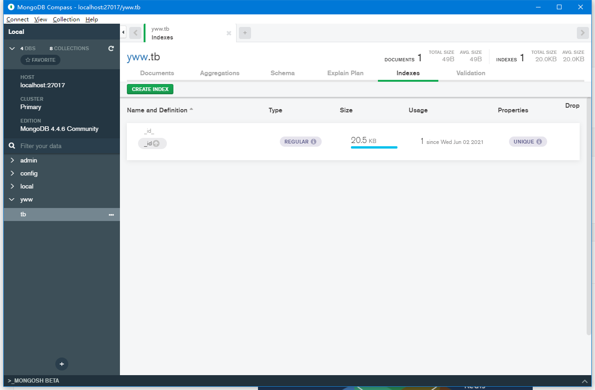

# [MongoDb](https://docs.mongodb.com/manual/crud/)

## Tags

>  **分布式文档型NoSQL数据库**
>
> > NoSql(Not Only Sql) 非关系型。

>  **ACID** (**A (Atomicity) 原子性** **C (Consistency) 一致性** **I (Isolation) 独立性** **D (Durability) 持久性**)

> 富JSON文档。 BSON （Binary JSON）格式


## 概念

| SQL术语/概念 | MongoDB术语/概念 | 解释/说明                           |
| :----------- | :--------------- | :---------------------------------- |
| database     | database         | 数据库                              |
| table        | collection       | 数据库表/集合                       |
| row          | document         | 数据记录行/文档                     |
| column       | field            | 数据字段/域                         |
| index        | index            | 索引                                |
| table joins  |                  | 表连接,MongoDB不支持                |
| primary key  | primary key      | 主键,MongoDB自动将_id字段设置为主键 |

## 操作示例

```shell
> mongo
... ... 
> show dbs
admin   0.000GB
config  0.000GB
local   0.000GB
# 使用（创建）数据库
> use test
switched to db test
> db
test
> db.dropDatabase()
{ "dropped" : "yww", "ok" : 1 }

> db.tb.insert({"name":"yww"})
WriteResult({ "nInserted" : 1 })
# 显示集合 或show collections
> show tables 
tb      
# 删除集合
> db.tb.drop()
true        

# 创建固定集合 （可不用创建）
## capped 类似RRD，队列过期、高性能
> db.createCollection("mycoll", {capped:true, size:100000})

# 批量插入
> db.tb.insertMany([{"a":1},{"a":2},{"c":2}])           
{                                                       
        "acknowledged" : true,                          
        "insertedIds" : [                               
                ObjectId("60b73423be07f83a854f2f0d"),   
                ObjectId("60b73423be07f83a854f2f0e"),   
                ObjectId("60b73423be07f83a854f2f0f")    
        ]                                               
}   
#更新文档
> db.tb.update( { "count" : { $gt : 1 } } , { $set : { "test2" : "OK"} } );

db.collection.update(
   <query>, # 查询条件
   <update>, # 更新操作
   {
     upsert: <boolean>,# 不存在是否插入。默认不插入
     multi: <boolean>,# 更新多条记录（默认更新第一条）
     writeConcern: <document># 异常级别
   }
)
# save方法指定id执行更新
> db.tb.save({"_id" : ObjectId("60b73423be07f83a854f2f0d"), "a" : 2})
WriteResult({ "nMatched" : 1, "nUpserted" : 0, "nModified" : 1 })

# 删除
> db.tb.remove({"a":2})
WriteResult({ "nRemoved" : 2 })
> db.tb.deleteOne({"a":3})
{ "acknowledged" : true, "deletedCount" : 1 }
# 删除所有文档 db.inventory.deleteMany({})

# 查询
# or条件
>  db.tb.find({
...  $or:[
... {"a":1},{"a":4}
... ]
... }).pretty()
{ "_id" : ObjectId("60b73423be07f83a854f2f0d"), "a" : 1 }
{ "_id" : ObjectId("60b73729ddcbf032f5177797"), "a" : 4 }

> db.tb.find({a:{$gt:1}})
{ "_id" : ObjectId("60b73729ddcbf032f5177797"), "a" : 4 }
# 查找字段a是字符串类型的数据
> db.tb.find({a:{$type:2}})
{ "_id" : ObjectId("60b73cfeddcbf032f5177798"), "a" : "ok" }
# 限制数量和跳过条数
>db.COLLECTION_NAME.find().limit(NUMBER).skip(NUMBER)
# 排序 1升序 2降序
>db.COLLECTION_NAME.find().sort({KEY:1})
# 业务场景
>db.anxinyun_themes.find({
    $and:[
    {sensor:{$in:[4054]}},
    {collect_time:{$gte:"2021-06-01"}},
    {collect_time:{$lt:"2021-06-08"}}
    ]
 }).sort({collect_time:-1}).limit(100)
```


**索引**

```shell
# 创建索引
> db.tb.createIndex({"a":1})
{
        "createdCollectionAutomatically" : false,
        "numIndexesBefore" : 1,
        "numIndexesAfter" : 2,
        "ok" : 1
}
# 获取所有索引
> db.tb.getIndexes()
[
        {
                "v" : 2,
                "key" : {
                        "_id" : 1
                },
                "name" : "_id_"
        },
        {
                "v" : 2,
                "key" : {
                        "a" : 1
                },
                "name" : "a_1"
        }
]
> db.tb.totalIndexSize()
57344
# 删除索引
> db.tb.dropIndex("a_1")
{ "nIndexesWas" : 2, "ok" : 1 }
```

创建参数：

unique: 唯一索引  backgroud: 后台执行

name：指定名称 

sparse: 不存在该字段的数据不进行索引，查询出来不包含。

expireAfterSeconds： 指定一个以秒为单位的数值，完成 TTL设定，设定集合的生存时间。

weights： 索引权重

**高级索引**

```json
{
   "address": {
      "city": "Los Angeles",
      "state": "California",
      "pincode": "123"
   },
   "tags": [
      "music",
      "cricket",
      "blogs"
   ],
   "name": "Tom Benzamin"
}
```

1. 数组字段索引： 可以索引数组中的各字段  `db.users.find({tags:"cricket"}).explain()`
2. 子文档索引： `db.users.ensureIndex({"address.city":1,"address.state":1,"address.pincode":1})`

**聚集**

```shell
> db.tb.aggregate([{$group : {_id : "$name", num_tutorial : {$sum : 1}}}])
{ "_id" : "a", "num_tutorial" : 2 }
{ "_id" : "b", "num_tutorial" : 1 }
{ "_id" : null, "num_tutorial" : 4 }
# 将聚集结果中字段a插入一个数组中
> db.tb.aggregate([{$group : {_id : "$name", num_tutorial : {$push : "$a"}}}])
{ "_id" : "a", "num_tutorial" : [ 1, 2 ] }
{ "_id" : "b", "num_tutorial" : [ 3 ] }
{ "_id" : null, "num_tutorial" : [ 1, 4, "ok" ] }
```


**数据类型**

| 数据类型           | 描述                                                         |
| :----------------- | :----------------------------------------------------------- |
| String             | 字符串。存储数据常用的数据类型。在 MongoDB 中，UTF-8 编码的字符串才是合法的。 |
| Integer            | 整型数值。用于存储数值。根据你所采用的服务器，可分为 32 位或 64 位。 |
| Boolean            | 布尔值。用于存储布尔值（真/假）。                            |
| Double             | 双精度浮点值。用于存储浮点值。                               |
| Min/Max keys       | 将一个值与 BSON（二进制的 JSON）元素的最低值和最高值相对比。 |
| Array              | 用于将数组或列表或多个值存储为一个键。                       |
| Timestamp          | 时间戳。记录文档修改或添加的具体时间。                       |
| Object             | 用于内嵌文档。                                               |
| Null               | 用于创建空值。                                               |
| Symbol             | 符号。该数据类型基本上等同于字符串类型，但不同的是，它一般用于采用特殊符号类型的语言。 |
| Date               | 日期时间。用 UNIX 时间格式来存储当前日期或时间。你可以指定自己的日期时间：创建 Date 对象，传入年月日信息。 |
| Object ID          | 对象 ID。用于创建文档的 ID。                                 |
| Binary Data        | 二进制数据。用于存储二进制数据。                             |
| Code               | 代码类型。用于在文档中存储 JavaScript 代码。                 |
| Regular expression | 正则表达式类型。用于存储正则表达式。                         |

## 环境部署

https://www.mongodb.com/try/download/community

Windows Msi安装,服务运行

`"C:\Program Files\MongoDB\Server\4.4\bin\mongod.exe" --config "C:\Program Files\MongoDB\Server\4.4\bin\mongod.cfg" --service`

命令行 + 副本集设置

```shell
mongod --port 27017 --dbpath "C:\Users\yww08\Documents\Data" --replSet rs0

> rs.initiate()
# > rs.conf()  >rs.status()
# 添加副本成员
>rs.add("mongod1.net:27017")
```

**分片**

Shard分片服务器 + Config Server配置服务器 + Query Routers接入查询路由


**备份恢复**

```shell
>mongodump -h dbhost -d dbname -o dbdirectory
>mongorestore -h <hostname><:port> -d dbname <path>
```

**监控**

mongostat  mongotop

### MongoDB Compass

```shell
本地安装的情况下，直接使用连接字符串 mongodb://localhost:27017
```

功能：CRUD、性能监控、索引分析等



## NoSQL


分为：列存储、文档存储（mongo）、k-v、图存储、对象存储、xml。