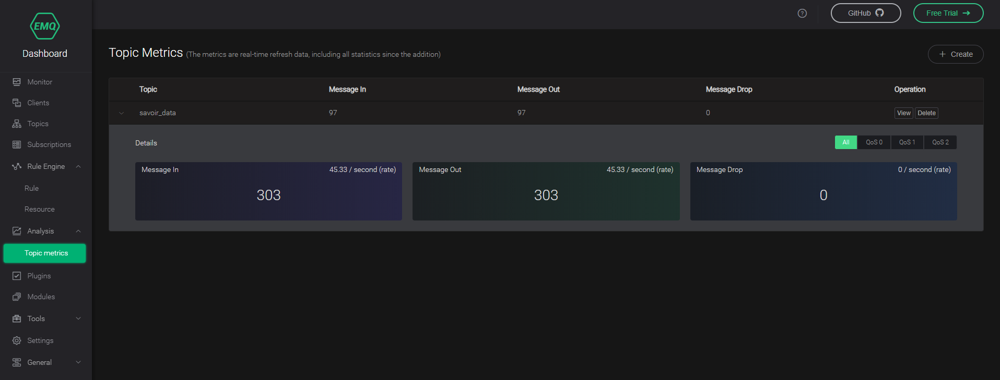

## 介绍

https://github.com/mcxiaoke/mqtt/blob/master/mqtt/01-Introduction.md

MQTT是一个客户端服务端架构的发布/订阅模式的消息传输协议。它的设计思想是轻巧、开放、简单、规范，易于实现。这些特点使得它对很多场景来说都是很好的选择，特别是对于受限的环境如机器与机器的通信（M2M）以及物联网环境（IoT）。

术语；
QoS 服务质量
Session 会话
Publish 发布
Subscription 订阅
Topic 主题
Topic Filter 主题过滤器

MQTT协议：
Fixed Header |  Variable Header  |  Payload

Fixed Header > 
	BYTE 1
	Bit 7~4 控制报文的类型（
		1~CONNECT 客户端到服务端（连接请求）  
		2~CONNACK 服务端到客户端（连接确认）
		3~PUBLISH 发布消息
		4~PUBACK QoS1消息收到确认
		5~PUBREC 发布收到
		6~PUBREL 发布释放
		7~PUBCOMP QoS2消息发布完成
		8~SUBSCRIBE 订阅请求
		9~SUBACK 订阅请求确认
		10~UBSUBSCRIBE 取消订阅请求
		11~UBSUBACK 取消订阅确认
		12~PINGREQ 心跳请求
		13~PINGRESP 心跳应答
		14~DISCONNECT 客户端断开连接）  Bit3~0 指定控制报文类型的标志位（）
	BYTE 2。。。 Remaining Length 剩余长度
Variable Header >
	PUB+ SUB+ UNSUB+ 这些报文包含2字节的报文标识符字段，（类似报文的消息ID）
Payload (有效荷载) >
	PUBLISH Payload > 即应用消息
	CONNECT
	SUBSCRIBE
	SUBACK
	UNSUBSCRIBE
	
-->
CONNECT – 连接服务端
	可变报头 Variable header >
		协议名（Protocol Name）
		协议级别（Protocol Level）
		连接标志（Connect Flags）
			bit 0 Reserved
			bit 1 Clean Session 
			bit 2 Will Flag 遗嘱标志
			bit 3~4 Will QoS 遗嘱QoS
			bit 5 Will Retain 遗嘱保留
			bit 6 Password Flag 密码标志
			bit 7 User Name Flag 用户名标志
		保持连接（Keep Alive）
			保持连接的秒，空闲时间超过此值，客户端必须发送一个心跳PINGREQ报文
	有效荷载 
		客户端标识符，遗嘱主题，遗嘱消息，用户名，密码
<--
CONNACK 

-->
PUBLISH 
	固定报文头：
		bit 3  DUP 重发标志
		bit 2~1 QoS 服务质量等级
			0 最多分发一次
			1 至少分发一次
			2 只分发一次
		bit 0 保留标志 RETAIN
			服务端保留消息给将来的消费者(订阅者)  QoS0无法保留
			保留标志1时发送0字节消息，同一个主题下任何现存的保留消息必须被移除
	可变报头
		主题名 Topic Name
		报文标识符 Packet Identifier
	有效荷载
		应用消息
<-- QoS0
	无响应
<-- QoS1
	PUBACK
<-- QoS2
	PUBREC
	--> PUBREL
	<-- PUBCOMP
	
--> SUBSCRIBE 订阅主题
	有效荷载：
		主题过滤器列表(UTF-8)
		每一个过滤器后面跟着1字节，服务质量要求(Requested QoS)服务端向客户端发送应用消息所允许的最大QoS等级
		
状态存储 Storing State
网络连接 Tcp/Ip TSL WebSocket
服务质量等级 QoS
	QoS 0:最多分发一次  消息的分发依赖于底层网络的能力。接收者不会发送响应，发送者也不会重试。消息可能送达一次也可能根本没送达
	QoS 1: 至少分发一次 (保证消息不丢，但可能重复)
	QoS 2: 仅分发一次 (确保不丢失、不重复)

主题层级分隔符  /
多层通配符	# (不匹配$SYS)
单层通配符	+
匹配服务器特定信息或控制接口 $SYS/


>> MQTT Broker

	EMQtt
	
	http://emqtt.com/
	http://www.emqtt.io/  Erlang开发的分布式高吞吐量的代理服务‘
	
		./bin/emqttd start/stop
		WEB Dashboard http://localhost:18083  admin  public
		plugings >> ./bin/emqttd_ctl plugins load emq_xxxx
			emq_retainer 消息存储
			emq_dashborad web仪表盘
			。。。
		etc/emq.conf：
			ode.name = emqttd@127.0.0.1
			mqtt.max_clientid_len = 1024
			#OS Environment
			EMQ_NODE_NAME	Erlang node name
			EMQ_NODE_COOKIE	Cookie for distributed erlang node
			EMQ_MAX_PORTS	Maximum number of opened sockets
			EMQ_TCP_PORT	MQTT TCP Listener Port, Default: 1883
			EMQ_SSL_PORT	MQTT SSL Listener Port, Default: 8883
			EMQ_WS_PORT	MQTT/WebSocket Port, Default: 8083
			EMQ_WSS_PORT	MQTT/WebSocket/SSL Port, Default: 8084
			#Cluster
			cluster.name = emqcl
			cluster.discovery = manual/static 静态节点列表/mcast UDP广播/dns/etcd/k8s
			cluster.autoheal = on
			cluster.autoclean = 5m
	Eclipse Mosquitto 轻量级/C libmosquitto 用于创建客户端的C库/mosquitto_pub/sub命令行
		安装：
		sudo apt-add-repository ppa:mosquitto-dev/mosquitto-ppa
		sudo apt-get update
		文档：
		mosquitto 
			-c config file
			-d deamon
			-p port default 1883
			-v verbose(log_type all)
			代理的系统publish：$SYS/
				$SYS/broker/bytes/received
				$SYS/broker/bytes/sent
				$SYS/broker/clients/connected
				$SYS/broker/clients/expired
				$SYS/broker/clients/disconnected
				$SYS/broker/clients/maximum
				$SYS/broker/clients/total
				$SYS/broker/connection/#  (bridges are configured)
				$SYS/broker/heap/current size
				$SYS/broker/heap/maximum size
				$SYS/broker/load/publish/sent/+
				$SYS/broker/messages/sent
				$SYS/broker/version
				...
			/var/lib/mosquitto/mosquitto.db 消息存储
			/etc/hosts.allow, /etc/hosts.deny 黑白名单
			etc/..conf
				log_dest  stdout/stderr/syslog/file
				persistence 是否序列化消息到磁盘(mosquitto.db)
				persistence_file  mosquitto.db
				max_inflight_messages 20 同时处理的QoS1/2消息条数
				max_queued_messages  100 QoS1/2消息队列长度
				message_size_limit  默认0无限制  payload的最大长度
				password_file 用户密码文件，allow_anonymous false时必须配置； mosquitto_passwd或 username:passworde
				persistence_location /var/lib/mosquitto/mosquitto
				queue_qos0_messages false 允许长客户端的QoS0消息缓存（非标准）
				retry_interval 20[s] QoS1/2消息重试间隔
				store_clean_interval  10 seconds 内部无引用消息保存时长
				sys_interval 10 seconds $SYS等级publish周期
				bind_address 默认listener绑定的IP地址
				listener port [bind address/host]
				max_connections -1 最大客户端连接数
				mount_point 主题前缀
				port 1883
				protocol mqtt
				<Configuring Bridges> ...

## EMQX

[offical 4.1](https://docs.emqx.cn/cn/broker/v4.1)

安装 `sudo apt install emqx`

启动 `emqx start` / `emqx_ctl status`
或 `systemctl start emqx`


### 配置说明
`/etc/emqx/etc`

```
listener.<Protocol>.<Listener Name>.xxx
zone.<Zone Name>.xxx
```

### Dashboard




### 日志追踪

## 功能

### 保留消息
publish报文时指定Retain为1.除了被正常转发以外，保留消息会被存储在服务端

### 共享订阅
多个订阅者之间实现负载均衡的订阅方式
```bash
                                                   [subscriber1] got msg1
             msg1, msg2, msg3                    /
[publisher]  ---------------->  "$share/g/topic"  -- [subscriber2] got msg2
                                                 \
                                                   [subscriber3] got msg3
```
```bash
$share/<group-name>/topic 带群组的共享订阅。属于同一个群组内部的订阅者将以负载均衡接收消息（类似kafka groupId）
$queue/topic `$share`订阅的一种特例，相当于在同一订阅组
```

### 延迟发布
$delayed/{DelayInterval(单位是秒)}/{TopicName}

### 代理订阅
需开启内置模块：emqx_mod_subscription 

```bash
module.subscription.1.topic = client/%c
module.subscription.2.topic = user/%u
module.subscription.2.qos = 2
module.subscription.2.nl  = 1 <MQTT V5>
```
客户端连上之后代理会自动订阅 clinet/clientId和user/username 这两个主题

### 消息桥接
1. RPC 只能EMQX之间,效率高
2. MQTT 和其他MQTT broker之间

RPC配置
```bash
bridge.mqtt.emqx2.address = emqx2@192.168.1.2
bridge.mqtt.emqx2.forwards = sensor1/#,sensor2/#
bridge.mqtt.emqx2.mountpoint = bridge/emqx2/${node}/
```
MQTT配置
```
bridge.mqtt.aws.address = 211.182.34.1:1883
bridge.mqtt.aws.proto_ver = mqttv4
bridge.mqtt.aws.clientid/username/password/keepalice/clean_start/reconnect_interval ...
```

### 主题重写
module.rewrite.pub.rule.<number> = 主题过滤器 正则表达式 目标表达式

如：module.rewrite.sub.rule.1 = y/+/z/# ^y/(.+)/z/(.+)$ y/z/$2

结果 y/a/z/b -> y/z/b


## 常见问题
1. [warning] <<"iota_data_sender">>@10.244.0.0:55676 [Channel] Dropped the qos2 packet 37923 due to awaiting_rel is full.


2.  [warning] <<"savoir.receive.xsx">>@10.244.0.0:57644 [Session] Dropped msg due to mqueue is full: Message(Id=xx, QoS=2, Topic=savoir_data, From=<<"iota_data_sender">>, Flags=[], Headers=#{peerhost => {10,244,0,0},
    proto_ver => 3,protocol => mqtt,username => undefined})

修改后的deploy.yaml文件如下：
  ```yaml
spec:
  template:
    spec:
      containers:
      - name: emq
        image: emqx/emqx:latest
        env:
          - name: EMQX_NAME
            value: "emqx"
          - name: EMQX_ZONE__EXTERNAL__MAX_AWAITING_REL
            value: "10000"
          - name: EMQX_ZONE__EXTERNAL__AWAIT_REL_TIMEOUT
            value: "300s"
          - name: EMQX_ZONE__EXTERNAL__MAX_MQUEUE_LEN
            value: "0"

  ```

## Apache Apollo

```shell
# ./mybroker/bin/apollo-broker run  

    _____                .__  .__  
   /  _  \ ______   ____ |  | |  |   ____  
  /  /_\  \\____ \ /  _ \|  | |  |  /  _ \  
 /    |    \  |_> >  <_> )  |_|  |_(  <_> )  
 \____|__  /   __/ \____/|____/____/\____/  
         \/|__|  Apache Apollo (1.7.1)  


Loading configuration file '/home/tarena/project/MQTT/apache-apollo-1.7.1/bin/mybroker/etc/apollo.xml'.  
INFO  | OS     : Linux 3.2.0-23-generic-pae (Ubuntu 12.04 LTS)  
INFO  | JVM    : Java HotSpot(TM) Server VM 1.8.0_144 (Oracle Corporation)  
INFO  | Apollo : 1.7.1 (at: /home/tarena/project/MQTT/apache-apollo-1.7.1)  
INFO  | OS is restricting the open file limit to: 100000  
INFO  | Accepting connections at: tcp://0.0.0.0:61613  
INFO  | Accepting connections at: tls://0.0.0.0:61614  
INFO  | Starting store: leveldb store at /home/tarena/project/MQTT/apache-apollo-1.7.1/bin/mybroker/data  
INFO  | Accepting connections at: ws://0.0.0.0:61623/  
INFO  | Accepting connections at: wss://0.0.0.0:61624/  
INFO  | Administration interface available at: https://127.0.0.1:61681/  
INFO  | Administration interface available at: http://127.0.0.1:61680/ 
```

管理界面：http://127.0.0.1:61680/ 默认 admin password


## SSL 和 CA签名

