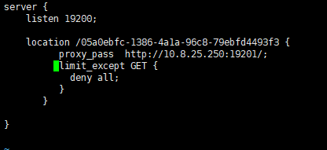

## NGINX

### 安装nginx
https://blog.csdn.net/qq_37345604/article/details/90034424

1. 启动
./nginx

2. 检查配置
./nginx -t

3. 软更新
./nginx -s reload


```json
...              #全局块

events {         #events块
   ...
}

http      #http块
{
    ...   #http全局块
    server        #server块
    { 
        ...       #server全局块
        location [PATTERN]   #location块
        {
            ...
        }
        location [PATTERN] 
        {
            ...
        }
    }
    server
    {
      ...
    }
    ...     #http全局块
}
```

默认nginx.conf
```
user www-data;
worker_processes auto; 允许生成的进程数
pid /run/nginx.pid; PID
error_log log/error.log debug;  #制定日志路径，级别。这个设置可以放入全局块，http块，server块，级别以此为：debug|info|notice|warn|error|crit|alert|emerg
include /etc/nginx/modules-enabled/*.conf;

events {
	worker_connections 768; #最大连接数，默认为512
    accept_mutex on;   #设置网路连接序列化，防止惊群现象发生，默认为on
    #multi_accept on;  #设置一个进程是否同时接受多个网络连接，默认为off
    #use epoll;      #事件驱动模型，select|poll|kqueue|epoll|resig|/dev/poll|eventport
}

http {

	##
	# Basic Settings
	##

	sendfile on; #允许sendfile方式传输文件，默认为off，可以在http块，server块，location块。
	tcp_nopush on;
	tcp_nodelay on;
	keepalive_timeout 65;  #连接超时时间，默认为75s，可以在http，server，location块。
	types_hash_max_size 2048;
	# server_tokens off;

	# server_names_hash_bucket_size 64;
	# server_name_in_redirect off;

	include /etc/nginx/mime.types; #文件扩展名与文件类型映射表
	default_type application/octet-stream; #默认文件类型，默认为text/plain

	##
	# SSL Settings
	##

	ssl_protocols TLSv1 TLSv1.1 TLSv1.2; # Dropping SSLv3, ref: POODLE
	ssl_prefer_server_ciphers on;

	##
	# Logging Settings
	##

	access_log /var/log/nginx/access.log; #服务日志    
	error_log /var/log/nginx/error.log; #错误日志

	##
	# Gzip Settings
	##

	gzip on;

	# gzip_vary on;
	# gzip_proxied any;
	# gzip_comp_level 6;
	# gzip_buffers 16 8k;
	# gzip_http_version 1.1;
	# gzip_types text/plain text/css application/json application/javascript text/xml application/xml application/xml+rss text/javascript;

	##
	# Virtual Host Configs
	##

	include /etc/nginx/conf.d/*.conf;
	include /etc/nginx/sites-enabled/*;
	
	## 如果出现 504 Gateway Time-out
	#用于tomcat反向代理,解决nginx 504错误 
    proxy_connect_timeout 300; #单位秒 
    proxy_send_timeout 300; #单位秒 
    proxy_read_timeout 300; #单位秒 
    proxy_buffer_size 16k; 
    proxy_buffers 4 64k; 
    proxy_busy_buffers_size 128k; 
    proxy_temp_file_write_size 128k;
    # ps:以timeout结尾配置项时间要配置大点
}

```

以下代理配置放在conf.d或sites-enabled中：
``` json
server {
        listen 80;
        return 301 https://$host$request_uri;
        server_name xxxx;
}

server {
        listen 443;
        server_name xxxx;
        ssl on;
        ssl_certificate xxx/certs/xxx.cn_bundle.crt;
        ssl_certificate_key xxxx/certs/xxxx.cn.key;

        ssl_session_timeout 5m;

        ssl_protocols SSLv3 TLSv1 TLSv1.1 TLSv1.2;
        ssl_ciphers "HIGH:!aNULL:!MD5 or HIGH:!aNULL:!MD5:!3DES";
        ssl_prefer_server_ciphers on;

        client_max_body_size 10M;

    location /v1/api {
        proxy_pass  http://xxxx:9090/v1/api;
        proxy_cookie_domain localhost localhost;
        proxy_cookie_path / /;
        proxy_connect_timeout 100;  ## 原作者这里为1，？？出现504 Gateway Time-out
        proxy_send_timeout 120;
        proxy_read_timeout 300;
        proxy_set_header X-Real-Ip $remote_addr;
        proxy_set_header X-Forwarded-For $proxy_add_x_forwarded_for;
    }
	
    location / {
        proxy_pass    http://xxxx:9080;
        proxy_cookie_domain localhost localhost;
        proxy_cookie_path / /;
        proxy_connect_timeout 100;
        proxy_send_timeout 600;
        proxy_read_timeout 60;
    }
}

```

$args：这个变量等于请求行中的参数，同$query_string。
$is_args: 如果已经设置$args，则该变量的值为"?"，否则为""。
$content_length： 请求头中的Content-length字段。
$content_type： 请求头中的Content-Type字段。
$document_uri： 与$uri相同。
$document_root： 当前请求在root指令中指定的值。
$host： 请求主机头字段，否则为服务器名称。
$http_user_agent： 客户端agent信息。
$http_cookie： 客户端cookie信息。
$limit_rate： 这个变量可以限制连接速率。
$request_method： 客户端请求的动作，通常为GET或POST。
$remote_addr： 客户端的IP地址。
$remote_port： 客户端的端口。
$remote_user： 已经经过Auth Basic Module验证的用户名。
$request_body_file`: 客户端请求主体的临时文件名。
$request_uri: 请求的URI，带参数
$request_filename： 当前请求的文件路径，由root或alias指令与URI请求生成。
$scheme： 所用的协议，比如http或者是https，比如rewrite ^(.+)$ $scheme://example.com$1 redirect;。
$server_protocol： 请求使用的协议，通常是HTTP/1.0或HTTP/1.1。
$server_addr： 服务器地址，在完成一次系统调用后可以确定这个值。
$server_name： 服务器名称。
$server_port： 请求到达服务器的端口号。
$request_uri： 包含请求参数的原始URI，不包含主机名，如：/foo/bar.php?arg=baz，它无法修改。
$uri： 不带请求参数的当前URI，$uri不包含主机名，如/foo/bar.html可能和最初的值有不同，比如经过重定向之类的。它可以通过内部重定向，或者使用index指令进行修改。不包括协议和主机名，例如/foo/bar.html。


限制动作：

